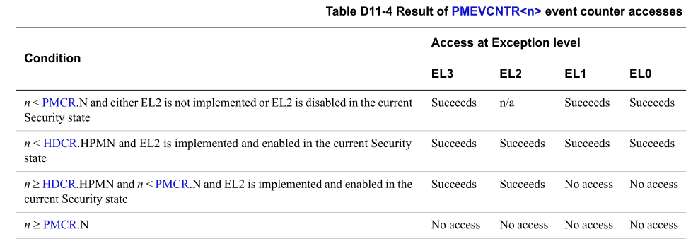

All implemented event counters are accessible in EL3 and EL2. If EL2 is
implemented the hypervisor uses HDCR.HPMN to reserve an event counter, with the
effect that if EL2 is enabled in the current Security state, software cannot
access that counter and its associated state from EL0 or EL1.
> 所有实现的事件计数器都可以在EL3和EL2中访问。如果实现了EL2，则系统管理程序将使用
> HDCR.HPMN保留一个事件计数器，其效果是，如果在当前安全状态下启用EL2，则软件无法
> 从EL0或EL1访问该计数器及其相关状态。

If FEAT_FGT is implemented, if PMSELR.SEL or n indicates an unimplemented event
counter, access to PMXEVTYPER, PMXEVCNTR, PMEVTYPER<n>, or PMEVCNTR<n> is
UNDEFINED.
> FGT 相关, 先不看

> Note
> 
> Whether software can access an event counter at an Exception level does not
> affect whether the counter counts events at that Exception level. For more
> information, see Controlling the PMU counters on page D11-5254 and Enabling
> event counters on page D11-5254.
>
> > 软件是否可以访问异常级别的事件计数器不会影响计数器是否对该异常级别的事件进
> > 行计数。有关详细信息，请参阅第 D11-5254 页上的控制 PMU 计数器和第 D11-5254
> > 页上的启用事件计数器。

# D11.10.1 PMEVCNTR<n> event counters

Table D11-4 on page D11-5265 shows how the number of implemented event
counters, PMCR.N, and if EL2 is implemented, the value of the HDCR.HPMN field
affects the behavior of permitted accesses to the PMEVCNTR<n> event counter
registers for values of n from 0 to 30.
> D11-5265 页上的表 D11-4 显示了已实现的事件计数器 PMCR.N 的数量以及是否已实现
> EL2，HDCR.HPMN 字段的值如何影响允许访问 PMEVCNTR 事件计数器寄存器值的行为 
> n 从 0 到 30。

Where Table D11-4 on page D11-5265 shows access succeeds for an event counter
n, the access might be UNDEFINED or generate a trap exception. See the
descriptions of PMEVCNTR<n> and PMXEVCNTR for details. Where Table D11-4 on
page D11-5265 shows no access for an event counter n:
> 如果 D11-5265 页上的表 D11-4 显示事件计数器 n 的访问成功，则该访问可能未定义
> 或生成陷阱异常。 详细信息请参见 PMEVCNTR 和 PMXEVCNTR 的描述。 其中 D11-5265
> 页上的表 D11-4 展示无法访问事件计数器 n：

* When PMSELR.SEL is n, the PE prevents direct reads and direct writes of
  PMXEVTYPER or PMXEVCNTR. See the register descriptions for more
  information.
* The PE prevents direct reads and direct writes of PMEVTYPER<n> or
  PMEVCNTR<n>. See the register descriptions for more information.
  > PE 防止直接读取和直接写入 PMEVTYPER 或 PMEVCNTR。 有关详细信息，请参阅
  > 寄存器说明。
* Direct reads and direct writes of the following registers are RAZ/WI.
  PMOVSCLR[n], PMOVSSET[n], PMCNTENSET[n], PMCNTENCLR[n], PMINTENSET[n], and
  PMINTENCLR[n].
  > Direct reads and direct writes of the following registers are RAZ/WI.
* Direct writes to PMSWINC[n] are ignored.
* A direct write of 1 to PMCR.P does not reset PMEVCNTR<n>.
  > 直接向 PMCR.P 写入 1 不会复位 PMEVCNTR。

# D11.10.2  Cycle counter

The PMU does not provide any control that a hypervisor can use to reserve the
cycle counter for its own use. However, access to the PMU registers are subject
to the access permissions described in Configurable instruction controls on
page D1-4665.

> PMU 不提供任何控制，虚拟机管理程序可以使用该控制来保留周期计数器供其自己使用。 
> 但是，对 PMU 寄存器的访问须遵守第 D1-4665 页上的可配置指令控制中所述的访问权
> 限。
