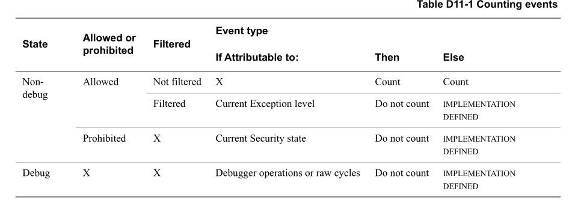

An event caused by the PE counting the event is Attributable. If an agent other
than the PE that is counting the events causes an event, these events are
Unattributable.

> 由PE引起的事件计数该事件是 Attributable。 如果正在对事件进行计数的 PE 
> 之外的代理导致了事件，则这些事件 Unattributable.

An event is defined as being either Attributable or Unattributable. If the
event is Attributable, it is further defined whether it is Attributable to:

> 事件被定义为 不是 Attributable 就是 Unattributable。如果事件是Attributable，
> 则进一步定义其是否 Attributable 于：

* The current Security state of the PE.
* The current Exception level of the PE.
* When the PE is in Debug state, operations issued to the PE by the debugger
  through the external debug interface.
  > 当PE处于Debug state，调试器通过外部调试接口向PE发出操作。

In a multithreaded implementation, an event might be generated by another PE
with the same values for affinity level 1 and higher. This event is further
defined as Attributable to:

> 在多线程实现中，事件可能由具有和相同亲和性 level 1 和更高level的另一个 
> PE 生成相同的值。 该事件进一步定义 Attributable 于:

* The current Security state of that PE.
* The current Exception level of that PE.
* When that PE is in Debug state, operations issued to that PE by the debugger
  through the external debug interface.
  > 同上,只不过是 that CPU

See Multithreaded implementations on page D11-5258 for information about
enabling and restricting counting events in a multithreaded implementation.

> 有关在多线程实现中启用和限制计数事件的信息，请参阅第 D11-5258 页上的多线程
> 实现。

> Note
> * In an implementation containing multiple PEs, each PE is identified by a
>   unique affinity value reported by MPIDR_EL1{Aff3, Aff2, Aff1, Aff0}, where
>   the value of affinity level 0 is the most significant for determining the
>   PE behavior, and the values of higher affinity levels are less significant.
>   Affinity level 3 is only supported in AArch64 state.
>   > 在包含多个PE的实现中，每个PE由MPIDR_EL1{Aff3，Aff2，Aff1，Aff0}报告的唯
>   > 一亲和度值来标识，其中亲和度级别0的值对于确定PE行为是 significant，而较高
>   > 亲和度级别的值则不那么 significant 。Affinity level 3仅在AArch64状态下受支持。
>
> * An implementation is described as multithreaded when the lowest level of
>   affinity consists of logical PEs that are implemented using a
>   multithreading type approach. In this section, when referring to a
>   multithreaded implementation, thread is used to mean processing elements
>   with: 
>   > ```
>   > consist of 由...组成 和 ... 一致
>   > mean: 表示...的意思
>   > ```
>   > 
>   > 当由lowest level affinity 构成的 logical PE, 并且他们是使用多线程类型方法实现
>   > 时, 该实现被描述为多线程的。在本节中，当提到多线程实现时，线程用于表示具有以下功
>   > 能的 processing elements(PE)
>
>   + MPIDR_EL1.MT or MPIDR.MT set to 1, 
>   + Different values for affinity level 0. 
>   + The same values for affinity level 1 and higher. 

An event can be defined as the combination of multiple subevents, which can be
either Attributable or Unattributable. 

> 一个事件可以定义为多个子事件的组合，这些子事件可以是 Attributable and or not

All architecturally defined events are Attributable, unless otherwise stated. 

> state: 陈述或说明（某事）（尤指仔细、详尽而明确地）
>
> 除非另有说明，所有架构定义的事件都是 Attributable

Unattributable events might be counted when Attributable events are not
counted. See: 

* Interaction with EL3 on page D11-5245. 
* Event filtering on page D11-5260. 
* Performance Monitors and Debug state on page D11-5264.

These sections are summarized by Table D11-1 on page D11-5253 for events
Attributable to the processor, and Unattributable events. Table D11-1 on page
D11-5253 entries apply when the counter and PMU are enabled and not frozen.
Otherwise, events are not counted.

> D11-5253 页上的表 D11-1 针对Attributable于处理器的事件和Unattributable事件对这些
> 部分进 行了总结。 当计数器和 PMU 启用且未冻结时，第 D11-5253 页上的表 D11-1 
> 条目适用。 否则，事件不被计算在内。


