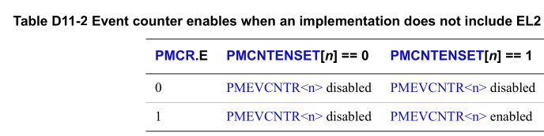
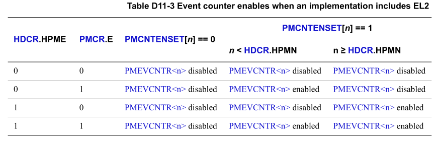

This section describes the mechanisms available for controlling the PMU event
and cycle counters. The following sections describe those mechanisms:
> 本节介绍可用于控制 PMU 事件和周期计数器的机制。 以下部分描述了这些机制：

* Enabling event counters.
* Freezing event counters on page D11-5255.
* Prohibiting event and cycle counting on page D11-5256.

# D11.5.1 Enabling event counters

Table D11-2 on page D11-5254 shows an implementation that does not include EL2,
where the PMCR.E bit is a global counter enable bit, and PMCNTENSET provides an
enable bit for each counter.

> D11-5254 页上的Table D11-2 显示了不包括 EL2 的实现，其中 PMCR.E 位是全局计数器
> enable bit, PMCNTENSET 为每个计数器提供一个enable bit.



If the implementation includes EL2, then in addition to the PMCR.E and
PMCNTENSET enable bits:
> 如果实现包括 EL2，则除了 PMCR.E 和 PMCNTENSET enable bit 之外：

* HDCR.HPME overrides the value of PMCR.E for counters configured for access
  in EL2.
  > 对于为 EL2 中的访问而配置的计数器，HDCR.HPME 会覆盖 PMCR.E 的值。

* HDCR.HPMN specifies the number of event counters that the Guest OS can
  access. When FEAT_HPMN0 is not implemented, the minimum permitted value of
  HDCR.HPMN is 1, meaning there must be at least one event counter that the
  Guest OS can access. Otherwise, the minimum permitted value of HDCR.HPMN is
  0.
  > HDCR.HPMN 指定Guest OS可以访问的事件计数器的数量。 当 FEAT_HPMN0 未实现时，
  > HDCR.HPMN 的最小允许值为 1，这意味着必须至少有一个Guest OS可以访问的事件计数器。
  > 否则，HDCR.HPMN 的最小允许值为 0。

Table D11-3 on page D11-5254 shows the combined effect of all the counter
enable controls.
> D11-5254 页上的Table D11-3 显示了所有计数器启用控制的综合效果。



> Note
>
> * The effect of HDCR.{HPME, HPMN} on the counter enables applies at all
>   Exception levels and in both Security states.
>   > HDCR.{HPME, HPMN} 对计数器启用的影响适用于所有异常级别和两种安全状态。
> * The value returned for PMCR.N is not affected by HDCR.HPMN at:
>   > PMCR.N 不受 HDCR.HPMN影响:
>   + EL3.
>   + EL2.
>   + Secure EL1, if FEAT_SEL2 is not implemented or Secure EL2 is disabled.
>   + Secure EL0, if FEAT_SEL2 is not implemented or Secure EL2 is disabled.


> Note
>
> The cycle counter, PMCCNTR, counts unless disabled or prohibited as described
> in Prohibiting event and cycle counting on page D11-5256.
>
> > 除非按照第 D11-5256 页的 Prohibiting event 和 cycle counting 中所述prohibit或
> > disabled，否则cycle counters PMCCNTR 会进行计数。

# D11.5.2 Freezing event counters

When FEAT_SPEv1p2 is implemented, the PMU can be configured to freeze event
counters when an SPE buffer management event occurs. A counter is disabled
under the following conditions:

> 实现 FEAT_SPEv1p2 时，可以将 PMU 配置为在发生 SPE management event 发生时
> freeze event counters. 计数器在以下情况下被禁用：

* If EL2 is implemented, MDCR_EL2.HPMN is not 0, n is in the range [0 ..
  (MDCR_EL2.HPMN-1)], when PMBSR_EL1.S is 1, and PMBLIMITR_EL1.E is 1,
  indicating an SPE buffer management event occurred, event counter n does
  not count if all the following are true:
  + PMBLIMITR_EL1.PMFZ is 1.
  + PMCR_EL0.FZS is 1.
* If EL2 is not implemented, n is in the range [0 .. (PMCR_EL0.N-1)], when
  PMBSR_EL1.S is 1 and PMBLIMITR_EL1.E is 1, indicating an SPE buffer
  management event occurred, event counter n does not count if all the
  following are true:
  + PMBLIMITR_EL1.PMFZ is 1.
  + PMCR_EL0.FZS is 1.
* If EL2 is implemented, MDCR_EL2.HPMN is not n, n is in the range
  [MDCR_EL2.HPMN .. (PMCR_EL0.N-1)], when PMBSR_EL1.S is 1 and
  PMBLIMITR_EL1.E is 1, indicating an SPE buffer management event occurred,
  event counter n does not count if all the following are true:
  + PMBLIMITR_EL1.PMFZ is 1.
  + MDCR_EL2.HPMFZS is 1. > Note > > This also applies when EL2 is disabled
    in the current Security state.

If the highest implemented Exception level is using AArch32, then the
Effective value of PMBLIMITR_EL1.E is 0 and FEAT_SPEv1p2 does not affect the
PMU event counters. Otherwise, the effect of FEAT_SPEv1p2 on PMU event
counters applies in AArch32 state. See Profiling Buffer management on page
D13-5463.

> ```
> !!!!!!!!
> 遗留问题
> !!!!!!!!
> ```
>
> 这一章先不看, 和 profiling buffer相关

When FEAT_PMUv3p7 is implemented, the PMU can be configured to freeze event
counters when an unsigned overflow of a counter occurs. A counter is disabled
under the following conditions:
> 实现 FEAT_PMUv3p7 时，PMU 可配置为在发生无符号计数器溢出时 freeze event 
> counters, 计数器在以下情况下被禁用：

* If EL2 is implemented, MDCR_EL2.HPMN is not 0, and n is in the range [0 ..
  (MDCR_EL2.HPMN-1)], when PMOVSCLR_EL0[(MDCR_EL2.HPMN-1):0] is nonzero,
  indicating an unsigned overflow in one of the event counters in the range,
  event counter n does not count when PMCR_EL0.FZO is 1.
  > 如果实现了 EL2，且 MDCR_EL2.HPMN 不为 0，且 n 的范围为 [0 … (MDCR_EL2.HPMN-1)]，
  > 当 PMOVSCLR_EL0[(MDCR_EL2.HPMN-1):0] 为非零时，表示无符号溢出 在范围内的事件计
  > 数器之一中，当 PMCR_EL0.FZO 为 1 时，事件计数器 n 不计数.
  >
  >> 这个是guest场景
* If EL2 is implemented, MDCR_EL2.HPMN is less than PMCR_EL0.N and n is in
  the range [MDCR_EL2.HPMN .. (PMCR_EL0.N-1)], when
  PMOVSCLR_EL0[(PMCR_EL0.N-1):MDCR_EL2.HPMN] is nonzero, indicating an
  unsigned overflow in one of the event counters in the range, event counter
  n does not count when MDCR_EL2.HPMFZO is 1.
  > 如果实现了 EL2, MDCR_EL2.HPMN < PMCR_EL0.N, 并且n在 [MDCR_EL2.HPMN .. 
  > (PMCR_EL0.N -1)] 范围之内, 当 PMOVSCLR_EL0[(PMCR_EL0.N-1):MDCR_EL2.HPMN]
  > 是 nonzero 时, 表示范围内的事件计数器之一发生无符号溢出，当 MDCR_EL2.HPMFZO 
  > 为 1 时，事件计数器 n 不计数。
  >
  >> 这个判断的意思是
  >> * 在GUEST中 (EL1), MDCR_EL2.HPMN == PMCR_EL0.N always.
  >> * 而在 HOST(EL2), MDCR_EL2.HPMN < PMCR_EL0.N always. 
  >>
  >> 所以这里条件满足一定是在HOST场景中, 所以会去判断 second range 中的 event.
  >> 并且会使用另一个bit控制 -- MDCR_EL2.HPMFZO


* If EL2 is not implemented and n is in the range [0 .. (PMCR_EL0.N-1)], when
  PMOVSCLR_EL0[(PMCR_EL0.N-1):0] is nonzero, indicating an unsigned overflow
  in one of the event counters in the range, event counter n does not count
  when PMCR_EL0.FZO is 1. 
  > 如果未实现 EL2 并且 n 在 [0 … (PMCR_EL0.N-1)] 范围内，则当 PMOVSCLR_EL0
  > [(PMCR_EL0.N-1):0] 为非零时，表明事件计数器之一发生无符号溢出 在该范围内，
  > 当 PMCR_EL0.FZO 为 1 时，事件计数器 n 不计数。

When the applicable PMCR_EL0.FZO or MDCR_EL2.HPMFZO bit is 1, it is CONSTRAINED
UNPREDICTABLE whether any event happening at or about the same time as the
event that caused the overflow is counted. This includes other instances of the
same event. 
> at or about the same time: 同时或者大约同时
>
> 当适用的 PMCR_EL0.FZO 或 MDCR_EL2.HPMFZO 位为 1 时，无论是否对与导致溢出的事件同
> 时发生或大约同时发生的任何事件进行计数，都是受约束不可预测的。这包括同一事件的其
> 他instances.
>
> > 不是很懂

> Note 
> 
> The architecture does not define when PMU events are counted relative to the
> instructions that caused the event. Events caused by an instruction might be
> counted before or after the instruction becomes architecturally executed, and
> events might be counted for operations that are not architecturally executed.
> Events can be counted speculatively, out-of-order, or both with respect to
> the simple sequential execution of the program. Events might also be counted
> simultaneously by other event counters when the overflow occurs, including
> events from different instructions. Multiple instances of an event might
> occur simultaneously, thus an event counter unsigned overflow can yield a
> nonzero value in the event counter.
> > simultaneously /ˌsaɪməlˈteɪniəsli/ : 同时发生的;同时出现的,同步的
> >
> > 该 architecture 并未定义何时相对于引发事件的指令对 PMU 事件进行计数。由
> > 指令引起的事件可以在指令被架构执行之前或之后被计数，并且事件可以针对未架构
> > 执行的操作被计数。相对于程序的简单顺序执行，可以对事件进行speculatively, out-
> > of-order 或两者兼而有之. 当发生溢出时，其他事件计数器也可能同时对事件进行计数，
> > 包括来自不同指令的事件。事件的多个实例可能同时发生，因此事件计数器无符号溢出可
> > 能会在事件计数器中产生非零值。
> 
> Arm recommends that such counting anomalies are minimized when software uses
> the freeze on overflow feature.
> > ```
> > minimize /ˈmɪnɪmaɪz/: 把...降到最低
> > anomalies [əˈnɒməliz]: 反常现象
> > ```
> > Arm 建议当软件使用溢出冻结功能时，尽量减少此类计数异常。
> 
> When the freeze on overflow feature is being used, software cannot assume
> that the event counter stops counting at zero when an overflow occurs.
> > 当使用溢出冻结功能时，软件不能假设发生溢出时事件计数器停止计数为零。

If an event counter n overflows, where n is even and event counter n+1 is
configured to count the CHAIN event, it is CONSTRAINED UNPREDICTABLE whether
the CHAIN event observes the overflow event when the applicable PMCR_EL0.FZO
or MDCR_EL2.HPMFZO bit is 1 and the corresponding PMCR_EL0.LP or MDCR_EL2.HLP
bit is 0.

> CHAIN event 先不看
>
> !!!!!!!!
> 遗留问题
> !!!!!!!!

If a direct read of PMOVSCLR_EL0 returns a nonzero value for a subset of the
overflow flags, which means an event counter n should not count, then a
sequence of direct reads of PMEVCNTR<n>_EL0 ordered after the read of
PMOVSCLR_EL0 and before the PMOVSCLR_EL0 flags are cleared to zero, will
return the same value for each read, because the event counter has stopped
counting.

> 如果直接读取 PMOVSCLR_EL0 返回溢出标志子集的非零值，这意味着事件计数器 n 不
> 应计数，则直接读取 PMEVCNTR_EL0 的时机将在读取 PMOVSCLR_EL0 之后和清除 
> PMOVSCLR_EL0 flag 为0 之前。每次读取都会返回相同的值，因为事件计数器已停止
> 计数。

> Note 
>
> Direct reads of System registers require explicit synchronization for
> following direct reads of other System registers to be ordered after the
> first direct read.
>
> > 系统寄存器的直接读取需要 explicit synchronization ，以便在第一次直接读
> > 取之后对其他系统寄存器进行直接读取。


# D11.5.3 Prohibiting event and cycle counting

Counting Attributable events in Secure state is prohibited unless any one of
the following is true:

* EL3 is not implemented.
* FEAT_PMUv3p7 is not implemented, EL3 is implemented, is using AArch64, and
  the value of MDCR_EL3.SPME is 1.

* FEAT_PMUv3p7 is implemented, EL3 is implemented, EL3 is using AArch64, the
  value of MDCR_EL3.SPME is 1, and the value of MDCR_EL3.MPMX is 0.
* FEAT_PMUv3p7 is implemented, EL3 is implemented, the PE is not at EL3, EL3
  is using AArch64, and the value of MDCR_EL3.MPMX is 1.
* EL3 is implemented, is using AArch32, and the value of SDCR.SPME is 1.
* EL3 is implemented, EL3 or EL1 is using AArch32, the PE is executing at
  EL0, and the value of SDER32_EL3.SUNIDEN is 1.
* If FEAT_Debugv8p2 is not implemented, EL3 is implemented, and counting is
  permitted by an IMPLEMENTATION DEFINED authentication interface,
  ExternalSecureNoninvasiveDebugEnabled() == TRUE.

> Note
>
> Software can read the Authentication Status register, DBGAUTHSTATUS to
> determine the state of an IMPLEMENTATION DEFINED authentication interface.

If FEAT_PMUv3p7 is implemented and MDCR_EL3.MPMX is 1, counting Attributable
events at EL3 for event counter n is prohibited if any of the following are
true:

* EL2 is not implemented, and n is in the range [0 .. (PMCR_EL0.N-1)].
* EL2 is implemented, MDCR_EL3.SPME is 0, and n is in the range [0 ..
  (PMCR_EL0.N-1)].
* EL2 is implemented, MDCR_EL2.HPMN is not 0, MDCR_EL3.SPME is 1, and n is in
  the range [0 .. (MDCR_EL2.HPMN-1)].

If EL2 is implemented and MDCR_EL3.{SPME, MPMX} is {1, 1}, when MDCR_EL2.HPMN
is less than PMCR_EL0.N and n is in the range [MDCR_EL2.HPMN ..
(PMCR_EL0.N-1)], counting Attributable events at EL3 for event counter n is
allowed.

Counting Attributable events at EL2 is prohibited unless any of the following
are true:
* FEAT_PMUv3p1 is not implemented.
* HDCR.HPMD is 0.
* MDCR_EL2.HPMN is less than PMCR_EL0.N, the event is being counted by event
  counter n, and n is in the range [MDCR_EL2.HPMN .. (PMCR_EL0.N-1)].

If FEAT_SEL2 is implemented, counting Attributable events at Secure EL2 is
allowed if and only if counting events is allowed in Secure state, and
counting events is allowed at EL2.

The accessibility of Performance Monitors registers is unaffected by whether
event counting is enabled or prohibited.

The cycle counter, PMCCNTR, counts unless any of the following is true:

* The cycle counter is disabled by PMCR_EL0.E or PMCNTENSET_EL0[31].
* Event counting by event counters in the range [0..(HDCR.HPMN-1)] is
  prohibited or frozen, and PMCR.DP is set to 1.

> Note
>
> When FEAT_HPMN0 is implemented and HDCR.HPMN is 0, the cycle counter is
> disabled by PMCR.DP under the same conditions that would prohibit or freeze
> event counting by event counters in the range [0..(HDCR.HPMN-1)] when
> HDCR.HPMN is not 0.

* The PE is in Debug state.
* FEAT_PMUv3p5 is implemented, EL3 is implemented, the PE is in Secure state,
  and SDCR.SCCD is set to 1.
* FEAT_PMUv3p5 is implemented, EL2 is implemented, the PE is executing at
  EL2, and HDCR.HCCD is set to 1.
* FEAT_PMUv3p7 is implemented, the PE is at EL3, EL3 is using AArch64, and
  MDCR_EL3.MCCD is set to 1.

For each Unattributable event, it is IMPLEMENTATION DEFINED whether it is
counted when counting Attributable events is prohibited.

See AArch64.CountPMUEvents() and AArch32.CountPMUEvents() in Chapter J1 Armv8
Pseudocode for more information. The CountEvents(n) functions return TRUE if
PMEVCNTR<n> is enabled and allowed to count events at the current Exception
level or state, and FALSE otherwise, The function CountEvents(31) returns
TRUE if the cycle counter is enabled and allowed to count cycles at the
current Exception level and state and FALSE otherwise. However, these
functions do not completely describe the behavior for Unattributable events.

The Performance Monitors are intended to be broadly accurate and
statistically useful, see Accuracy of the Performance Monitors on page
D11-5248. Some inaccuracy is permitted at the point of changing between a
state where counting is prohibited and a state where counting is allowed,
however. To avoid the leaking of information, the permitted inaccuracy is
that transactions that are not prohibited can be uncounted. Where possible,
prohibited transactions must not be counted, but if they are counted, then
that counting must not degrade security.


> 先不看 Secure State相关的.
>
> !!!!!!!!
> 遗留问题
> !!!!!!!!
