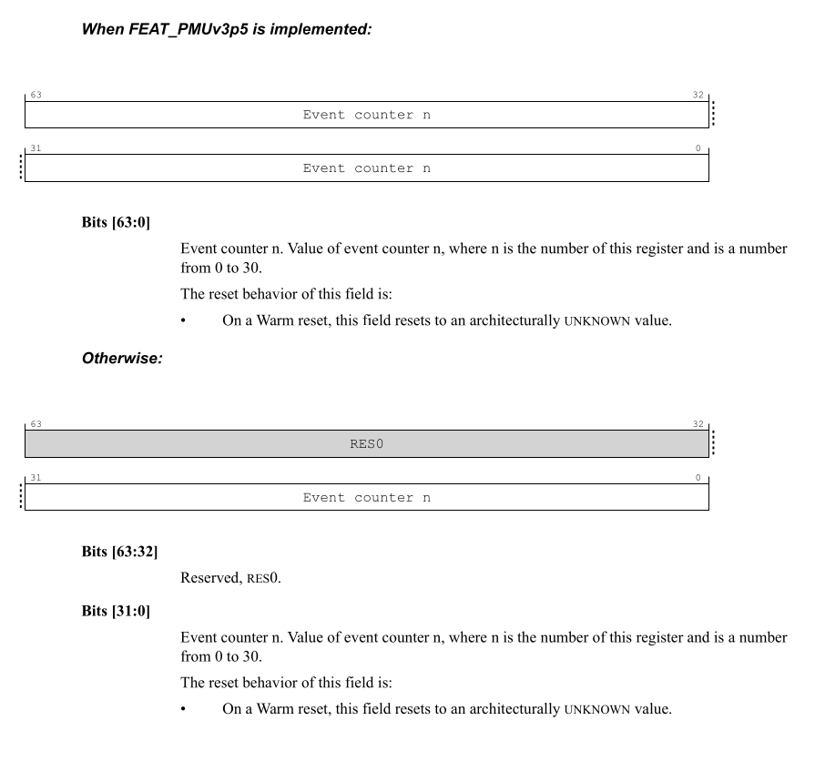
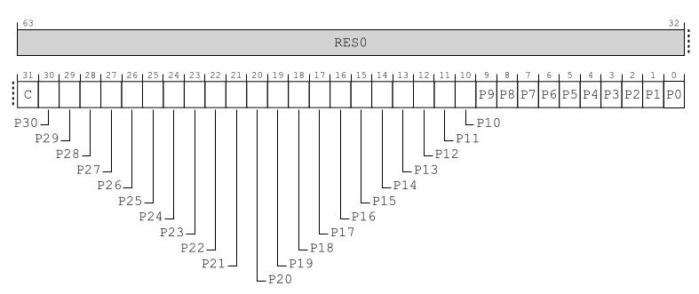
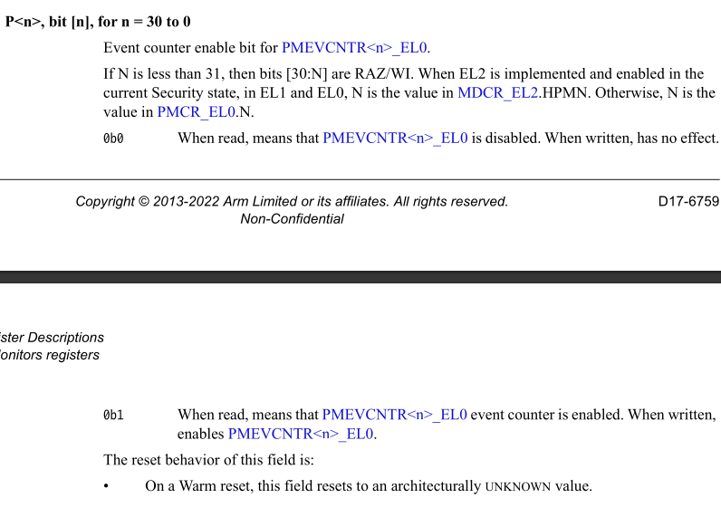

# MDCR_EL2

> From
> 
> D17.3.17 MDCR_EL2, Monitor Debug Configuration Register (EL2)

The MDCR_EL2 characteristics are:
## Purpose
> Provides EL2 configuration options for self-hosted debug and the Performance
> Monitors Extension.
>
> 为 self-hosted debug 和 PME 提供 EL2 配置选项

## Configurations

> AArch64 System register MDCR_EL2 bits [31:0] are architecturally mapped to
> AArch32 System register HDCR[31:0].

If EL2 is not implemented, this register is RES0 from EL3.

This register has no effect if EL2 is not enabled in the current Security
state.

> 如果在当前安全状态下未启用 EL2，则该寄存器无效。

## Attributes

MDCR_EL2 is a 64-bit register.

## MTPME, bit [28]
**When FEAT_MTPMU is implemented and EL3 is not implemented:**

Multi-threaded PMU Enable. Enables use of the PMEVTYPER<n>_EL0.MT bits.
* 0b0

  FEAT_MTPMU is disabled. The Effective value of PMEVTYPER<n>_EL0.MT is zero.

* 0b1

  PMEVTYPER<n>_EL0.MT bits not affected by this field.

If FEAT_MTPMU is disabled for any other PE in the system that has the same
level 1 Affinity as the PE, it is IMPLEMENTATION DEFINED whether the PE behaves
as if this field is 0.
> 如果对系统中与该 PE 具有相同级别 1 亲和力的任何其他 PE 禁用 FEAT_MTPMU，则 PE
> 是否表现得如同该字段为 0 一样，由实现定义。

The reset behavior of this field is:

* On a Cold reset, this field resets to 1.

**Otherwise:**

Reserved, RES0.

## HPME, bit [7]
**When FEAT_PMUv3 is implemented:**

[MDCR_EL2.HPMN..(N-1)] event counters enable.
* 0b0

  Event counters in the range [MDCR_EL2.HPMN..(PMCR_EL0.N-1)] are disabled.
  > second range 的 event counters 被disable
* 0b1

  Event counters in the range [MDCR_EL2.HPMN..(PMCR_EL0.N-1)] are enabled by
  PMCNTENSET_EL0.
  > second range 的 event counters 根据 PMCNTENSET_EL0 决定是否enable

If MDCR_EL2.HPMN is less than PMCR_EL0.N, this field affects the operation of
event counters in the range [MDCR_EL2.HPMN..(PMCR_EL0.N-1)].

This field does not affect the operation of other event counters.

The operation of this field applies even when EL2 is disabled in the current
Security state. The reset behavior of this field is:

* On a Warm reset, this field resets to an architecturally UNKNOWN value.

**Otherwise:**

Reserved, RES0.
## HPMFZO, bit [29]
**When FEAT_PMUv3p7 is implemented:**

Hyp Performance Monitors Freeze-on-overflow. Stop event counters on overflow.
> Hyp 性能监视器 Freeze-on-overflow。 溢出时停止事件计数器。

**0b0**

Do not freeze on overflow.

**0b1**

Event counters do not count when
***
PMOVSCLR_EL0[(PMCR_EL0.N-1):MDCR_EL2.HPMN] is nonzero.

If MDCR_EL2.HPMN is less than PMCR_EL0.N, this field affects the operation of
event counters in the range [MDCR_EL2.HPMN .. (PMCR_EL0.N-1)].
> 如果 MDCR_EL2.HPMN < PMCR_EL0.N, 该字段影响 [MDCR_EL2.HPMN..(PMCR_EL0.N-1)]
> 范围内的 event counters的行为

This field does not affect the operation of other event counters and
PMCCNTR_EL0.

> 该字段不影响其他事件计数器和PMCCNTR_EL0 的行为.

The operation of this field applies even when EL2 is disabled in the current
Security state.

> 即使在当前安全状态下 EL2 被禁用，该字段的操作也适用。

The reset behavior of this field is:

* On a Warm reset, this field resets to an architecturally UNKNOWN value.
***
**Otherwise:**

Reserved, RES0.
## HPMN, bits [4:0]

When FEAT_PMUv3 is implemented:

Defines the number of event counters that are accessible from EL3, EL2, EL1,
and from EL0 if permitted.

> 定义可从 EL3、EL2、EL1 和 EL0（如果允许）访问的事件计数器的数量。

If HPMN is not 0 and is less than PMCR_EL0.N, HPMN divides the event counters
into a first range [0..(HPMN-1)], and a second range [HPMN..(PMCR_EL0.N-1)]. If
FEAT_HPMN0 is implemented and this field is 0, all event counters are in the
second range and none are in the first range.

> 如果HPMN不为0并且小于PMCR_EL0.N，则HPMN将事件计数器划分为first range [0…(HPMN-1)]
> 和second range [HPMN…(PMCR_EL0.N-1)]。如果实现 FEAT_HPMN0 并且该字段为 0，则所有事
> 件计数器都在second range内，并且没有一个事件计数器在first range内。
If HPMN is equal to PMCR_EL0.N, all event counters are in the first range and
none are in the second range.

> 如果 HPMN 等于 PMCR_EL0.N, 所有事件计数器都在first range内，并且没有一个事件
> 计数器在second range内。

For an event counter <n> in the first range:
* The counter is accessible from EL1, EL2, and EL3.
* The counter is accessible from EL0 if permitted by PMUSERENR_EL0 or
  PMUSERENR.
* If FEAT_PMUv3p5 is implemented, PMCR_EL0.LP or PMCR.LP determines whether the
  counter overflow flag is set on unsigned overflow of PMEVCNTR<n>_EL0[31:0] or
  PMEVCNTR<n>_EL0[63:0].
  > 如果实现 FEAT_PMUv3p5，则 PMCR_EL0.LP 或 PMCR.LP 确定是否在 PMEVCNTR_EL0[31:0] 
  > 或 PMEVCNTR_EL0[63:0] 的无符号溢出时设置计数器溢出标志。
* PMCR_EL0.E and PMCNTENSET_EL0[n] enable the operation of event counter n.

For an event counter <n> in the second range:
* The counter is accessible from EL2 and EL3.

* If EL2 is disabled in the current Security state, the event counter is also
  accessible from EL1, and from EL0 if permitted by PMUSERENR_EL0.

* If FEAT_PMUv3p5 is implemented, MDCR_EL2.HLP determines whether the counter
  overflow flag is set on unsigned overflow of PMEVCNTR<n>_EL0[31:0] or
  PMEVCNTR<n>_EL0[63:0].

* MDCR_EL2.HPME and PMCNTENSET_EL0[n] enable the operation of event counter n.

# PMCR_EL0
> FROM
>
> D17.5.7 PMCR_EL0, Performance Monitors Control Register
## Purpose

Provides details of the Performance Monitors implementation, including the
number of counters implemented, and configures and controls the counters.
> 提供性能监视器实现的详细信息，包括计数器实现的数量，配置和控制计数器。

## N, bits [15:11]

Indicates the number of event counters implemented. This value is in the range
of 0b00000-0b11111. If the value is 0b00000, then only PMCCNTR_EL0 is
implemented. If the value is 0b11111, then PMCCNTR_EL0 and 31 event counters
are implemented.

> 指示已实施的事件计数器的数量。 该值的范围是0b00000-0b11111。 如果值为 0b00000，
> 则仅实现 PMCCNTR_EL0。 如果值为 0b11111，则实现了 PMCCNTR_EL0 和 31 个事件计数器。

When EL2 is implemented and enabled for the current Security state, reads of
this field from EL1 and EL0 return the value of MDCR_EL2.HPMN.

> 当针对当前安全状态实现并启用 EL2 时，从 EL1 和 EL0 读取该字段将返回 
> MDCR_EL2.HPMN 的值。
>
>> NOTE
>> 
>> 这里的场景是描述在 GUEST OS中, 访问 PMCR_EL0, 只返回 first range 的数量

This field has an IMPLEMENTATION DEFINED value.

Access to this field is RO.
## FZO, bit [9]
**When FEAT_PMUv3p7 is implemented:**

Freeze-on-overflow. Stop event counters on overflow. 
> Freeze-on-overflow. overflow时 stop event counters。 

In the description of this field:
* If EL2 is implemented and is using AArch64, PMN is MDCR_EL2.HPMN.
* If EL2 is implemented and is using AArch32, PMN is HDCR.HPMN.
* If EL2 is not implemented, PMN is PMCR_EL0.N.

**0b0**

Do not freeze on overflow.

**0b1**

Event counter PMEVCNTR<n>_EL0 does not count when PMOVSCLR_EL0[(PMN-1):0] is
nonzero and n is in the range of affected event counters.

> 当 PMOVSCLR_EL0[(PMN-1):0] 非零且 n 位于受影响事件计数器的范围内时，事件
> 计数器 PMEVCNTR<n>_EL0 不计数。

If PMN is not 0, this field affects the operation of event counters in the
range [0 .. (PMN-1)].

> 如果 PMN 不为 0，则该字段影响 [0 … (PMN-1)] 范围内事件计数器的行为.

This field does not affect the operation of other event counters and
PMCCNTR_EL0.

> 该字段不影响其他事件计数器和PMCCNTR_EL0 的行为。

The operation of this field applies even when EL2 is disabled in the current
Security state.
> 即使在当前安全状态下 EL2 被禁用，该字段的操作也适用。

The reset behavior of this field is:
* On a Warm reset, this field resets to an architecturally UNKNOWN value.

**Otherwise:**

Reserved, RES0.

## LP, bit [7]
**When FEAT_PMUv3p5 is implemented:**

Long event counter enable. Determines when unsigned overflow is recorded by an
event counter overflow bit.
> long event 计数器启用。 确定何时通过 event counter overflow bit 记录unsigned 
> overflow,

In the description of this field:
* If EL2 is implemented and is using AArch32, PMN is HDCR.HPMN.
* If EL2 is implemented and is using AArch64, PMN is MDCR_EL2.HPMN.
* If EL2 is not implemented, PMN is PMCR_EL0.N.
> PMN 只是的 MDCR_EL2.HPMN, 如果EL2没有实现,那么可以认为都是 first range

**0b0**

Event counter overflow on increment that causes unsigned overflow of
PMEVCNTR<n>_EL0[31:0].
> bit[31:0] 溢出触发overflow

**0b1**

Event counter overflow on increment that causes unsigned overflow of
PMEVCNTR<n>_EL0[63:0].
> bit[63:0]溢出触发overflow

If PMN is not 0, this field affects the operation of event counters in the
range [0 .. (PMN-1)].
> 如果 PMN 不是0, 该字段影响 range [0, ... (PMN-1)]中的event counter的行为

This field does not affect the operation of other event counters and
PMCCNTR_EL0.
> 该字段不影响 other event counters 和 PMCCNTR_EL0 的行为

The operation of this field applies even when EL2 is disabled in the current
Security state. 
> 即使在当前Security state下禁用 EL2，该字段的操作也适用

The reset behavior of this field is:
* On a Warm reset, this field resets to an architecturally UNKNOWN value.

**Otherwise:**

Reserved, RES0.

## E, bit [0]
Enable.

If EL2 is implemented and is using AArch32, PMN is HDCR.HPMN.

If EL2 is implemented and is using AArch64, PMN is MDCR_EL2.HPMN.

If EL2 is not implemented, PMN is PMCR_EL0.N.

* 0b0

  PMCCNTR_EL0 is disabled and event counters PMEVCNTR<n>_EL0, where n is in the
  range of affected event counters, are disabled.
  > PMCCNTR_EL0 被禁用，并且事件计数器 PMEVCNTR_EL0（其中 n 在受影响的事件计数器
  > 的范围内）被禁用。

* 0b1

  PMCCNTR_EL0 and event counters PMEVCNTR<n>_EL0, where n is in the range of
  affected event counters, are enabled by PMCNTENSET_EL0.
  > PMCCNTR_EL0 和事件计数器 PMEVCNTR_EL0（其中 n 在受影响的事件计数器的范围内）由 
  > PMCNTENSET_EL0 启用。

If PMN is not 0, this field affects the operation of event counters in the
range [0 .. (PMN-1)].

> PMN != 0 , affect range [0 .. (PMN-1)]

This field does not affect the operation of other event counters.

The operation of this field applies even when EL2 is disabled in the current
Security state.
> 即使在当前安全状态下 EL2 被禁用，该字段的操作也适用。

The reset behavior of this field is:
* On a Warm reset, this field resets to 0.
# PMEVCNTR<n>_EL0
The PMEVCNTR<n>_EL0 characteristics are:
## Purpose
Holds event counter n, which counts events, where n is 0 to 30.

## Field descriptions

# PMOVSCLR_EL0

> FROM 
>
> D17.5.13 PMOVSCLR_EL0, Performance Monitors Overflow Flag Status Clear Register

## Purpose

Contains the state of the overflow bit for the Cycle Count Register,
PMCCNTR_EL0, and each of the implemented event counters PMEVCNTR<n>_EL0.
Writing to this register clears these bits.

> 包含周期计数寄存器 PMCCNTR_EL0 和每个已实现的事件计数器 PMEVCNTR<n>_EL0
> 的溢出位的状态。 写入该寄存器会清除这些位。

## Field descriptions

### Bits [63:32]
Reserved, RES0.

### C, bit [31]
Cycle counter overflow clear bit.

* 0b0

  When read, means the cycle counter has not overflowed since this bit was last
  cleared. When written, has no effect.
  > 读取时，表示自上次清除该位以来周期计数器未溢出。 写入后，没有任何效果。

* 0b1
 
  When read, means the cycle counter has overflowed since this bit was last
  cleared. When written, clears the cycle counter overflow bit to 0.
  > 读取时，意味着自该位上次被清除以来周期计数器已溢出。 写入时，将周期计数器溢
  > 出位清除为 0。

PMCR_EL0.LC controls whether an overflow is detected from unsigned overflow of
PMCCNTR_EL0[31:0] or unsigned overflow of PMCCNTR_EL0[63:0].
> PMCR_EL0.LC 控制是否从 PMCCNTR_EL0[31:0] 的无符号溢出或 PMCCNTR_EL0[63:0] 
> 的无符号溢出中检测到溢出。

The reset behavior of this field is:
* On a Warm reset, this field resets to an architecturally UNKNOWN value.

### P<n>, bit [n], for n = 30 to 0
Event counter overflow clear bit for PMEVCNTR<n>_EL0.

If N is less than 31, then bits [30:N] are RAZ/WI. When EL2 is implemented and
enabled in the current Security state, in EL1 and EL0, N is the value in
MDCR_EL2.HPMN. Otherwise, N is the value in PMCR_EL0.N.
> 如果 N 小于 31，则位 [30:N] 为 RAZ/WI (Read-As-Zero, Write-Ignore)。 当EL2在
> 当前安全状态下实现并启用时，在EL1和EL0中，N是MDCR_EL2.HPMN中的值。 否则，N 
> 是 PMCR_EL0.N 中的值。
>> 前面解释过
* 0b0

  When read, means that PMEVCNTR<n>_EL0 has not overflowed since this bit was
  last cleared. When written, has no effect.
  > 同上

* 0b1

  When read, means that PMEVCNTR<n>_EL0 has overflowed since this bit was last
  cleared. When written, clears the PMEVCNTR<n>_EL0 overflow bit to 0.
  > 同上

If FEAT_PMUv3p5 is implemented, MDCR_EL2.HLP and PMCR_EL0.LP control whether an
overflow is detected from unsigned overflow of PMEVCNTR<n>_EL0[31:0] or
unsigned overflow of PMEVCNTR<n>_EL0[63:0].

> 这个也同上, 只不过是 PMCR_EL0.LP

The reset behavior of this field is:
* On a Warm reset, this field resets to an architecturally UNKNOWN value.

# PMCNTENSET_EL0 
> FROM
>
> D17.5.6 PMCNTENSET_EL0, Performance Monitors Count Enable Set register

## Purpose

Enables the Cycle Count Register, PMCCNTR_EL0, and any implemented event
counters PMEVCNTR<n>_EL0. Reading this register shows which counters are
enabled.

> 使能周期计数寄存器 PMCCNTR_EL0 和任何已实现的事件计数器 PMEVCNTR_EL0。
> 读取该寄存器可显示哪些计数器已启用。

## Field description

### C, bit [31]

### P<n>, bit [n], for n = 30 to 0

# PMEVTYPER<n>_EL0

> FROM D17.5.9 PMEVTYPER<n>_EL0, Performance Monitors Event Type Registers, n =
> 0 - 30

The PMEVTYPER<n>_EL0 characteristics are:

## Purpose
Configures event counter n, where n is 0 to 30.

## Field descriptions

### MT, bit [25]

**When FEAT_MTPMU is implemented or an IMPLEMENTATION DEFINED multi-threaded
PMU extension is implemented:**

Multithreading.

* 0b0

  Count events only on controlling PE.
* 0b1

  Count events from any PE with the same affinity at level 1 and above as this PE.
  > 

From Armv8.6, the IMPLEMENTATION DEFINED multi-threaded PMU extension is not
permitted, meaning if FEAT_MTPMU is not implemented, this field is RES0. See
ID_AA64DFR0_EL1.MTPMU.
> 从 Armv8.6 开始，不允许实现定义的多线程 PMU 扩展，这意味着如果未实现 
> FEAT_MTPMU，则该字段为 RES0。 请参阅 ID_AA64DFR0_EL1.MTPMU。

This field is ignored by the PE and treated as zero when FEAT_MTPMU is
implemented and Disabled.
> 当 FEAT_MTPMU 被实现并禁用时，该字段被 PE 忽略并被视为零。

The reset behavior of this field is:

* On a Warm reset, this field resets to an architecturally UNKNOWN value.

**Otherwise:**

Reserved, RES0.
