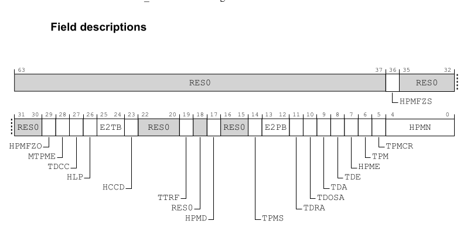

# D17.3.17 MDCR_EL2, Monitor Debug Configuration Register (EL2)
The MDCR_EL2 characteristics are:
## Purpose
> Provides EL2 configuration options for self-hosted debug and the Performance
> Monitors Extension.
>
> 为 self-hosted debug 和 PME 提供 EL2 配置选项

## Configurations

> AArch64 System register MDCR_EL2 bits [31:0] are architecturally mapped to
> AArch32 System register HDCR[31:0].

If EL2 is not implemented, this register is RES0 from EL3.

This register has no effect if EL2 is not enabled in the current Security
state.

> 如果在当前安全状态下未启用 EL2，则该寄存器无效。

## Attributes

MDCR_EL2 is a 64-bit register.

## HPMN, bits [4:0]

When FEAT_PMUv3 is implemented:

Defines the number of event counters that are accessible from EL3, EL2, EL1,
and from EL0 if permitted.

> 定义可从 EL3、EL2、EL1 和 EL0（如果允许）访问的事件计数器的数量。

If HPMN is not 0 and is less than PMCR_EL0.N, HPMN divides the event counters
into a first range [0..(HPMN-1)], and a second range [HPMN..(PMCR_EL0.N-1)]. If
FEAT_HPMN0 is implemented and this field is 0, all event counters are in the
second range and none are in the first range.

> 如果HPMN不为0并且小于PMCR_EL0.N，则HPMN将事件计数器划分为first range [0…(HPMN-1)]
> 和second range [HPMN…(PMCR_EL0.N-1)]。如果实现 FEAT_HPMN0 并且该字段为 0，则所有事
> 件计数器都在second range内，并且没有一个事件计数器在first range内。

If HPMN is equal to PMCR_EL0.N, all event counters are in the first range and
none are in the second range.

> 如果 HPMN 等于 PMCR_EL0.N, 所有事件计数器都在first range内，并且没有一个事件
> 计数器在second range内。

For an event counter <n> in the first range:
* The counter is accessible from EL1, EL2, and EL3.
* The counter is accessible from EL0 if permitted by PMUSERENR_EL0 or
  PMUSERENR.
* If FEAT_PMUv3p5 is implemented, PMCR_EL0.LP or PMCR.LP determines whether the
  counter overflow flag is set on unsigned overflow of PMEVCNTR<n>_EL0[31:0] or
  PMEVCNTR<n>_EL0[63:0].
  > 如果实现 FEAT_PMUv3p5，则 PMCR_EL0.LP 或 PMCR.LP 确定是否在 PMEVCNTR_EL0[31:0] 
  > 或 PMEVCNTR_EL0[63:0] 的无符号溢出时设置计数器溢出标志。
* PMCR_EL0.E and PMCNTENSET_EL0[n] enable the operation of event counter n.

For an event counter <n> in the second range:
* The counter is accessible from EL2 and EL3.

* If EL2 is disabled in the current Security state, the event counter is also
  accessible from EL1, and from EL0 if permitted by PMUSERENR_EL0.

* If FEAT_PMUv3p5 is implemented, MDCR_EL2.HLP determines whether the counter
  overflow flag is set on unsigned overflow of PMEVCNTR<n>_EL0[31:0] or
  PMEVCNTR<n>_EL0[63:0].

* MDCR_EL2.HPME and PMCNTENSET_EL0[n] enable the operation of event counter n.

# PMCR_EL0
> FROM
>
> D17.5.7 PMCR_EL0, Performance Monitors Control Register
## Purpose

Provides details of the Performance Monitors implementation, including the
number of counters implemented, and configures and controls the counters.
> 提供性能监视器实现的详细信息，包括计数器实现的数量，配置和控制计数器。

## N, bits [15:11]

Indicates the number of event counters implemented. This value is in the range
of 0b00000-0b11111. If the value is 0b00000, then only PMCCNTR_EL0 is
implemented. If the value is 0b11111, then PMCCNTR_EL0 and 31 event counters
are implemented.

> 指示已实施的事件计数器的数量。 该值的范围是0b00000-0b11111。 如果值为 0b00000，
> 则仅实现 PMCCNTR_EL0。 如果值为 0b11111，则实现了 PMCCNTR_EL0 和 31 个事件计数器。

When EL2 is implemented and enabled for the current Security state, reads of
this field from EL1 and EL0 return the value of MDCR_EL2.HPMN.

> 当针对当前安全状态实现并启用 EL2 时，从 EL1 和 EL0 读取该字段将返回 
> MDCR_EL2.HPMN 的值。
>
>> NOTE
>> 
>> 这里的场景是描述在 GUEST OS中, 访问 PMCR_EL0, 只返回 first range 的数量

This field has an IMPLEMENTATION DEFINED value.

Access to this field is RO.
## LP, bit [7]
**When FEAT_PMUv3p5 is implemented:**

Long event counter enable. Determines when unsigned overflow is recorded by an
event counter overflow bit.
> long event 计数器启用。 确定何时通过 event counter overflow bit 记录unsigned 
> overflow,

In the description of this field:
* If EL2 is implemented and is using AArch32, PMN is HDCR.HPMN.
* If EL2 is implemented and is using AArch64, PMN is MDCR_EL2.HPMN.
* If EL2 is not implemented, PMN is PMCR_EL0.N.
> PMN 只是的 MDCR_EL2.HPMN, 如果EL2没有实现,那么可以认为都是 first range

**0b0**

Event counter overflow on increment that causes unsigned overflow of
PMEVCNTR<n>_EL0[31:0].
> bit[31:0] 溢出触发overflow
**0b1**

Event counter overflow on increment that causes unsigned overflow of
PMEVCNTR<n>_EL0[63:0].
> bit[63:0]溢出触发overflow

If PMN is not 0, this field affects the operation of event counters in the
range [0 .. (PMN-1)].
> 如果 PMN 不是0, 该字段影响 range [0, ... (PMN-1)]中的event counter的行为

This field does not affect the operation of other event counters and
PMCCNTR_EL0.
> 该字段不影响 other event counters 和 PMCCNTR_EL0 的行为

The operation of this field applies even when EL2 is disabled in the current
Security state. 
> 即使在当前Security state下禁用 EL2，该字段的操作也适用

The reset behavior of this field is:
* On a Warm reset, this field resets to an architecturally UNKNOWN value.

**Otherwise:**

Reserved, RES0.
