# PSTATE

> from ARM64v8 SPEC D1.4 Process state, PSTATE
> 下面的部分主要是对手册的翻译

`Process state` 或者说 `PSTATE` 是process state 信息的
抽象。

所有arm指令集都提供了对`PSTATE`元素进行操作的指令。

`PSTATE`包括下面的部分:
* 只有在 AArch32 状态下有意义的字段 
* 只有在 AArch64 状态下有意义的字段
* 在两种状态下都有意义的字段

`PSTATE`在伪代码中被定义为`ProcState`类型的PSTATE结构。

## PSTATE fields that are meaningful in AArch64 state
在AArch64 state 下 PSTATE 有意义的字段可以归为如下几类:
* Condition flags.
* Execution state controls.
* Exception mask bits.
* Access control bits.
* Timing control bits.
* Speculation control bits.
> speculation /spekjuˈleɪʃn/ : 推测, 投机

The following PSTATE bits are meaningful in AArch64 state:

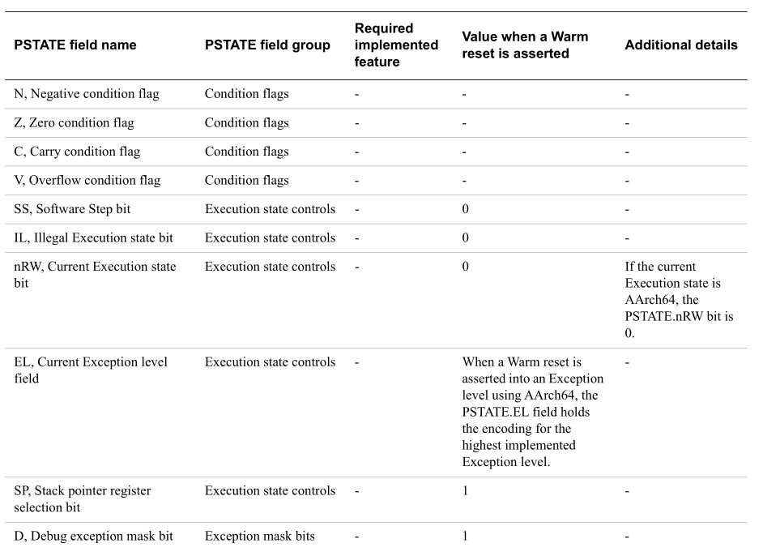

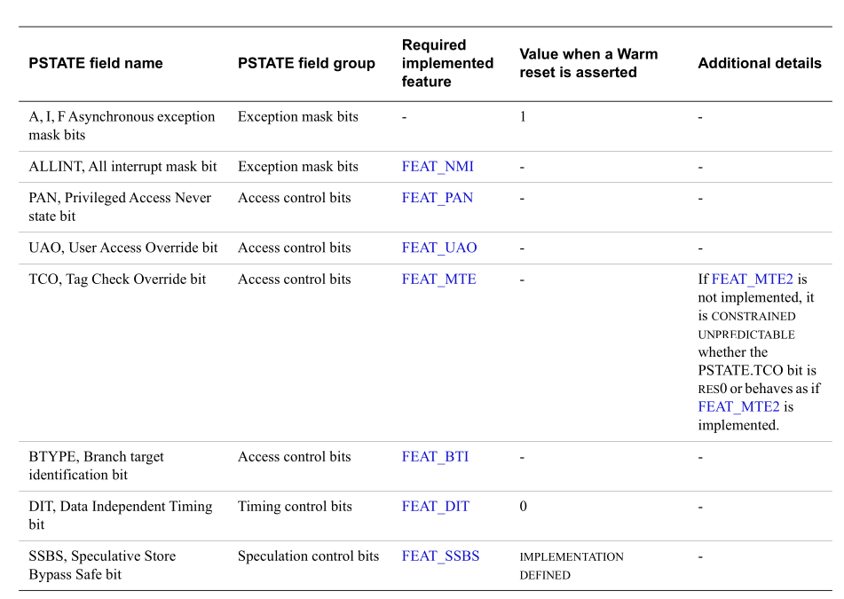

***

**Accessing PSTATE fields**

在AArch64 state下，可以使用 `Special-purpose`寄存器访问`PSTATE` 字段 
---- 使用 MRS 指令 direct read, 使用 MSR 指令 direct write

如果在AArch64 state, 以下 Specical-purpose 寄存器可以访问 hold
(持有，维持) AArch64 state 的PSTATE字段：

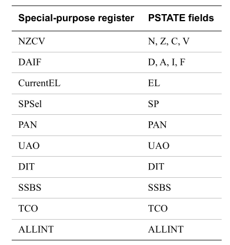

其他所有的 PSTATE field 都不能 direct read 和 direct write

软件可以使用 MSR(imm) 指令 direct write `PSTATE.{D, A, I, F, 
SP, PAN, UAO, SSBS, TCO}.`

下面的 PSTATE 字段可以在 EL0 被访问: * PSTATE.{N, Z, C, V, SSBS, DIT, TCO}.
* If SCTLR_EL1.UMA is 0, PSTATE.{D, A, I, F}.
* All other PSTATE access instructions can be executed at EL1 
 or higher and are UNDEFINED at EL0.

Writes to the PSTATE fields have side-effects on various aspects of 
the PE operation. For side-effects caused by writes to a PSTATE 
field, all of the following are true:
* The side-effect is guaranteed not to be visible to earlier instructions in the Execution stream.
* The side-effect is guaranteed to be visible to later instructions in the Execution stream.

Other side-effects might occur but are not guaranteed.

> 对PSTATE字段的写入对PE操作的各个方面都有副作用。对于写入
> PSTATE字段引起的副作用，以下所有情况都是正确的： 
> * 保证执行流中的早期指令不会看到副作用。
> * 该副作用保证对执行流中的后续指令可见。

> 可能会出现其他副作用，但不能保证。 

# PSTATE Field
* [SSBS](./ssbs.md)
# ACCESS PSTATE
从上面可以知道通过 MSR，MRS指令可以access PSTATE中的某些字段。
另外，异常的触发和返回也会access PSTATE，我们分别看下

## MSR
> NOTE
>
> 这里我们只看 MSR指令，MRS类似

MSR指令有两种编码
* MSR (imm)
* MSR (reg)

而 MSR (imm) 目前只在 写 PSTATE相关字段有用。

### MSR (imm)

> NOTE
>
> 大家思考下，为什么MSR(imm) 只用于访问PSTATE 
>
> 原因在于其他的system register 整个空间都可以访问,
> 而 PSTATE的需求只访问某些字段。
>
> 而system register大小一般是64-bits, 而一条MSR指令的编码
> 大小为32bits, 所以需要用寄存器存储要写入的值，而PSTATE
> 访问某些字段，则可以用 [(op1,op2), CRm] 表示 [字段的Index, 写入
> value]

某些位在某些情况下才能被写入:
* PSTATE.D, PSTATE.A, PSTATE.I, PSTATE.F, and PSTATE.SP.
* If FEAT_SSBS is implemented, PSTATE.SSBS.
* If FEAT_PAN is implemented, PSTATE.PAN.
* If FEAT_UAO is implemented, PSTATE.UAO.
* If FEAT_DIT is implemented, PSTATE.DIT.
* If FEAT_MTE is implemented, PSTATE.TCO.
* If FEAT_NMI is implemented, PSTATE.ALLINT.
* If FEAT_SME is implemented, PSTATE.SM and PSTATE.ZA.

该指令有`SMSTART 和 SMSTOP`的alias。(别的格式)

指令编码:

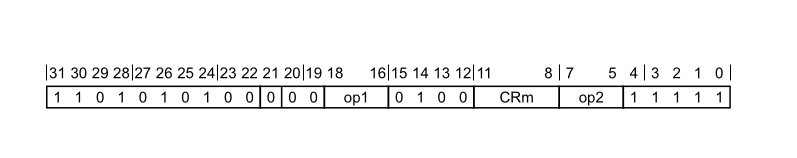
```
Encoding
MSR <pstatefield>, #<imm>
```

我们看下指令的伪代码:
```
if op1 == '000' && op2 == '000' then SEE "CFINV";
if op1 == '000' && op2 == '001' then SEE "XAFLAG";
if op1 == '000' && op2 == '010' then SEE "AXFLAG";

AArch64.CheckSystemAccess('00', op1, '0100', CRm, op2, '11111', '0');
bits(2) min_EL;
boolean need_secure = FALSE;

case op1 of
    when '00x'
        min_EL = EL1;
    when '010'
        min_EL = EL1;
    when '011'
        min_EL = EL0;
    when '100'
        min_EL = EL2;
    when '101'
        if !HaveVirtHostExt() then
            UNDEFINED;
        min_EL = EL2;
    when '110'
        min_EL = EL3;
    when '111'
        min_EL = EL1;
        need_secure = TRUE;
if (UInt(PSTATE.EL) < UInt(min_EL) || (need_secure && CurrentSecurityState() != SS_Secure)) then
    UNDEFINED;
```
这部分会根据访问的字段不同，确定最低的访问级别 min_EL 和 secure, 如果不满足，则报
UNDEFINED。

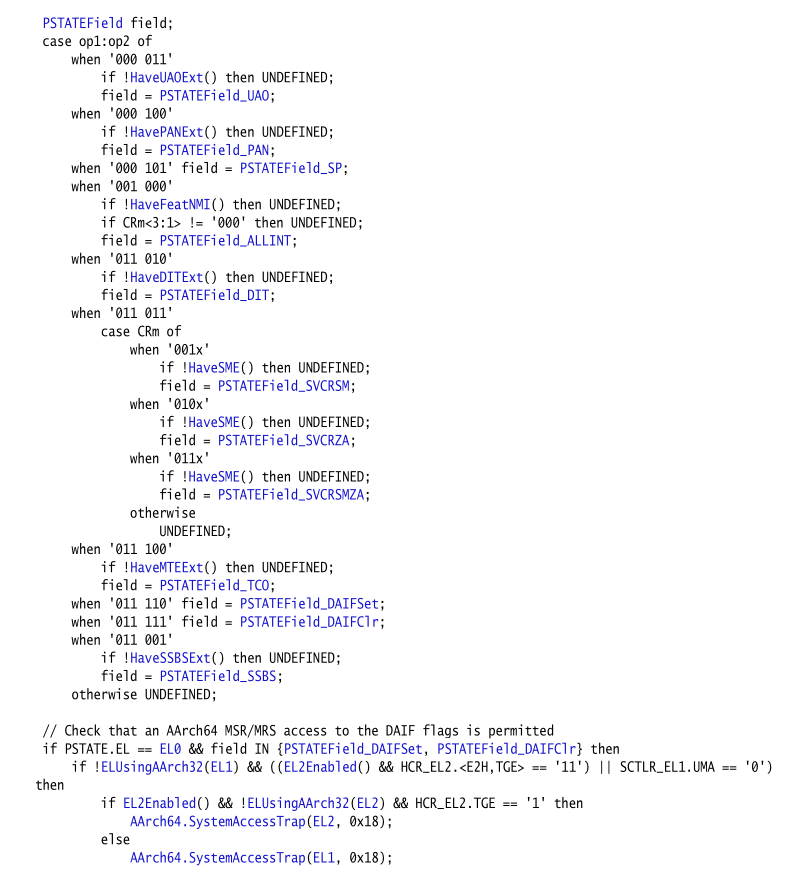

根据 [op1:op2] 的组合确定访问的 PSTATE 字段
> 这里 会查看 该PE是否支持 某些特性，例如 访问
> SSBS字段时，会调用`HaveSSBSExt()`判断是否支持 `FEAT_SSBS2`
> 如果不支持，则报 UNDEFINED异常。
>> 虽然手册中,`HaveSSBSExt()`去判断 `FEAT_SSBS`, 但是个人认为
>> 是去判断 `FEAT_SSBS2`, 一方面是因为 `FEAT_SSBS2`的描述，
>> 另一方面在手册中并未搜到和 `FEAT_SSBS2`的伪代码（侧面说明
>> 伪代码中的`FEAT_SSBS`包含了 `FEAT_SSBS2`

***
***
***

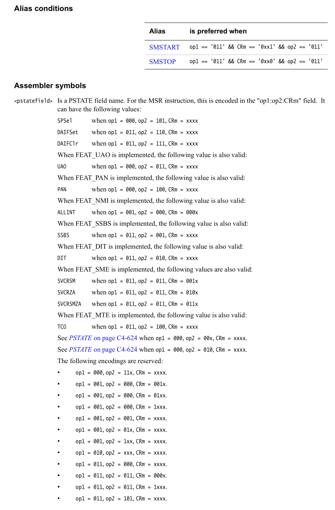

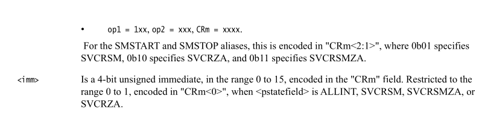

* `SMSTART`和`SMSTOP`指令编码和 `MSR(imm)`某些重合 (alias)
  + `SMSTART` : op1 = 011, CRm = 0xx1 op2 = 011
  + `SMSTOP` : op1 = 011, CRm = 0xx0 op2 = 011<br/>
  (详细看 `FEAT_SME`)
* MSR(imm) 除了上面 列出的项，其余都是reserved。

***
***
***
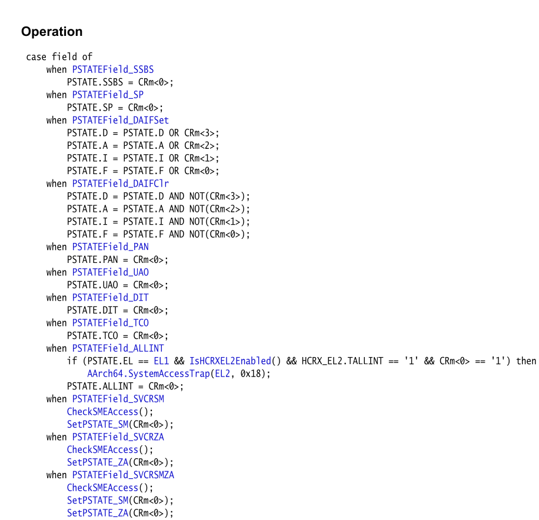

该部分根据 上面得到的 field , 选择将CRm某些位赋值给 `PSTATE`
相应的字段, 某些field可能有副作用，例如`PSTATEField_SVCRSM`,
这里就不再展开。

> NOTE
>
> 从上面可以看到，在该 PE 未实现某些 feature时，访问相应
> 字段，可能会造成 undefine 异常。那么我们知道在 进入异常时，
> 会save pstate -> spsr, 在退出异常时，会restore spsr -> pstate

### MSR(reg) -- SSBS
在AArch64 模式下，PSTATE的某些字段类似于一个sysreg, 使用`MSR(reg)`
指令访问，以`SSBS`字段为例

> NOTE
>
> This register is present only when FEAT_SSBS is implemented. 
> Otherwise, direct accesses to SSBS are UNDEFINED.

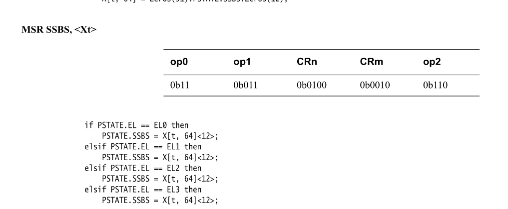

## MRS(reg) -- SSBS
和上面 `MSR(reg)`一样，如果没有实现`FEAT_SSBS`, 则会报 `UNDEFINED`异常。

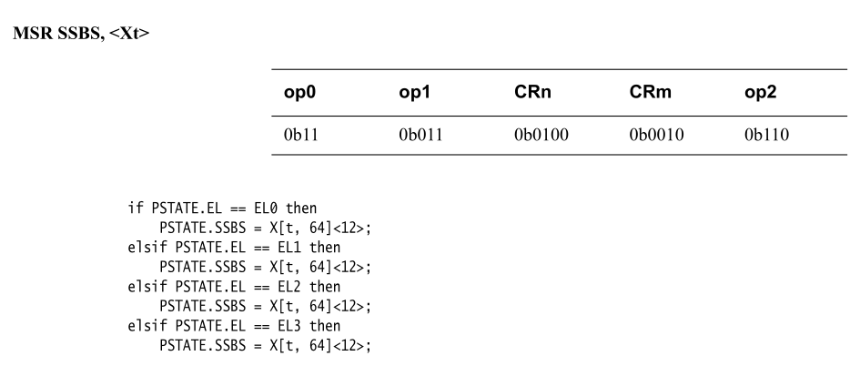

## SPSR
SPSR用于在进入异常时 save pstate -> SPSR, 在退出异常时 restore pstate->SPSR,
我们分别来看下:

### enter Execution

我们以 `AArch64.SystemAccessTrap`为例:
伪代码如下:
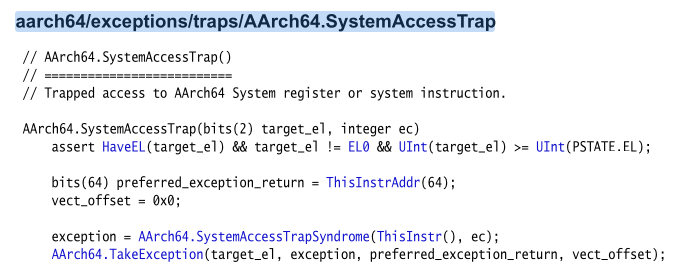

最终调用到 `AArch64.TakeException`(其他类型异常也是这样)。

这部分代码有点多我们截取我们关心的。

* 在更改PSTATE之前<br/>
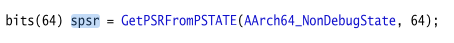, 

* 更改 PSTATE  && 保存 SPSR
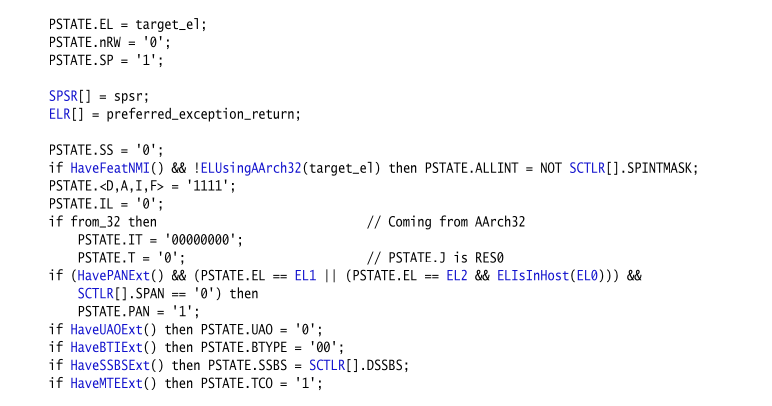

总的执行顺序如下:
```
1. spsr = PSTATE
2. PSTATE.EL = target_el   //首先将PSTATE.EL 设置为 target_el
3. SPSR[] = spsr           //SPSR[] = SPSR_ELx = spsr  x = target_el
4. 初始化PSTATE的其他字段，举个例子:
    SPSR: 
      if HaveSSBSExt() then PSTATE.SSBS = SCTLR[].DSSBS;
    会去查看 SCTLR_ELx.DSSBS (同上, x = target_el)。我们会在下面展开
```
这里包含了，对 src_el PSTATE 的 READ, 和 target_el PSTATE的write。
这里展示了WRITE动作，并不会触发 UNDEFINED异常。 

我们再来看下`GetPSRFromPSTATE()`

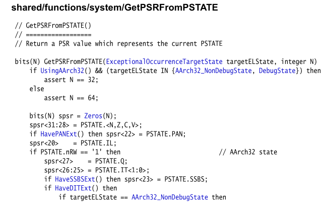
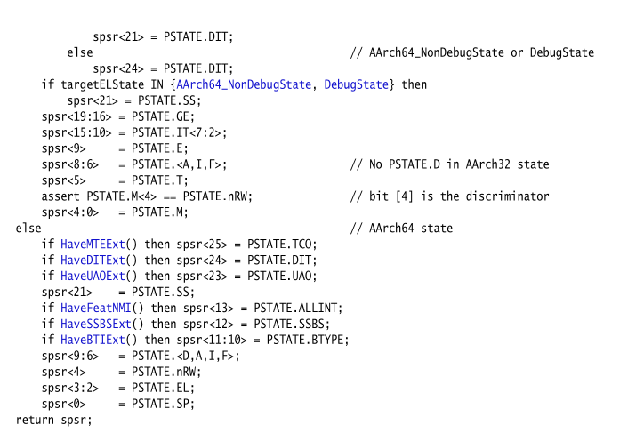

以`SSBS`为例，这里也是通过 `HaveSSBSExt()`是否有`FEAT_SSBS`的功能，然后在
访问`PSTATE.SSBS`, 这个过程也没有`UNDEFINED`逻辑。

### exit Exception
这里我们以`eret`指令为例:

手册中对该指令描述如下:
```
Exception Return using the ELR and SPSR for the current Exception
level. When executed, the PE restores PSTATE from the SPSR, 
and branches to the address held in the ELR.
```
可以看到会使用 current_el 的 SPSR 恢复 PSTATE.
我们来看下其伪代码:


可以看到会将 `SPSR[]`(SPSR_ELx x=current_el)当作第二个参数传入。
接着看下`AArch64.ExceptionReturn()`

截取部分片段:
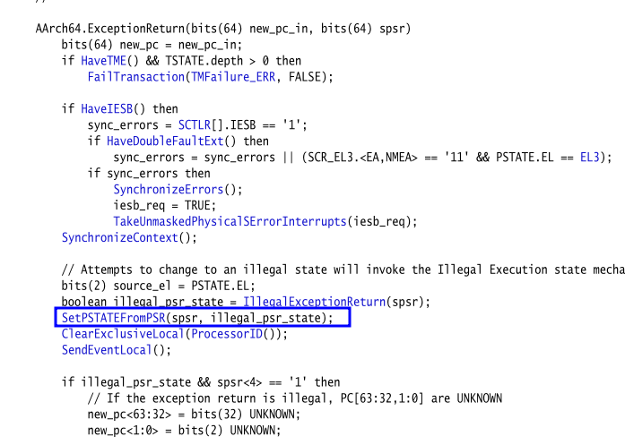

`SetPSTATEFromPSR()`函数，会将`SPSR_Elx x=current_el` retore to PSTATE。
该函数会传入一个 `illegal_psr_state`, 表示这个状态是非法的。
该函数伪代码如下:

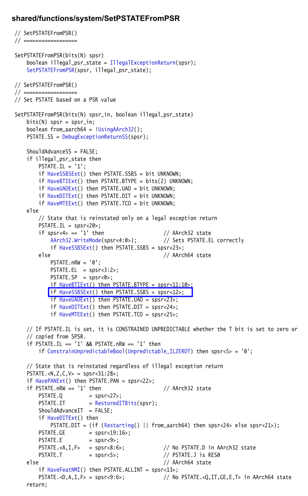

以SSBS为例，和`GetPSRFromPSTATE()`同样的逻辑。如果`HaveSSBSExt()`返回
为假，同样不会对`PSTATE.SSBS`进行写操作。
<!--
# arm64 手册位置
aarch64/exceptions/traps/AArch64.SystemAccessTrap
aarch64/instrs/branch/eret/AArch64.ExceptionReturn
-->
