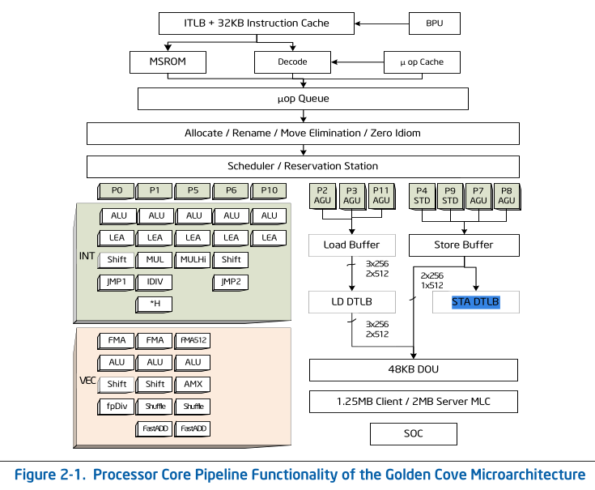
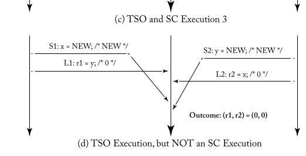
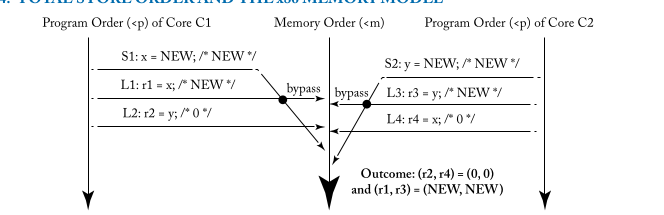

# 简介
## STORE buffer

以x86 TSO 内存模型为例子, x86实现了STORE BUFFER和 Load Buffer,
这两个都是为实现乱序执行单元的组件。



`STORE Buffer`在Pentium 4 引入，将`store`的数据先存储在`store buffer`,
然后再flush到 `memory`(cache, visible)。CPU 访问Store buffer, 比
访问cache快的多，这样做的好处是减少Store动作对后续指令执行阻塞。
增加流水线的效率。

但这样就会导致一个问题，
```
store A
load B
```
由于`store A` 先存放在 `store buffer`, 此时还没有flush，此时执行 `load B`,
然后在flush `store buffer`, 这时候，在memory older 看来，先`load B`, 再
`STORE A`, 这样就造成了OoO(out-of-order)。如下图:



这种行为在 TSO 模型中是允许的。我们列举下几种memory order
```
load-load
store-store
load-store
store-load
```
上面的OoO对应着 `store-load`乱序。

## store-buffer bypass
我们思考下面的情形: 
```
// init a = 0
STORE A -> 1
LOAD A  =  ?
```
由于store buffer的存在，对于相同地址的读操作，应该首先考虑读取
store buffer中的（因为还未更新到内存，或者还有一种方法就是flush
store buffer但是这样会影响效率）, 这样本次的load动作就不是从Memory
中load的。所以此次 bypass (bypass memory)



这里由于`write buffer` 和单线程的memory order的需求，`S1->L1`, `S2->L3`
肯定不能乱序，所以`r1=x=NEW`, `r3=y=NEW`, 但是`S1->L2`, `S2->L4`
可能乱序, 造成如图的顺序。

> NOTE
>
> 但是这里我觉得不符合x86-TSO的语义:
> 因为, 需要保证`L1->L2`, `L3->L4`的顺序(load->load)
> 同时需要保证`S1->L1`, `S2->L3`的顺序，也就是说，
> 需要保证`STORE_A->LOAD_A`的顺序，所以不应该出现
> ```
> r1,r3 = (NEW, NEW), r2, r4 = (0, 0)
> ```
>
> 那么这种情况该怎么规避呢? 以下是自己的猜测:
> 
> 当执行load 操作时，会将在load buffer中创建一个副本。
> 而在commit之前，如果检测到load的地址在其他的cpu上有
> 修改（cacheline invaild) , 则将load 之后的指令，重新执行。
>
> 这种行为叫做memory order violation


现代的cpu 对上述 `bypass`的动作进行了进一步优化，叫做`Speculative Store 
Bypass`, 当处理器对某个内存地址进行读操作时，除了查询 load buffer，
还需要查询 store buffer，以获取处理器之前对该内存地址写入的值。
为了提升性能，推测本次的`load` 访问的地址，不存在与 `store buffer`, 投机
执行后面的指令。如果之后发现`store buffer`中有当前地址的load内存地址的
更新值，则丢弃投机执行的结果。这样就泄漏了相关旁路信息。

> FROM [CPU漏洞详解 3.4](https://www.sohu.com/a/357494787_467784)

# introduce
> FROM arm64v8 sdm, A2.2.1
> `Additional functionality added to Armv8.0 in later releases`

**FEAT_SSBS, FEAT_SBSS2, Speculative Store Bypass Safe**

FEAT_SSBS allows software to indicate whether hardware is permitted 
to load or store speculatively in a manner that could give rise 
to a cache timing side channel, which in turn could beused to
derive an address from values loaded to a register from memory.

> FEAT_SSBS 允许软件去指示硬件是否允许以 give rise to a cache timing side channel 
> 的方式进行 speculatively load / store , 该channel反过来可以用于从memory load
> 到 reg 的值中导出一个地址。

FEAT_SSBS2 provides controls for the MSR and MRS instructions 
to read and write the PSTATE.SSBS field.

> FEAT_SSBS2 提供了对于 MSR ， MRS 指令 r/w `PSTATE.SSBS` 字
> 段的方法

FEAT_SSBS is supported in both AArch64 and AArch32 states. 
FEAT_SSBS2 is supported in AArch64 state only.

> * FEAT_SSBS: 支持 AArch64 && AArch32
> * FEAT_SSBS2: 只支持 AArch64

This feature is OPTIONAL in Armv8.0 implementations.

> 该功能在 Armv8.0 实现中是 OPTIONAL的

The following fields identify the presence of FEAT_SSBS and FEAT_SSBS2:
* ID_AA64PFR1_EL1.SSBS.
* ID_PFR2_EL1.SSBS.
* ID_PFR2.SSBS.

> 下面的字段指示 FEAT_SSBS 和 FEAT_SSBS2 是否存在
> * ID_AA64PFR1_EL1.SSBS 
> * ID_PFR2_EL1.SSBS
> * ID_PFR2.SSBS

For more information, see:
* Speculative Store Bypass Safe (SSBS) on page B2-172.
* Speculative Store Bypass Safe (SSBS) on page E2-7179.

# ID_AA64PFR1_EL1.SSBS
> NOTE 
>
> `ID_AA64PFR1_EL1` 寄存器 主要是指示当前处理器实现的feature
***SSBS, bits [7:4]***

Speculative Store Bypassing controls in AArch64 state. Defined values are:
* 0b0000 : AArch64 provides no mechanism to control the use 
 of Speculative Store Bypassing. (没有实现)
* 0b0001 : AArch64 provides the PSTATE.SSBS mechanism to mark
 regions that are Speculative Store Bypass Safe. (支持 PSTATE.SSBS,
 相当于 FEAT_SSBS)
* 0b0010 : As 0b0001, and adds the MSR and MRS instructions 
 to directly read and write the PSTATE.SSBS field. (支持MSR,MRS
 指令直接访问, 相当与 FEAT_SSBS2)

All other values are reserved.

FEAT_SSBS implements the functionality identified by the value 0b0001.

FEAT_SBSS2 implements the functionality identified by the value 0b0010.

# SSBS 参考资料
1. [Speculative Store Bypass explained: what it is, how it works](https://www.redhat.com/en/blog/speculative-store-bypass-explained-what-it-how-it-works)

2. [CPU漏洞详解 3.4](https://www.sohu.com/a/357494787_467784)
