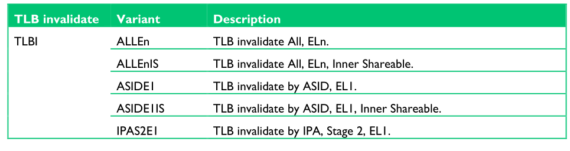
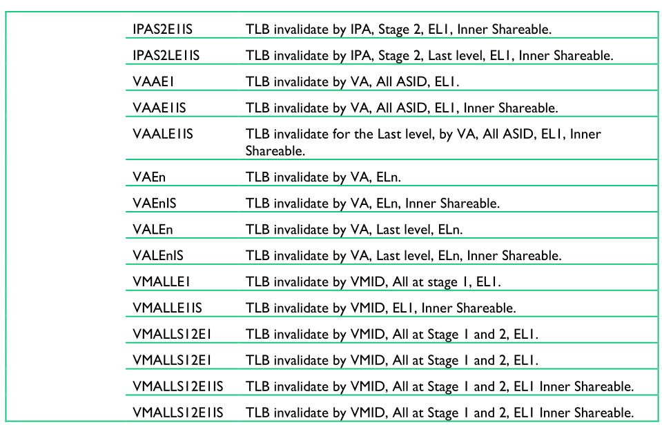

The Translation Lookaside Buffer (TLB) is a cache of recently accessed page
translations in the MMU. For each memory access performed by the processor, the
MMU checks whether the translation is cached in the TLB. If the requested
address translation causes a hit within the TLB, the translation of the address
is immediately available.

> TLB 是 在 MMU 中 用于 recently accessed page translation 的cache. 对于由处理器
> 执行的每个内存访问, MMU 会检查 TLB 中是否有该 translation 在 TLB 中有缓存.
> 如果请求地址的 translation 在 TLB 中 hit了, 该地址的translation 将会立即获得.
> (从tlb中)

Each TLB entry typically contains not only physical and virtual addresses, but
also attributes such as memory type, cache policies, access permissions, the
Address Space ID (ASID), and the Virtual Machine ID (VMID). If the TLB does not
contain a valid translation for the virtual address that is issued by the
processor, which is known as a TLB miss, an external translation table walk or
lookup is performed. Dedicated hardware within the MMU enables it to read the
translation tables in memory. The newly loaded translation can then be cached
in the TLB for possible reuse if the translation table walk does not result in
a page fault. The exact structure of the TLB differs between implementations of
the Arm processors.

> typically: 典型的, 通常
> 
> 每一个 TLB entry 通常不会只包含PA和VA, 同时也包涵某些 attr, e.g., memory type, 
> cachet policies(不知道是啥), access permissions, ASID, VMID. 如果TLB没有包含
> 对于当前处理器提交的虚拟地址的 valid translation, 这个被称为 TLB miss, 将会有
> 一个额外的 translation table walk 或者 lookup 将被执行.


If the OS modifies translation entries that have been cached in the TLB, it is
the responsibility of the OS to invalidate these stale TLB entries.

> 如果 OS 修改了一个translation entries, 并且他被缓存在 TLB 中, OS 应该负责 invalidate
> 这些 stale TLB entries

When executing A64 code, there is a TLBI, which is a TLB invalidate
instruction. It has the form:

> 当执行 A64 code是, 使用 TLBI, 这是一个无效 TLB 的指令. 它的格式如下:
```
TLBI <type><level>{IS} {, <Xt>}
```
The following list gives some of the more common selections for the type field.

> 如下的list 为 type filed 提供了一些常见的选择

```
ALL         All TLB entries.
            所有TLB

VMALL       All TLB entries. This is stage 1 for current guest OS.
            所有TLB, 但是仅对于 current guest OS stage 1

VMALLS12    All TLB entries. This is stage 1 and 2 for current guest OS.
            所有TLB. 但是仅对于 current guest OS stage 2

ASID        Entries that match ASID in Xt.
            符合Xt中ASID的所有的 Entries

VA          Entry for virtual address and ASID specified in Xt.
            对于 Xt 中指定的 virtual address 和 ASID 的对应的 entry

VAA         Entries for virtual address that is specified in Xt, with any ASID.
            对于 Xt 中指定的 virtual address, 和任何ASID 对应的 entry 
```

Each Exception level, that is EL3, EL2, or EL1, has its own virtual address
space that the operation applies to. The IS field specifies that this is only
for Inner Shareable entries.

> 每个 Exception level(EL3, EL2, EL1), 拥有自己的 virtual address space(该操作
> 提供的, 请见下面的指令). IS 字段 指定了它只对 Inner Shareable entries生效.

The <level> field simply specifies the Exception level virtual address space
(can be 3, 2 or 1) that the operation must apply to.

> <level> field 只是指定了该操作必须作用的 Exception level (3, 2, 1)的 virtual 
> address space

The IS field specifies that this is only for Inner Shareable entries.

> 上面说了,不知道为什么这里要重复

The following table lists TLB configuration instructions:





The following code example shows a sequence for writes to translation tables
backed by Inner Shareable memory:

> backed: 支持;帮助;后退
>
> 下面大的code example 展示了 write 到 支持 Inner Shareable memory 的 translation 
> tables

```
<< Writes to translation tables >>
DSB ISHST           // ensure write has completed
TLBI ALLE1          // invalidate all TLB entries
DSB ISH             // ensure completion of TLB invalidation
ISB                 // synchronize context and ensure that no
                    // instructions are fetched using the old
                    // translation
```
For a change to a single entry, for example, use the instruction:
> 例如, 要更改 单个 entry, 使用如下的 instruction:
```
TLBI VAE1, X0
```

Which invalidates an entry that is associated with the address that is
specified in the register X0.

> 该指令无效 由 register x0 指定的地址相关的 entry.

The TLB can hold a fixed number of entries. You can achieve best performance by
minimizing the number of external memory accesses caused by translation table
traversal and obtaining a high TLB hit rate. The Armv8-A architecture provides
a feature known as contiguous block entries to efficiently use TLB space.
Translation table block entries each contain a contiguous bit. When set, this
bit signals to the TLB that it can cache a single entry covering translations
for multiple blocks. A lookup can index anywhere into an address range covered
by a contiguous block. The TLB can therefore cache one entry for a defined
range of addresses, making it possible to store a larger range of virtual
addresses within the TLB than is otherwise possible.

> traversal: 遍历
> contiguous: [kənˈtɪɡjuəs] 相邻的; 相接的;
>
> TLB 拥有固定数目的 entries. 通过最小化由 translation table 遍历引起的外部内存
> 访问次数并获得较高的TLB hit rate, 可以实现最佳性能. Armv8-A arch 提供了一种名为
> contiguous block entries 以更有效的使用 TLB space. Translation table block entries
> 中的每一个都包含了一个 contiguous bit. 当设置时, 此位通知tlb 表示它可以使用一个 entry 
> 缓存覆盖多个blocks. 因此 TLB 可以为定义的address的范围缓存一个 entry, 从而可以在 TLB
> store 比其他情况下更大范围的虚拟地址.

To use a contiguous bit, the contiguous blocks must be adjacent, that is they
must correspond to a contiguous range of virtual addresses. They must start on
an aligned boundary, have consistent attributes, and point to a contiguous
output address range at the same level of translation. The required alignment
is that VA[20:16] for a 4KB granule or VA[28:21] for a 64KB granule, are the
same for all addresses. The following numbers of contiguous blocks are
required:

> adjacent /əˈdʒeɪsnt/ : 相邻的,相近的
> correspond to : 对应于, 相对于
> granule [ˈɡrænjuːl] : 颗粒
>
> 为了使用 contigure abit, contiguous blocks 必须是相邻的, 也就是说它们必须
> 对应于虚拟地址的连续范围.  他们必须起始于一个 aligned boundary, 拥有一致的
> attr, 并且指向相同 translation level的连续的 OA. 对齐的需求是, 4KB 颗粒的VA[20:16]
> 或者64KB的 VA[28:21] 对于所有地址都是相同的.
> 
> 需要下面数量的 contiguous block:

* 16 × 4KB adjacent blocks giving a 64KB entry with 4KB granule.
* 32 ×32MB adjacent blocks giving a 1GB entry for L2 descriptors.
* 128 ×16KB giving a 2MB entry for L3 descriptors when using a 16KB granule.
* 32 ×64Kb adjacent blocks giving a 2MB entry with a 64KB granule.

(目前只讨论了4KB, 64KB, arm64 只有这两种last level page size么?)

If these conditions are not met, a programming error occurs, which can cause
TLB aborts or corrupted lookups. Possible examples of such an error include:

> 如果遇到的不是这些情况, 会发生 programming error, 它将导致 TLB aborts
> 或者 corrupted lookups. 可能导致这样错误的例子包括:

* One or more of the table entries do not have the contiguous bit set.
* The output of one of the entries points outside the aligned range.

> 一个或多个 table entries 没有设置 contiguous bit
> 其中一个条数的输出指向 对齐范围之外???

With the Armv8-A architecture, incorrect use does not allow permissions checks
outside of EL0 and EL1 valid address space to be escaped, or to erroneously
provide access to EL3 space.

> 对于Armv8-A体系结构，不正确的使用不允许对EL0和EL1有效地址空间之外的权限检查进行
> escaped，或者错误地提供对EL3空间的访问。
