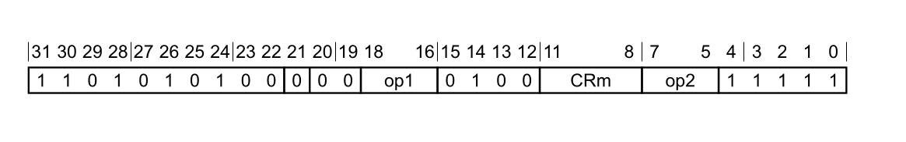

[COMMIT](https://github.com/torvalds/linux/commit/0bf0f444b2c49241b2b39aa3cf210d7c95ef6c34)

[MAIL LIST](https://lore.kernel.org/all/1535645767-9901-5-git-send-email-will.deacon@arm.com/#t)

# Instructions for accessing the PSTATE fields

> FROM : C5.1.3 op0==0b00, architectural hints, barriers and CLREX, and PSTATE access
>
# MSR 指令编码

# arm64 手册位置
aarch64/exceptions/traps/AArch64.SystemAccessTrap

aarch64/instrs/branch/eret/AArch64.ExceptionReturn
