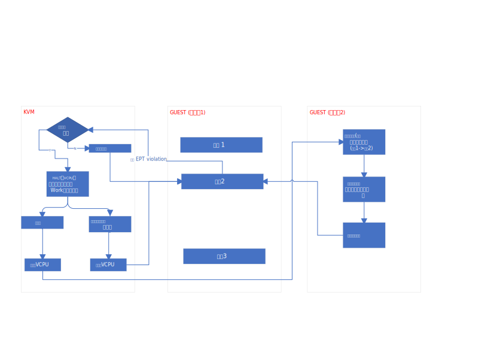

# Patch
## Part1 commit message 
```diff
From af585b921e5d1e919947c4b1164b59507fe7cd7b Mon Sep 17 00:00:00 2001
From: Gleb Natapov <gleb@redhat.com>
Date: Thu, 14 Oct 2010 11:22:46 +0200
Subject: [PATCH 01/11] KVM: Halt vcpu if page it tries to access is swapped
 out

If a guest accesses swapped out memory do not swap it in from vcpu thread
context. Schedule work to do swapping and put vcpu into halted state
instead.

Interrupts will still be delivered to the guest and if interrupt will
cause reschedule guest will continue to run another task.

如果一个guest（虚拟机）访问了被交换出的内存，请不要从 vCPU 线程上下
文中将其调入。而是安排工作来进行交换，并将 vCPU 置于暂停状态。

中断仍然会发送到guest，如果中断导致重新调度，则guest将继续执行另一个任务。

[avi: remove call to get_user_pages_noio(), nacked by Linus; this
      makes everything synchrnous again]

Acked-by: Rik van Riel <riel@redhat.com>
Signed-off-by: Gleb Natapov <gleb@redhat.com>
Signed-off-by: Marcelo Tosatti <mtosatti@redhat.com>
---
 arch/x86/include/asm/kvm_host.h |  18 +++
 arch/x86/kvm/Kconfig            |   1 +
 arch/x86/kvm/Makefile           |   1 +
 arch/x86/kvm/mmu.c              |  52 ++++++++-
 arch/x86/kvm/paging_tmpl.h      |   4 +-
 arch/x86/kvm/x86.c              | 112 ++++++++++++++++++-
 include/linux/kvm_host.h        |  31 ++++++
 include/trace/events/kvm.h      |  90 +++++++++++++++
 virt/kvm/Kconfig                |   3 +
 virt/kvm/async_pf.c             | 190 ++++++++++++++++++++++++++++++++
 virt/kvm/async_pf.h             |  36 ++++++
 virt/kvm/kvm_main.c             |  48 ++++++--
 12 files changed, 570 insertions(+), 16 deletions(-)
 create mode 100644 virt/kvm/async_pf.c
 create mode 100644 virt/kvm/async_pf.h
```
这里需要思考下 **为什么此时halt对于 guest来说是透明的**
* 如果是EPT mmu, 此时发生的异常是: EPT violation, 该异常本身对于guest来说是透明的。
* 如果halt 过程中发生了异常, 实际上ip 还是指向发生异常(EPT violation)的指令，对于
 guest来说，跟这条指令没有执行过一样。假如说发生了EPT violation, 内存页面被换出，
 对于guest的视角，更像是 触发 EPT violation 的上一条指令执行事件比较长。在该指令执行
 结束后，EPT violation 的指令正常执行，在指令边界处触发中断. 如下所示:



这里guest调度到之前的进程（触发 EPT violation)的进程时，执行 `指令2`, 这时，
可能页面被换入(指令执行成功），也可能页面还没有被换入, 那会继续出发 `EPT
violation`, 进入kvm, 这时kvm, 还是会将vcpu halt住，等待中断 / 页面被换入
的事件。

## Part2
```diff
diff --git a/arch/x86/include/asm/kvm_host.h b/arch/x86/include/asm/kvm_host.h
index f702f82aa1eb..b5f4c1a36d65 100644
--- a/arch/x86/include/asm/kvm_host.h
+++ b/arch/x86/include/asm/kvm_host.h
@@ -83,11 +83,14 @@
 #define KVM_NR_FIXED_MTRR_REGION 88
 #define KVM_NR_VAR_MTRR 8
 
+#define ASYNC_PF_PER_VCPU 64
+
 extern spinlock_t kvm_lock;
 extern struct list_head vm_list;
 
 struct kvm_vcpu;
 struct kvm;
+struct kvm_async_pf;
 
 enum kvm_reg {
 	VCPU_REGS_RAX = 0,
@@ -412,6 +415,11 @@ struct kvm_vcpu_arch {
 	u64 hv_vapic;
 
 	cpumask_var_t wbinvd_dirty_mask;
+
+	struct {
+		bool halted;
+		gfn_t gfns[roundup_pow_of_two(ASYNC_PF_PER_VCPU)];
+	} apf;
 };
 
 struct kvm_arch {
@@ -585,6 +593,10 @@ struct kvm_x86_ops {
 	const struct trace_print_flags *exit_reasons_str;
 };
 
+struct kvm_arch_async_pf {
+	gfn_t gfn;
+};
+
 extern struct kvm_x86_ops *kvm_x86_ops;
 
 int kvm_mmu_module_init(void);
@@ -799,4 +811,10 @@ void kvm_set_shared_msr(unsigned index, u64 val, u64 mask);
 
 bool kvm_is_linear_rip(struct kvm_vcpu *vcpu, unsigned long linear_rip);
 
+void kvm_arch_async_page_not_present(struct kvm_vcpu *vcpu,
+				     struct kvm_async_pf *work);
+void kvm_arch_async_page_present(struct kvm_vcpu *vcpu,
+				 struct kvm_async_pf *work);
+extern bool kvm_find_async_pf_gfn(struct kvm_vcpu *vcpu, gfn_t gfn);
+
 #endif /* _ASM_X86_KVM_HOST_H */
diff --git a/arch/x86/kvm/Kconfig b/arch/x86/kvm/Kconfig
index ddc131ff438f..50f63648ce1b 100644
--- a/arch/x86/kvm/Kconfig
+++ b/arch/x86/kvm/Kconfig
@@ -28,6 +28,7 @@ config KVM
 	select HAVE_KVM_IRQCHIP
 	select HAVE_KVM_EVENTFD
 	select KVM_APIC_ARCHITECTURE
+	select KVM_ASYNC_PF
 	select USER_RETURN_NOTIFIER
 	select KVM_MMIO
 	---help---
diff --git a/arch/x86/kvm/Makefile b/arch/x86/kvm/Makefile
index 31a7035c4bd9..c53bf19b1da0 100644
--- a/arch/x86/kvm/Makefile
+++ b/arch/x86/kvm/Makefile
@@ -9,6 +9,7 @@ kvm-y			+= $(addprefix ../../../virt/kvm/, kvm_main.o ioapic.o \
 				coalesced_mmio.o irq_comm.o eventfd.o \
 				assigned-dev.o)
 kvm-$(CONFIG_IOMMU_API)	+= $(addprefix ../../../virt/kvm/, iommu.o)
+kvm-$(CONFIG_KVM_ASYNC_PF)	+= $(addprefix ../../../virt/kvm/, async_pf.o)
 
 kvm-y			+= x86.o mmu.o emulate.o i8259.o irq.o lapic.o \
 			   i8254.o timer.o
diff --git a/arch/x86/kvm/mmu.c b/arch/x86/kvm/mmu.c
index fbb04aee8301..4ab04de5a76a 100644
--- a/arch/x86/kvm/mmu.c
+++ b/arch/x86/kvm/mmu.c
@@ -18,9 +18,11 @@
  *
  */
 
+#include "irq.h"
 #include "mmu.h"
 #include "x86.h"
 #include "kvm_cache_regs.h"
+#include "x86.h"
 
 #include <linux/kvm_host.h>
 #include <linux/types.h>
@@ -2587,6 +2589,50 @@ static int nonpaging_page_fault(struct kvm_vcpu *vcpu, gva_t gva,
 			     error_code & PFERR_WRITE_MASK, gfn);
 }
 
+int kvm_arch_setup_async_pf(struct kvm_vcpu *vcpu, gva_t gva, gfn_t gfn)
+{
+	struct kvm_arch_async_pf arch;
+	arch.gfn = gfn;
+
+	return kvm_setup_async_pf(vcpu, gva, gfn, &arch);
+}
+
+static bool can_do_async_pf(struct kvm_vcpu *vcpu)
+{
+	if (unlikely(!irqchip_in_kernel(vcpu->kvm) ||
+		     kvm_event_needs_reinjection(vcpu)))
+		return false;
+
+	return kvm_x86_ops->interrupt_allowed(vcpu);
+}
+
+static bool try_async_pf(struct kvm_vcpu *vcpu, gfn_t gfn, gva_t gva,
+			 pfn_t *pfn)
+{
+	bool async;
+
+	*pfn = gfn_to_pfn_async(vcpu->kvm, gfn, &async);
+
+	if (!async)
+		return false; /* *pfn has correct page already */
+
+	put_page(pfn_to_page(*pfn));
+
+	if (can_do_async_pf(vcpu)) {
+		trace_kvm_try_async_get_page(async, *pfn);
+		if (kvm_find_async_pf_gfn(vcpu, gfn)) {
+			trace_kvm_async_pf_doublefault(gva, gfn);
+			kvm_make_request(KVM_REQ_APF_HALT, vcpu);
+			return true;
+		} else if (kvm_arch_setup_async_pf(vcpu, gva, gfn))
+			return true;
+	}
+
+	*pfn = gfn_to_pfn(vcpu->kvm, gfn);
+
+	return false;
+}
+
 static int tdp_page_fault(struct kvm_vcpu *vcpu, gva_t gpa,
 				u32 error_code)
 {
@@ -2609,7 +2655,11 @@ static int tdp_page_fault(struct kvm_vcpu *vcpu, gva_t gpa,
 
 	mmu_seq = vcpu->kvm->mmu_notifier_seq;
 	smp_rmb();
-	pfn = gfn_to_pfn(vcpu->kvm, gfn);
+
+	if (try_async_pf(vcpu, gfn, gpa, &pfn))
+		return 0;
+
+	/* mmio */
 	if (is_error_pfn(pfn))
 		return kvm_handle_bad_page(vcpu->kvm, gfn, pfn);
 	spin_lock(&vcpu->kvm->mmu_lock);
diff --git a/arch/x86/kvm/paging_tmpl.h b/arch/x86/kvm/paging_tmpl.h
index cd7a833a3b52..c45376dd041a 100644
--- a/arch/x86/kvm/paging_tmpl.h
+++ b/arch/x86/kvm/paging_tmpl.h
@@ -568,7 +568,9 @@ static int FNAME(page_fault)(struct kvm_vcpu *vcpu, gva_t addr,
 
 	mmu_seq = vcpu->kvm->mmu_notifier_seq;
 	smp_rmb();
-	pfn = gfn_to_pfn(vcpu->kvm, walker.gfn);
+
+	if (try_async_pf(vcpu, walker.gfn, addr, &pfn))
+		return 0;
 
 	/* mmio */
 	if (is_error_pfn(pfn))
diff --git a/arch/x86/kvm/x86.c b/arch/x86/kvm/x86.c
index c05d47701292..3cd4d091c2f3 100644
--- a/arch/x86/kvm/x86.c
+++ b/arch/x86/kvm/x86.c
@@ -43,6 +43,7 @@
 #include <linux/slab.h>
 #include <linux/perf_event.h>
 #include <linux/uaccess.h>
+#include <linux/hash.h>
 #include <trace/events/kvm.h>
 
 #define CREATE_TRACE_POINTS
@@ -155,6 +156,13 @@ struct kvm_stats_debugfs_item debugfs_entries[] = {
 
 u64 __read_mostly host_xcr0;
 
+static inline void kvm_async_pf_hash_reset(struct kvm_vcpu *vcpu)
+{
+	int i;
+	for (i = 0; i < roundup_pow_of_two(ASYNC_PF_PER_VCPU); i++)
+		vcpu->arch.apf.gfns[i] = ~0;
+}
+
 static void kvm_on_user_return(struct user_return_notifier *urn)
 {
 	unsigned slot;
@@ -5115,6 +5123,12 @@ static int vcpu_enter_guest(struct kvm_vcpu *vcpu)
 			vcpu->fpu_active = 0;
 			kvm_x86_ops->fpu_deactivate(vcpu);
 		}
+		if (kvm_check_request(KVM_REQ_APF_HALT, vcpu)) {
+			/* Page is swapped out. Do synthetic halt */
+			vcpu->arch.apf.halted = true;
+			r = 1;
+			goto out;
+		}
 	}
 
 	r = kvm_mmu_reload(vcpu);
@@ -5243,7 +5257,8 @@ static int __vcpu_run(struct kvm_vcpu *vcpu)
 
 	r = 1;
 	while (r > 0) {
-		if (vcpu->arch.mp_state == KVM_MP_STATE_RUNNABLE)
+		if (vcpu->arch.mp_state == KVM_MP_STATE_RUNNABLE &&
+		    !vcpu->arch.apf.halted)
 			r = vcpu_enter_guest(vcpu);
 		else {
 			srcu_read_unlock(&kvm->srcu, vcpu->srcu_idx);
@@ -5256,6 +5271,7 @@ static int __vcpu_run(struct kvm_vcpu *vcpu)
 					vcpu->arch.mp_state =
 						KVM_MP_STATE_RUNNABLE;
 				case KVM_MP_STATE_RUNNABLE:
+					vcpu->arch.apf.halted = false;
 					break;
 				case KVM_MP_STATE_SIPI_RECEIVED:
 				default:
@@ -5277,6 +5293,9 @@ static int __vcpu_run(struct kvm_vcpu *vcpu)
 			vcpu->run->exit_reason = KVM_EXIT_INTR;
 			++vcpu->stat.request_irq_exits;
 		}
+
+		kvm_check_async_pf_completion(vcpu);
+
 		if (signal_pending(current)) {
 			r = -EINTR;
 			vcpu->run->exit_reason = KVM_EXIT_INTR;
@@ -5792,6 +5811,10 @@ int kvm_arch_vcpu_reset(struct kvm_vcpu *vcpu)
 
 	kvm_make_request(KVM_REQ_EVENT, vcpu);
 
+	kvm_clear_async_pf_completion_queue(vcpu);
+	kvm_async_pf_hash_reset(vcpu);
+	vcpu->arch.apf.halted = false;
+
 	return kvm_x86_ops->vcpu_reset(vcpu);
 }
 
@@ -5880,6 +5903,8 @@ int kvm_arch_vcpu_init(struct kvm_vcpu *vcpu)
 	if (!zalloc_cpumask_var(&vcpu->arch.wbinvd_dirty_mask, GFP_KERNEL))
 		goto fail_free_mce_banks;
 
+	kvm_async_pf_hash_reset(vcpu);
+
 	return 0;
 fail_free_mce_banks:
 	kfree(vcpu->arch.mce_banks);
@@ -5938,8 +5963,10 @@ static void kvm_free_vcpus(struct kvm *kvm)
 	/*
 	 * Unpin any mmu pages first.
 	 */
-	kvm_for_each_vcpu(i, vcpu, kvm)
+	kvm_for_each_vcpu(i, vcpu, kvm) {
+		kvm_clear_async_pf_completion_queue(vcpu);
 		kvm_unload_vcpu_mmu(vcpu);
+	}
 	kvm_for_each_vcpu(i, vcpu, kvm)
 		kvm_arch_vcpu_free(vcpu);
 
@@ -6050,7 +6077,9 @@ void kvm_arch_flush_shadow(struct kvm *kvm)
 
 int kvm_arch_vcpu_runnable(struct kvm_vcpu *vcpu)
 {
-	return vcpu->arch.mp_state == KVM_MP_STATE_RUNNABLE
+	return (vcpu->arch.mp_state == KVM_MP_STATE_RUNNABLE &&
+		!vcpu->arch.apf.halted)
+		|| !list_empty_careful(&vcpu->async_pf.done)
 		|| vcpu->arch.mp_state == KVM_MP_STATE_SIPI_RECEIVED
 		|| vcpu->arch.nmi_pending ||
 		(kvm_arch_interrupt_allowed(vcpu) &&
@@ -6109,6 +6138,83 @@ void kvm_set_rflags(struct kvm_vcpu *vcpu, unsigned long rflags)
 }
 EXPORT_SYMBOL_GPL(kvm_set_rflags);
 
+static inline u32 kvm_async_pf_hash_fn(gfn_t gfn)
+{
+	return hash_32(gfn & 0xffffffff, order_base_2(ASYNC_PF_PER_VCPU));
+}
+
+static inline u32 kvm_async_pf_next_probe(u32 key)
+{
+	return (key + 1) & (roundup_pow_of_two(ASYNC_PF_PER_VCPU) - 1);
+}
+
+static void kvm_add_async_pf_gfn(struct kvm_vcpu *vcpu, gfn_t gfn)
+{
+	u32 key = kvm_async_pf_hash_fn(gfn);
+
+	while (vcpu->arch.apf.gfns[key] != ~0)
+		key = kvm_async_pf_next_probe(key);
+
+	vcpu->arch.apf.gfns[key] = gfn;
+}
+
+static u32 kvm_async_pf_gfn_slot(struct kvm_vcpu *vcpu, gfn_t gfn)
+{
+	int i;
+	u32 key = kvm_async_pf_hash_fn(gfn);
+
+	for (i = 0; i < roundup_pow_of_two(ASYNC_PF_PER_VCPU) &&
+		     (vcpu->arch.apf.gfns[key] != gfn ||
+		      vcpu->arch.apf.gfns[key] == ~0); i++)
+		key = kvm_async_pf_next_probe(key);
+
+	return key;
+}
+
+bool kvm_find_async_pf_gfn(struct kvm_vcpu *vcpu, gfn_t gfn)
+{
+	return vcpu->arch.apf.gfns[kvm_async_pf_gfn_slot(vcpu, gfn)] == gfn;
+}
+
+static void kvm_del_async_pf_gfn(struct kvm_vcpu *vcpu, gfn_t gfn)
+{
+	u32 i, j, k;
+
+	i = j = kvm_async_pf_gfn_slot(vcpu, gfn);
+	while (true) {
+		vcpu->arch.apf.gfns[i] = ~0;
+		do {
+			j = kvm_async_pf_next_probe(j);
+			if (vcpu->arch.apf.gfns[j] == ~0)
+				return;
+			k = kvm_async_pf_hash_fn(vcpu->arch.apf.gfns[j]);
+			/*
+			 * k lies cyclically in ]i,j]
+			 * |    i.k.j |
+			 * |....j i.k.| or  |.k..j i...|
+			 */
+		} while ((i <= j) ? (i < k && k <= j) : (i < k || k <= j));
+		vcpu->arch.apf.gfns[i] = vcpu->arch.apf.gfns[j];
+		i = j;
+	}
+}
+
+void kvm_arch_async_page_not_present(struct kvm_vcpu *vcpu,
+				     struct kvm_async_pf *work)
+{
+	trace_kvm_async_pf_not_present(work->gva);
+
+	kvm_make_request(KVM_REQ_APF_HALT, vcpu);
+	kvm_add_async_pf_gfn(vcpu, work->arch.gfn);
+}
+
+void kvm_arch_async_page_present(struct kvm_vcpu *vcpu,
+				 struct kvm_async_pf *work)
+{
+	trace_kvm_async_pf_ready(work->gva);
+	kvm_del_async_pf_gfn(vcpu, work->arch.gfn);
+}
+
 EXPORT_TRACEPOINT_SYMBOL_GPL(kvm_exit);
 EXPORT_TRACEPOINT_SYMBOL_GPL(kvm_inj_virq);
 EXPORT_TRACEPOINT_SYMBOL_GPL(kvm_page_fault);
diff --git a/include/linux/kvm_host.h b/include/linux/kvm_host.h
index a0557422715e..e56acc7857e2 100644
--- a/include/linux/kvm_host.h
+++ b/include/linux/kvm_host.h
@@ -40,6 +40,7 @@
 #define KVM_REQ_KICK               9
 #define KVM_REQ_DEACTIVATE_FPU    10
 #define KVM_REQ_EVENT             11
+#define KVM_REQ_APF_HALT          12
 
 #define KVM_USERSPACE_IRQ_SOURCE_ID	0
 
@@ -74,6 +75,26 @@ int kvm_io_bus_register_dev(struct kvm *kvm, enum kvm_bus bus_idx,
 int kvm_io_bus_unregister_dev(struct kvm *kvm, enum kvm_bus bus_idx,
 			      struct kvm_io_device *dev);
 
+#ifdef CONFIG_KVM_ASYNC_PF
+struct kvm_async_pf {
+	struct work_struct work;
+	struct list_head link;
+	struct list_head queue;
+	struct kvm_vcpu *vcpu;
+	struct mm_struct *mm;
+	gva_t gva;
+	unsigned long addr;
+	struct kvm_arch_async_pf arch;
+	struct page *page;
+	bool done;
+};
+
+void kvm_clear_async_pf_completion_queue(struct kvm_vcpu *vcpu);
+void kvm_check_async_pf_completion(struct kvm_vcpu *vcpu);
+int kvm_setup_async_pf(struct kvm_vcpu *vcpu, gva_t gva, gfn_t gfn,
+		       struct kvm_arch_async_pf *arch);
+#endif
+
 struct kvm_vcpu {
 	struct kvm *kvm;
 #ifdef CONFIG_PREEMPT_NOTIFIERS
@@ -104,6 +125,15 @@ struct kvm_vcpu {
 	gpa_t mmio_phys_addr;
 #endif
 
+#ifdef CONFIG_KVM_ASYNC_PF
+	struct {
+		u32 queued;
+		struct list_head queue;
+		struct list_head done;
+		spinlock_t lock;
+	} async_pf;
+#endif
+
 	struct kvm_vcpu_arch arch;
 };
 
@@ -302,6 +332,7 @@ void kvm_set_page_accessed(struct page *page);
 
 pfn_t hva_to_pfn_atomic(struct kvm *kvm, unsigned long addr);
 pfn_t gfn_to_pfn_atomic(struct kvm *kvm, gfn_t gfn);
+pfn_t gfn_to_pfn_async(struct kvm *kvm, gfn_t gfn, bool *async);
 pfn_t gfn_to_pfn(struct kvm *kvm, gfn_t gfn);
 pfn_t gfn_to_pfn_memslot(struct kvm *kvm,
 			 struct kvm_memory_slot *slot, gfn_t gfn);
diff --git a/include/trace/events/kvm.h b/include/trace/events/kvm.h
index 6dd3a51ab1cb..a78a5e574632 100644
--- a/include/trace/events/kvm.h
+++ b/include/trace/events/kvm.h
@@ -185,6 +185,96 @@ TRACE_EVENT(kvm_age_page,
 		  __entry->referenced ? "YOUNG" : "OLD")
 );
 
+#ifdef CONFIG_KVM_ASYNC_PF
+TRACE_EVENT(
+	kvm_try_async_get_page,
+	TP_PROTO(bool async, u64 pfn),
+	TP_ARGS(async, pfn),
+
+	TP_STRUCT__entry(
+		__field(__u64, pfn)
+		),
+
+	TP_fast_assign(
+		__entry->pfn = (!async) ? pfn : (u64)-1;
+		),
+
+	TP_printk("pfn %#llx", __entry->pfn)
+);
+
+TRACE_EVENT(
+	kvm_async_pf_not_present,
+	TP_PROTO(u64 gva),
+	TP_ARGS(gva),
+
+	TP_STRUCT__entry(
+		__field(__u64, gva)
+		),
+
+	TP_fast_assign(
+		__entry->gva = gva;
+		),
+
+	TP_printk("gva %#llx not present", __entry->gva)
+);
+
+TRACE_EVENT(
+	kvm_async_pf_ready,
+	TP_PROTO(u64 gva),
+	TP_ARGS(gva),
+
+	TP_STRUCT__entry(
+		__field(__u64, gva)
+		),
+
+	TP_fast_assign(
+		__entry->gva = gva;
+		),
+
+	TP_printk("gva %#llx ready", __entry->gva)
+);
+
+TRACE_EVENT(
+	kvm_async_pf_completed,
+	TP_PROTO(unsigned long address, struct page *page, u64 gva),
+	TP_ARGS(address, page, gva),
+
+	TP_STRUCT__entry(
+		__field(unsigned long, address)
+		__field(pfn_t, pfn)
+		__field(u64, gva)
+		),
+
+	TP_fast_assign(
+		__entry->address = address;
+		__entry->pfn = page ? page_to_pfn(page) : 0;
+		__entry->gva = gva;
+		),
+
+	TP_printk("gva %#llx address %#lx pfn %#llx",  __entry->gva,
+		  __entry->address, __entry->pfn)
+);
+
+TRACE_EVENT(
+	kvm_async_pf_doublefault,
+	TP_PROTO(u64 gva, u64 gfn),
+	TP_ARGS(gva, gfn),
+
+	TP_STRUCT__entry(
+		__field(u64, gva)
+		__field(u64, gfn)
+		),
+
+	TP_fast_assign(
+		__entry->gva = gva;
+		__entry->gfn = gfn;
+		),
+
+	TP_printk("gva = %#llx, gfn = %#llx", __entry->gva, __entry->gfn)
+);
+
+#endif
+
 #endif /* _TRACE_KVM_MAIN_H */
 
 /* This part must be outside protection */
diff --git a/virt/kvm/Kconfig b/virt/kvm/Kconfig
index 7f1178f6b839..f63ccb0a5982 100644
--- a/virt/kvm/Kconfig
+++ b/virt/kvm/Kconfig
@@ -15,3 +15,6 @@ config KVM_APIC_ARCHITECTURE
 
 config KVM_MMIO
        bool
+
+config KVM_ASYNC_PF
+       bool
diff --git a/virt/kvm/async_pf.c b/virt/kvm/async_pf.c
new file mode 100644
index 000000000000..857d63431cb7
--- /dev/null
+++ b/virt/kvm/async_pf.c
@@ -0,0 +1,190 @@
+/*
+ * kvm asynchronous fault support
+ *
+ * Copyright 2010 Red Hat, Inc.
+ *
+ * Author:
+ *      Gleb Natapov <gleb@redhat.com>
+ *
+ * This file is free software; you can redistribute it and/or modify
+ * it under the terms of version 2 of the GNU General Public License
+ * as published by the Free Software Foundation.
+ *
+ * This program is distributed in the hope that it will be useful,
+ * but WITHOUT ANY WARRANTY; without even the implied warranty of
+ * MERCHANTABILITY or FITNESS FOR A PARTICULAR PURPOSE.  See the
+ * GNU General Public License for more details.
+ *
+ * You should have received a copy of the GNU General Public License
+ * along with this program; if not, write to the Free Software Foundation,
+ * Inc., 51 Franklin St, Fifth Floor, Boston, MA 02110-1301, USA.
+ */
+
+#include <linux/kvm_host.h>
+#include <linux/slab.h>
+#include <linux/module.h>
+#include <linux/mmu_context.h>
+
+#include "async_pf.h"
+#include <trace/events/kvm.h>
+
+static struct kmem_cache *async_pf_cache;
+
+int kvm_async_pf_init(void)
+{
    //创建 async_pf_cache, 这时一个全局的
+	async_pf_cache = KMEM_CACHE(kvm_async_pf, 0);
+
+	if (!async_pf_cache)
+		return -ENOMEM;
+
+	return 0;
+}
+
+void kvm_async_pf_deinit(void)
+{
+	if (async_pf_cache)
+		kmem_cache_destroy(async_pf_cache);
+	async_pf_cache = NULL;
+}
+
+void kvm_async_pf_vcpu_init(struct kvm_vcpu *vcpu)
+{
+	INIT_LIST_HEAD(&vcpu->async_pf.done);
+	INIT_LIST_HEAD(&vcpu->async_pf.queue);
+	spin_lock_init(&vcpu->async_pf.lock);
+}
+
+static void async_pf_execute(struct work_struct *work)
+{
+	struct page *page = NULL;
+	struct kvm_async_pf *apf =
+		container_of(work, struct kvm_async_pf, work);
+	struct mm_struct *mm = apf->mm;
+	struct kvm_vcpu *vcpu = apf->vcpu;
+	unsigned long addr = apf->addr;
+	gva_t gva = apf->gva;
+
+	might_sleep();
+
+	use_mm(mm);
+	down_read(&mm->mmap_sem);
+	get_user_pages(current, mm, addr, 1, 1, 0, &page, NULL);
+	up_read(&mm->mmap_sem);
+	unuse_mm(mm);
+
+	spin_lock(&vcpu->async_pf.lock);
+	list_add_tail(&apf->link, &vcpu->async_pf.done);
+	apf->page = page;
+	apf->done = true;
+	spin_unlock(&vcpu->async_pf.lock);
+
+	/*
+	 * apf may be freed by kvm_check_async_pf_completion() after
+	 * this point
+	 */
+
+	trace_kvm_async_pf_completed(addr, page, gva);
+
+	if (waitqueue_active(&vcpu->wq))
+		wake_up_interruptible(&vcpu->wq);
+
+	mmdrop(mm);
+	kvm_put_kvm(vcpu->kvm);
+}
+
+void kvm_clear_async_pf_completion_queue(struct kvm_vcpu *vcpu)
+{
+	/* cancel outstanding work queue item */
+	while (!list_empty(&vcpu->async_pf.queue)) {
+		struct kvm_async_pf *work =
+			list_entry(vcpu->async_pf.queue.next,
+				   typeof(*work), queue);
+		cancel_work_sync(&work->work);
+		list_del(&work->queue);
+		if (!work->done) /* work was canceled */
+			kmem_cache_free(async_pf_cache, work);
+	}
+
+	spin_lock(&vcpu->async_pf.lock);
+	while (!list_empty(&vcpu->async_pf.done)) {
+		struct kvm_async_pf *work =
+			list_entry(vcpu->async_pf.done.next,
+				   typeof(*work), link);
+		list_del(&work->link);
+		if (work->page)
+			put_page(work->page);
+		kmem_cache_free(async_pf_cache, work);
+	}
+	spin_unlock(&vcpu->async_pf.lock);
+
+	vcpu->async_pf.queued = 0;
+}
+
+void kvm_check_async_pf_completion(struct kvm_vcpu *vcpu)
+{
+	struct kvm_async_pf *work;
+
+	if (list_empty_careful(&vcpu->async_pf.done))
+		return;
+
+	spin_lock(&vcpu->async_pf.lock);
+	work = list_first_entry(&vcpu->async_pf.done, typeof(*work), link);
+	list_del(&work->link);
+	spin_unlock(&vcpu->async_pf.lock);
+
+	kvm_arch_async_page_present(vcpu, work);
+
+	list_del(&work->queue);
+	vcpu->async_pf.queued--;
+	if (work->page)
+		put_page(work->page);
+	kmem_cache_free(async_pf_cache, work);
+}
+
+int kvm_setup_async_pf(struct kvm_vcpu *vcpu, gva_t gva, gfn_t gfn,
+		       struct kvm_arch_async_pf *arch)
+{
+	struct kvm_async_pf *work;
+
+	if (vcpu->async_pf.queued >= ASYNC_PF_PER_VCPU)
+		return 0;
+
+	/* setup delayed work */
+
+	/*
+	 * do alloc nowait since if we are going to sleep anyway we
+	 * may as well sleep faulting in page
+	 */
+	work = kmem_cache_zalloc(async_pf_cache, GFP_NOWAIT);
+	if (!work)
+		return 0;
+
+	work->page = NULL;
+	work->done = false;
+	work->vcpu = vcpu;
+	work->gva = gva;
+	work->addr = gfn_to_hva(vcpu->kvm, gfn);
+	work->arch = *arch;
+	work->mm = current->mm;
+	atomic_inc(&work->mm->mm_count);
+	kvm_get_kvm(work->vcpu->kvm);
+
+	/* this can't really happen otherwise gfn_to_pfn_async
+	   would succeed */
+	if (unlikely(kvm_is_error_hva(work->addr)))
+		goto retry_sync;
+
+	INIT_WORK(&work->work, async_pf_execute);
+	if (!schedule_work(&work->work))
+		goto retry_sync;
+
+	list_add_tail(&work->queue, &vcpu->async_pf.queue);
+	vcpu->async_pf.queued++;
+	kvm_arch_async_page_not_present(vcpu, work);
+	return 1;
+retry_sync:
+	kvm_put_kvm(work->vcpu->kvm);
+	mmdrop(work->mm);
+	kmem_cache_free(async_pf_cache, work);
+	return 0;
+}
diff --git a/virt/kvm/async_pf.h b/virt/kvm/async_pf.h
new file mode 100644
index 000000000000..e7ef6447cb82
--- /dev/null
+++ b/virt/kvm/async_pf.h
@@ -0,0 +1,36 @@
+/*
+ * kvm asynchronous fault support
+ *
+ * Copyright 2010 Red Hat, Inc.
+ *
+ * Author:
+ *      Gleb Natapov <gleb@redhat.com>
+ *
+ * This file is free software; you can redistribute it and/or modify
+ * it under the terms of version 2 of the GNU General Public License
+ * as published by the Free Software Foundation.
+ *
+ * This program is distributed in the hope that it will be useful,
+ * but WITHOUT ANY WARRANTY; without even the implied warranty of
+ * MERCHANTABILITY or FITNESS FOR A PARTICULAR PURPOSE.  See the
+ * GNU General Public License for more details.
+ *
+ * You should have received a copy of the GNU General Public License
+ * along with this program; if not, write to the Free Software Foundation,
+ * Inc., 51 Franklin St, Fifth Floor, Boston, MA 02110-1301, USA.
+ */
+
+#ifndef __KVM_ASYNC_PF_H__
+#define __KVM_ASYNC_PF_H__
+
+#ifdef CONFIG_KVM_ASYNC_PF
+int kvm_async_pf_init(void);
+void kvm_async_pf_deinit(void);
+void kvm_async_pf_vcpu_init(struct kvm_vcpu *vcpu);
+#else
+#define kvm_async_pf_init() (0)
+#define kvm_async_pf_deinit() do{}while(0)
+#define kvm_async_pf_vcpu_init(C) do{}while(0)
+#endif
+
+#endif
diff --git a/virt/kvm/kvm_main.c b/virt/kvm/kvm_main.c
index 5225052aebc1..75fd590c0214 100644
--- a/virt/kvm/kvm_main.c
+++ b/virt/kvm/kvm_main.c
@@ -55,6 +55,7 @@
 #include <asm-generic/bitops/le.h>
 
 #include "coalesced_mmio.h"
+#include "async_pf.h"
 
 #define CREATE_TRACE_POINTS
 #include <trace/events/kvm.h>
@@ -186,6 +187,7 @@ int kvm_vcpu_init(struct kvm_vcpu *vcpu, struct kvm *kvm, unsigned id)
 	vcpu->kvm = kvm;
 	vcpu->vcpu_id = id;
 	init_waitqueue_head(&vcpu->wq);
+	kvm_async_pf_vcpu_init(vcpu);
 
 	page = alloc_page(GFP_KERNEL | __GFP_ZERO);
 	if (!page) {
@@ -946,15 +948,20 @@ unsigned long gfn_to_hva(struct kvm *kvm, gfn_t gfn)
 }
 EXPORT_SYMBOL_GPL(gfn_to_hva);
 
-static pfn_t hva_to_pfn(struct kvm *kvm, unsigned long addr, bool atomic)
+static pfn_t hva_to_pfn(struct kvm *kvm, unsigned long addr, bool atomic,
+			bool *async)
 {
 	struct page *page[1];
-	int npages;
+	int npages = 0;
 	pfn_t pfn;
 
-	if (atomic)
+	/* we can do it either atomically or asynchronously, not both */
+	BUG_ON(atomic && async);
+	if (atomic || async)
 		npages = __get_user_pages_fast(addr, 1, 1, page);
-	else {
+
+	if (unlikely(npages != 1) && !atomic) {
 		might_sleep();
 		npages = get_user_pages_fast(addr, 1, 1, page);
 	}
@@ -976,6 +983,9 @@ static pfn_t hva_to_pfn(struct kvm *kvm, unsigned long addr, bool atomic)
 
 		if (vma == NULL || addr < vma->vm_start ||
 		    !(vma->vm_flags & VM_PFNMAP)) {
+			if (async && !(vma->vm_flags & VM_PFNMAP) &&
+			    (vma->vm_flags & VM_WRITE))
+				*async = true;
 			up_read(&current->mm->mmap_sem);
 return_fault_page:
 			get_page(fault_page);
@@ -993,32 +1003,41 @@ static pfn_t hva_to_pfn(struct kvm *kvm, unsigned long addr, bool atomic)
 
 pfn_t hva_to_pfn_atomic(struct kvm *kvm, unsigned long addr)
 {
-	return hva_to_pfn(kvm, addr, true);
+	return hva_to_pfn(kvm, addr, true, NULL);
 }
 EXPORT_SYMBOL_GPL(hva_to_pfn_atomic);
 
-static pfn_t __gfn_to_pfn(struct kvm *kvm, gfn_t gfn, bool atomic)
//增加同步异步的参数
+static pfn_t __gfn_to_pfn(struct kvm *kvm, gfn_t gfn, bool atomic, bool *async)
 {
 	unsigned long addr;
 
+	if (async)
+		*async = false;
+
 	addr = gfn_to_hva(kvm, gfn);
 	if (kvm_is_error_hva(addr)) {
 		get_page(bad_page);
 		return page_to_pfn(bad_page);
 	}
 
-	return hva_to_pfn(kvm, addr, atomic);
+	return hva_to_pfn(kvm, addr, atomic, async);
 }
 
 pfn_t gfn_to_pfn_atomic(struct kvm *kvm, gfn_t gfn)
 {
-	return __gfn_to_pfn(kvm, gfn, true);
+	return __gfn_to_pfn(kvm, gfn, true, NULL);
 }
 EXPORT_SYMBOL_GPL(gfn_to_pfn_atomic);
 
+pfn_t gfn_to_pfn_async(struct kvm *kvm, gfn_t gfn, bool *async)
+{
+	return __gfn_to_pfn(kvm, gfn, false, async);
+}
+EXPORT_SYMBOL_GPL(gfn_to_pfn_async);
+
 pfn_t gfn_to_pfn(struct kvm *kvm, gfn_t gfn)
 {
-	return __gfn_to_pfn(kvm, gfn, false);
+	return __gfn_to_pfn(kvm, gfn, false, NULL);
 }
 EXPORT_SYMBOL_GPL(gfn_to_pfn);
 
@@ -1026,7 +1045,7 @@ pfn_t gfn_to_pfn_memslot(struct kvm *kvm,
 			 struct kvm_memory_slot *slot, gfn_t gfn)
 {
 	unsigned long addr = gfn_to_hva_memslot(slot, gfn);
-	return hva_to_pfn(kvm, addr, false);
+	return hva_to_pfn(kvm, addr, false, NULL);
 }
 
 int gfn_to_page_many_atomic(struct kvm *kvm, gfn_t gfn, struct page **pages,
@@ -2336,6 +2355,10 @@ int kvm_init(void *opaque, unsigned vcpu_size, unsigned vcpu_align,
 		goto out_free_5;
 	}
 
+	r = kvm_async_pf_init();
+	if (r)
+		goto out_free;
+
 	kvm_chardev_ops.owner = module;
 	kvm_vm_fops.owner = module;
 	kvm_vcpu_fops.owner = module;
@@ -2343,7 +2366,7 @@ int kvm_init(void *opaque, unsigned vcpu_size, unsigned vcpu_align,
 	r = misc_register(&kvm_dev);
 	if (r) {
 		printk(KERN_ERR "kvm: misc device register failed\n");
-		goto out_free;
+		goto out_unreg;
 	}
 
 	kvm_preempt_ops.sched_in = kvm_sched_in;
@@ -2353,6 +2376,8 @@ int kvm_init(void *opaque, unsigned vcpu_size, unsigned vcpu_align,
 
 	return 0;
 
+out_unreg:
+	kvm_async_pf_deinit();
 out_free:
 	kmem_cache_destroy(kvm_vcpu_cache);
 out_free_5:
@@ -2385,6 +2410,7 @@ void kvm_exit(void)
 	kvm_exit_debug();
 	misc_deregister(&kvm_dev);
 	kmem_cache_destroy(kvm_vcpu_cache);
+	kvm_async_pf_deinit();
 	sysdev_unregister(&kvm_sysdev);
 	sysdev_class_unregister(&kvm_sysdev_class);
 	unregister_reboot_notifier(&kvm_reboot_notifier);
-- 
2.41.0
```
