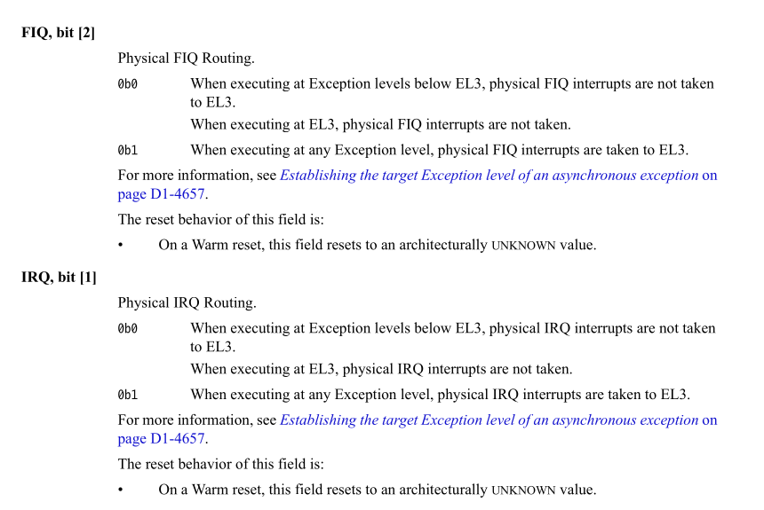
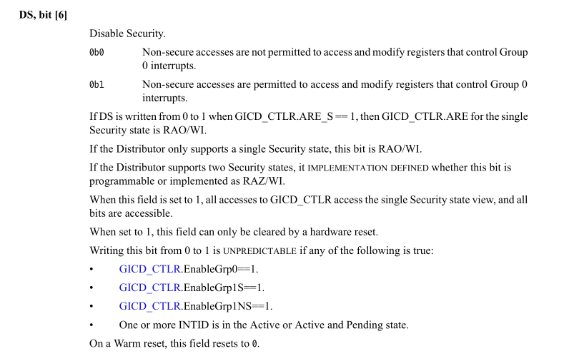
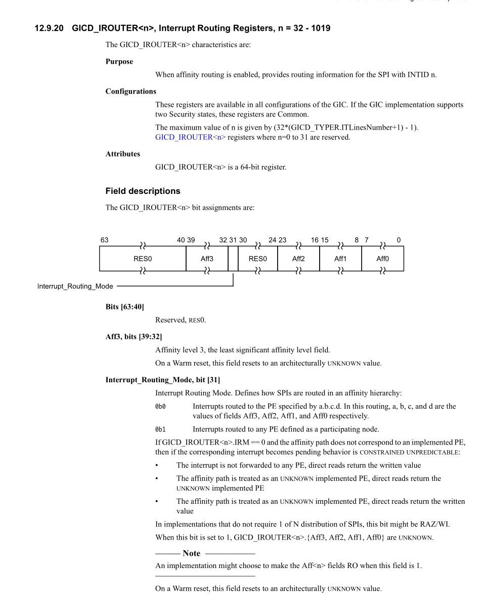
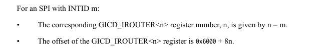
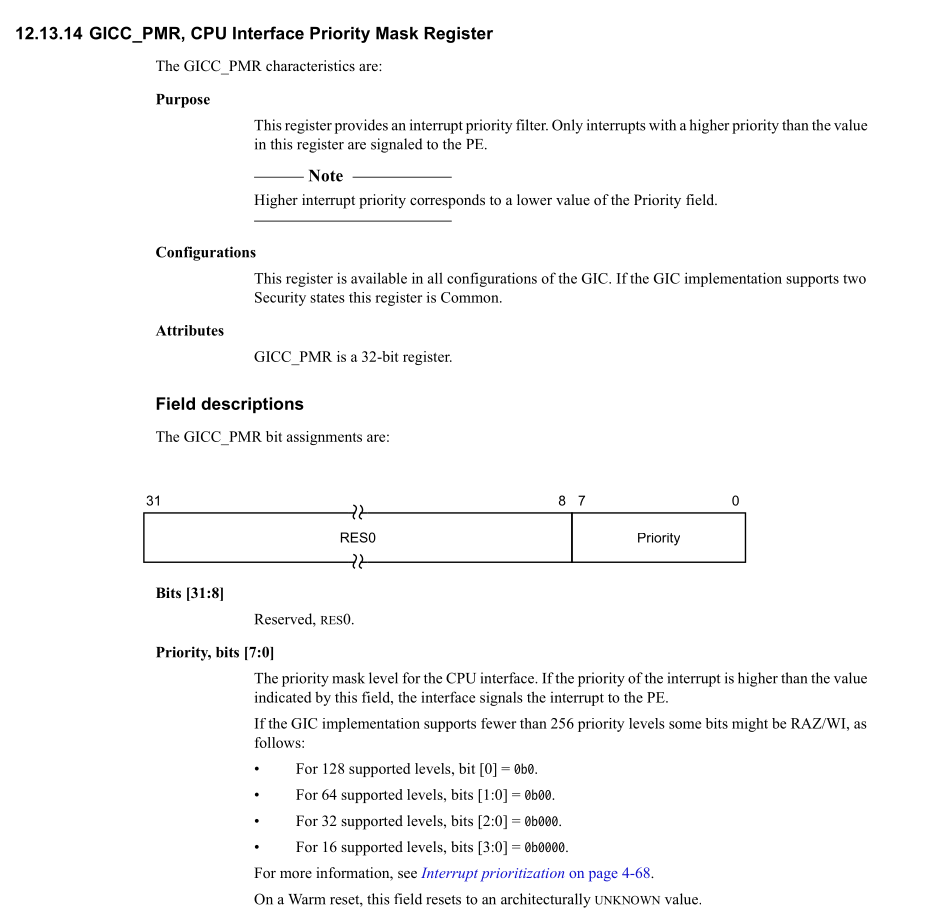
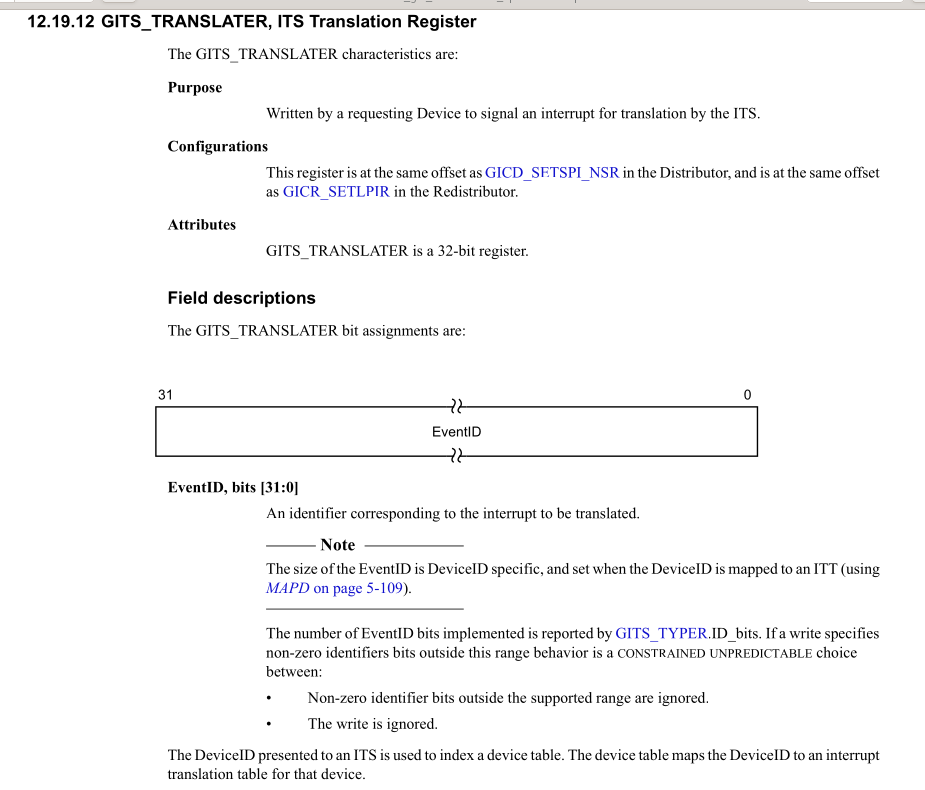

# system register 
## for PE
### SCR_EL3, Secure Configuration Register
#### FIQ[2] IRQ[1]

该字段用于管理，该类型中断到达后，是否 trap到el3,
例如, 

如果FIQ=1, IRQ=0:
* FIQ中断到达，路由el3
* IRQ中断到达，路由el2

## GIC Disatributor
### GICD_CTLR
#### DS, bit[6]
**When access is Secure, in a system that supports two Security states:**

> NOTE 
>
> 一下为个人理解
* 0b0 : 不允许在Non-secure 模式下访问或者修改和控制 Group 0 interrupt相关的寄存器
* 0b1: 允许

### GICD_IROUTER<n> 
interrupt routing register n = 32 ~ 1019

类似于ip地址一样分了四段，每个段作为一个level, 
其中`Interrupt_Routing_Mode`字段决定SPIs使用下面哪种模式:
* 0b0 : a.b.c.d ,其中a,b,c,d来自 Aff3, Aff2, Aff1, Aff0
* 0b1 : Interrupts routed to any PE defined as a participating node.（随机路由)

其中有两种访问方式，一个是寄存器访问n = m, 一个是内存偏移访问 `0x6000 + 8 * n`

## GIC CPU INTERFACE
### GICC_PMR

类似于x86 TPR  (cr8), 控制到达CPU的最低中断优先级

##  system register
### ICC_IAR0_EL1

类似于eoi寄存器，但是不同于eoi 寄存器的是，该寄存器INTID 存储的为当前正在pending
的最高优先级的寄存器, 对该寄存器进行读操作，就会触发 ack INTID interrupt(这个寄存器只
会ack 来自Group 0 interrupt。

> NOTE
>
> 这个设计有点意思，需要看下软件方面的实现
> ack的这个机制，不同于x86, x86 的acknowleage是硬件自动触发，而
> 这个需要软件去读该寄存器。类似的是他们都会获取到中断信息（x86为
> vector, arm64为 INTID,并且都会改变中断状态，都可以让下一个中断
> pengding)

### ICC_RPR_EL1

类似于x86 ISR,ack, 写 EOI/GICC_PMR会改变这个值

## GIC TIS
### GITS_TRANSLATER

