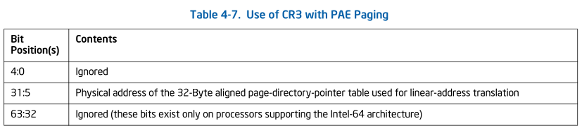
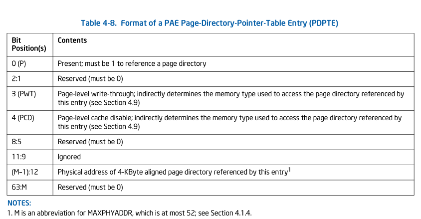
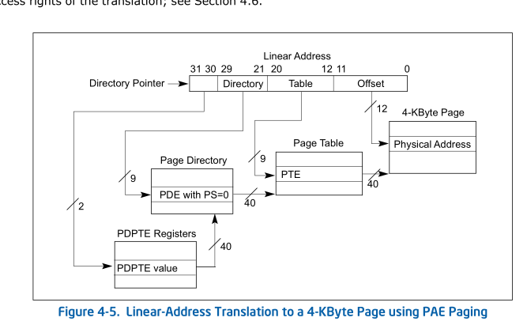

# 4.4 PAE PAGING
A logical processor uses PAE paging if CR0.PG = 1, CR4.PAE = 1, and
IA32_EFER.LME = 0. PAE paging translates 32-bit linear addresses to 52-bit
physical addresses.1 Although 52 bits corresponds to 4 PBytes,
linear addresses are limited to 32 bits; at most 4 GBytes of linear-address
space may be accessed at any given time. With PAE paging, a logical processor
maintains a set of four (4) PDPTE registers, which are loaded from an address
in CR3. Linear address are translated using 4 hierarchies of in-memory paging
structures, each located using one of the PDPTE registers. (This is different
from the other paging modes, in which there is one hierarchy referenced by
CR3.)

> 如果 `CR0.PG = 1`, `CR4.PAE = 1` 并且 `IA32_EFER.LME = 0`时 logical processor
> 使用 PAE. PAE pagging 将 32-bit 线性地址翻译成52-bit物理地址。虽然52-bits相对应
> 是4-PBytes, 但是线性地址被限制在 32 bits; 在任何给定的时间只能最多访问4 GByte 线性
> 地址空间。在PAE paging下，logical processor 维护 4个一系列的 PDPTE registers,
> 这些寄存器从CR3指向的地址load。线性地址使用4个层级的 in-memory paging structures进行
> 地址转换(一共有四组), 每个使用一个PDPTE register定位。（这和其他的 paging modes不同，
> 其他的只有有CR3指定的一个层级)

Section 4.4.1 discusses the PDPTE registers. Section 4.4.2 describes
linear-address translation with PAE paging.

## 4.4.1 PDPTE Registers
When PAE paging is used, CR3 references the base of a 32-Byte
page-directory-pointer table. Table 4-7 illustrates how CR3 is used with PAE
paging.

> 当 使用 PAE paging，CR3指向了一个 32-byte对其的
> PDPT（page-directory-pointer-table). Table 4-7 阐述了在 PAE paging中
> CR3如何被使用

The page-directory-pointer-table comprises four (4) 64-bit entries called
PDPTEs. Each PDPTE controls access to a 1-GByte region of the linear-address
space. Corresponding to the PDPTEs, the logical processor maintains a set of
four (4) internal, non-architectural PDPTE registers, called PDPTE0, PDPTE1,
PDPTE2, and PDPTE3. The logical processor loads these registers from the PDPTEs
in memory as part of certain operations: 

> comprises /kəmˈpraɪzɪz/ : 包含， 组成 
> PDPT 有四个 64-bit的entry组成，称为 PDPTEs.每一个 PDPTE 控制访问 1-GByte范围的
> 线性地址空间。对应于 PDPTEs， 逻辑处理器维护一组 (4个) 内部的, non-architectural
> PDPTE register, 被成为`PDPTE0`,`PDPTE1`,`PDPTE2`,`PDPTE3`。逻辑处理器将会在下面
> 某些操作的一部分把内存中的PDPTEs load到 寄存器中。

* If PAE paging would be in use following an execution of MOV to CR0 or MOV to
CR4 (see Section 4.1.1) and the instruction is modifying any of CR0.CD,
CR0.NW, CR0.PG, CR4.PAE, CR4.PGE, CR4.PSE, or CR4.SMEP; then the PDPTEs are
loaded from the address in CR3. 

> 如果PAE在下面执行中将被使用: MOV to CR0, MOV to CR4.(一个是开启分页，一个是开启PAE).
> 或者是修改下面字段的指令: CR0.CD, CR0.NW, CR0.PG, CR4.PAE, CR4.PGE, CR4.PSE, or CR4.SMEP;
> PDPTEs将从 CR3中的地址处load

* If MOV to CR3 is executed while the logical processor is using PAE paging, the
PDPTEs are loaded from the address being loaded into CR3. 

> 如果 当 logical processor 使用 PAE paging, MOV to CR3 被执行，PDPTEs将会从
> 将要load到CR3的地址处 load

* If PAE paging is in use and a task switch changes the value of CR3, 
 the PDPTEs are loaded from the address in the new CR3 value. 

> 如果PAE 被使用，并且 task switch 改变了CR3的值，PDPTEs 将在新的CR3的值
> 处 load

* Certain VMX transitions load the PDPTE registers. See Section 4.11.1. 

> 某些VMX translations 会load PDPTE register. 请看 Section 4.11.1

Table 4-8 gives the format of a PDPTE. If any of the PDPTEs sets both the P
flag (bit 0) and any reserved bit, the MOV to CR instruction causes a
general-protection exception (#GP(0)) and the PDPTEs are not
loaded.2 As shown in Table 4-8, bits 2:1, 8:5, and 63:MAXPHYADDR are
reserved in the PDPTEs.

> Table 4-8给定了 PDPTE 的格式，如果 PDPTE同时设置了 P flag ( bit 0) 和
> 任何 reserved bit, MOV to CR 指令将会造成 #GP(0) 并且 PDPTE 将不会loaded。
> 如 Table 4-8 展示的那样，bit 2:1, 8:5 和 63：MAXPHYADDR 都在 PDPTEs中被
> reserved 。

## Linear-Address Translation with PAE Paging
PAE paging may map linear addresses to either 4-KByte pages or 2-MByte pages.
Figure 4-5 illustrates the translation process when it produces a 4-KByte
page; Figure 4-6 covers the case of a 2-MByte page. The following items
describe the PAE paging process in more detail as well has how the page size is
determined:

> PAE paging 可能 将线性地址映射到 4-KByte pages 或者 2-MByte pages。
> * Figure 4-5 : 4K
> * Figure 4-6 : 2M
>
> 下面的items将描述 PAE paging 处理的更多细节，另外还包括page size
> 将如何确定。

* Bits 31:30 of the linear address select a PDPTE register (see Section 4.4.1);
this is PDPTEi, where i is the value of bits 31:30.1 Because a PDPTE
register is identified using bits 31:30 of the linear address, it controls
access to a 1-GByte region of the linear-address space. If the P flag (bit 0)
of PDPTEi is 0, the processor ignores bits 63:1, and there is no mapping for
the 1-GByte region controlled by PDPTEi. A reference using a linear address in
this region causes a page-fault exception (see Section 4.7).

> 线性地址的 BIT [31: 30] 用于选择一个 PDPTE register; 记做 PDPTEi, 这里 i
> 为 BIT [31: 30]的值。因为 PDPTE register被 线性地址的BIT[31:30]指定，所以他控
> 制访问线性地址的1-GByte的一个范围。如果 PDPTEi的 P = 0, processor将忽视 
> BIT[63:1], 并且 PDPTEi哦那个之的 1-GBytes范围将没有映射。引用该region的线性地址
> 将会造成 #PF (Section 4.7)

* If the P flag of PDPTEi is 1, 4-KByte naturally aligned page directory is
located at the physical address specified in bits 51:12 of PDPTEi (see Table
4-8 in Section 4.4.1). A page directory comprises 512 64-bit entries (PDEs). A
PDE is selected using the physical address defined as follows:
    + Bits 51:12 are from PDPTEi.
    + Bits 11:3 are bits 29:21 of the linear address.
    + Bits 2:0 are 0.

> * 如果 PDPTEi 的 P = 1, 4-KByte 自然对齐的 page directory 被 PDPTEi的 
> BIT[51:12]位指定的物理地址定位。page directory有 512个 64-bit的 entry组成
> (PDEs).PDE使用的物理地址将由下面的规则选择:
>   + PDPTEi -> PA[51:12]
>   + liner address[29:21] -> PA[11:3]
>   + PA[2:0] -> (0, 0, 0)  64-bit对齐

Because a PTE is identified using bits 31:12 of the linear address, every PTE
maps a 4-KByte page (see Table 4-11). The final physical address is computed as
follows:

> 因为 PTE使用 LA[31:12]指定，每个 PTE 映射 4-KByte大小的页面(Table 4-11). final
> PA将如下计算

* If the PDE’s PS flag is 1, the PDE maps a 2-MByte page (see Table 4-9). The
final physical address is computed as follows:
    + Bits 51:21 are from the PDE.
    + Bits 20:0 are from the original linear address.

> * 如果 PDE's PS=1, PDE 映射 2-MByte page (Table 4-9). final PA如下计算:
>   + PDE -> PA[51:21]
>   + liner address[20:0] -> PA[20:0]

* If the PDE’s PS flag is 0, a 4-KByte naturally aligned page table is located at
the physical address specified in bits 51:12 of the PDE (see Table 4-10). A
page table comprises 512 64-bit entries (PTEs). A PTE is selected using the
physical address defined as follows:
    + Bits 51:12 are from the PDE.
    + Bits 11:3 are bits 20:12 of the linear address.
    + Bits 2:0 are 0.

> * 如果 PDE's 的 PS = 0, 4-KByte自然对齐的 page table 的物理地址被 PDE[51:12] 
> 指定 (Table 4-10). 一个 page table 包含 512 个 64-bit 的 entry (PTEs).一个PTE
> 选择使用如下定义的物理地址
>    + PDE -> PA[51:12]
>    + liner address -> PA[11:3]
>    + PA[2:0] -> (0,0,0) 64-bit 对齐

* Because a PTE is identified using bits 31:12 of the linear address, every PTE
maps a 4-KByte page (see Table 4-11). The final physical address is computed as
follows:
    + Bits 51:12 are from the PTE.
    + Bits 11:0 are from the original linear address.

> * 因为PTE 使用 LA[31:12] 指定，每个PTE 映射 4-KByte page (Table 4-11） 。最终的
> PA 如下计算获取:
>   + PTE -> PA[51:12]
>   + liner address[11:0] -> PA[11:0]

If the P flag (bit 0) of a PDE or a PTE is 0 or if a PDE or a PTE sets any
reserved bit, the entry is used neither to reference another paging-structure
entry nor to map a page. There is no translation for a linear address whose
translation would use such a paging-structure entry; a reference to such a
linear address causes a page-fault exception (see Section 4.7).

> 如果 PDE, PTE P = 0, 或者 PDE PTE 设置了任何 reserved bit, 该entry不再指向另一个
> paging-structures entry或者映射一个page。使用该 paging 

The following bits are reserved with PAE paging:

> PAE paging 时，下面bits是 reserved

* If the P flag (bit 0) of a PDE or a PTE is 1, bits 62:MAXPHYADDR are reserved.
* If the P flag and the PS flag (bit 7) of a PDE are both 1, bits 20:13 are
reserved. 
* If IA32_EFER.NXE = 0 and the P flag of a PDE or a PTE is 1, the XD flag (bit
 63) is reserved.
> * PDE / PTE 的 P = 1 : 62:MAXPHYADDR 
> * PDE P = 1 && PS = 1 : BIT[20:13]
>> NOTE: PS = 1, 表示大页  
>> * PTE ref PT (PS = 0)
>>    + [11, 8] Ignored
>>    + [M-1, 12] 表示 PT PA 
>> * PTE ref HUGE PAGE (PS = 1)
>>    + 8(G) : Global; if CR4.PGE = 1, determines whether the translation is
>>      global (see Section 4.10); ignored otherwise
>>    + [11, 9] Ignored
>>    + 12 (PAT) : if the PAT is supported, indirectly determines the memory
>>      type used to access the 2-MByte page referenced by this
>>      entry (see Section 4.9.2); otherwise, reserved (must be 0) 
>>      > 和 memory type 相关先不看
>>    + [M -1, 12] : reserved

> * IA32_EFER.NXE = 0 && PDE/PTE P = 1 : XD flags (BIT 63) 
* If the PAT is not supported:1
    + If the P flag of a PTE is 1, bit 7 is reserved.
    + If the P flag and the PS flag of a PDE are both 1, bit 12 is reserved.

> * 如果 PAT 不支持
>   + PTE P = 1 :  bit 7 
>   + PDE P = 1 && PS = 1 : bit 12

A reference using a linear address that is successfully translated to a
physical address is performed only if allowed by the access rights of the
translation; see Section 4.6.

> 只有 在 该 translation 的 access rights 允许的情况下 才能成功的将 LA -> PA

