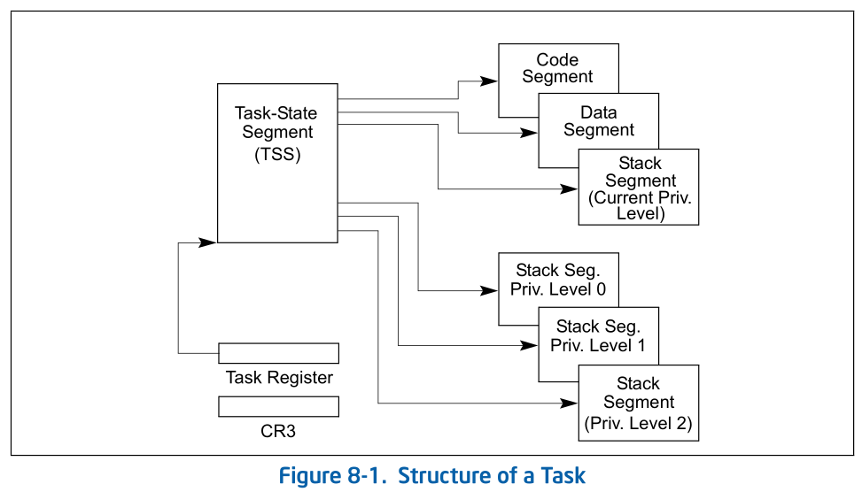

# 8.1 TASK MANAGEMENT OVERVIEW

A task is a unit of work that a processor can dispatch, execute, and suspend.
It can be used to execute a program, a task or process, an operating-system
service utility, an interrupt or exception handler, or a kernel or executive
utility.

> ```
> utility: /juːˈtɪləti/ : 有用,有效, 实用
> executive /ɛgˈzɛkjutɪv/ : 经营管理的; 有执行权的; 行政的;实施的;高级的;
> ```
>
> task 是一个 processor 可以 dispatch/execute/suspend work的单元. 它可以用于
> 执行一个 program, task, process, operating-system service utility, intr/exception
> handler, 或者 kernel/executive utility.

The IA-32 architecture provides a mechanism for saving the state of a task, for
dispatching tasks for execution, and for switching from one task to another.
When operating in protected mode, all processor execution takes place from
within a task. Even simple systems must define at least one task. More complex
systems can use the processor’s task management facilities to support
multitasking applications.

> take place:  发生，产生; 进行，举行
>
> IA-32 arch 为调度要执行的任务和 切换一个任务到另一个任务, 提供了一个用于 保存
> task 状态的机制. 当运行在保护模式下, 所有的 processor的都运行在task中. 即使
> 简单的系统必须定义至少一个task. 更复杂的系统 可能使用 processor的 task management
> 功能来支持多任务.

## 8.1.1 Task Structure

A task is made up of two parts: a task execution space and a task-state segment
(TSS). The task execution space consists of a code segment, a stack segment,
and one or more data segments (see Figure 8-1). If an operating system or
executive uses the processor’s privilege-level protection mechanism, the task
execution space also provides a separate stack for each privilege level.

> task 有两部分 组成: task execution space 和 task-state segment(TSS)
>
> task execution space:
>   * code segment
>   * task segment
>   * 1/more data segment
>
> 如果操作系统或者 executive 使用了处理器的 privilege-level protection 机制,

The TSS specifies the segments that make up the task execution space and
provides a storage place for task state information. In multitasking systems,
the TSS also provides a mechanism for linking tasks. A task is identified by
the segment selector for its TSS. When a task is loaded into the processor for
execution, the segment selector, base address, limit, and segment descriptor
attributes for the TSS are loaded into the task register (see Section 2.4.4,
“Task Register (TR)”).

If paging is implemented for the task, the base address of the page directory
used by the task is loaded into control register CR3.



## 8.1.2 Task State

The following items define the state of the currently executing task:
* The task’s current execution space, defined by the segment selectors in the segment registers (CS, DS, SS, ES,
FS, and GS).

* The state of the general-purpose registers.
* The state of the EFLAGS register.
* The state of the EIP register.
* The state of control register CR3.
* The state of the task register.
* The state of the LDTR register.
* The I/O map base address and I/O map (contained in the TSS).
* Stack pointers to the privilege 0, 1, and 2 stacks (contained in the TSS).
* Link to previously executed task (contained in the TSS).
* The state of the shadow stack pointer (SSP).

Prior to dispatching a task, all of these items are contained in the task’s
TSS, except the state of the task register. Also, the complete contents of the
LDTR register are not contained in the TSS, only the segment selector for the
LDT.

## 8.1.3 Executing a Task

* Software or the processor can dispatch a task for execution in one of the
  following ways:
* A explicit call to a task with the CALL instruction.
* A explicit jump to a task with the JMP instruction.
* An implicit call (by the processor) to an interrupt-handler task.
* An implicit call to an exception-handler task.
* A return (initiated with an IRET instruction) when the NT flag in the EFLAGS
  register is set.

All of these methods for dispatching a task identify the task to be dispatched
with a segment selector that points to a task gate or the TSS for the task.
When dispatching a task with a CALL or JMP instruction, the selector in the
instruction may select the TSS directly or a task gate that holds the selector
for the TSS. When dispatching a task to handle an interrupt or exception, the
IDT entry for the interrupt or exception must contain a task gate that holds
the selector for the interrupt- or exception-handler TSS.

When a task is dispatched for execution, a task switch occurs between the
currently running task and the dispatched task. During a task switch, the
execution environment of the currently executing task (called the task’s state
or context) is saved in its TSS and execution of the task is suspended. The
context for the dispatched task is then loaded into the processor and execution
of that task begins with the instruction pointed to by the newly loaded EIP
register. If the task has not been run since the system was last initialized,
the EIP will point to the first instruc- tion of the task’s code; otherwise, it
will point to the next instruction after the last instruction that the task
executed when it was last active.

If the currently executing task (the calling task) called the task being
dispatched (the called task), the TSS segment selector for the calling task is
stored in the TSS of the called task to provide a link back to the calling
task. For all IA-32 processors, tasks are not recursive. A task cannot call or
jump to itself.

Interrupts and exceptions can be handled with a task switch to a handler task.
Here, the processor performs a task switch to handle the interrupt or exception
and automatically switches back to the interrupted task upon returning from the
interrupt-handler task or exception-handler task. This mechanism can also
handle interrupts that occur during interrupt tasks.

As part of a task switch, the processor can also switch to another LDT,
allowing each task to have a different logical- to-physical address mapping for
LDT-based segments. The page-directory base register (CR3) also is reloaded on
a task switch, allowing each task to have its own set of page tables. These
protection facilities help isolate tasks and prevent them from interfering with
one another.

If protection mechanisms are not used, the processor provides no protection
between tasks. This is true even with operating systems that use multiple
privilege levels for protection. A task running at privilege level 3 that uses
the same LDT and page tables as other privilege-level-3 tasks can access code
and corrupt data and the stack of other tasks.

Use of task management facilities for handling multitasking applications is
optional. Multitasking can be handled in software, with each software defined
task executed in the context of a single IA-32 architecture task.

If shadow stack is enabled, then the SSP of the task is located at the 4 bytes
at offset 104 in the 32-bit TSS and is used by the processor to establish the
SSP when a task switch occurs from a task associated with this TSS. Note that
the processor does not write the SSP of the task initiating the task switch to
the TSS of that task, and instead the SSP of the previous task is pushed onto
the shadow stack of the new task.
