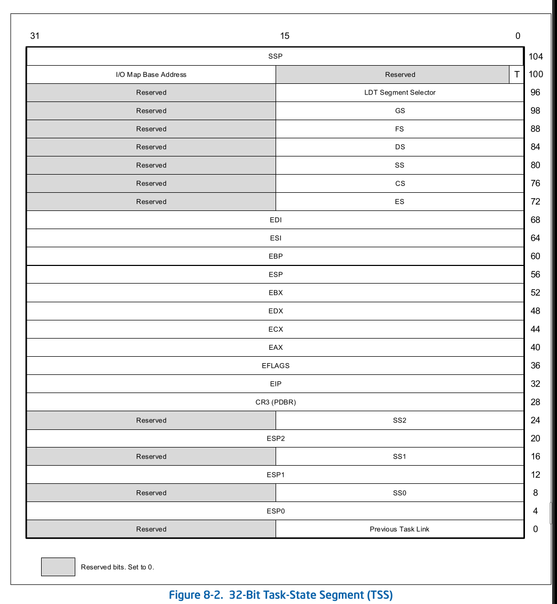
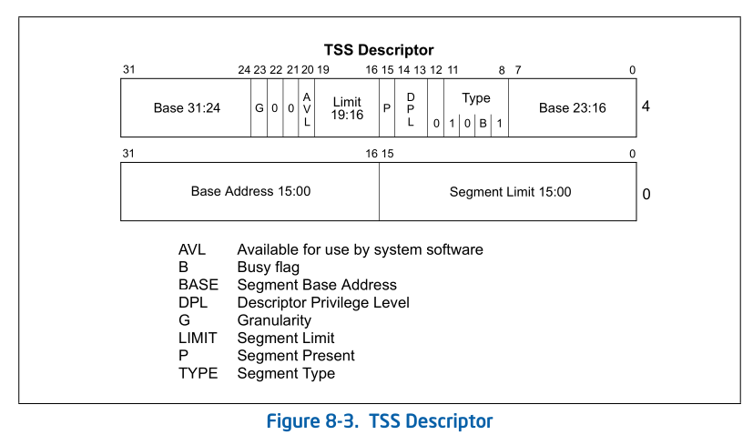
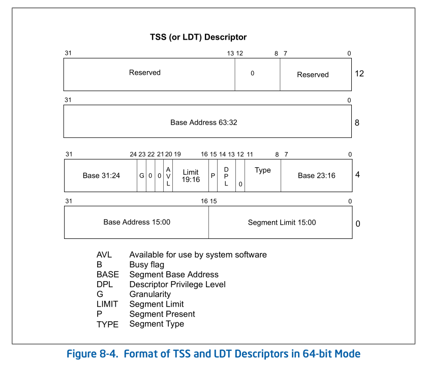
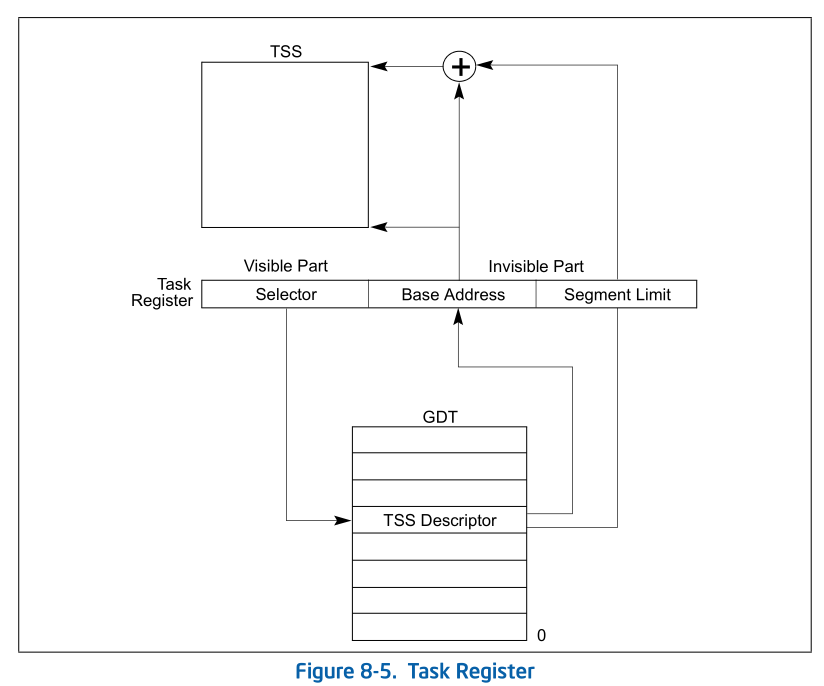
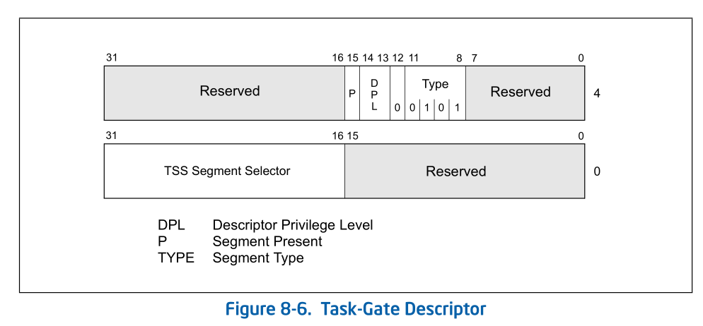
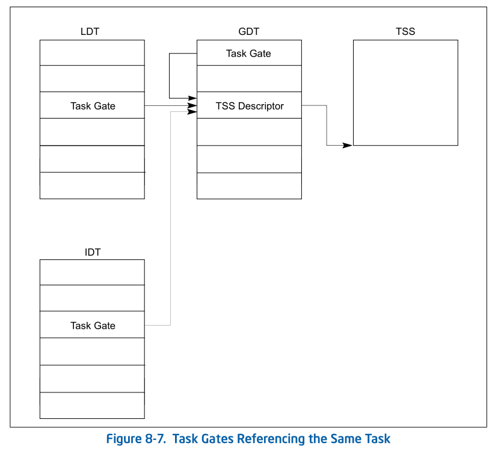

# 8.2 TASK MANAGEMENT DATA STRUCTURES

The processor defines five data structures for handling task-related
activities:

> ```
> activity : 活动;工作;消遣;活跃
>   An activity is something you do, or just the state of doing. 
> ```
>
> 处理器为 处理 task 相关工作定义了5个structure.

* Task-state segment (TSS).
* Task-gate descriptor.
* TSS descriptor.
* Task register.
* NT flag in the EFLAGS register.

When operating in protected mode, a TSS and TSS descriptor must be created for
at least one task, and the segment selector for the TSS must be loaded into the
task register (using the LTR instruction).

> 当位于保护模式, TSS 和 TSS descriptor 必须至少为一个task 创建 TSS 和 TSS desc,
> TSS 的段选择子 被加载到 task register ( 使用 LTR instruction )

## 8.2.1 Task-State Segment (TSS)

The processor state information needed to restore a task is saved in a system
segment called the task-state segment (TSS). Figure 8-2 shows the format of a
TSS for tasks designed for 32-bit CPUs. The fields of a TSS are divided into
two main categories: dynamic fields and static fields.

> category /ˈkætəɡəri/ 种类,范畴
>
> 一个task需要被restore 的 处理器状态信息 保存在一个 system segment 被称为 task-state
> segment (TSS). 图 8-2 展示了 为 32-bit CPU 设计的 task的 TSS 的格式. TSS中的字段
> 可以被氛围主要两类: dynamic fields 和 static fields.

For information about 16-bit Intel 286 processor task structures, see Section
8.6, “16-Bit Task-State Segment (TSS).” For information about 64-bit mode task
structures, see Section 8.7, “Task Management in 64-bit Mode.”

> 关于 16-bit Intel 286 processor task structures的信息, 请查看 Section 8.6,
> "16-Bit Task-State Segment (TSS).", 关于 64-bit mode的 task structure 信息,
> 请查看 Section 8.7 "Task Management in 64-bit Mode."



The processor updates dynamic fields when a task is suspended during a task
switch. The following are dynamic fields:

> 当 tasks 在 task switch 中 被 suspend, 处理器更新 dynamic fields. 下面是
> dynamic 字段:

* **General-purpose register fields** — State of the EAX, ECX, EDX, EBX, ESP, EBP,
  ESI, and EDI registers prior to the task switch.
  > 通用寄存器字段 -- 在 task switch 之前的....
* **Segment selector fields** — Segment selectors stored in the ES, CS, SS, DS, FS,
  and GS registers prior to the task switch.
* **EFLAGS register field** — State of the EFLAGS register prior to the task switch.
* **EIP (instruction pointer) field** — State of the EIP register prior to the task switch.
* **Previous task link field** — Contains the segment selector for the TSS of the
  previous task (updated on a task switch that was initiated by a call,
  interrupt, or exception). This field (which is sometimes called the back link
  field) permits a task switch back to the previous task by using the IRET
  instruction.
  > `Previous task link field` - 包含了先前 task的 TSS的segment selector(由
  > call, interrupt 或者 exception 发起的 tasks switch会更新该字段). 该字段
  > (它有时被成为 back link field) 允许 task switch 返回先前的task 通过使用
  > IRET instruction.

The processor reads the static fields, but does not normally change them. These
fields are set up when a task is created. The following are static fields:
> 处理器读取 static fields, 但是正常情况下不会更改他们. 这些字段在 task被创建
> 时已经初始化好了. static fields 如下:

* **LDT segment selector field** — Contains the segment selector for the task's
  LDT.
* **CR3 control register field** — Contains the base physical address of the page
  directory to be used by the task. Control register CR3 is also known as the
  page-directory base register (PDBR).
  > be known as : 被称为
  >
  > `CR3` - 包含了该task 使用的 page directory 的 base physical address. 控制
  > 寄存器 CR3 也被称为 page-directory base register (PDBR)
* **Privilege level-0, -1, and -2 stack pointer fields** — These stack pointers
  consist of a logical address made up of the segment selector for the stack
  segment (SS0, SS1, and SS2) and an offset into the stack (ESP0, ESP1, and
  ESP2). Note that the values in these fields are static for a particular task;
  whereas, the SS and ESP values will change if stack switching occurs within
  the task.
  > 这些stack pointers 包含了一个逻辑地址, 该逻辑地址由stack segment 的 segment
  > selector(SS0, SS1,SS2) 和在该stack中的offset构成(ESP0, ESP1, ESP2). 注意,
  > 对于一个特定任务, 这些字段中的值是静态的. 然而如果任务内部发生 stack switch,
  > 而ss和ESP 将发生变化.
* T (debug trap) flag (byte 100, bit 0) — When set, the T flag causes the
  processor to raise a debug exception when a task switch to this task occurs
  (see Section 18.3.1.5, “Task-Switch Exception Condition”).
  > raise /reɪz/ : 提起，举起；
  >
  > 当设置了 T flag, 将导致处理器发起一个 debug exception 在 task switch 到该任务
  > 时发生 (请查看 Section 18.3.1.5 "Task-Switch Exception Condition)
* **I/O map base address field** — Contains a 16-bit offset from the base of the
  TSS to the I/O permission bit map and interrupt redirection bitmap. When
  present, these maps are stored in the TSS at higher addresses. The I/O map
  base address points to the beginning of the I/O permission bit map and the
  end of the interrupt redirection bit map. See Chapter 19, “Input/Output,” in
  the Intel® 64 and IA-32 Architectures Software Developer’s Manual, Volume 1,
  for more information about the I/O permission bit map. See Section 21.3,
  “Interrupt and Exception Handling in Virtual-8086 Mode,” for a detailed
  description of the interrupt redirection bit map.
  > I/O map base address field - 从TSS 基址到 I/O permission bit map 以及 interrupt
  > redirection bitmap包含了一个 16-bit offset. 当 present时, 这些maps保存在
  > TSS 的高地址部分. 请查看 Chapter 19 "Input/Output"了解关于 I/O permission bit map
  > 的相关信息. 请查看 Section 21.3 "Interrupt and Exception Handling in Virtual-
  > 8086 Mode" 了解 interrupt redirection bit map 的细节描述.
* **Shadow Stack Pointer (SSP)** — Contains task's shadow stack pointer. The shadow
  stack of the task should have a supervisor shadow stack token at the address
  pointed to by the task SSP (offset 104). This token will be verified and made
  busy when switching to that shadow stack using a CALL/JMP instruction, and
  made free when switching out of that task using an IRET instruction.
  > `!!!!!!!!!!!!!` 先不看

If paging is used:
> 当使用分页时:

* Pages corresponding to the previous task’s TSS, the current task’s TSS, and
  the descriptor table entries for each all should be marked as read/write.
  > 前一个task的 TSS , current tasks TSS 以及 descriptor table entires 所对应的page, 
  > 他们每个都应该被标记 read/write
* Task switches are carried out faster if the pages containing these structures
  are present in memory before the task switch is initiated.
  > carry out : 执行;开展;完成
  >
  > 如果在发起 task switch 之前, 这些 structure 所对应的page 都在memory中present, 
  > task switch 将会执行的更快.

## 8.2.2 TSS Descriptor

The TSS, like all other segments, is defined by a segment descriptor. Figure
8-3 shows the format of a TSS descriptor. TSS descriptors may only be placed in
the GDT; they cannot be placed in an LDT or the IDT.

> TSS 像其他所有的segment一样,被定义为是一个 segent descriptor. Figure 8-3
> 展示了 TSS descriptor 的格式. TSS descriptors 只可以定义在GDT中, 而不能
> 定义在 LDT 或者 IDT 中

An attempt to access a TSS using a segment selector with its TI flag set (which
indicates the current LDT) causes a general-protection exception (#GP) to be
generated during CALLs and JMPs; it causes an invalid TSS exception (#TS)
during IRETs. A general-protection exception is also generated if an attempt is
made to load a segment selector for a TSS into a segment register.

> 使用设置有 TI flag 的 segment selector 访问 TSS(该flags指示使用当前 LDT)将会在
> 造成在 CALLs和 JMPs时生成general-protection exception (#GP) ; 将会在 IRETs时
> 造成 invalid TSS exception (#TS). 如果尝试将 TSS 的 segment selector load到
> segment register, 也会产生 general-protection exception.

The busy flag (B) in the type field indicates whether the task is busy. A busy
task is currently running or suspended. A type field with a value of 1001B
indicates an inactive task; a value of 1011B indicates a busy task. Tasks are
not recursive. The processor uses the busy flag to detect an attempt to call a
task whose execution has been interrupted. To ensure that there is only one
busy flag is associated with a task, each TSS should have only one TSS
descriptor that points to it.

> recursive /rɪˈkɜːsɪv/ 递归的;循环的
>
> type field 的 busy flag (B) 指示该task是否是busy的. Busy flag在当前是running
> 或者被suspend.
>   * 1001B: inactive task
>   * 1011B: busy task
> Tasks 是不可递归的.  处理器使用 busy flag 来发现企图调用已经执行或者被中断的
> task. 为了确保只有一个busy flag与task相关联,每个TSS 应该只有一个 descriptor 
> 指向他.



The base, limit, and DPL fields and the granularity and present flags have
functions similar to their use in data-segment descriptors (see Section 3.4.5,
“Segment Descriptors”). When the G flag is 0 in a TSS descriptor for a 32- bit
TSS, the limit field must have a value equal to or greater than 67H, one byte
less than the minimum size of a TSS. Attempting to switch to a task whose TSS
descriptor has a limit less than 67H generates an invalid-TSS exception
(#TS). A larger limit is required if an I/O permission bit map is included or
if the operating system stores additional data. The processor does not check
for a limit greater than 67H on a task switch; however, it does check when
accessing the I/O permission bit map or interrupt redirection bit map.

> granularity: /ˌɡrænjəˈlærəti/ : 颗粒,粒度
>
> base, limit, DPL 字段, granularity, present flag和其在data-segment descriptor
> 的功能类似(请查看 Secction 3.4.5 "Segment Descriptor"). 当32-bit TSS的 TSS 
> descriptor中的 G flag为0, limit field 的值必须 >= 67H, 比TSS 的最小值小1.
> 尝试switch到TSS descriptor limit小于67H的task时, 将会产生 invalid-TSS exception
> (#TS). 如果 有I/O permission bit map 被包含 或者如果操作系统要store 额外的数据,
> 则需要更大的limit; 处理器在 task switch 时, 不会检查limit是否 > 67H, 但是在访问
> I/O permission bit map 或者 interrupt redirectionbit map 时, 要做limit的检查. 

Any program or procedure with access to a TSS descriptor (that is, whose CPL is
numerically equal to or less than the DPL of the TSS descriptor) can dispatch
the task with a call or a jump.

> that is : 换言之;就是说
>
> 任何可以访问TSS descritor 的 program /procedure (也就是说, 它的CPL 小于等于 TSS 
> descriptor的DPL). 可以通过使用 call/jump 来调度任务

In most systems, the DPLs of TSS descriptors are set to values less than 3, so
that only privileged software can perform task switching. However, in
multitasking applications, DPLs for some TSS descriptors may be set to 3 to
allow task switching at the application (or user) privilege level.

> 在大部分的系统中, TSS descriptor 的 DPLs 被设置小于3, 所以仅有privileged software
> 可以执行task switching. 但是, 在多任务程序中, 某些 TSS descritor 可以设置为
> 3, 来允许task 在 application (or user) 特权级 来做任务切换.

## 8.2.3 TSS Descriptor in 64-bit mode

In 64-bit mode, task switching is not supported, but TSS descriptors still
exist. The format of a 64-bit TSS is described in Section 8.7.

> 在64-bit 模式中, 不再支持 task switching, 但是 TSS descriptors 仍然存在.
> 64-bit TSS 格式如 Section 8.7 中的描述.

In 64-bit mode, the TSS descriptor is expanded to 16 bytes (see Figure 8-4).
This expansion also applies to an LDT descriptor in 64-bit mode. Table 3-2
provides the encoding information for the segment type field.

> expansion /ɪkˈspænʃn/: 扩展
>
> 在64-bit 模式中, TSS descriptor 被扩展为 16 bytes (查看 Figure 8-4). 该扩展
> 仍然是用语 64-bit mode中的 LDT descritor. Table 3-2提供了segment type 字段
> 的解码信息.



## 8.2.4 Task Register

The task register holds the 16-bit segment selector and the entire segment
descriptor (32-bit base address (64 bits in IA-32e mode), 16-bit segment limit,
and descriptor attributes) for the TSS of the current task (see Figure 2-6).
This information is copied from the TSS descriptor in the GDT for the current
task. Figure 8-5 shows the path the processor uses to access the TSS (using the
information in the task register).

> task register 持有 16-bit segment selector 和 整个的 segment descritor(32-bit 
> base address (在 IA-32e mode 中为 64 bit), 16-bit segment limit, descritor
> attributes) 和 当前task的的 TSS(请查看 Figure 2-6). 该信息从current task 在GDT
> 中的 TSS descritor 中copy出. Figure 8-5 展示了processer 访问 TSS 使用的路径(使用
> task register 中的信息)

The task register has a visible part (that can be read and changed by software)
and an invisible part (maintained by the processor and is inaccessible by
software). The segment selector in the visible portion points to a TSS
descriptor in the GDT. The processor uses the invisible portion of the task
register to cache the segment descriptor for the TSS. Caching these values in a
register makes execution of the task more efficient. The LTR (load task
register) and STR (store task register) instructions load and read the visible
portion of the task register:

> task register 有一个 visible part(可以被software 读取并更改)和一个 invisible
> part(由处理器维护并且不可以被software访问). visible portion 中的segment selector
> 指向 GDT 中的一个 TSS descritor. 处理器使用 task register 中的 invisible portion
> 来缓存 TSS 的 segment descritor. 在寄存器中缓存这些信息可以让task的运行更有效率.
> LTR 和 STR 指令 会 load 并且 read task register 中的 visible portion

The LTR instruction loads a segment selector (source operand) into the task
register that points to a TSS descriptor in the GDT. It then loads the
invisible portion of the task register with information from the TSS
descriptor. LTR is a privileged instruction that may be executed only when the
CPL is 0. It’s used during system initialization to put an initial value in the
task register. Afterwards, the contents of the task register are changed
implicitly when a task switch occurs.

> LTR 指令 加载了一个segment selector(源操作数) 到 tasks register, 该 segment selecttor
> 指向 GDT 中的一个 TSS descritor. 然后他从 TSS descriptor 得到的信息中
> load invisible 的部分. LTR 是 privileged instruction

The STR (store task register) instruction stores the visible portion of the
task register in a general-purpose register or memory. This instruction can be
executed by code running at any privilege level in order to identify the
currently running task. However, it is normally used only by operating system
software. (If CR4.UMIP = 1, STR can be executed only when CPL = 0.)

On power up or reset of the processor, segment selector and base address are
set to the default value of 0; the limit is set to FFFFH.



## 8.2.5 Task-Gate Descriptor

A task-gate descriptor provides an indirect, protected reference to a task (see
Figure 8-6). It can be placed in the GDT, an LDT, or the IDT. The TSS segment
selector field in a task-gate descriptor points to a TSS descriptor in the GDT.
The RPL in this segment selector is not used.

The DPL of a task-gate descriptor controls access to the TSS descriptor during
a task switch. When a program or procedure makes a call or jump to a task
through a task gate, the CPL and the RPL field of the gate selector pointing to
the task gate must be less than or equal to the DPL of the task-gate
descriptor. Note that when a task gate is used, the DPL of the destination TSS
descriptor is not used.



A task can be accessed either through a task-gate descriptor or a TSS
descriptor. Both of these structures satisfy the following needs:

* Need for a task to have only one busy flag — Because the busy flag for a task
  is stored in the TSS descriptor, each task should have only one TSS
  descriptor. There may, however, be several task gates that reference the same
  TSS descriptor.

* Need to provide selective access to tasks — Task gates fill this need,
  because they can reside in an LDT and can have a DPL that is different from
  the TSS descriptor's DPL. A program or procedure that does not have
  sufficient privilege to access the TSS descriptor for a task in the GDT
  (which usually has a DPL of 0) may be allowed access to the task through a
  task gate with a higher DPL. Task gates give the operating system greater
  latitude for limiting access to specific tasks.

* Need for an interrupt or exception to be handled by an independent task —
  Task gates may also reside in the IDT, which allows interrupts and exceptions
  to be handled by handler tasks. When an interrupt or exception vector points
  to a task gate, the processor switches to the specified task. Figure 8-7
  illustrates how a task gate in an LDT, a task gate in the GDT, and a task
  gate in the IDT can all point to the same task.


