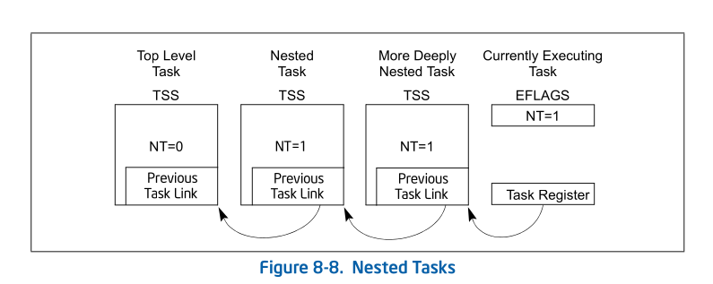
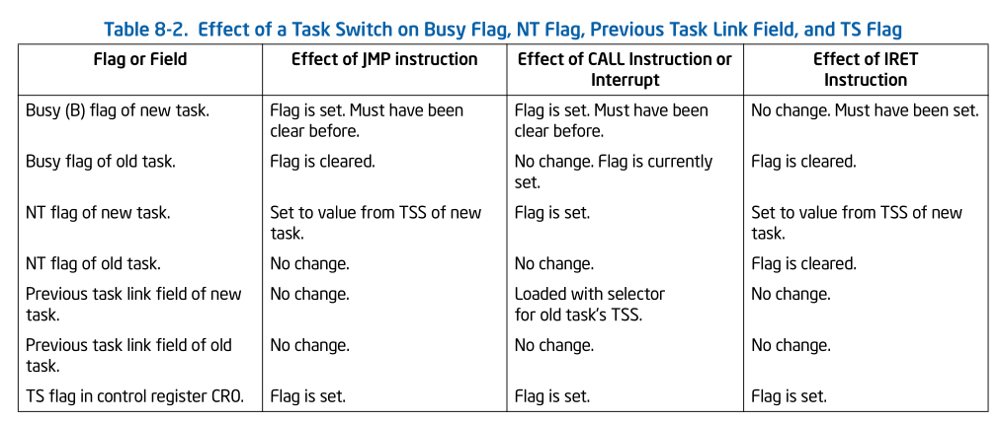

# 8.4 TASK LINKING

The previous task link field of the TSS (sometimes called the “backlink”) and
the NT flag in the EFLAGS register are used to return execution to the previous
task. EFLAGS.NT = 1 indicates that the currently executing task is nested
within the execution of another task.

When a CALL instruction, an interrupt, or an exception causes a task switch:
the processor copies the segment selector for the current TSS to the previous
task link field of the TSS for the new task; it then sets EFLAGS.NT = 1. If
software uses an IRET instruction to suspend the new task, the processor checks
for EFLAGS.NT = 1; it then uses the value in the previous task link field to
return to the previous task. See Figures 8-8.

When a JMP instruction causes a task switch, the new task is not nested. The
previous task link field is not used and EFLAGS.NT = 0. Use a JMP instruction
to dispatch a new task when nesting is not desired.

Table 8-2 shows the busy flag (in the TSS segment descriptor), the NT flag, the
previous task link field, and TS flag (in control register CR0) during a task
switch.

The NT flag may be modified by software executing at any privilege level. It is
possible for a program to set the NT flag and execute an IRET instruction. This
might randomly invoke the task specified in the previous link field of the
current task's TSS. To keep such spurious task switches from succeeding, the
operating system should initialize the previous task link field in every TSS
that it creates to 0.

## 8.4.1 Use of Busy Flag To Prevent Recursive Task Switching

A TSS allows only one context to be saved for a task; therefore, once a task is
called (dispatched), a recursive (or re-entrant) call to the task would cause
the current state of the task to be lost. The busy flag in the TSS segment
descriptor is provided to prevent re-entrant task switching and a subsequent
loss of task state information. The processor manages the busy flag as follows:

1. When dispatching a task, the processor sets the busy flag of the new task.

2. If during a task switch, the current task is placed in a nested chain (the
   task switch is being generated by a CALL instruction, an interrupt, or an
   exception), the busy flag for the current task remains set.

3. When switching to the new task (initiated by a CALL instruction, interrupt,
   or exception), the processor generates a general-protection exception (#GP)
   if the busy flag of the new task is already set. If the task switch is
   initiated with an IRET instruction, the exception is not raised because the
   processor expects the busy flag to be set.

4. When a task is terminated by a jump to a new task (initiated with a JMP
   instruction in the task code) or by an IRET instruction in the task code,
   the processor clears the busy flag, returning the task to the “not busy”
   state.

The processor prevents recursive task switching by preventing a task from
switching to itself or to any task in a nested chain of tasks. The chain of
nested suspended tasks may grow to any length, due to multiple calls, inter-
rupts, or exceptions. The busy flag prevents a task from being invoked if it is
in this chain.

The busy flag may be used in multiprocessor configurations, because the
processor follows a LOCK protocol (on the bus or in the cache) when it sets or
clears the busy flag. This lock keeps two processors from invoking the same
task at the same time. See Section 9.1.2.1, “Automatic Locking,” for more
information about setting the busy flag in a multiprocessor applications.

## 8.4.2 Modifying Task Linkages

In a uniprocessor system, in situations where it is necessary to remove a task
from a chain of linked tasks, use the following procedure to remove the task:

1. Disable interrupts.
2. Change the previous task link field in the TSS of the pre-empting task (the
   task that suspended the task to be removed). It is assumed that the
   pre-empting task is the next task (newer task) in the chain from the task to
   be removed. Change the previous task link field to point to the TSS of the
   next oldest task in the chain or to an even older task in the chain.

3. Clear the busy (B) flag in the TSS segment descriptor for the task being
   removed from the chain. If more than one task is being removed from the
   chain, the busy flag for each task being remove must be cleared.

4. Enable interrupts.

In a multiprocessing system, additional synchronization and serialization
operations must be added to this proce- dure to ensure that the TSS and its
segment descriptor are both locked when the previous task link field is changed
and the busy flag is cleared.
