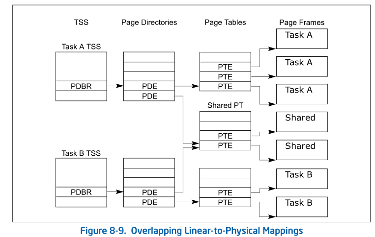

# 8.5 TASK ADDRESS SPACE
The address space for a task consists of the segments that the task can access. These segments include the code,
data, stack, and system segments referenced in the TSS and any other segments accessed by the task code. The
segments are mapped into the processor’s linear address space, which is in turn mapped into the processor’s phys-
ical address space (either directly or through paging).

The LDT segment field in the TSS can be used to give each task its own LDT. Giving a task its own LDT allows the
task address space to be isolated from other tasks by placing the segment descriptors for all the segments associ-
ated with the task in the task’s LDT.

It also is possible for several tasks to use the same LDT. This is a memory-efficient way to allow specific tasks to
communicate with or control each other, without dropping the protection barriers for the entire system.

Because all tasks have access to the GDT, it also is possible to create shared segments accessed through segment
descriptors in this table.

If paging is enabled, the CR3 register (PDBR) field in the TSS allows each task to have its own set of page tables
for mapping linear addresses to physical addresses. Or, several tasks can share the same set of page tables.

## 8.5.1 Mapping Tasks to the Linear and Physical Address Spaces

Tasks can be mapped to the linear address space and physical address space in one of two ways:

* One linear-to-physical address space mapping is shared among all tasks. —
  When paging is not enabled, this is the only choice. Without paging, all
  linear addresses map to the same physical addresses. When paging is enabled,
  this form of linear-to-physical address space mapping is obtained by using
  one page directory for all tasks. The linear address space may exceed the
  available physical space if demand-paged virtual memory is supported.

* Each task has its own linear address space that is mapped to the physical
  address space. — This form of mapping is accomplished by using a different
  page directory for each task. Because the PDBR (control register CR3) is
  loaded on task switches, each task may have a different page directory.

The linear address spaces of different tasks may map to completely distinct
physical addresses. If the entries of different page directories point to
different page tables and the page tables point to different pages of physical
memory, then the tasks do not share physical addresses.

With either method of mapping task linear address spaces, the TSSs for all
tasks must lie in a shared area of the physical space, which is accessible to
all tasks. This mapping is required so that the mapping of TSS addresses does
not change while the processor is reading and updating the TSSs during a task
switch. The linear address space mapped by the GDT also should be mapped to a
shared area of the physical space; otherwise, the purpose of the GDT is
defeated. Figure 8-9 shows how the linear address spaces of two tasks can
overlap in the physical space by sharing page tables.

## 8.5.2 Task Logical Address Space

To allow the sharing of data among tasks, use the following techniques to
create shared logical-to-physical address-space mappings for data segments:

* Through the segment descriptors in the GDT — All tasks must have access to
  the segment descriptors in the GDT. If some segment descriptors in the GDT
  point to segments in the linear-address space that are mapped into an area of
  the physical-address space common to all tasks, then all tasks can share the
  data and code in those segments.

* Through a shared LDT — Two or more tasks can use the same LDT if the LDT
  fields in their TSSs point to the same LDT. If some segment descriptors in a
  shared LDT point to segments that are mapped to a common area of the physical
  address space, the data and code in those segments can be shared among the
  tasks that share the LDT. This method of sharing is more selective than
  sharing through the GDT, because the sharing can be limited to specific
  tasks. Other tasks in the system may have different LDTs that do not give
  them access to the shared segments.

* Through segment descriptors in distinct LDTs that are mapped to common
  addresses in linear address space — If this common area of the linear address
  space is mapped to the same area of the physical address space for each task,
  these segment descriptors permit the tasks to share segments. Such segment
  descriptors are commonly called aliases. This method of sharing is even more
  selective than those listed above, because, other segment descriptors in the
  LDTs may point to independent linear addresses which are not shared.
