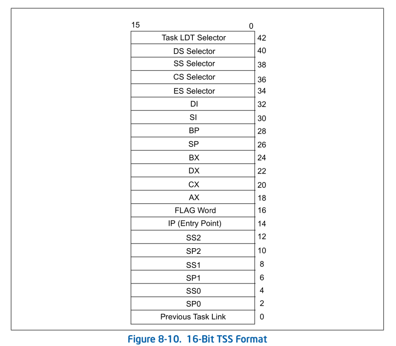

# 8.6 16-BIT TASK-STATE SEGMENT (TSS)

The 32-bit IA-32 processors also recognize a 16-bit TSS format like the one
used in Intel 286 processors (see Figure 8-10). This format is supported for
compatibility with software written to run on earlier IA-32 processors.

* The following information is important to know about the 16-bit TSS.
* Do not use a 16-bit TSS to implement a virtual-8086 task.

* The I/O base address is not included in the 16-bit TSS. None of the functions
  of the I/O map are supported.The valid segment limit for a 16-bit TSS is 2CH.

* The 16-bit TSS does not contain a field for the base address of the page
  directory, which is loaded into control register CR3. A separate set of page
  tables for each task is not supported for 16-bit tasks. If a 16-bit task is
  dispatched, the page-table structure for the previous task is used.

* When task state is saved in a 16-bit TSS, the upper 16 bits of the EFLAGS
  register and the EIP register are lost.

* When the general-purpose registers are loaded or saved from a 16-bit TSS, the
  upper 16 bits of the registers are modified and not maintained.

