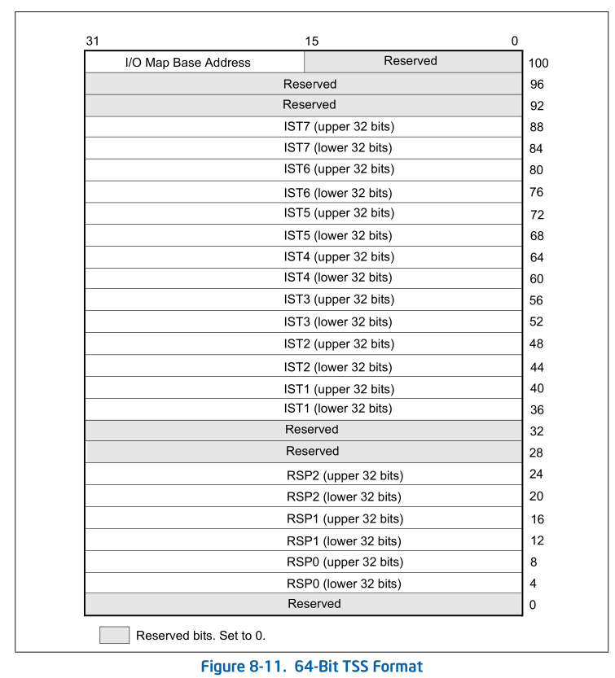

In 64-bit mode, task structure and task state are similar to those in protected
mode. However, the task switching mechanism available in protected mode is not
supported in 64-bit mode. Task management and switching must be performed by
software. The processor issues a general-protection exception (#GP) if the
following is attempted in 64-bit mode:

* Control transfer to a TSS or a task gate using JMP, CALL, INT n, INT3, INTO,
  INT1, or interrupt.
* An IRET with EFLAGS.NT (nested task) set to 1.

Although hardware task-switching is not supported in 64-bit mode, a 64-bit task
state segment (TSS) must exist. Figure 8-11 shows the format of a 64-bit TSS.
The TSS holds information important to 64-bit mode and that is not directly
related to the task-switch mechanism. This information includes:

* RSPn — The full 64-bit canonical forms of the stack pointers (RSP) for
  privilege levels 0-2.

* ISTn — The full 64-bit canonical forms of the interrupt stack table (IST)
  pointers.

* I/O map base address — The 16-bit offset to the I/O permission bit map from
  the 64-bit TSS base.
The operating system must create at least one 64-bit TSS after activating
IA-32e mode. It must execute the LTR instruction (in 64-bit mode) to load the
TR register with a pointer to the 64-bit TSS responsible for both 64-bit- mode
programs and compatibility-mode programs.

