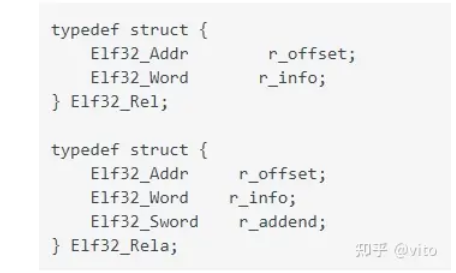

# kaslr作用
kaslr是内核的一个安全特性，用于将kernel image的各个段，加载到随机
的位置。这个既包括了物理地址，也包括虚拟地址。

# 虚拟地址 randomize 具体流程
我们思考下，kernel是被grub加载到物理内存中，所以物理地址已经确定了，
现在需要搞一个随机的虚拟内存的base，这个动作需要在开启分页之前做。
我们来看下具体流程。

> NOTE
>
> 这里我们分析arm64代码, 代码版本为 rhel 4.18.0-372
## stext
```cpp
ENTRY(stext)
        bl      preserve_boot_args
        bl      el2_setup                       // Drop to EL1, w0=cpu_boot_mode
        //=========(1)====================
        adrp    x23, __PHYS_OFFSET
        //=========(2)====================
        and     x23, x23, MIN_KIMG_ALIGN - 1    // KASLR offset, defaults to 0
        bl      set_cpu_boot_mode_flag
        //=========(3)====================
        bl      __create_page_tables
        bl      __cpu_setup                     // initialise processor
        b       __primary_switch
ENDPROC(stext)
```
1. 和物理的随机有关，我们展开来说
> NOTE: 简述物理地址randomize
>
> 在stext执行之前，实际上会先执行efi-stub相关代码, 该代码会重新将
> kernel img加载到一个内存位置, 这个内存位置，在开启了KASLR
> (CONFIG_RANDOMIZE_BASE)的情况下，也可能会有一个随机的offset
> (根据bios是否提供相应的功能), 并且再做一个TEXT_OFFSET的偏移。
>
> 没有开启KASLR 或者 BIOS不支持 RNG，offset为 TEXT_OFFSET

我们先来看下`__PHY_OFFSET`的定义:
```
#define __PHYS_OFFSET   (KERNEL_START - TEXT_OFFSET)
#define KERNEL_START      _text
```
我们来看下 `_text`的定义:
```
//======arch/arm64/kernel/vmlinux.lds.S======
SECTIONS
{
        ...
        . = KIMAGE_VADDR + TEXT_OFFSET;

        .head.text : {
                _text = .;
                HEAD_TEXT
        }
        ...
}
```
`_text`的编译地址为`KIMAGE_VADDR + TEXT_OFFSET`，这只是确定了一个编译地址,
而生成image的时候，我们看下该段在哪:
```
简单测试:
通过gdb调试 vmlinux
(gdb) x/10xb _text
0xffff800010080000 <_text>:     0x4d    0x5a    0x00    0x91    0xff    0xbf    0x54    0x14
0xffff800010080008 <_text+8>:   0x00    0x00

通过hexdump查看 Image文件:
00000000  4d 5a 00 91 ff bf 54 14  00 00                    |MZ....T...|
```
可以发现`_text`被生成在Image的开头处。而note 中有提到, kernel 会将image load到
TEXT_OFFSET + rng_offset处。所以image的物理地址(简称`phy_load_address`)，
可以记做`phybase + TEXT_OFFSET + rng_offset`,在未开启分页的模式下，
而stext所加载的位置，实际上等于`phy_load_address`, 所以`adrp x23,  stext - TEXT_OFFSET`, 
x23将会获取到
```
phy_load_address - TEXT_OFFSET
 = phybase + TEXT_OFFSET + rng_offset - TEXT_OFFSET
 = phybase + rng_offset
```

2. 这里做了一个and的操作，`MIN_KIMG_ALIGN` 为2M, 而phybase > 2M, 所以这个操作会把 phybase 
减去，所以获取到的x23 = rng_offset

> NOTE
>
> 我们再看下`TEXT_OFFSET`的定义:
> ```
> /*
>  * TEXT_OFFSET 是在Makefile中定义的, 会作为编译选项编入
>  * =====arch/arm64/Makefile======
>  */
> CPPFLAGS_vmlinux.lds = -DTEXT_OFFSET=$(TEXT_OFFSET) //这个变量不知道在哪里用到，但是肯定是通过这个导入的
> ...
> ifeq ($(CONFIG_ARM64_RANDOMIZE_TEXT_OFFSET), y)
> TEXT_OFFSET := $(shell awk "BEGIN {srand(); printf \"0x%06x\n\", \
>                  int(2 * 1024 * 1024 / (2 ^ $(CONFIG_ARM64_PAGE_SHIFT)) * \
>                  rand()) * (2 ^ $(CONFIG_ARM64_PAGE_SHIFT))}")
> else
> TEXT_OFFSET := 0x00080000
> endif
> ```
> 可以看到TEXT_OFFSET也作了一个随机的操作，不过这个在编译的时候已经确定了，不会在运行的
> 时候去进行调整。

3. 在这里调用`__create_page_tables`, 该函数会创建页表，上面我们也提到过，`stext`之后
的KASLR代码流程实际上是为了搞一个随机的虚拟地址，而虚拟地址映射关系是由页表确立的，
但是这里还没有去计算随机数。其流程在`__primary_switch`相关流程中执行，那为什么要在这里
创建页表呢 ? 这里我也没太想通，可以想到的一点是`kaslr_early_init()`函数, 
是在enable_mmu后执行的。
<br/>
`kaslr_early_init()`函数是C代码写的，而且编译的时候，代码是按照编译的baseaddress来的,
(KIMAGE_VADDR + TEXT_OFFSET), 可能有些流程从C代码角度看不直观，获取的变量地址可能
会有问题。例如下面代码:
```
u64 __init kaslr_early_init(u64 dt_phys)
{
        ...
        module_alloc_base = (u64)_etext - MODULES_VSIZE;
        ...
}
```
这里本身就是要取`_etext`虚拟地址，去进行计算，而C->汇编，翻译成`ADRP`指令后，
在未开启mmu的情况下获取的是物理地址。所以C代码还是适合在开启mmu的情况下执行。

## __create_page_tables
```
__create_page_tables:
        ...
        /*
         * Map the kernel image (starting with PHYS_OFFSET).
         */
        adrp    x0, init_pg_dir
        mov_q   x5, KIMAGE_VADDR + TEXT_OFFSET  // compile time __va(_text)
        //===============(1)==================
        add     x5, x5, x23                     // add KASLR displacement
        mov     x4, PTRS_PER_PGD
        adrp    x6, _end                        // runtime __pa(_end)
        adrp    x3, _text                       // runtime __pa(_text)
        sub     x6, x6, x3                      // _end - _text
        add     x6, x6, x5                      // runtime __va(_end)
```

可以看到在`__create_page_tables`流程中，确定baseaddress时，会把x23加上。
## __primary_switch
```cpp
__primary_switch:
#ifdef CONFIG_RANDOMIZE_BASE
        //因为开启了KASLR后，可能需要再关闭mmu,重建页表，
        //所以可能需要未开启mmu的 sctlr_el1的值，所以这里
        //保存一下
        mov     x19, x0                         // preserve new SCTLR_EL1 value
        mrs     x20, sctlr_el1                  // preserve old SCTLR_EL1 value
#endif
        adrp    x1, init_pg_dir
        //开启mmu
        bl      __enable_mmu
#ifdef CONFIG_RELOCATABLE
        /*
         * 这里我个人的理解是，只有开启了KASLR的情况下，才需要执行  __relocate_kernel, 
         *
         * 因为只有在开启KASLR的情况下，才会涉及编译地址和运行虚拟地址不一致情况，
         * 才会需要重写reloc section
         *
         * 上游社区可能意识到了这一点，相关patch(还未分析)
         * commit aacd149b62382c63911060b8f64c1e3d89bd405a
         * arm64: head: avoid relocating the kernel twice for KASLR
         */
        bl      __relocate_kernel
#ifdef CONFIG_RANDOMIZE_BASE
        /*
         * 跳转到 __primary_switched， 跳转之后，便使用高地址映射(没有开启
         * KASLR即为编译地址)
         */
        ldr     x8, =__primary_switched
        adrp    x0, __PHYS_OFFSET
        blr     x8

        /*
         * If we return here, we have a KASLR displacement in x23 which we need
         * to take into account by discarding the current kernel mapping and
         * creating a new one.
         */
         /*
          * 没有KASLR的情况下，不会返回到这里，有KASLR的情况下，需要返回到这一层，
          * 进行disable_mmu的操作。
          *
          * 这里大家想一下，为什么需要返回到这一层执行disable mmu ?
          *
          * 因为该函数在 .idmap.text段中,disable mmu也能跑，
          * 而 __primary_switched 在.init.text 段中
          *
          * NOTE: 关于pre_disable_mmu_workaround还需要看下手册 !!!!
          */
        pre_disable_mmu_workaround
        msr     sctlr_el1, x20                  // disable the MMU
        isb
        /*
         * 因为__primary_switched->kaslr_early_init函数获取到了新的
         * offset(下面我们会看到), 所以这里再重建一次页表，也是最后一次
         */
        bl      __create_page_tables            // recreate kernel mapping

        tlbi    vmalle1                         // Remove any stale TLB entries
        dsb     nsh

        msr     sctlr_el1, x19                  // re-enable the MMU
        isb
        ic      iallu                           // flush instructions fetched
        dsb     nsh                             // via old mapping
        isb
        ic      iallu                           // flush instructions fetched
        dsb     nsh                             // via old mapping
        isb
        /*
         * 因为改变了映射关系，所以需要修改kernel 的reloc段，下面我们会讲到
         */
        bl      __relocate_kernel
#endif
#endif
        //再次调用__primary_switched, 进入使用高地址模式
        ldr     x8, =__primary_switched
        adrp    x0, __PHYS_OFFSET
        br      x8
ENDPROC(__primary_switch)
```
## __primary_swiched
```cpp
__primary_switched:
        adrp    x4, init_thread_union
        add     sp, x4, #THREAD_SIZE
        adr_l   x5, init_task
        msr     sp_el0, x5                      // Save thread_info

        adr_l   x8, vectors                     // load VBAR_EL1 with virtual
        msr     vbar_el1, x8                    // vector table address
        isb
        /*
         * 这里进行了压栈操作，可以看到只压了x30(LR),
         * 压LR意味着之后可能需要LR，LR是上一个函数调用时
         * 的IP。也就意味着可能需要返回上一级函数。
         * 也就是__primary_switch
         *
         * NOTE: 
         * 这里LR保存的是一个低地址，也就是idmap的地址
         */
        stp     xzr, x30, [sp, #-16]!
        mov     x29, sp
        /*
         * 这里是个宏，作用是将x21的值赋值给
         * __fdt_pointer这个变量中
         */
        str_l   x21, __fdt_pointer, x5          // Save FDT pointer
        /*
         * 保存新的kimage_addr的值
         * 我们把编译地址A，记做: C_ADDR(A)
         * kimage_vaddr = C_ADDR(_text) - TEXT_OFFSET
         *
         * kimage_vaddr - __PHYS_OFFSET 
         *  = C_ADDR(_text) - TEXT_OFFSET - 
         */
        ldr_l   x4, kimage_vaddr                // Save the offset between
        sub     x4, x4, x0                      // the kernel virtual and
        str_l   x4, kimage_voffset, x5          // physical mappings

        // Clear BSS
        adr_l   x0, __bss_start
        mov     x1, xzr
        adr_l   x2, __bss_stop
        sub     x2, x2, x0
        bl      __pi_memset
        dsb     ishst                           // Make zero page visible to PTW

#if defined(CONFIG_KASAN_GENERIC) || defined(CONFIG_KASAN_SW_TAGS)
        bl      kasan_early_init
#endif
#ifdef CONFIG_RANDOMIZE_BASE
        tst     x23, ~(MIN_KIMG_ALIGN - 1)      // already running randomized?
        b.ne    0f
        mov     x0, x21                         // pass FDT address in x0
        bl      kaslr_early_init                // parse FDT for KASLR options
        cbz     x0, 0f                          // KASLR disabled? just proceed
        orr     x23, x23, x0                    // record KASLR offset

         cbz     x0, 0f                          // KASLR disabled? just proceed
         orr     x23, x23, x0                    // record KASLR offset
         ldp     x29, x30, [sp], #16             // we must enable KASLR, return
         ret                                     // to __primary_switch()
 0:
 #endif
         add     sp, sp, #16
         mov     x29, #0
         mov     x30, #0
         b       start_kernel
 ENDPROC(__primary_switched)
```

# relocate_kernel
```
__relocate_kernel:
        /*
        ¦* Iterate over each entry in the relocation table, and apply the
        ¦* relocations in place.
        ¦*/
        ldr     w9, =__rela_offset              // offset to reloc table
        ldr     w10, =__rela_size               // size of reloc table

        mov_q   x11, KIMAGE_VADDR               // default virtual offset
        add     x11, x11, x23                   // actual virtual offset
        add     x9, x9, x11                     // __va(.rela)
        add     x10, x9, x10                    // __va(.rela) + sizeof(.rela)

0:      cmp     x9, x10
        b.hs    1f
        ldp     x11, x12, [x9], #24
        ldr     x13, [x9, #-8]
        cmp     w12, #R_AARCH64_RELATIVE
        b.ne    0b
        add     x13, x13, x23                   // relocate
        str     x13, [x11, x23]
        b       0b
1:      ret
ENDPROC(__relocate_kernel)
```
我们先看下rela table entry




* r_offset: 给出需要重定位的位置
* r_info : 这里表明重定位的类型，kernel 只检测是否是
    `R_AARCH64_RELATIVE`类型，如果是, 才进行重定位
* r_addend: 相当于初始位置，是一个相对值, 该值 + x23 为需要重定位
 的虚拟地址（这块得还得看下kernel 这边是怎么做的)

代码逻辑也很简单:
* 计算rela的首地址
```
 __rela_offset   = ABSOLUTE(ADDR(.rela) - KIMAGE_VADDR)
__rela_size     = SIZEOF(.rela);
```
可以看到__rela_offset + KIMAGE_VADDR为编译地址，这里还需要+偏移也就是x23

* 依次读取每个entry, 将 r_offset --> x11, r_info--> 12,  r_addend --> x13
* r_addend(x13) + offset(x23)
* 将计算后的值，放入[r_offset + offset](也就是需要重定位的位置，这里也得加上offset,
 因为现在开启了分页，而且是按照 + offset 进行分页的所以，想要访问地址，都需要 +
 offset)


> NOTE
>
> 参考文档: https://zhuanlan.zhihu.com/p/628432429

# kaslr offset 取值
## kernel image offset
```cpp
u64 __init kaslr_early_init(u64 dt_phys)
{
        ...
        /*
        * OK, so we are proceeding with KASLR enabled. Calculate a suitable
        * kernel image offset from the seed. Let's place the kernel in the
        * middle half of the VMALLOC area (VA_BITS_MIN - 2), and stay clear of
        * the lower and upper quarters to avoid colliding with other
        * allocations.
        * Even if we could randomize at page granularity for 16k and 64k pages,
        * let's always round to 2 MB so we don't interfere with the ability to
        * map using contiguous PTEs
        */

        mask = ((1UL << (VA_BITS - 2)) - 1) & ~(SZ_2M - 1);
        offset = seed & mask;
        ...
}
```
这里使用`seed & mask`, seed是一个随机的64 bits, 所以只需要分析下mask,
看其对offset有一个怎样的限制。

上面有一些注释，我们简单概括下:
* 把 kernel img限制在一个范围之内, 这个位置尽量在vmalloc的中心位置
* offset进行一个对齐，这里肯定是考虑page_size的对齐，因为这部分是不能影响的，
  因为这是硬件上的限制，（[0, PAGE_SHIFT]该区间的bits用于在页表内的地址偏移，
  所以这部分不能做offset,否则寻址的时候，会出现问题）

那我们看下上面的计算，
```
vmalloc的大小是:
BIT(VA_BTS_MIN - 1)

因为seed是完全随机的，所以seed & mask为:
[0, BIT(VA_BITS_MIN -2)] , 占用 vmalloc size的比例为: [0, 1/2]

offset最后计算为 BIT(VA_BITS_MIN - 3) + seed & mask, 范围为
[0 + 1/4, 1/2 + 1/4] = [1/4, 3/4]

这样vmalloc的上下空间，就余出来了
```

我们来看下arm64的虚拟内存分布
```
  Start                 End                     Size            Use
  -----------------------------------------------------------------------
  0000000000000000      0000ffffffffffff         256TB          user
  ffff000000000000      ffff7fffffffffff         128TB          kernel logical memory map
 [ffff600000000000      ffff7fffffffffff]         32TB          [kasan shadow region]
  ffff800000000000      ffff800007ffffff         128MB          bpf jit region
  ffff800008000000      ffff80000fffffff         128MB          modules
  ffff800010000000      fffffdffbffeffff         125TB          vmalloc
```
可以看到,  在`ffff800000000000`后，有两个空间`bpf jit region`, `modules`这两个
空间是固定映射， kaslr 也是为了给这些fixmap 预留足够的空间

## modules base offset
IS_NOT_ENABLE(CONFIG_RANDOMIZE_MODULE_REGION_FULL)
代码:
```cpp
u64 __init kaslr_early_init(u64 dt_phys)
{
        ...
        if (IS_ENABLED(CONFIG_RANDOMIZE_MODULE_REGION_FULL)) {
                ...
        } else {
                /*
                 * Randomize the module region by setting module_alloc_base to
                 * a PAGE_SIZE multiple in the range [_etext - MODULES_VSIZE,
                 * _stext) . This guarantees that the resulting region still
                 * covers [_stext, _etext], and that all relative branches can
                 * be resolved without veneers.
                 */
                module_range = MODULES_VSIZE - (u64)(_etext - _stext);
                module_alloc_base = (u64)_etext + offset - MODULES_VSIZE;
        }
        /* use the lower 21 bits to randomize the base of the module region */
        module_alloc_base += (module_range * (seed & ((1 << 21) - 1))) >> 21;
        module_alloc_base &= PAGE_MASK;
        
        return offset;
}
```
我们来计算下:
```
MODULES_VSIZE   alias   MS
_etext          alias   et
_stext          alias   st

module_range =  MS - (et - st)
modules_alloc_base = et + offset - MS
modules_alloc_base += (modules_range * (seed & ( (1<<21) - 1)) >> 21

这里seed是一个(0, (unsigned long) -1)的随机数, 而 x >> 21 相当于 x / (1 << 21)
那么 (seed & (1 << 21) - 1)) >> 21 的取值范围大概为
[0,  (1 << 21 - 1) / (1 << 21)] ~= 
[0, 1]

大概为[0, 1]的范围随机，但是随机分布不太清楚

modules_alloc_base += (modules_range * [0 ,1])
modules_alloc_base += [0, MS - et + st]
modules_alloc_base = [et + offset - MS, et + offset - MS + MS - et + st]
modules_alloc_base = [et + offset - MS, st + offset]

而这里et st 实际上值得编译的时候的_etext, 和 _stext值，
而经过kaslr位移后，位移后的两个值，我们记做 _etext' _stext', 值为:
_etext' = _etext + offset
_stext' = _stext + offset

所以modules_alloc_base的取值范围为:

modules_alloc_base = [_etext' - MS, _stext']
```

但是从前面的commit message中可以看到, modules位置，可取得的范围
为`[_etext' - 128M , _stext' + 128M]`, 但是该计算过程前面的注释中
又提到, 目前得到的随机范围为:`[_etext' - MODULES_VSIZE, _stext']`,
不知道为什么会有这样的改变，我们来看下，能不能获取到
`[etext' , _stext' + 128M]`, 这样的范围:
```
modules_alloc_base += [0, MS - et + st]
我们改变下 modules_alloc_base的初始值:
修改为 et + offset
得到

modules_alloc_base = [ et + offset, MS - et + st + et + offset]
modules_alloc_base = [et + offset, MS + st + offset]

modules_alloc_base = [etext', MS + stext']
```

这里可能需要随机确定下`modules_alloc_base`的初始值。
但是因为这是随机确定的，感觉影响不到什么，除非可以确定，
vmalloc_range中，究竟是`[etext', _stext' + 128M]`,占用的内存多，
还是`[etext' - 128M, stext']`占用的内存多，这样可以使modules
获取更多的虚拟内存空间。

这里还有一点，为什么要用 `1 << 21`,  这里21这个值有什么讲究么, 
我们来想下，上面的推导，是建立在数据不溢出的情况下，我们先来看下，
数据溢出。

```
moduels_alloc_base += (modules_range * (seed & ((1 << 21) - 1))) >> 21;
modules_range最大大小为 MOULES_VSIZE(128M : (1 << 27) - 1), 我们这里必须保证
不能溢出，否则就没有了上面推到的数学意义,  1 << 27 * 1 << 21 = 1 << 48
所以我们可以看到，取21可以防止溢出到 48 位，但是48位可以看作va bits, 但是在
这个数学计算上没有意义，放置溢出64位才有意义。

我这里还没有想到其他的方面有需要保证48 bits的。

另外这里需要判断下，1 << x, 这个x是不是越大越好，也就是越大，随机性越高。
但是这里需要一些概率论的知识，我不太会推导 > <, 有兴趣大家可以去论证下。
```

> NOTE
>
> 我们来看下kernel 的随机，思考两个问题:
>
> 1. 需不需要一个合理的概率分布?
>
> 2. 随机性是不是越高越好
>
> 这里其实就涉及到kaslr的作用，kaslr 是用来放置黑客攻击kernel, 来给 kernel
> symbol做一个随机的偏移，那这样的话，上面的两点最好都要满足，但是这可能需要
> 概率论的知识，并且，kernel 是没有浮点类型的，而且做相关数学计算也不是很方便
> (可以看到这里用>> 取代了 / , 这样做更方便程序员写代码，但是这样的除数，取值就
> 很有限了)。所以恐怕得结合概率论知识和kernel cpu计算的局限性综合考虑。
