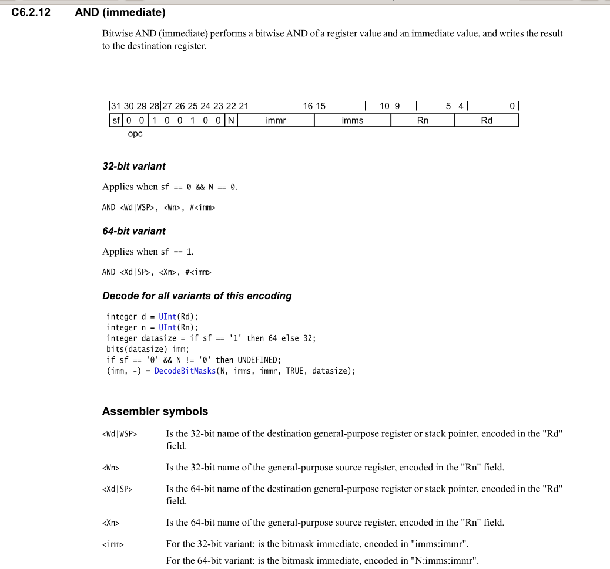
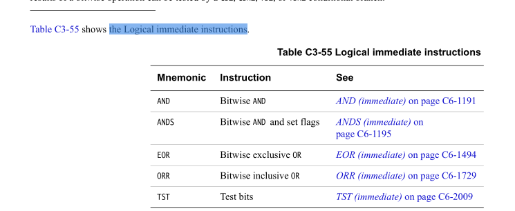
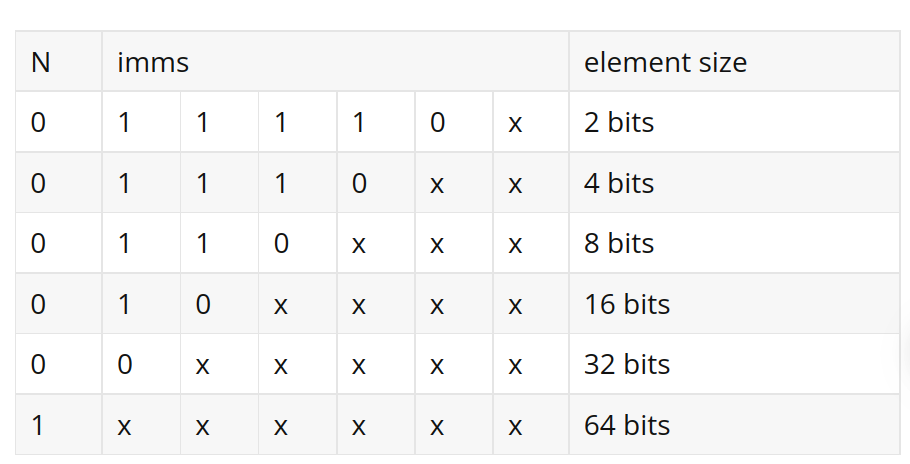

# AND 指令立即数取值
我们来看下`AND(immediate)`， 手册中相关说明


首先该指令支持32位与(`32-bits variant`), 和64位与操作(`64-bits 
variant`)。在指令编码处，由`sf` 位控制, 但是在32位与指令中，N
位必须为0（之后，我们会讲到)

我们以 `64-bits variant`为例，指令格式为:
```
AND <Xd|SP>, <Xn>, #<imm>
```
* 目的操作数为 `Xd|SP`寄存器，这里`Xd`指的是通用寄存器(`general-purpose register`)
     sp指定是stack pointer, 对应于指令编码的 `Rd`字段
* 源操作数为 `Xn`寄存器，对应指令编码的 `Rn`字段
* imm指的源操作数要与的立即数, 也分32, 64 bits variant
        + 32 : imms:immr
        + 64 : N:imms:immr
> NOTE
>
> 从这里也可以看到, N位只在`64 bits variant`中起作用

那么这里我们详细解释下 `imms:immr`, 和`N:imms:immr`

# 手册中关于该类型理解数的说明
在arm-v8 spec中的，`C3.4 Data processing - immediate`章节中，详细详解了
各种立即数的类型，而AND指令所包含的立即数类型为 `logical(immediate)`
（在手册`C3.4.2 Logical (immidate)`章节中有讲到

我们先截取手册中的描述:
> 手册中的相关描述
>
> The Logical (immediate) instructions accept a bitmask immediate 
> value that is a 32-bit pattern or a 64-bit pattern viewed as a 
> vector of identical elements of size e = 2, 4, 8, 16, 32 or, 64 
> bits. Each element contains the same sub-pattern, that is a single 
> run of 1 to (e - 1) nonzero bits from bit 0 followed by zero bits, 
> then rotated by 0 to (e - 1) bits. This mechanism can generate 5334 
> unique 64-bit patterns as 2667 pairs of pattern and their bitwise 
> inverse.

首先立即数是一个有大小为 2, 4, 8 ,16 ,32, 64 bits 元素组成，该元素大小记做e, 
这些元素有着相同的值，值为[1, e - 1] 连续的  nozero bits ，然后可以旋转[0, e -1],
什么意思呢，举个例子，如果 e = 4, 那么可以取值为(0111, 0011, 0001),然后可以旋转[0, e -1],
以 0111为例, 可以旋转为(0111, 1011, 1101, 1110)。假如说是`64-bits pattern`,
以取值0111, 旋转为0得到的立即数为:
```
0b 0111 0111 0111 0111 0111 0111 0111 0111 0111 0111 0111 0111 0111 0111 0111 0111 
```
那么`64-bits pattern`可以有多少个值呢:
```
63 * 64 + 32 * 31 +16 * 15 + 8 * 7 + 4 * 3 + 2 * 1
= 5334
```
这里63指的得是sub-pattern的初始值，共有 e - 1 中可能性，而64指得是，
可以旋转的bit, 共有64中可能性。后面提到了2667 pairs，我觉得可能是指取反， 例如:

如果0001 sub-pattern是合法存在，那么1110肯定也是合法存在。

我们再来看下，有哪些指令用到了该类型的立即数:



#  指令解码
指令解码中, 有3部分可以用于imm值的计算，为: N, immr, imms
那我们来看下，是怎么计算的, 首先我们列出一个{N, immrs}的map tables


x指的是从低位开始，连续1的个数 - 1,其中x不可以全为1
而1, 0 都是固定的。N在64 bits element size时候为1

immr随意取值, 但是需要在 [0, element size - 1]范围内

我们先来举个例子，再来看下为什么要这样设计:<br/>

eg:<br/>
*  N = 0, imms = 11110  x <br/>
从表中可以看到，element size = 2bits, 此时 x只能取0（因为x不能全为1), 
那imms只有一种情况 11101, 此时从低位开始连续1的个数为(0 + 1) 1,相当于
初始值为01 而immr 可以有两种取值{0,1}, 那么:
    + immr = 0, 获取到的imm为:`0b 01 01 ...`
    + immr = 1, 获取到的imm为:`0b 10 10 ...`
* N = 4, immrs = 1110 xx <br/>
    这里xx可以获得的值为{00, 01, 10} 那么可以获得的element初始值连续
    1的个数为:{0 + 1, 1 + 1, 2 + 1} = {1,2,3},那么，得到的element序列
    为: {0001, 0011, 0111}
    + xx = 00
        * immr = 0, imm :`0b 0001 0001 ...`
        * immr = 1, imm :`0b 0010 0010 ...`
        * immr = 2, imm :`0b 0010 0010 ...`
        * immr = 3, imm :`0b 0100 0100 ...`
    + xx = 01
        * immr = 0, imm :`0b 0011 0011 ...`
        * immr = 1, imm :`0b 0110 0110 ...`
        * immr = 2, imm :`0b 1100 1100 ...`
        * immr = 3, imm :`0b 1001 1001 ...`
    + xx = 10
        * immr = 0, imm :`0b 0111 0111 ...`
        * immr = 1, imm :`0b 1110 1110 ...`
        * immr = 2, imm :`0b 1101 1101 ...`
        * immr = 3, imm :`0b 1011 1011 ...`
> NOTE
>
> 从这里能更直观看出来，上面计算所取得imm的个数
> 以及A是合法的，~A也是合法的结论。

我们来解释下imms为什么要这样设计:
* 首先我们需要避免出现两个值{0, (unsigned)-1}, 因为这样的计算
 是没有意义的 `A & 0 = 0`, `A & (unsigned)-1 = A`, 这不需要算数
 计算就可以得到结果，并且`AND(immidate)`指令和`AND(shifted register)`
 指令还不一样，假设imm = {0, (unsigned)-1}前者是完全可以通过逻辑得
 到输出结果, 而后者由于两个操作数都是在寄存器中，这对程序员来说是无法
 通过逻辑得到输出的。那么我们再来重复下，他的做法:
    + immr x的值为初始序列的从低位起连续1的个数 - 1
    + immr x的所有bits不能都是1<br/><br/>
 第一条表保证了取得的element不能为0, 第二条则保证了取得的element不能为(unsigned)-1
* 当然这里可以这么规定(个人理解，不知道设计者有没有其他考虑）
    + immr x的值为初始序列的从低位起连续1的个数
    + immr x的所有bits不能都是0

我们再来看下N的作用:
假设没有N，
```
32 element size: imms = 00 00 00
64 element size: imms = 00 00 00

16 element size: imms = 10 00 00
64 element size: imms = 10 00 00
```
可以看到这样根据imms就看不出element size是64 element size还是32 element size了.
为什么{64, 32 16 8 4 2}会有这样的问题，{32,16}, {16, 8}...不会有这样冲突的问题。

我们返回来看上面的 {N, imms} maptable

可以发现，除了64 element size, 其他的都会在固定部分有区别，而 64 element size
的imms 是随意设置的(除了全1), 所以会和其他的element size冲突，所以这里涉及了一个
位(N)表明该imms是64 element size

# 参考资料
* armv8 spec
* [ENCODING OF IMMEDIATE VALUES ON AARCH64](https://dinfuehr.github.io/blog/encoding-of-immediate-values-on-aarch64/)
* [ARMv8 A64 汇编中立即数范围问题分析](https://blog.csdn.net/pcj_888/article/details/121455966)
