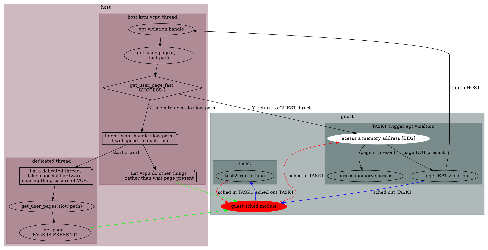
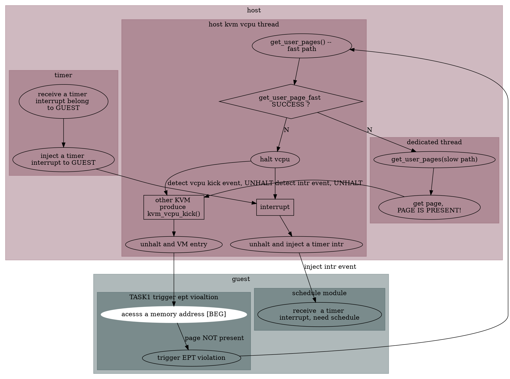

# introduce
在支持EPT的架构中, 对于`GVA->HPA`一般有两段映射:
* `GVA->GPA`
* `GPA->HPA`

而host kernel (kvm) 需要关心的是 `GPA->HPA`的映射, 需要host做的事情主要有
以下几个:
1. 捕捉相关 VM-exit event (EPT violation), 得到 GPA
2. 分配page
3. 建立映射关系(当然这个映射关系, 不止是GPA->HPA的mmu pgtable, 还有 HVA -- GPA,
   在这里不展开, 总之分配好具体的page(分配HPA), 以及为其建立好 mmu pgtable, 
   就可以完成该事件的处理)

但是, 已经建立好映射的页面, 也是qemu进程的虚拟地址空间(匿名页), 是可以被swap out,
当被swap out后, GUEST 访问该HPA对应的 GVA/GPA时, 仍然会触发 EPT violation. 这时还会
再走一次 VM-exit, 而且也需要完成上面所述的三件事, 其中第二件:分配page, 需要swap in
之前被swap out的page, 路径比较长, 如下:
```
VM-exit
  handle_ept_violation
    kvm_mmu_page_fault
      tdp_page_fault
        gfn_to_pfn
          hva_to_pfn
            get_user_pages --slow path
```

`get_user_pages`会走到slow path, 由于会走swap in流程, 所以该过程执行较慢. 所以大佬们就想着
能不能让其异步执行, 然后让vcpu先不complete 造成 EPT violation 的 instruction, 去干别的事
情, 等page present后, 再去执行该指令. 另外将 get_user_pages 让一个 dedicated thread 去完成,
这样, 对于虚拟机来说, 就相当于搞了一个额外的 硬件, 专门去处理 swap in, 解放了vcpu的算力.

> NOTE
>
> 大家思考下, 如果要达到该目的, 一定是让GUEST有意无意的 sche out 造成 EPT violation
> 的进程, 

该上面流程总结如下:

<!--
<details>
<summary>简要需求图</summary>

-->


</details>

由上图可见, 引入async pf 的逻辑是让其能够在触发 EPT violation后, 能够让VCPU 调度
到另外一个task, 从而阻塞触发 EPT violation 的进程执行. 为了达到这一目的, 做了以下改动:

* VCPU 线程在执行`get_user_page()`时, 仅执行fast path, 如果page 不是present的, 该接口直接
  返回, 而剩下的工作, 则交给另外一个`dedicated thread` 去做
* KVM 会通过一些方式, 让 GUEST 执行调度, 从而避免再次执行触发`EPT violation`的指令.具体方法
  有两种 : 对应于半虚拟化方式, 和非半虚拟化方式, 我们下面会分别讨论

我们首先讨论非半虚拟化方式:

# 非半虚拟化方式
我们知道, 如果达到这一目的, 就必须让 GUEST 去 sched out 当前触发 EPT violation 的 tasks, 
而非半虚拟化方式, 就是对 guest transparent, 所以, 又得要求guest 是靠自己当前的调度逻辑, 主动
的schedule, KVM 很巧妙的利用了操作系统使用时钟中断进行调度, 来达到这一目的, 主要步骤如下:



这里需要注意的是:
1. 上面是以timer interrupt 举例, 如果收到不是timer interrupt, 该中断也会inject 到
   guest中, 只不过guest在处理完interrupt后,还会返回到之前的task, 在page 没有present
   的情况下, 还会触发 EPT violation(包括如果收到了timer interrupt, 但是并没有执行sched
   动作. 也是同样的情况). But so what ? 本来引入async pf 的目的, 就是让vcpu 能够去做些
   别的任务? schedule other task && handle interrupt, 都可以让vcpu 继续运行, 和 get_user_page(slow
   path) 并行运行.
2. 该实现比较巧妙的时, 它对GUEST 完全透明, 当guest 触发async pf时, 当vcpu再次运行,
   无论是收到interrupt, 还是 async pf complete kick this vcpu, 对于guest而言, 就像是
   在触发异常指令之前的 instruction boundary执行了较长的时间(也就是触发异常的上一条指令)

下面我们详细介绍下, PV async pf.

# PV async pf

> NOTE
>
> 我们思考下, 该方式看似就已经解决问题了,为什么还要搞一个半虚拟化的方式, 来使该流程便复杂,
> 我们来看下该方式有何缺点:
>
> * 场景1
>   ```
>   vcpu_thread                 interrupt handler or work
>      halt_vcpu
>
>                               kick vcpu
>
>      unhalt
>      vcpu_enter
>   ```
>   可以看到在 halt_vcpu 之间, 到vcpu enter 之间, 有一个比较大的window, 如果能把 该window优化掉就好了
>
>
> * 场景2
>   ```
>   vcpu_thread_kvm   host_intr_handler_or_work           GUEST
>     halt_vcpu
>                     kick_vcpu
>     uhalt
>     vcpu_enter
>                                                         sched out task1
>                                                         sched in task1
>                                                         page is NOT present
>                                                         trigger EPT violation
>     vcpu_exit
>     halt_vcpu
>   ```
>   可以看到, 这里在vcpu enter后, 还有可能调度回 task1, 接着触发EPT violation, 如果page
>   还没有present的话, 本次调度, 仍然会VM exit, 继续halt vcpu, 还会有场景1 中的较大的window.
>
> 所以通过上面两种场景看, 该方式的实现, 并不能做到与vcpu 与 `get_user_page_slow_path`做到完全平行.
> 还是会在某些地方有block

结合上述, 我们首先需要思考下, 半虚拟化的 async pf要达到一个什么样的目的:
1. 尽量不去 halt vcpu, 让其能够在`get_user_page_fast()`没有成功的时候, 就可以VM-entry, 为了避免
   再次执行触发EPT violation的指令, 需要打破现有的执行流程, 并且执行调度.

   而打破现有的执行流程, 无非是通过 INTERRUPT/EXCEPTION
2. 能够让GUEST知道, 哪些task是因为async pf被调度走了, 避免再page没有present的情况下, 将这些task
   调度回来

而PV async pf, 就是多做了上面两件事.

