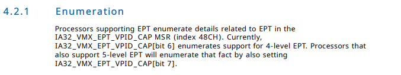
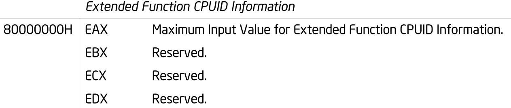
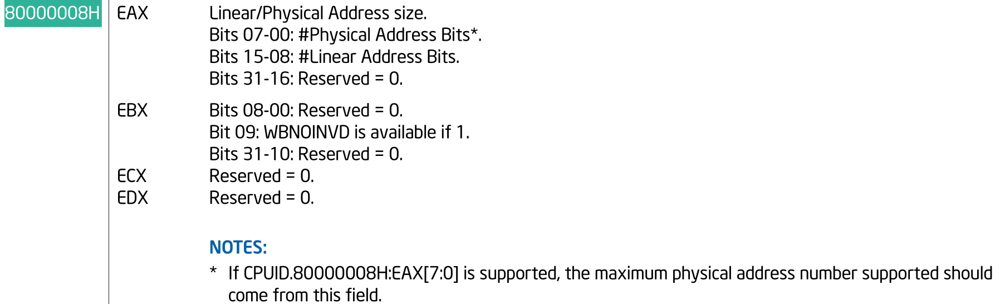

# init  shadow root level
```cpp
kvm_init_mmu(...) {
    ...
    if (mmu_is_nested(vcpu))
        init_kvm_nested_mmu(vcpu);
    else if (tdp_enabled)
            init_kvm_tdp_mmu(vcpu);
    else
            init_kvm_softmmu(vcpu);
    ...
}
init_kvm_tdp_mmu() {
    ...
    context->shadow_root_level = kvm_x86_ops->get_tdp_level(vcpu);
    context->direct_map = true;
    
    ...
    context->inject_page_fault = kvm_inject_page_fault
    ...
}

static int get_ept_level(struct kvm_vcpu *vcpu)
{
        if (cpu_has_vmx_ept_5levels() && (cpuid_maxphyaddr(vcpu) > 48))
                return 5;
        return 4;
}
```
## emulate 5level ept in MSR_IA32_VMX_EPT_VPID_CAP
```cpp
static inline bool cpu_has_vmx_ept_5levels(void)              
{                                                             
        return vmx_capability.ept & VMX_EPT_PAGE_WALK_5_BIT;  
}


```
init `vmx_capability`
```cpp
static __init int setup_vmcs_config(struct vmcs_config *vmcs_conf,
                                    struct vmx_capability *vmx_cap)
{
    ...
    rdmsr_safe(MSR_IA32_VMX_EPT_VPID_CAP,
        &vmx_cap->ept, &vmx_cap->vpid);
    ...
}
```

kvm 只支持 4-level page 以上的ept
```cpp
static __init int hardware_setup(void)
{
    ...
    if (!cpu_has_vmx_ept() ||
        !cpu_has_vmx_ept_4levels() ||
        !cpu_has_vmx_ept_mt_wb() ||
        !cpu_has_vmx_invept_global())
            enable_ept = 0;
    ...
}
```

5-level ept emulation



## cpuid la57 in kvm
```cpp
int kvm_update_cpuid(struct kvm_vcpu *vcpu)
{
    ...
    vcpu->arch.maxphyaddr = cpuid_query_maxphyaddr(vcpu);
    ...
}

int cpuid_query_maxphyaddr(struct kvm_vcpu *vcpu)
{
        struct kvm_cpuid_entry2 *best;

        best = kvm_find_cpuid_entry(vcpu, 0x80000000, 0);
        if (!best || best->eax < 0x80000008)
                goto not_found;
        best = kvm_find_cpuid_entry(vcpu, 0x80000008, 0);
        if (best)
                return best->eax & 0xff;
not_found:
        return 36;
}
```
### CPUID EAX =  0x80000000



### CPUID EAX = 0x80000008



