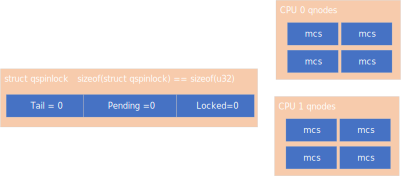
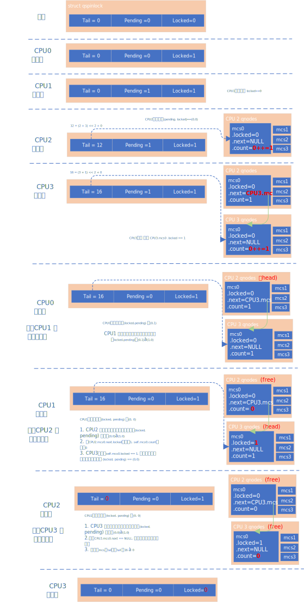

# 简介
内核中的自旋锁是互斥锁。而内核中的自旋锁经过多个版本的演进，
最终是在 mcs 自旋锁 算法之上，根据kernel 本身的需求，作了改进。

我们这里不去回顾 Linux 自旋锁的历史，简单介绍下 mcs 自旋锁算法，
并详细讲解 kernel 中的 mcs自旋锁的变体。

> NOTE
>
> 如果想要了解 kernel 自旋锁的演进，可以看下
>
> [深入理解Linux内核之自旋锁](https://zhuanlan.zhihu.com/p/584016727)
>
> 该文章详细讲解了kernel自旋锁的演进，并通过举例子
> 的方式，讲解了各个算法（包括最新的算法），十分值
> 得看, 本文主要分析kernel 最新的 自旋锁算法。


# MCS 自旋锁
MCS 自旋锁是在为了解决票号自旋锁带来的 cache 抖动的问题<sup>1</sup>, 
实现了一个队列，使其各自自旋各自的地址, 而不是自旋一个地址，这样就
解决了这个问题。

> NOTE 1
> 
> 这里提到的缓存抖动，大家可以设想下，如果每个cpu都在spin 一个地址，
> 当其中一个cpu 去写该地址，则其他的cpu都要去 invalidate 该缓存，并且
> 从内存里重新获取。而且这种动作会一直持续下去。另外，在spin wait loop
> 中，还容易造成 memory order violation， 会进一步影响性能。
>
> 另外大家想下，本身这种设计和MCS 自旋锁的需求是贴合的。
> 因为队列本身具有顺序性，需要前面的线程释放完之后，才能获取到锁，
> 也就是大家只需要关注前面进程何时释放锁即可。

所以 MCS自旋锁 即保持票号自旋锁的保证线程获取锁的顺序的优点，
同时解决票号自旋锁带来的cache 抖动问题。但是也有缺点，我们下面会介绍。

我们先来看下 MCS自旋锁的实现


而MCS自旋锁有什么缺点呢 ?
* 更改了spinlock的相关接口
* 锁占用的内存变大

kernel 对此做了一些优化，我们来看下
# KERNEL MCS 变体

spinlock的相关数据结构(struct qspinlock)，仍然保持之前的样子
大小为`sizeof(u32)`。但是该空间分割成主要的三个成员
`(locked, pending,tail)`。我们来看下kernel代码定义:
```cpp
typedef struct qspinlock {
        union {
                atomic_t val;

                /*
                ¦* By using the whole 2nd least significant byte for the
                ¦* pending bit, we can allow better optimization of the lock
                ¦* acquisition for the pending bit holder.
                ¦*/
#ifdef __LITTLE_ENDIAN
                struct {
                        u8      locked;
                        u8      pending;
                };
                struct {
                        u16     locked_pending;
                        u16     tail;
                };
#else
                struct {
                        u16     tail;
                        u16     locked_pending;
                };
                struct {
                        u8      reserved[2];
                        u8      pending;
                        u8      locked;
                };
#endif
        };
} arch_spinlock_t;
```
可以看到访问该数据结构，应该使用原子操作(qspinlock.val),
根据的线程(cpu)的情况可能需要关注的东西不同, 例如: 
`mcs.locked = 1`的cpu需要关注 (qspinlock.locked_pending)成员。
而pending的cpu仅需要关注(qspinlock.locked), 我们下面会介绍具体的流程



* 简单来说，是占据pending 的cpu抢占locked, 而 占据 mcs head 的cpu
抢占 `locked_pending`, 而非mcs head的cpu, 先抢占 `self.mcs.locked == 1`,
等待该条件满足时，表示其为 mcs head, 然后再抢占 `locked_pending`
* 每个 cpu有四个 mcs0, 代表4中状态（代表4层执行流，线程、软中断、
硬中断、屏蔽中断), 举个例子，线程拿到了锁，这时候来了一个硬
中断，硬中断处理完后，进入软中断处理及流程，这时拿了一把锁，
此时又来了一个硬中断，该中断处理中又拿了一个自旋锁，还未解锁时，
来了一个NMI又拿了一个自旋锁。 这样每个CPU最多持有四把自旋锁。而
每个自旋锁，如果都需要使用 mcs结构 enqueue， 最多需要4个mcs结构。
* tail的计算也是基于上面。每个cpu最多拿四个mcs, 所以tail[bit:1,bit:0]
用来表示当前用了几个自旋锁。cpu index记录在剩余的bits中。另外 
`tail == 0`有特殊的含义 -- 表示没有 mcs 在抢占自旋锁。所以不存在 
`cpu0.mcs0`的这种情况，需要将 `cpu_index++`, 也就是下面的公式:
```
tail = ((cpu_index + 1) << 2) + mcs_index
```

# 代码分析
> NOTE
>
> 下面 频繁使用三元组 (tail, pending, locked) , 例如(0, 0, 1) 表示
> locked = 1, pending = 0, tail = 0
>
> 另外 tail = n , 表示tail位被占用
> 
> tail = z, 则表示tail 为任意值
>
> locked, pending == x, y 表示任意值

我们直接看 `queue_spin_lock()`的相关代码:

## queued_spin_lock
```cpp
static __always_inline void queued_spin_lock(struct qspinlock *lock)
{
        u32 val;
        //=============(1)=================
        val = atomic_cmpxchg_acquire(&lock->val, 0, _Q_LOCKED_VAL);
        if (likely(val == 0))
                return;
        //============(2)==================
        queued_spin_lock_slowpath(lock, val);
}
```
1. 查看`lock->val` 是否为0, 如果为0, 则说明没有人在使用该锁, 将
(0, 0, 0) 修改为 (0, 0, 1)
2. 如果有人占用锁，则走slowpath流程

## slow path
### lock pending -- part 1
```cpp
void queued_spin_lock_slowpath(struct qspinlock *lock, u32 val)
{
        struct mcs_spinlock *prev, *next, *node;
        u32 old, tail;
        int idx;

        BUILD_BUG_ON(CONFIG_NR_CPUS >= (1U << _Q_TAIL_CPU_BITS));
        //===============(1)==================
        if (pv_enabled())
                goto pv_queue;

        if (virt_spin_lock(lock))
                return;

        /*
        ¦* Wait for in-progress pending->locked hand-overs with a bounded
        ¦* number of spins so that we guarantee forward progress.
        ¦*
        ¦* 0,1,0 -> 0,0,1
        ¦*/
        //===============(2)==================
        if (val == _Q_PENDING_VAL) {
                int cnt = _Q_PENDING_LOOPS;
                val = atomic_cond_read_relaxed(&lock->val,
                                        (VAL != _Q_PENDING_VAL) || !cnt--);
        }

        /*
        ¦* If we observe any contention; queue.
        ¦*/
        //===============(3)==================
        if (val & ~_Q_LOCKED_MASK)
                goto queue;
        /*
    `   ¦* trylock || pending
    `   ¦*
    `   ¦* 0,0,* -> 0,1,* -> 0,0,1 pending, trylock
    `   ¦*/
        //===============(4)==================
    `   val = queued_fetch_set_pending_acquire(lock);
        ...
```
1. 我们这里先不关注半虚拟化
2. 如果是(0, 1, 0)， 则等待其进入(0, 0, 1), 这样做的好处是，如果其进入了
(0,0,1) 则直接抢占pending位，状态为(0,1,1), 就不用走queue的流程
3. 如果除 locked位，其他位不为0, 则说明有被别的线程抢占了，则走queue的流程
4. 该代码为:
```cpp
static __always_inline u32 queued_fetch_set_pending_acquire(struct qspinlock *lock)
{
        return atomic_fetch_or_acquire(_Q_PENDING_VAL, &lock->val);
}
```
这里进行按位或操作，并返回之前的值，我们来想下在原子操作前有那
几种可能的情况。
* (z, 1, y) : 进行逻辑或操作无影响。但是本次抢占锁失败
* (n, 0, y) : !! 这种情况就打乱了顺序，不允许, 并且需要将pending位还原
* (0, 0, 1) : 抢占pending位，spin lock位
* (0, 0, 0) : 抢占了pending位，然后这时，只有自己能抢占lock位，再抢占lock位

我们继续分析(4) 之后的代码:

### lock pending -- part2
```cpp

        /*
        ¦* If we observe contention, there is a concurrent locker.
        ¦*
        ¦* Undo and queue; our setting of PENDING might have made the
        ¦* n,0,0 -> 0,0,0 transition fail and it will now be waiting
        ¦* on @next to become !NULL.
        ¦*/
        //============(1)====================
        if (unlikely(val & ~_Q_LOCKED_MASK)) {

        //============(1.1)====================
                /* Undo PENDING if we set it. */
                if (!(val & _Q_PENDING_MASK))
                        clear_pending(lock);

                goto queue;
        }

        /*
        ¦* We're pending, wait for the owner to go away.
        ¦*
        ¦* 0,1,1 -> 0,1,0
        ¦*
        ¦* this wait loop must be a load-acquire such that we match the
        ¦* store-release that clears the locked bit and create lock
        ¦* sequentiality; this is because not all
        ¦* clear_pending_set_locked() implementations imply full
        ¦* barriers.
        ¦*/
        //===============(2)================
        if (val & _Q_LOCKED_MASK)
                atomic_cond_read_acquire(&lock->val, !(VAL & _Q_LOCKED_MASK));
/*
        ¦* take ownership and clear the pending bit.
        ¦*
        ¦* 0,1,0 -> 0,0,1
        ¦*/
        clear_pending_set_locked(lock);
        lockevent_inc(lock_pending);
        return;
```
1. 除了locked字段以外还有值，则抢锁失败
    + pending字段有值，则为(z, 1, y), 抢锁失败不需要做什么事情, 
    + pending 字段未有值，那tail字段肯定有值，则为(n, 0, y), 抢锁
     失败，还需要将pending位还原为0
    + 以上两种情况都需要入队
2. 这种情况为 (0, 0, y)
    + 如果为 (0, 0, 1), 则spin lock位，等待其变为0
    + 如果位 (0, 0, 0), clear pending 并且 抢占 lock位

### queue -- part1
```cpp
void queued_spin_lock_slowpath(struct qspinlock *lock, u32 val)
{
        ...
queue:
        lockevent_inc(lock_slowpath);
pv_queue:
        //=================(1)=======================
        node = this_cpu_ptr(&qnodes[0].mcs);
        idx = node->count++;
        tail = encode_tail(smp_processor_id(), idx);

        /*
        ¦* 4 nodes are allocated based on the assumption that there will
        ¦* not be nested NMIs taking spinlocks. That may not be true in
        ¦* some architectures even though the chance of needing more than
        ¦* 4 nodes will still be extremely unlikely. When that happens,
        ¦* we fall back to spinning on the lock directly without using
        ¦* any MCS node. This is not the most elegant solution, but is
        ¦* simple enough.
        ¦*/
        //=================(2)=======================
        if (unlikely(idx >= MAX_NODES)) {
                lockevent_inc(lock_no_node);
                while (!queued_spin_trylock(lock))
                        cpu_relax();
                goto release;
        }

        //=================(3)=======================
        node = grab_mcs_node(node, idx);
        ...
}
```
1. 获取mcs结构，关于该node的count,在 qnodes[0].mcs中记录。
`encode_tail()` 会根据 当前cpu idx和原来的count值计算出一个
值作为tail的值。
2. `idx >= MAX_NODES`其实是不正常的（说明已经获取了 MAX_NODES(4)
次锁), 注释中写了可能的原因，我们这里先不细看 (!!后续补充!!)
3. 获取 qnodes[idx].mcs  node


### queue -- part2
```cpp
void queued_spin_lock_slowpath(struct qspinlock *lock, u32 val)
{
        ...
        /*
         * 上节代码: 
         * idx = node->count++;
         */
		...
        /*
        ¦* Keep counts of non-zero index values:              
        ¦*/                                                   
        lockevent_cond_inc(lock_use_node2 + idx - 1, idx);    
                                                                                   
        //=============(1)===============
        /*                                                                         
        ¦* Ensure that we increment the head node->count before initialising       
        ¦* the actual node. If the compiler is kind enough to reorder these        
        ¦* stores, then an IRQ could overwrite our assignments.                    
        ¦*/                                                                        
        barrier();
        //=============(2)===============
        node->locked = 0;                                                          
        node->next = NULL;                                                         
        pv_init_node(node);                                                        
                                                                                   
        /*                                                                         
        ¦* We touched a (possibly) cold cacheline in the per-cpu queue node;       
        ¦* attempt the trylock once more in the hope someone let go while we       
        ¦* weren't watching.                                                       
        ¦*/                                                                        
        //=============(3)===============
        if (queued_spin_trylock(lock))                                             
                goto release;                                                      
                                                                                   
		...
}
```
1. [locking/qspinlock: Ensure node->count is updated before initialising node](https://lore.kernel.org/lkml/20180528100209.755214820@linuxfoundation.org/)
> commit 11dc13224c975efcec96647a4768a6f1bb7a19a8 
该 barrier是为了避免编译器将 `init node` 和 `idx = node->count++`顺序搞乱。
在单执行流跑的时候不会有问题。当遇到下面的情况
```
(1) 未加barrier()之前, 编译器乱序
normal thread                   触发中断
//乱序
init node[0]
                                init node[0]
idx = node->count++

(2) 加了barrier
normal thread
idx = node->count++             触发中断
                                init node[1]
init node[0]
```
未加 barrier()之前，会遇到中断执行流和normal thread执行流，使用
一个node的情况。
2. 初始化该node
3. 这时候，我们只修改了node, 如果能抢到锁，恢复原来的node也很好恢复。
所以尝试抢锁，抢到就血赚。

### queue -- part3
```cpp
void queued_spin_lock_slowpath(struct qspinlock *lock, u32 val)
{
        /* 
         * 上节代码:(1)
         * node->locked = 0;                                                          
         * node->next = NULL;                                                         
         */
        ...
        /*
        ¦* Ensure that the initialisation of @node is complete before we
        ¦* publish the updated tail via xchg_tail() and potentially link
        ¦* @node into the waitqueue via WRITE_ONCE(prev->next, node) below.
        ¦*/
        //=============(1)===============
        smp_wmb();

        /*                                                                         
        ¦* Publish the updated tail.                                               
        ¦* We have already touched the queueing cacheline; don't bother with       
        ¦* pending stuff.                                                          
        ¦*
        ¦* p,*,* -> n,*,*
        ¦*/
        //==============(2)===============
        old = xchg_tail(lock, tail);
        next = NULL;

        /*
        ¦* if there was a previous node; link it and wait until reaching the
        ¦* head of the waitqueue.
        ¦*/
        //==============(3)===============
        if (old & _Q_TAIL_MASK) {
                prev = decode_tail(old);

                /* Link @node into the waitqueue. */
        //==============(4)===============
                WRITE_ONCE(prev->next, node);

                pv_wait_node(node, prev);
        //==============(5)===============
                arch_mcs_spin_lock_contended(&node->locked);

                /*
                ¦* While waiting for the MCS lock, the next pointer may have
                ¦* been set by another lock waiter. We optimistically load
                ¦* the next pointer & prefetch the cacheline for writing
                ¦* to reduce latency in the upcoming MCS unlock operation.
                ¦*/
        //==============(6)===============
                next = READ_ONCE(node->next);
                if (next)
                        prefetchw(next);
        }
        ...
}
```
1. 关于此处的分析，请看<br/>
    + [locking/qspinlock: Ensure node is initialised before updating 
      prev->next](./patch/locking-qspinlock-Ensure-node-is-initialised-before-.patch)<br/>
    + [locking/qspinlock: Elide back-to-back RELEASE operations 
    with smp_wmb](./patch/locking-qspinlock-Elide-back-to-back-RELEASE-operati.patch)<br/>
2. publish the updated tail (替换tail)
3. 判断 old 是否有 tail值，如果有，则说明mcs链表中有成员, 需要获取
prev, 并且更新`prev->next`
4. 更新 prev->next
5. 这时需要自旋等待 node->locked == 1
```cpp
#define arch_mcs_spin_lock_contended(l)                                 \
do {                                                                    \
        smp_cond_load_acquire(l, VAL);                                  \
} while (0)
```
6. 因为在(5)处等待了一段时间，很可能node->next就有值了，因为这时候抢到了
锁，如果有next需要再将`next->locked = 1`, 但是距离写操作还有一些指令，
这里执行`prefetchw` 操作，暗示cpu会有对`next`地址的写操作，使其在写操作
发生之前，将该地址的内容load到 cache中。
### queue -- part4
```cpp
void queued_spin_lock_slowpath(struct qspinlock *lock, u32 val)
{
        ...
        /*
        ¦* we're at the head of the waitqueue, wait for the owner & pending to
        ¦* go away.
        ¦*
        ¦* *,x,y -> *,0,0
        ¦*
        ¦* this wait loop must use a load-acquire such that we match the
        ¦* store-release that clears the locked bit and create lock
        ¦* sequentiality; this is because the set_locked() function below
        ¦* does not imply a full barrier.
        ¦*
        ¦* The PV pv_wait_head_or_lock function, if active, will acquire
        ¦* the lock and return a non-zero value. So we have to skip the
        ¦* atomic_cond_read_acquire() call. As the next PV queue head hasn't
        ¦* been designated yet, there is no way for the locked value to become
        ¦* _Q_SLOW_VAL. So both the set_locked() and the
        ¦* atomic_cmpxchg_relaxed() calls will be safe.
        ¦*
        ¦* If PV isn't active, 0 will be returned instead.
        ¦*
        ¦*/
        //================(1)======================
        if ((val = pv_wait_head_or_lock(lock, node)))
                goto locked;

        //================(2)======================
        val = atomic_cond_read_acquire(&lock->val, !(VAL & _Q_LOCKED_PENDING_MASK));
        ...
}
```
1. pv先不看 !!!!!
2. 自旋 `lock->lock_pending  == 0` (n, 1, 0) 或者 (n,0,1) -->(n, 0, 0), 
这里只有该进程自旋这个地址，所以如果变为(n, 0, 0) , 只有这个进程可以抢到。

### locked
```cpp
void queued_spin_lock_slowpath(struct qspinlock *lock, u32 val)
{
locked:
        /*
        ¦* claim the lock:
        ¦*
        ¦* n,0,0 -> 0,0,1 : lock, uncontended
        ¦* *,*,0 -> *,*,1 : lock, contended
        ¦*
        ¦* If the queue head is the only one in the queue (lock value == tail)
        ¦* and nobody is pending, clear the tail code and grab the lock.
        ¦* Otherwise, we only need to grab the lock.
        ¦*/

        /*
        ¦* In the PV case we might already have _Q_LOCKED_VAL set, because
        ¦* of lock stealing; therefore we must also allow:
        ¦*
        ¦* n,0,1 -> 0,0,1
        ¦*
        ¦* Note: at this point: (val & _Q_PENDING_MASK) == 0, because of the
        ¦*       above wait condition, therefore any concurrent setting of
        ¦*       PENDING will make the uncontended transition fail.
        ¦*/
        //==============(1)====================
        if ((val & _Q_TAIL_MASK) == tail) {
                //==============(2)====================
                if (atomic_try_cmpxchg_relaxed(&lock->val, &val, _Q_LOCKED_VAL))
                        goto release; /* No contention */
        }

        /*
        ¦* contended path; wait for next if not observed yet, release.
        ¦*/
        //==============(3)====================
        if (!next)
                next = smp_cond_load_relaxed(&node->next, (VAL));

        /*
        ¦* Either somebody is queued behind us or _Q_PENDING_VAL got set
        ¦* which will then detect the remaining tail and queue behind us
        ¦* ensuring we'll see a @next.
        ¦*/
        //==============(4)====================
        set_locked(lock);

        //==============(5)====================
        arch_mcs_spin_unlock_contended(&next->locked);
        pv_kick_node(lock, next);

release:
        /*
        ¦* release the node
        ¦*/
        __this_cpu_dec(qnodes[0].mcs.count);
}
```
1. 如果tail 就是 当前的mcs, 说明，没有其他人抢了，这时将
状态变为 (0, 0, 1)
2. `atomic_try_cmpxchg_relaxed()`
    + 如果lock->val == val , val保持不变，返回值为true
    + 如果Lock->val != val, val=lock->val, 返回值为false
    + 所以, 如果返回为真，说明为(this_node, 0, 0)则
    直接替换成(0, 0, 1) 即可, 并且释放该mcs
3. 如果next没有值，并且这时`lock->tail != this_node`, 说明
有人抢锁，并执行完`old = xchg_tail(lock, tail);` 这行代码，
但是还没有执行`WRITE_ONCE(prev->next, node);`, 这行代码，
这时，需要等待 node->next 被赋值。
4. 这时，可以抢占锁了。
```
commit c61da58d8a9ba9238250a548f00826eaf44af0f7
```
5. 将next->locked 赋值为1
```cpp
#define arch_mcs_spin_unlock_contended(l)                               \
        smp_store_release((l), 1)
```

