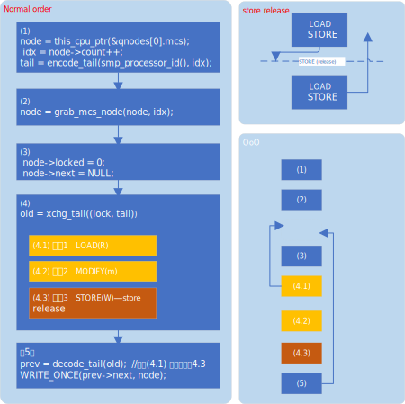

```diff
From 95bcade33a8af38755c9b0636e36a36ad3789fe6 Mon Sep 17 00:00:00 2001
From: Will Deacon <will.deacon@arm.com>
Date: Tue, 13 Feb 2018 13:22:56 +0000
Subject: [PATCH] locking/qspinlock: Ensure node is initialised before updating
 prev->next

When a locker ends up queuing on the qspinlock locking slowpath, we
initialise the relevant mcs node and publish it indirectly by updating
the tail portion of the lock word using xchg_tail. If we find that there
was a pre-existing locker in the queue, we subsequently update their
 ->next field to point at our node so that we are notified when it's our
turn to take the lock.

This can be roughly illustrated as follows:
  !!!!!!!!MY_NOTE!!!!!!!!!!
  这里相当与初始化node, 并且从node中 !!load!! 到tail中, 是一个read操作
  !!!!!!!!MY_NOTE!!!!!!!!!!
  /* Initialise the fields in node and encode a pointer to node in tail */
  tail = initialise_node(node);

  /*
   * Exchange tail into the lockword using an atomic read-modify-write
   * operation with release semantics
   */
  !!!!!!!!MY_NOTE!!!!!!!!!!
  xchg_tail() {xchg_release()}
  !!!!!!!!MY_NOTE!!!!!!!!!!
  old = xchg_tail(lock, tail);

  /* If there was a pre-existing waiter ... */
  if (old & _Q_TAIL_MASK) {
	prev = decode_tail(old);
	smp_read_barrier_depends();

	/* ... then update their ->next field to point to node.
	WRITE_ONCE(prev->next, node);
  }

The conditional update of prev->next therefore relies on the address
dependency from the result of xchg_tail ensuring order against the
prior initialisation of node. However, since the release semantics of
the xchg_tail operation apply only to the write portion of the RmW,
then this ordering is not guaranteed and it is possible for the CPU
to return old before the writes to node have been published, consequently
allowing us to point prev->next to an uninitialised node.

This patch fixes the problem by making the update of prev->next a RELEASE
operation, which also removes the reliance on dependency ordering.

Signed-off-by: Will Deacon <will.deacon@arm.com>
Acked-by: Peter Zijlstra (Intel) <peterz@infradead.org>
Cc: Linus Torvalds <torvalds@linux-foundation.org>
Cc: Thomas Gleixner <tglx@linutronix.de>
Link: http://lkml.kernel.org/r/1518528177-19169-2-git-send-email-will.deacon@arm.com
Signed-off-by: Ingo Molnar <mingo@kernel.org>
---
 kernel/locking/qspinlock.c | 13 +++++++------
 1 file changed, 7 insertions(+), 6 deletions(-)

diff --git a/kernel/locking/qspinlock.c b/kernel/locking/qspinlock.c
index 38ece035039e..348c8cec1042 100644
--- a/kernel/locking/qspinlock.c
+++ b/kernel/locking/qspinlock.c
@@ -408,14 +408,15 @@ void queued_spin_lock_slowpath(struct qspinlock *lock, u32 val)
 	 */
 	if (old & _Q_TAIL_MASK) {
 		prev = decode_tail(old);
+
 		/*
-		 * The above xchg_tail() is also a load of @lock which
-		 * generates, through decode_tail(), a pointer.  The address
-		 * dependency matches the RELEASE of xchg_tail() such that
-		 * the subsequent access to @prev happens after.
+		 * We must ensure that the stores to @node are observed before
+		 * the write to prev->next. The address dependency from
+		 * xchg_tail is not sufficient to ensure this because the read
+		 * component of xchg_tail is unordered with respect to the
+		 * initialisation of @node.
 		 */
-
-		WRITE_ONCE(prev->next, node);
+		smp_store_release(&prev->next, node);
 
 		pv_wait_node(node, prev);
 		arch_mcs_spin_lock_contended(&node->locked);
-- 
2.39.0
```
> MAIL: https://lkml.indiana.edu/hypermail/linux/kernel/1802.1/03985.html
> COMMIT : 95bcade33a8af38755c9b0636e36a36ad3789fe6

作者的意思是xchg_release是一个RmW的操作，该操作只有write 操作是加了屏障的，
(store release), 依赖流是这样
```
WRITE_ONCE(prev->next, node)
--> prev
--> old
--> xchg_release LOAD (RmW中的R)
--> tail
--> idx
--> node->count
```
而node的init操作`node->locked = 0, node->next = NULL`, 
则和上面流程 (xchg_release 的 store 动作) 没有依赖。
这样由于`STORE-release`的语义，`WRITE_ONCE(prev->next, node)`
可能在`xchg_release()` STORE动作之前完成，也能在 `init node`
相关代码之前完成( `xchg_release()`的 LOAD操作也是如此)

如下图所示:



将`WRITE_ONCE` 修改为`smp_store_release`后，由于 `store release`
的语义，`init node`相关指令执行，一定在 该 STORE之前完成。
