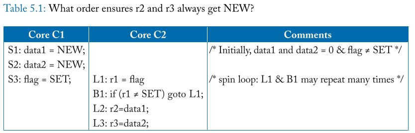

# CHAPTER 5 Relaxed Memory Consistency

The previous two chapters explored the memory consistency models sequential
consistency (SC) and total store order (TSO). These chapters presented SC as
intuitive and TSO as widely implemented (e.g., in x86). Both models are
sometimes called strong because the global memory order of each model usually
respects (preserves) per-thread program order. Recall that SC preserves order
for two memory operations from the same thread for all four combinations of
loads and stores (Load -> Load, Load -> Store, Store -> Store, and Store ->
Load), whereas TSO preserves the first three orders but not Store -> Load order.

> ```
> intuitive [ɪnˈtjuːɪtɪv]: 直觉的;易懂的; 使用简便的
> preserves [prɪˈzɜːvz] : 保存; 保护; 保留; 维护; 维持...现状
> recall: 回忆起 ; 召回 ; 使想起 ; 收回
> ```
> 前两章探讨了内存一致性模型——顺序一致性（SC）和总存储顺序（TSO）。这些章节介绍了
> 直观的SC和广泛实现的TSO（例如，在x86中）。这两个模型有时都被称为强模型，因为每个
> 模型的全局内存顺序通常遵守（preserves 保留? 保持）每个线程的程序顺序。回想一下，
> 对于所有四种加载和存储组合（加载->加载、加载->存储、存储->存储和存储->加载）,
> SC保持来自同一线程的两个内存操作的顺序，而TSO保持前三个顺序，但不保持存储->加载
> 顺序。

This chapter examines more relaxed (weak) memory consistency models that seek
to preserve only the orders that programmers “require.” The principal benefit of
this approach is that mandating fewer ordering constraints can facilitate
higher performance by allowing more hardware and software (compiler and runtime
system) optimizations. The principal drawbacks are that relaxed models must
formalize when ordering is “required” and provide mechanisms for programmers
or low-level software to communicate such ordering to implementations, and
vendors have failed to agree on a single relaxed model, compromising
portability

> ```
> examines 检查，检验; 审查; 调查; 考察
> principal [ˈprɪnsəpl] 主要的 ; 最重要的 
> mandating 授权 ; 强制执行
> facilitate [fəˈsɪlɪteɪt] 促进
> drawbacks [ˈdrɔˌbæks] 缺点
> formalize  使成为正式的 ; 使有固定体系，使定形
> compromising [ˈkɑːmprəmaɪzɪŋ] 有失体面的;   不宜泄露的;
> portability [ˌpɔrtəˈbɪlɪti] 便携性 ; 可携带，轻便
> ```
>
> 本章研究了更宽松（弱）的内存一致性模型，这些模型试图只保持程序员“需要”的顺序.
> 这种方法的主要好处是，通过允许更多的硬件和软件（编译器和运行时系统）优化，强
> 制要求更少的排序约束可以促进更高的性能. 主要的缺点是，当“需要”排序时，宽松的模型
> 必须形式化，并为程序员或低级软件提供机制来将这种排序传达给实现，而供应商未能就单
> 一的宽松模型达成一致，从而影响了可移植性

A full exploration of relaxed consistency models is beyond the scope of this
chapter. This chapter is instead a primer that seeks to provide the basic
intuition and help make the reader aware of the limits of a simple
understanding of these models. In particular, we provide motivation for relaxed
models (Section 5.1), present and formalize an example relaxed consis- tency
model XC (Section 5.2), discuss the implementation of XC, including atomic
instructions and instructions used to enforce ordering (Section 5.3), introduce
sequential consistency for data-race-free programs (Section 5.4), present
additional relaxed model concepts (Section 5.5), present the RISC-V and IBM
Power memory model case studies (Section 5.6), point to further reading and
other commercial models (Section 5.7), compare models (Section 5.8), and touch
upon high-level-language memory models (Section 5.9).

> concept: 概念
>
> 对宽松一致性模型的全面探索超出了本章的范围。相反，本章是一本入门读物，旨在提
> 供基本的直觉，并帮助读者认识到对于这些模型的局限性简单的理解。特别是，我们提出了
> 宽松模型的动机（第5.1节), 提出并实例化了一个示例宽松一致性模型XC（第5.2节），
> 讨论了XC的实现，包括原子指令和用于强制排序的指令（第5.3节），为data-race-free的程序引
> 入序列一致性（第5.4节），介绍其他宽松的模型概念（第5.5节），介绍RISC-V和IBM Power
> 内存模型案例研究（第5.6节），指出进一步的阅读和其他商业模型（第5.7节），比较模型
> （第5.8节，并触及高级语言内存模型（第5.9节）。

## 5.1 MOTIVATION

As we will soon see, mastering relaxed consistency models can be more
challenging than understanding SC and TSO. These drawbacks beg the question:
why bother with relaxed models at all? In this section, we motivate relaxed
models, first by showing some common situations in which programmers do not care
about instruction ordering (Section 5.1.1) and then by discussing a few of
the optimizations that can be exploited when unnecessary orderings are not
enforced (Section 5.1.2).

> ``` 
> mastering 掌握 ; 控制 ; 精通 ; 精通
> beg the question: 引出问题
> bother: 打扰;使(某人)烦恼(或担忧、不安);
> exploited /ɪkˈsplɔɪtɪd/ 利用(…为自己谋利);剥削;发挥;运用;压榨
> 
> ```
> 
> 我们很快就会看到，掌握宽松的一致性模型可能比理解SC和TSO更具挑战性。这些缺点
> 引出了一个问题：这些缺点引出了一个问题：为什么要费心使用宽松的模型呢？
> 在本节中，我们首先展示一些程序员不关心指令排序的常见情况（第 5.1.1 节），
> 然后讨论一些在不强制执行不必要的排序时可以利用的优化（ 第 5.1.2 节）。

## 5.1.1 OPPORTUNITIES TO REORDER MEMORY OPERATIONS

Consider the example depicted in Table 5.1. Most programmers would expect that
r2 will always get the value NEW because S1 is before S3 and S3 is before the
dynamic instance of L1 that loads the value SET, which is before L2. We can
denote this:

> depicted [dɪˈpɪktɪd]: 描绘;描述;描写;
> 
> 考虑表 5.1 中描述的示例。 大多数程序员会期望 r2 始终获得值 NEW，因为 S1 在 
> S3 之前，而 S3 在 动态实例 L1 load 到 SET 值之前，而后者又在L2之前。 我们可
> 以这样表示：



* S1 -> S3 -> L1 loads SET -> L2.

  Similarly, most programmers would expect that r3 will always get the value NEW because:
  > 类似地，大多数程序员都期望 r3 始终获得值 NEW，因为：

* S2 -> S3 -> L1 loads SET -> L3.

In addition to these two expected orders above, SC and TSO also require the
orders S1 -> S2 and L2 -> L3. Preserving these additional orders may limit
implementation optimizations to aid performance, yet these additional orders
are not needed by the program for correct operation.

> 除了上面这两个预期顺序之外，SC 和 TSO 还需要顺序 S1 -> S2 和 L2 -> L3。 
> 保持这些附加顺序可能会限制实现提高性能的优化，但程序不需要这些附加顺序来
> 进行正确操作。

Table 5.2 depicts a more general case of the handoff between two critical
sections using the same lock. Assume that hardware supports lock acquire (e.g.,
with test-and-set doing a read-modify-write and looping until it succeeds) and
lock release (e.g., store the value 0). Let core C1 acquire the lock, do
critical section 1 with an arbitrary interleaving of loads (L1i) and stores
(S1j), and then release the lock. Similarly, let core C2 do critical section 2,
including an arbitrary interleaving of loads (L2i) and stores (S2j).

> ```
> critical sections: 临界区 
> arbitrary [ˈɑːrbɪtreri] 任意的;武断的;专横的;专制的;随心所欲的;
> interleaving [ˌɪntəˈliːvɪŋ] 插入，夹进 ; 交错；交叉
> handoff: 切换
> ```
>
> 表 5.2 描述了使用同一锁的两个临界区之间的切换的更一般情况。 假设硬件支持锁获取
> （例如，test-and-set 执行 read-modify-write RMW 并循环直到成功）和锁释放
> （例如，store value 0）。 让 core C1 获取锁，通过load (L1i) 和store (S1j) 的任意交
> 错执行临界区 1，然后释放锁。 类似地，让核心 C2 执行 临界区 2，包括load (L2i) 和store 
> (S2j) 的任意交错。


Proper operation of the handoff from critical section 1 to critical section 2
depends on the order of these operations:

> 从临界区1到临界区2的切换的正确操作取决于这些操作的顺序：

* All L1i, All S1j -> R1 -> A2 -> All L2i, All S2j,

  where commas (“,”) separate operations whose order is not specified. 

  > commas : 逗号
  >
  > 其中逗号（“，”）分隔顺序未指定的操作。

Proper operation does not depend on any ordering of the loads and stores within
each critical section—unless the operations are to the same address (in which
case ordering is required to maintain sequential processor ordering). That is:

> 正确的操作不依赖于每个临界区内加载和存储的任何顺序，除非操作针对相同的地址
> （在这种情况下，需要排序来维持顺序的处理器顺序）。 那是：

* All L1i and S1j can be in any order with respect to each other, and
  > 所有 L1i 和 S1j 彼此之间可以按任何顺序，并且
* All L2i and S2j can be in any order with respect to each other. 
  > L2i, S2i 同上

If proper operation does not depend on ordering among many loads and stores,
perhaps one could obtain higher performance by relaxing the order among them,
since loads and stores are typically much more frequent than lock acquires and
releases. This is what relaxed or weak models do.

> 如果正确的操作不依赖于许多加载和存储之间的顺序，那么也许可以通过放宽它们之间
> 的顺序来获得更高的性能，因为加载和存储通常比锁获取和释放要频繁得多。 这就是
> 宽松模型或弱模型所做的事情。

## 5.1.2 OPPORTUNITIES TO EXPLOIT REORDERING

Assume for now a relaxed memory consistency model that allows us to reorder any
memory operations unless there is a FENCE between them. This relaxed model
forces the programmer to reason about which operations need to be ordered,
which is a drawback, but it also enables many optimizations that can improve
performance. We discuss a few common and important optimizations, but a deep
treatment of this topic is beyond the scope of this primer.

> 

**Non-FIFO, Coalescing Write Buffer**

Recall that TSO enables the use of a FIFO write buffer, which improves
performance by hid- ing some or all of the latency of committed stores.
Although a FIFO write buffer improves performance, an even more optimized design
would use a non-FIFO write buffer that permits coalescing of writes (i.e., two
stores that are not consecutive in program order can write to the same entry in
the write buffer). However, a non-FIFO coalescing write buffer normally violates
TSO because TSO requires stores to appear in program order. Our example relaxed
model al- lows stores to coalesce in a non-FIFO write buffer, so long as the
stores have not been separated by a FENCE.

**Simpler Support for Core Speculation**

In systems with strong consistency models, a core may speculatively execute
loads out of pro- gram order before they are ready to be committed. Recall how
the MIPS R10000 core, which supports SC, used such speculation to gain better
performance than a naive implementation that did not speculate. The catch,
however, is that speculative cores that support SC typically have to include
mechanisms to check whether the speculation is correct, even if
mis-speculations are rare [15, 21]. The R10000 checks speculation by comparing
the addresses of evicted cache blocks against a list of the addresses that the
core has speculatively loaded but not yet committed (i.e., the contents of the
core’s load queue). This mechanism adds to the cost and complexity of the
hardware, it consumes additional power, and it represents another finite
resource that may con- strain instruction level parallelism. In a system with a
relaxed memory consistency model, a core can execute loads out of program order
without having to compare the addresses of these loads to the addresses of
incoming coherence requests. These loads are not speculative with respect to
the relaxed consistency model (although they may be speculative with respect
to, say, a branch prediction or earlier stores by the same thread to the same
address).

**Coupling Consistency and Coherence**

We previously advocated decoupling consistency and coherence to manage
intellectual com- plexity. Alternatively, relaxed models can provide better
performance than strong models by “opening the coherence box.” For example, an
implementation might allow a subset of cores to load the new value from a store
even as the rest of the cores can still load the old value, tem- porarily
breaking coherence’s single-writer–multiple-reader invariant. This situation
can occur, for example, when two thread contexts logically share a per-core
write buffer or when two cores share an L1 data cache. However, “opening the
coherence box” incurs considerable intellectual and verification complexity,
bringing to mind the Greek myth about Pandora’s box. As we will discuss in
Section 5.6.2, IBM Power permits the above optimizations. We will also explore
in Chapter 10 why and how GPUs and heterogeneous processors typically open the
coherence box while enforcing consistency. But first we explore relaxed models
with the coherence box sealed tightly.


## 5.2 AN EXAMPLE RELAXED CONSISTENCY MODEL (XC)

For teaching purposes, this section introduces an eXample relaxed Consistency
model (XC) that captures the basic idea and some implementation potential of
relaxed memory consistency models. XC assumes that a global memory order
exists, as is true for the strong models of SC and TSO, as well as the largely
defunct relaxed models for Alpha [33] and SPARC Relaxed Memory Order (RMO)
[34].

### 5.2.1 THE BASIC IDEA OF THE XC MODEL

XC provides a FENCE instruction so that programmers can indicate when order is
needed; otherwise, by default, loads and stores are unordered. Other relaxed
consistency models call a FENCE a barrier, a memory barrier, a membar, or a
sync. Let core Ci execute some loads and/or stores, Xi, then a FENCE
instruction, and then some more loads and/or stores, Yi. The FENCE ensures that
memory order will order all Xi operations before the FENCE, which in turn is
before all Yi operations. A FENCE instruction does not specify an address. Two
FENCEs by the same core also stay ordered. However, a FENCE does not affect the
order of memory operations at other cores (which is why “fence” may be a better
name than “barrier”). Some architectures include multiple FENCE instructions
with different ordering properties; for example, an architecture could include a
FENCE instruction that enforces all orders except from a store to a subsequent
load. In this chapter, however, we consider only FENCEs that order all types of
operations.
