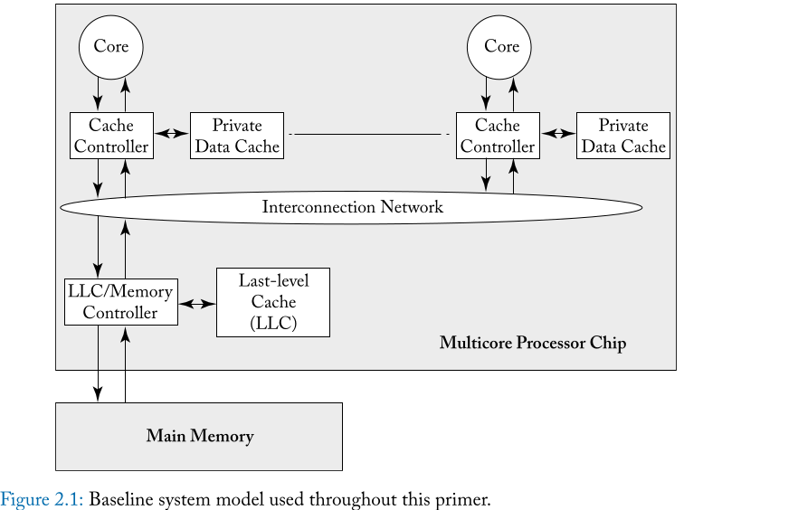
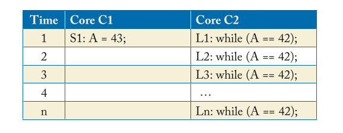

# CHAPTER 2 Coherence Basics

In this chapter, we introduce enough about cache coherence to understand how
consistency models interact with caches. We start in Section 2.1 by presenting
the system model that we consider throughout this primer. To simplify the
exposition in this chapter and the following chapters, we select the simplest
possible system model that is sufficient for illustrating the important issues;
we defer until Chapter 9 issues related to more complicated system models.
Section 2.2 explains the cache coherence problem that must be solved and how
the possibility of incoherence arises. Section 2.3 precisely defines cache
coherence.

> ```
> exposition:解释简化
> present: 介绍, 引见, 正式介绍
> throughout : 各个方面
> sufficient /səˈfɪʃnt/ : 充分的;足够的
> complicated : [ˈkɒmplɪkeɪtɪd] 复杂的; 难懂的;  
> ```
>
> 在本章中，我们将充分介绍cache coherence ，以了解 consistency models 如何与
> 缓存交互。我们从 2.1 节开始，介绍我们在本入门书中考虑的系统模型。为了简化
> 本章和后续章节的阐述，我们选择最简单的系统模型，足以说明重要问题.

## 2.1 BASELINE SYSTEM MODEL

In this primer, we consider systems with multiple processor cores that share
memory. That is, all cores can perform loads and stores to all (physical)
addresses. The baseline system model includes a single multicore processor chip
and off-chip main memory, as illustrated in Figure 2.1. The multicore processor
chip consists of multiple single-threaded cores, each of which has its own
private data cache, and a last-level cache (LLC) that is shared by all cores.
Throughout this primer, when we use the term “cache,” we are referring to a
core’s private data cache and not the LLC. Each core’s data cache is accessed
with physical addresses and is write-back. The cores and the LLC communicate
with each other over an interconnection network. The LLC, despite being on the
processor chip, is logically a “memory-side cache” and thus does not introduce
another level of coherence issues. The LLC is logically just in front of the
memory and serves to reduce the average latency of memory accesses and increase
the memory’s effective bandwidth. The LLC also serves as an on-chip memory
controller.

This baseline system model omits many features that are common but that are not
required for purposes of most of this primer. These features include
instruction caches, multiple-level caches, caches shared among multiple cores,
virtually addressed caches, TLBs, and coherent di- rect memory access (DMA).
The baseline system model also omits the possibility of multiple multicore
chips. We will discuss all of these features later, but for now, they would add
unnec- essary complexity.



## 2.2 THE PROBLEM: HOW INCOHERENCE COULD POSSIBLY OCCUR

The possibility of incoherence arises only because of one fundamental issue:
there exist multiple actors with access to caches and memory. In modern
systems, these actors are processor cores, DMA engines, and external devices
that can read and/or write to caches and memory. In the rest of this primer, we
generally focus on actors that are cores, but it is worth keeping in mind that
other actors may exist.

Table 2.1 illustrates a simple example of incoherence. Initially, memory
location A has the value 42 in memory as well as both of the cores’ local
caches. At time 1, Core 1 changes the value at memory location A from 42 to 43
in its cache, making Core 2’s value of A in its cache stale. Core 2 executes a
while loop loading, repeatedly, the (stale) value of A from its local cache.
Clearly, this is an example of incoherence as the store from Core 1 has not not
been made visible to Core 2 and consequently C2 is stuck in the while loop.

To prevent incoherence, the system must implement a cache coherence protocol
that makes the store from Core 1 visible to Core 2. The design and
implementation of these cache coherence protocols are the main topics of
Chapters 6–9.

Table 2.1: Example of incoherence. Assume the value of memory at memory
location A is ini- tially 42 and cached in the local caches of both cores.

cores


## 2.3 THE CACHE COHERENCE INTERFACE

Informally, a coherence protocol must ensure that writes are made visible to
all processors. In this section, we will more formally understand coherence
protocols through the abstract interfaces they expose.

The processor cores interact with the coherence protocol through a coherence
interface (Figure 2.2) that provides two methods: (1) a read-request method
that takes in a memory loca- tion as the parameter and returns a value; and (2)
a write-request method that takes in a memory location and a value (to be
written) as parameters and returns an acknowledgment.

There are many coherence protocols that have appeared in the literature and
been em- ployed in real processors. We classify these protocols into two
categories based on the nature of their coherence interfaces—specifically, based
on whether there is a clean separation of coher- ence from the consistency
model or whether they are indivisible.

Consistency-agnostic coherence. In the first category, a write is made visible
to all other cores before returning. Because writes are propagated
synchronously, the first category presents an interface that is identical to
that of an atomic memory system (with no caches). Thus, any sub- system that
interacts with the coherence protocol—e.g., the processor core pipeline—can as-
sume it is interacting with an atomic memory system with no caches present.
From a consis- tency enforcement perspective, this coherence interface enables
a nice separation of concerns. The cache coherence protocol abstracts away the
caches completely and presents an illusion of atomic memory—it is as if the
caches are removed and only the memory is contained within the coherence box
(Figure 2.2)—while the processor core pipeline enforces the orderings mandated
by the consistency model specification.

Consistency-directed coherence. In the second, more-recent category, writes are
propagated asynchronously—a write can thus return before it has been made
visible to all processors, thus allowing for stale values (in real time) to be
observed. However, in order to correctly enforce consistency, coherence
protocols in this class must ensure that the order in which writes are
eventually made visible adheres to the ordering rules mandated by the
consistency model. Re- ferring back to Figure 2.2, both the pipeline and the
coherence protocol enforce the orderings mandated by the consistency model.
This second category emerged to support throughput-based general-purpose
graphics processing units (GP-GPUs) and gained prominence after the publi-
cation of the first edition of this primer.1

The primer (and the rest of the chapter) focuses on the first class of coherence
protocols. We discuss the second class of coherence protocols in the context of
heterogeneous coherence (Chapter 10).

