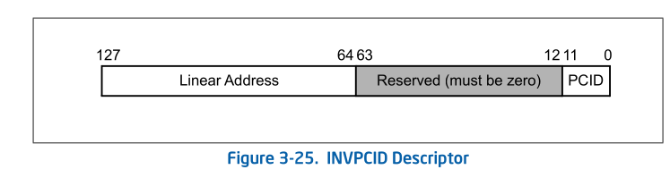

# CPU 功能简介
在intel sdm `4.10.1 process-context identifiers (PCID)`
章节中, 简要描述了PCID.

> NOTE
>
> translation caching information 既包括 TLB 也包括
> paging-structure cache, 我们在下面的讲述中 为了方便,
> 很多时候称 translation caching information 为 TLB

PCID用作CPU管理多个线性地址空间的 cache information.可以
允许CPU在switch到一个不同PCID的新的 线性地址空间时, 不丢弃
之前的 cache information 

> 我们知道切换线性地址空间是通过 switch CR3, 那么有了PCID功能后,
> 可以允许CPU在切换CR3时,不丢弃之前的缓存信息.

PCID是一个12-bit的标识符.所以最多有4096个. PCID 在 CR4.PCIDE = 0,
时, 当前PCID 只能为 0000H, 当 CR4.PCIDE != 0 时, 当前PCID才能为
非0值.

处理器保证只有在 IA-32e mode中 CR4.PCIDE 才能为1. 我们再来看下
在使能了PCID 的情况下, 无效缓存的一些行为:

* **MOV to CR3**.
  + CR4.PCIDE = 0, 该指令会无效所有的TLB entries 和paging structure cache
    (和PCID 000H 相关的, 但是上面也提到了在CR4.PCIDE=0 时, current PCID
    只能为000H) (除global pages_)
  + CR4.PCIDE = 1, 并且指令的源操作数bit 63 = 0, 该指令会无效所有和
    指令源操作中bit [11:0] 指定的PCID相关的 TLBs和 paging structure cache
    (除gobal pages)
  + CR4.PCIDE = 1, 并且指令源操作数 bit 63 = 1, 该指令不需要无效任何TLB entries
    或者 paging-structure caches.

   

  > NOTE
  >   
  >
  > 这里我们需要注意两点
  >
  > 1. 不需要无效TLB... 这个在手册的多个地方有提及, 意思是可能无效也可能不
  >    无效, 看CPU自己, 但是这个行为不会影响软件测的运行,软件在设计时候,也不能
  >    对此有依赖(例如, 在第三条的情况下, 软件错误的认为TLBs 肯定不会无效, 利用
  >    该想法再次和该TLB相关的线性地址, 认为其肯定会利用old TLB访问其page, 但是
  >    实际上是不一定的.)
  >
  > 2. 为什么switch CR3 过程中, 会无效源操作数 中的 PCID 字段相关的caching information ,
  >    而不是无效除了该PCID的. 原因在于当执行 `MOV to CR3`, 切换到一个新的线性地址空间
  >    中, 我们只能访问到该源操作数PCID 相关的 caching information, 除该PCID的caching 
  >    information 不会影响到我们. 而我们需要关心, 当我们switch 回来时, 这些caching
  >    information 是不是old的,需不需要无效

* **INVLPG** : 

  我们知道`INVLPG`指令可以指定一个线性地址, 无效该线性地址相关的TLB. 当 CR4.PCIDE = 1
  后, 该指令会无效和当前PCID相关的缓存信息. 但是也可能无效其他的PCID相关的缓存
* **INVPCID** :
  该指令比较复杂,有两个操作数: 

  op1: invpcid type, 在下面描述
  + Individual-address invalidation: If the INVPCID type is 0, the logical
    processor invalidates mappings—except global translations—for the linear
    address and PCID specified in the INVPCID descriptor. In some cases, the
    instruction may invalidate global translations or mappings for other linear
    addresses (or other PCIDs) as well.

    无效一个PCID 的一个线性地址
  + Single-context invalidation: If the INVPCID type is 1, the logical
    processor invalidates all mappings—except global translations—associated
    with the PCID specified in the INVPCID descriptor. In some cases, the
    instruction may invalidate global translations or mappings for other PCIDs
    as well.

    无效当前PCID
  + All-context invalidation, including global translations: If the INVPCID
    type is 2, the logical processor invalidates all mappings—including global
    translations—associated with any PCID.

    无效所有PCID(包括global translations)
  + All-context invalidation: If the INVPCID type is 3, the logical processor
    invalidates all mappings—except global translations—associated with any
    PCID. In some case, the instruction may invalidate global translations as
    well.

    无效所有PCID (除了global translations)

  op2 : invpcid descriptor(见下图)
  

# kernel 实现
Luto 在 [PCID and improved laziness](https://lore.kernel.org/all/cover.1498751203.git.luto@kernel.org/)
maillist中讨论引入 PCID, 可以看到该mail的标题为`PCID and improved laziness`, 
在PCID的同时还能提升TLB laziness, 所以我们接下来分为两部分:
* 如何优化 lazy TLB
* PCID 的功能实现

## improve laziness
我们先来回忆下 lazy TLB 的设计, 然后
再看看这组patch是如何提升其功能的.

lazy TLB 前面介绍过, 其目的是为了减少下面场景下, tlb shootdown的次数:
* A进程有两个线程 t1, t2分别运行在两个CPU上: c1, c2
* t1 切换到内核线程 k1
* t2 发出tlb shootdown (1)
* t2 再发出 tlb shootdown  (2)
* k1 -> t1

lazy TLB 的做法是在 t1 切换到内核线程 K1时, 记录当前cpu的 mm 以及 一个tlb
状态`TLBSTATE_LAZY`, 当收到 tlb shootdown 时(1), 标记tlb状态为`TLBSTATE_OLD`,
并且在 `mm->cpu_vm_mask`中清除该CPU 的bit, 这样在(2)发出时,不会在向c1发出
ipi 通知. 在k1->t1时, 在flush 一次 tlb

那么可以看到, CPU c1 最多收到一次 tlb shootdown 的ipi, 那么优化的话,只能
把仅有的一次优化没.

作者就是这么干的! 我们来看下相关代码.

### track how up-to-date tlb

在`improve laziness`的patch之前,我们先看下该作者是如何track tlb的最新程度的

作者在 `mm_context_t`中引入了两个成员
```diff
 typedef struct {
+       /*
+        * ctx_id uniquely identifies this mm_struct.  A ctx_id will never
+        * be reused, and zero is not a valid ctx_id.
+        */
+       u64 ctx_id;
+
+       /*
+        * Any code that needs to do any sort of TLB flushing for this
+        * mm will first make its changes to the page tables, then
+        * increment tlb_gen, then flush.  This lets the low-level
+        * flushing code keep track of what needs flushing.
+        *
+        * This is not used on Xen PV.
+        */
+       atomic64_t tlb_gen;
//mm_context_t
```

该数据位于 mm_struct(mm_struct.context)

* ctx_id: 用于唯一标识 mm_struct 
  > NOTE
  >
  > 为什么不用mm_struct 指针, 因为该地址可能被释放+申请, 不能唯一标识,
  > 我们下面会看下该值是如何初始化的
* tlb_gen: 在执行tlb flush 之前,会inc 该值

而 `[ctx_id, tlb_gen]` 的组合可以用来表示当前的线性地址空间的`"version"`,
如果需要更新`context.tlb_gen`, 就说明该进程的线性地址空间映射有所
改变,需要 `"bump version"`. 而线性地址空间映射关系可以存在于多个地方
* memory 中的 page table ("newest version") (先不想dcache)
* 每个CPU的tlb , 这个在某些情况下,(例如 tlb shootdown 还没有收到) 
  `"version"` 可能要低一些

我们来看下两者的init流程

定义一个atomic的全局变量, 记录最新的 `ctx_id`
```diff
+atomic64_t last_mm_ctx_id = ATOMIC64_INIT(1);
```

在 init context流程中会设置 `context.tlb_gen`以及`context.tlb_gen`
```diff
 static inline int init_new_context(struct task_struct *tsk,
                                   struct mm_struct *mm)
 {
+       mm->context.ctx_id = atomic64_inc_return(&last_mm_ctx_id);
+       atomic64_set(&mm->context.tlb_gen, 0);
+
        #ifdef CONFIG_X86_INTEL_MEMORY_PROTECTION_KEYS
        if (cpu_feature_enabled(X86_FEATURE_OSPKE)) {
                /* pkey 0 is the default and always allocated */
```
`context.ctx_id`由全局变量`last_mm_ctx_id`自增而来, 而`tlb_gen`
则设置为0, 表示该进程地址空间 TLB 的一个初始状态

`tlb_gen`会在刷新tlb的发起者的流程中更新.
```diff
+static inline u64 inc_mm_tlb_gen(struct mm_struct *mm)
+{
+       u64 new_tlb_gen;
+
+       /*
+        * Bump the generation count.  This also serves as a full barrier
+        * that synchronizes with switch_mm(): callers are required to order
+        * their read of mm_cpumask after their writes to the paging
+        * structures.
+        */
+       smp_mb__before_atomic();
+       new_tlb_gen = atomic64_inc_return(&mm->context.tlb_gen);
+       smp_mb__after_atomic();
+
+       return new_tlb_gen;
+}
+

 static inline void arch_tlbbatch_add_mm(struct arch_tlbflush_unmap_batch *batch,
                                        struct mm_struct *mm)
 {
+       inc_mm_tlb_gen(mm);
        cpumask_or(&batch->cpumask, &batch->cpumask, mm_cpumask(mm));
 }

 void leave_mm(int cpu)
 {
        struct mm_struct *loaded_mm = this_cpu_read(cpu_tlbstate.loaded_mm);
@@ -250,8 +252,8 @@ void flush_tlb_mm_range(struct mm_struct *mm, unsigned long start,

        cpu = get_cpu();

-       /* Synchronize with switch_mm. */
-       smp_mb();
+       /* This is also a barrier that synchronizes with switch_mm(). */
+       inc_mm_tlb_gen(mm);

        /* Should we flush just the requested range? */
        if ((end != TLB_FLUSH_ALL) &&
```

这个实际上就相当于更新了 memory 的 `"version"`

我们再来看下, 当前cpu 的 `"version"`

CPU的 `"version"`怎么在哪里定义的, 那当然是定义在`tlb_state`中的啦.
```diff
+struct tlb_context {
+   u64 ctx_id;
+   u64 tlb_gen;
+};
+
 struct tlb_state {
    /*
     * cpu_tlbstate.loaded_mm should match CR3 whenever interrupts
@@ -97,6 +102,21 @@ struct tlb_state {
     * disabling interrupts when modifying either one.
     */
    unsigned long cr4;
+
+   /*
+    * This is a list of all contexts that might exist in the TLB.
+    * Since we don't yet use PCID, there is only one context.
+    *
+    * For each context, ctx_id indicates which mm the TLB's user
+    * entries came from.  As an invariant, the TLB will never
+    * contain entries that are out-of-date as when that mm reached
+    * the tlb_gen in the list.
+    *
+    * To be clear, this means that it's legal for the TLB code to
+    * flush the TLB without updating tlb_gen.  This can happen
+    * (for now, at least) due to paravirt remote flushes.
+    */
+   struct tlb_context ctxs[1];
 };
 DECLARE_PER_CPU_SHARED_ALIGNED(struct tlb_state, cpu_tlbstate);
```

可以看到作者在这里设置了一个数组, 数组是1, 这是为之后引入PCID做准备,
这里数组大小为1, 是因为当前CPU中只有一个地址空间映射(tlb),所以只需要保存
一个`"version"` 即可, 而引入PCID后, 可能就会有多个地址空间映射了(多组TLB),
那么这时需要在扩充数组. 

> NOTE
>
> luto 这种方式引入代码, 真是厉害, 这样使得后人在看这些patch的时候,
> 更加清晰. 每个patch都有自己的功能, 不越界. YYDS

那CPU的 `"version"` 时候更新(同步)呢?

其实主要分为两个流程
* `flush_tlb_func_common`:  直接同步
* `switch_mm_irqs_off`: lazy 同步

在看该函数之前,我们首先看下该patch对于`struct flush_tlb_info`
的改动

```diff
 struct flush_tlb_info {
-   struct mm_struct *mm;
-   unsigned long start;
-   unsigned long end; /*
+    * We support several kinds of flushes.
+    *
+    * - Fully flush a single mm.  .mm will be set, .end will be
+    *   TLB_FLUSH_ALL, and .new_tlb_gen will be the tlb_gen to
+    *   which the IPI sender is trying to catch us up.
+    *
+    * - Partially flush a single mm.  .mm will be set, .start and
+    *   .end will indicate the range, and .new_tlb_gen will be set
+    *   such that the changes between generation .new_tlb_gen-1 and
+    *   .new_tlb_gen are entirely contained in the indicated range.
+    *
+    * - Fully flush all mms whose tlb_gens have been updated.  .mm
+    *   will be NULL, .end will be TLB_FLUSH_ALL, and .new_tlb_gen
+    *   will be zero.
+    */
+   struct mm_struct    *mm;
+   unsigned long       start;
+   unsigned long       end;
+   u64         new_tlb_gen;
 };
```
主要就引入了 `new_tlb_gen`, 该成员的意思是, 将 CPU的`"version"`(tlb_stte.ctxs[])
更新成`flush_tlb_info.new_tlb_gen`


代码流程我们先看`flush_tlb_func_common`.

### flush_tlb_func_common
#### PART 1
```diff
+/*
+ * flush_tlb_func_common()'s memory ordering requirement is that any
+ * TLB fills that happen after we flush the TLB are ordered after we
+ * read active_mm's tlb_gen.  We don't need any explicit barriers
+ * because all x86 flush operations are serializing and the
+ * atomic64_read operation won't be reordered by the compiler.
+ */
 static void flush_tlb_func_common(const struct flush_tlb_info *f,
                  bool local, enum tlb_flush_reason reason)
 {
     //================(1)===============
+   /*
+    * We have three different tlb_gen values in here.  They are:
+    *
+    * - mm_tlb_gen:     the latest generation.
+    * - local_tlb_gen:  the generation that this CPU has already caught
+    *                   up to.
+    * - f->new_tlb_gen: the generation that the requester of the flush
+    *                   wants us to catch up to.
+    */
+   struct mm_struct *loaded_mm = this_cpu_read(cpu_tlbstate.loaded_mm);
+   u64 mm_tlb_gen = atomic64_read(&loaded_mm->context.tlb_gen);
+   u64 local_tlb_gen = this_cpu_read(cpu_tlbstate.ctxs[0].tlb_gen);
+
    /* This code cannot presently handle being reentered. */
    VM_WARN_ON(!irqs_disabled());

+   VM_WARN_ON(this_cpu_read(cpu_tlbstate.ctxs[0].ctx_id) !=
+          loaded_mm->context.ctx_id);
+
    if (this_cpu_read(cpu_tlbstate.state) != TLBSTATE_OK) {
+       /*
+        * leave_mm() is adequate to handle any type of flush, and
+        * we would prefer not to receive further IPIs.  leave_mm()
+        * clears this CPU's bit in mm_cpumask().
+        */
        //================(2)===============
        //adequate /ˈædɪkwət/ : 足够的; 充分的
        leave_mm(smp_processor_id());
        return;
    }
```

1. 解释下其中的3个变量
   * mm_tlb_gen: 当前进程的 tlb "version"
   * local_tlb_gen: 当前 cpu  tlb "version"
   * f->new_tlb_gen : 发起者想要这个cpu更新到的 tlb "version"
2. 这里相当于更好的处理了 lazy tlb, 当收到 IPI时, 我们最好清楚掉该cpu
   的cpumask bit, 以便之后不会再次收到 flush tlb IPI.

#### PART 2
```diff
...

-   if (f->end == TLB_FLUSH_ALL) {
-       local_flush_tlb();
-       if (local)
-           count_vm_tlb_event(NR_TLB_LOCAL_FLUSH_ALL);
-       trace_tlb_flush(reason, TLB_FLUSH_ALL);
-   } else {
    //================(1)===================
+   if (unlikely(local_tlb_gen == mm_tlb_gen)) {
+       /*
+        * There's nothing to do: we're already up to date.  This can
+        * happen if two concurrent flushes happen -- the first flush to
+        * be handled can catch us all the way up, leaving no work for
+        * the second flush.
+        */
+       return;
+   }
+
+   WARN_ON_ONCE(local_tlb_gen > mm_tlb_gen);
+   WARN_ON_ONCE(f->new_tlb_gen > mm_tlb_gen);
+
    //================(2)===================
+   /*
+    * If we get to this point, we know that our TLB is out of date.
+    * This does not strictly imply that we need to flush (it's
+    * possible that f->new_tlb_gen <= local_tlb_gen), but we're
+    * going to need to flush in the very near future, so we might
+    * as well get it over with.
+    *
+    * The only question is whether to do a full or partial flush.
+    *
+    * We do a partial flush if requested and two extra conditions
+    * are met:
+    *
+    * 1. f->new_tlb_gen == local_tlb_gen + 1.  We have an invariant that
+    *    we've always done all needed flushes to catch up to
+    *    local_tlb_gen.  If, for example, local_tlb_gen == 2 and
+    *    f->new_tlb_gen == 3, then we know that the flush needed to bring
+    *    us up to date for tlb_gen 3 is the partial flush we're
+    *    processing.
+    *
+    *    As an example of why this check is needed, suppose that there
+    *    are two concurrent flushes.  The first is a full flush that
+    *    changes context.tlb_gen from 1 to 2.  The second is a partial
+    *    flush that changes context.tlb_gen from 2 to 3.  If they get
+    *    processed on this CPU in reverse order, we'll see
+    *     local_tlb_gen == 1, mm_tlb_gen == 3, and end != TLB_FLUSH_ALL.
+    *    If we were to use __flush_tlb_single() and set local_tlb_gen to
+    *    3, we'd be break the invariant: we'd update local_tlb_gen above
+    *    1 without the full flush that's needed for tlb_gen 2.
+    *
+    * 2. f->new_tlb_gen == mm_tlb_gen.  This is purely an optimiation.
+    *    Partial TLB flushes are not all that much cheaper than full TLB
+    *    flushes, so it seems unlikely that it would be a performance win
+    *    to do a partial flush if that won't bring our TLB fully up to
+    *    date.  By doing a full flush instead, we can increase
+    *    local_tlb_gen all the way to mm_tlb_gen and we can probably
+    *    avoid another flush in the very near future.
+    */
+   if (f->end != TLB_FLUSH_ALL &&
+       f->new_tlb_gen == local_tlb_gen + 1 &&
+       f->new_tlb_gen == mm_tlb_gen) {
+       /* Partial flush */
        unsigned long addr;
        unsigned long nr_pages = (f->end - f->start) >> PAGE_SHIFT;
+
        addr = f->start;
        while (addr < f->end) {
            __flush_tlb_single(addr);
@@ -182,7 +261,16 @@ static void flush_tlb_func_common(const struct flush_tlb_info *f,
        if (local)
            count_vm_tlb_events(NR_TLB_LOCAL_FLUSH_ONE, nr_pages);
        trace_tlb_flush(reason, nr_pages);
+   } else {
+       /* Full flush. */
+       local_flush_tlb();
+       if (local)
+           count_vm_tlb_event(NR_TLB_LOCAL_FLUSH_ALL);
+       trace_tlb_flush(reason, TLB_FLUSH_ALL);
    }
+
+   /* Both paths above update our state to mm_tlb_gen. */
    //================(3)===================
+   this_cpu_write(cpu_tlbstate.ctxs[0].tlb_gen, mm_tlb_gen);
 }
```
1. 这种情况之所以能发生,我们需要再后面的代码中解释(因为flush tlb 达到的tlb "version"
   可能不是 `f->new_tlb_gen`, 而是`mm_tlb_gen`, 假如触发了两次`flush_tlb_func_common`,
   第一次就已经达到了`mm_tlb_gen`, 那么第二次进入该func 就会进入该函数
2. 当执行到该部分代码的时候, 肯定是需要flush tlb 了, 注释中也提到了, 进入该func时, 
   可能会遇到 `f->new_tlb_gen <= local_tlb_gen`的情况. 这样的情况下,我们做完了这一
   次的flush, 紧接着又会去再做一次. 所以这里我们需要判断出我们需要怎样的刷新
   (full flush or partial flush), 我们先关注下(3)这个地方, 无论是上面走了 partial
   flush 还是 full flush, 我们都想在本次的flush 中,将 `local_tlb_gen`更新到`mm_tlb_gen`的版本,
   基于这个目的,我们就可以比较清晰的分析这块代码了.
   * `f->end == TLB_FLUSH_ALL` -> full flush: 本次flush要求的是full flush,那么无论还有
     没有flush的请求,本次的full flush 都达到目的(`local_tlb_gen`更新到 `mm_tlb_gen`的版本)
   * `f->new_tlb_gen != local_tlb_gen + 1` -> full flush: 说明还有下一次flush (这个下一次的
     flush 比本次flush 发起的时间要早) 如果本次做了partial flush, 之后还得再做一次, 不如
     直接做full flush(多次的partial flush 可能比一次full flush 还要降低性能)
   * `f->new_tlb_gen != mm_tlb_gen` -> full flush: 说明还有下一次flush(这个下一次的flush 比
     本次 flush 发起的时间要晚), full flush 的理由同上.
   * 其他情况 -> partial flush
 
通过上面可以看到,作者对于partial flush的要求很高.

#### PART 3
```diff
 static void flush_tlb_func_local(void *info, enum tlb_flush_reason reason)
@@ -253,7 +341,7 @@ void flush_tlb_mm_range(struct mm_struct *mm, unsigned long start,
    cpu = get_cpu();

    /* This is also a barrier that synchronizes with switch_mm(). */
-   inc_mm_tlb_gen(mm);
    //================(1)===================
+   info.new_tlb_gen = inc_mm_tlb_gen(mm);

    /* Should we flush just the requested range? */
    if ((end != TLB_FLUSH_ALL) &&
--
```
1. 由于在`flush_tlb_info`中引入了 "tlb version", 那么我们需要在发起的时候, 将`info.new_tlb_gen`,
   和`mm_tlb_gen` bump version
   > NOTE
   >
   > 那有些小伙伴可能会想到`flush_tlb_func_common`的那个unlikely()判断, 注意那个判断
   > 是比较的 `local_tlb_gen` 和 `mm_tlb_gen`, 也就是 cpu 的 tlb version 和 当前进程的
   > tlb version. 此时, cpu的 tlb version 还未更新, 需要调用`flush_tlb_func_common`更新,
   > 所以这里做的没有什么问题

接下来我们看下如何在`switch_mm_irqs_off`中lazy flush

### LAZY FLUSH 
#### COMMIT MESSAGE

首先说明, 这个patch是上面`flush_tlb_func_common`patch的下一个patch, 会在上面patch基础上
有做一些改动,我们综合看下

> patch为:
>
> 94b1b03b519b81c494900cb112aa00ed205cc2d9 <br/>
> x86/mm: Rework lazy TLB mode and TLB freshness tracking

在看patch之前我们首先看下patch中的commit message:
```
x86's lazy TLB mode used to be fairly weak -- it would switch to
init_mm the first time it tried to flush a lazy TLB.  This meant an
unnecessary CR3 write and, if the flush was remote, an unnecessary
IPI.

used to be: 过去是
fairly : 相当的, 完全的,简直; 公平地

x86的 lazy tlb mode 过去是弱爆了 -- 他在第一次尝试去 flush lazy TLB
时, 去swith 到 init_mm. 这意味着 这是一个不必要的 CR3 write, 并且,
对于该flush 是一个remote 的话, 也是一个没有必要的 IPI

Rewrite it entirely.  When we enter lazy mode, we simply remove the
CPU from mm_cpumask.  This means that we need a way to figure out
whether we've missed a flush when we switch back out of lazy mode.
I use the tlb_gen machinery to track whether a context is up to
date.

up to date: 最新的;现代的; 新式的; 时髦的

完全的重写这部分. 当我们 enter lazy mode, 我们简单的将该CPU  从 
mm_cpumask中移除. 这意味着我们需要一种方式指出, 当我们从lazy mode
中返回, 我们是否missed 了一个 flush. 我使用了 tlb_gen 机制 来跟踪
context是否是最新的

Note to reviewers: this patch, my itself, looks a bit odd.  I'm
using an array of length 1 containing (ctx_id, tlb_gen) rather than
just storing tlb_gen, and making it at array isn't necessary yet.
I'm doing this because the next few patches add PCID support, and,
with PCID, we need ctx_id, and the array will end up with a length
greater than 1.  Making it an array now means that there will be
less churn and therefore less stress on your eyeballs.

churn:  剧烈搅动; 反胃，恶心;猛烈翻腾; 
stress: 压力

reviewers, 请注意: 这个patch, 在我自己看来都有点奇怪. 我使用的是
长度为1 的数组, 数组成员包括(ctx_id, tlb_gen), 而不是仅仅储存tlb_gen,
并且还没有必要将其设置为数组. 我做这些是因为下面的几个支持 PCID的patch,
并且在支持PCID情况下,我们需要ctx_id, 并且这个数组将被设置大于1. 现在把它
做成一个数组意味着代码将会有更小的改动，因此视觉上的压力也会更小。

> NOTE
> 个人再看这部分代码的时候, 只感觉这样写逻辑更清晰, 每一个patch都有
> 自己独立的目的. very nice
```

* 第一段的意思是, 在第一次收到 lazy tlb flush时, 会去切换到init_mm,
  luto认为是没有必要的(我也是这么认为), 当时合入patch的作者(Linus),
  在
  > 99ef44b79de47f23869897c11493521a1e42b2d2<br/>
  > Clean up %cr3 loading on x86, fix lazy TLB problem

  引入, 实话说, 我也没看懂是为了啥, 个人猜测是为了防止`speculative 
  execution`而访问到线性地址空间的freed porttion ? 我在`lazy tlb`笔记
  中有讨论. 但是这里luto感觉没啥用,很浪费
* 第二, 三段没什么要说的, 请看注释

> NOTE
>
> 这里需要大家提前思考下, lazy TLB 和 PCID 之前有什么关系么, 作者为什么
> 要在这组patch中引入 improve lazy TLB的patch ?
>
> 其实有关系, lazy TLB 是延后刷新TLB, 而PCID 也意味着,当一个线程在运行时,
> 其CPU中还有其他线程的TLB, 所以可能会收到其他CPU 发起的对另一个线程的
> TLB flush, 这时要不要考虑lazy flush. 而作者将其纳入到统一的机制中: 
> 
> 要. 并且检测要不要刷新的机制是一样的, 就是对比 当前cpu的[ctx_id, tlb_gen],
> 和 需要load的 mm_struct中的[ctx_id, tlb_gen]是否一致.

下面, 我们详细看下代码

#### tlb_state 改动
```diff
diff --git a/arch/x86/include/asm/tlbflush.h b/arch/x86/include/asm/tlbflush.h
index d7df54cc7e4d..06e997a36d49 100644
--- a/arch/x86/include/asm/tlbflush.h
+++ b/arch/x86/include/asm/tlbflush.h
@@ -95,7 +95,6 @@ struct tlb_state {
     * mode even if we've already switched back to swapper_pg_dir.
     */
    struct mm_struct *loaded_mm;
-   int state;

    /*
     * Access to this CR4 shadow and to H/W CR4 is protected by
@@ -310,9 +309,6 @@ static inline void flush_tlb_page(struct vm_area_struct *vma, unsigned long a)
 void native_flush_tlb_others(const struct cpumask *cpumask,
                 const struct flush_tlb_info *info);

-#define TLBSTATE_OK    1
-#define TLBSTATE_LAZY  2
-
 static inline void arch_tlbbatch_add_mm(struct arch_tlbflush_unmap_batch *batch,
                    struct mm_struct *mm)
 {
```
删除 `tlb_state.state`, 因为现在不再需要通过该字段跟踪CPU的tlb 状态


#### switch_mm_irqs_off
##### PART1
```diff
 void switch_mm_irqs_off(struct mm_struct *prev, struct mm_struct *next,
            struct task_struct *tsk)
 {
-   unsigned cpu = smp_processor_id();
    struct mm_struct *real_prev = this_cpu_read(cpu_tlbstate.loaded_mm);
+   unsigned cpu = smp_processor_id();
+   u64 next_tlb_gen;

    /*
-    * NB: The scheduler will call us with prev == next when
-    * switching from lazy TLB mode to normal mode if active_mm
-    * isn't changing.  When this happens, there is no guarantee
-    * that CR3 (and hence cpu_tlbstate.loaded_mm) matches next.
+    * NB: The scheduler will call us with prev == next when switching
+    * from lazy TLB mode to normal mode if active_mm isn't changing.
+    * When this happens, we don't assume that CR3 (and hence
+    * cpu_tlbstate.loaded_mm) matches next.
     *
     * NB: leave_mm() calls us with prev == NULL and tsk == NULL.
     */

-   this_cpu_write(cpu_tlbstate.state, TLBSTATE_OK);
+   /* We don't want flush_tlb_func_* to run concurrently with us. */
+   if (IS_ENABLED(CONFIG_PROVE_LOCKING))
+       WARN_ON_ONCE(!irqs_disabled());
+
+   /*
+    * Verify that CR3 is what we think it is.  This will catch
+    * hypothetical buggy code that directly switches to swapper_pg_dir
+    * without going through leave_mm() / switch_mm_irqs_off().
+    */
+   VM_BUG_ON(read_cr3_pa() != __pa(real_prev->pgd));

    //=====================(1)=====================
    if (real_prev == next) {
-       /*
-        * There's nothing to do: we always keep the per-mm control
-        * regs in sync with cpu_tlbstate.loaded_mm.  Just
-        * sanity-check mm_cpumask.
-        */
-       if (WARN_ON_ONCE(!cpumask_test_cpu(cpu, mm_cpumask(next))))
-           cpumask_set_cpu(cpu, mm_cpumask(next));
-       return;
-   }
+       VM_BUG_ON(this_cpu_read(cpu_tlbstate.ctxs[0].ctx_id) !=
+             next->context.ctx_id);
+
        //=====================(2)=====================
+       if (cpumask_test_cpu(cpu, mm_cpumask(next))) {
+           /*
+            * There's nothing to do: we weren't lazy, and we
+            * aren't changing our mm.  We don't need to flush
+            * anything, nor do we need to update CR3, CR4, or
+            * LDTR.
+            */
+           return;
+       }
+
+       /* Resume remote flushes and then read tlb_gen. */
+       cpumask_set_cpu(cpu, mm_cpumask(next));
+       next_tlb_gen = atomic64_read(&next->context.tlb_gen);
+
        //=====================(3)=====================
+       if (this_cpu_read(cpu_tlbstate.ctxs[0].tlb_gen) < next_tlb_gen) {
+           /*
+            * Ideally, we'd have a flush_tlb() variant that
+            * takes the known CR3 value as input.  This would
+            * be faster on Xen PV and on hypothetical CPUs
+            * on which INVPCID is fast.
+            */
+           this_cpu_write(cpu_tlbstate.ctxs[0].tlb_gen,
+                      next_tlb_gen);
            //=====================(4)=====================
+           write_cr3(__pa(next->pgd));
+
+           /*
+            * This gets called via leave_mm() in the idle path
+            * where RCU functions differently.  Tracing normally
+            * uses RCU, so we have to call the tracepoint
+            * specially here.
+            */
+           trace_tlb_flush_rcuidle(TLB_FLUSH_ON_TASK_SWITCH,
+                       TLB_FLUSH_ALL);
+       }

if (IS_ENABLED(CONFIG_VMAP_STACK)) {
        /*
-        * If our current stack is in vmalloc space and isn't
-        * mapped in the new pgd, we'll double-fault.  Forcibly
-        * map it.
+        * We just exited lazy mode, which means that CR4 and/or LDTR
+        * may be stale.  (Changes to the required CR4 and LDTR states
+        * are not reflected in tlb_gen.)
         */
-       unsigned int stack_pgd_index = pgd_index(current_stack_pointer());
-
-       pgd_t *pgd = next->pgd + stack_pgd_index;
-
-       if (unlikely(pgd_none(*pgd)))
-           set_pgd(pgd, init_mm.pgd[stack_pgd_index]);
-   }
-
```
1. 我们先分析`real_prev == next` (out lazy mode) 的代码
2. 这里说明我们不在 lazy mode 中,不需要做任何事情(什么情况下会发生呢)
3. 判断是否 missed 了tlb flush , 如果条件满足,则是
4. 这里我们做一个full flush
   > NOTE
   >
   > 这里为什么没有partial flush的分支, 因为作者的数据结构中只能记录是否miss了
   > tlb flush request, 没有记录flush info , 所以这里只能做full flush, 不知道
   > 后续的patch有没有对这块有优化 !!!!!!

##### PART2
```diff
    //=====================(1)=====================
+   } else {
+       VM_BUG_ON(this_cpu_read(cpu_tlbstate.ctxs[0].ctx_id) ==
+             next->context.ctx_id);
+
+       if (IS_ENABLED(CONFIG_VMAP_STACK)) {
+           /*
+            * If our current stack is in vmalloc space and isn't
+            * mapped in the new pgd, we'll double-fault.  Forcibly
+            * map it.
+            */
+           unsigned int index = pgd_index(current_stack_pointer());
+           pgd_t *pgd = next->pgd + index;
+
+           if (unlikely(pgd_none(*pgd)))
+               set_pgd(pgd, init_mm.pgd[index]);
+       }

-   this_cpu_write(cpu_tlbstate.loaded_mm, next);
-   this_cpu_write(cpu_tlbstate.ctxs[0].ctx_id, next->context.ctx_id);
-   this_cpu_write(cpu_tlbstate.ctxs[0].tlb_gen, atomic64_read(&next->context.tlb_gen));
        //=====================(2)=====================
+       /* Stop remote flushes for the previous mm */
+       if (cpumask_test_cpu(cpu, mm_cpumask(real_prev)))
+           cpumask_clear_cpu(cpu, mm_cpumask(real_prev));

-   WARN_ON_ONCE(cpumask_test_cpu(cpu, mm_cpumask(next)));
-   cpumask_set_cpu(cpu, mm_cpumask(next));
+       VM_WARN_ON_ONCE(cpumask_test_cpu(cpu, mm_cpumask(next)));

-   /*
-    * Re-load page tables.
-    *
-    * This logic has an ordering constraint:
-    *
-    *  CPU 0: Write to a PTE for 'next'
-    *  CPU 0: load bit 1 in mm_cpumask.  if nonzero, send IPI.
-    *  CPU 1: set bit 1 in next's mm_cpumask
-    *  CPU 1: load from the PTE that CPU 0 writes (implicit)
-    *
-    * We need to prevent an outcome in which CPU 1 observes
-    * the new PTE value and CPU 0 observes bit 1 clear in
-    * mm_cpumask.  (If that occurs, then the IPI will never
-    * be sent, and CPU 0's TLB will contain a stale entry.)
-    *
-    * The bad outcome can occur if either CPU's load is
-    * reordered before that CPU's store, so both CPUs must
-    * execute full barriers to prevent this from happening.
-    *
-    * Thus, switch_mm needs a full barrier between the
-    * store to mm_cpumask and any operation that could load
-    * from next->pgd.  TLB fills are special and can happen
-    * due to instruction fetches or for no reason at all,
-    * and neither LOCK nor MFENCE orders them.
-    * Fortunately, load_cr3() is serializing and gives the
-    * ordering guarantee we need.
-    */
-   load_cr3(next->pgd);
+       /*
+        * Start remote flushes and then read tlb_gen.
+        */
        //=====================(3)=====================
+       cpumask_set_cpu(cpu, mm_cpumask(next));
+       next_tlb_gen = atomic64_read(&next->context.tlb_gen);

-   /*
-    * This gets called via leave_mm() in the idle path where RCU
-    * functions differently.  Tracing normally uses RCU, so we have to
-    * call the tracepoint specially here.
-    */
-   trace_tlb_flush_rcuidle(TLB_FLUSH_ON_TASK_SWITCH, TLB_FLUSH_ALL);
        //=====================(4)=====================
+       this_cpu_write(cpu_tlbstate.ctxs[0].ctx_id, next->context.ctx_id);
+       this_cpu_write(cpu_tlbstate.ctxs[0].tlb_gen, next_tlb_gen);
+       this_cpu_write(cpu_tlbstate.loaded_mm, next);
        //=====================(5)=====================
+       write_cr3(__pa(next->pgd));

-   /* Stop flush ipis for the previous mm */
-   WARN_ON_ONCE(!cpumask_test_cpu(cpu, mm_cpumask(real_prev)) &&
-            real_prev != &init_mm);
-   cpumask_clear_cpu(cpu, mm_cpumask(real_prev));
+       /*
+        * This gets called via leave_mm() in the idle path where RCU
+        * functions differently.  Tracing normally uses RCU, so we
+        * have to call the tracepoint specially here.
+        */
+       trace_tlb_flush_rcuidle(TLB_FLUSH_ON_TASK_SWITCH,
+                   TLB_FLUSH_ALL);
+   }
-   /* Load per-mm CR4 and LDTR state */
    load_mm_cr4(next);
    switch_ldt(real_prev, next);
 }
```
1. 该分支为`real_prev != next`, 意味着要切换mm, 这个patch还未引入pcid, 切换mm
   就是要flush all tlb
2. 清除 read_prev 关于该cpu的 mm_cpumask
3. 设置 next 关于该cpu的 mm_cpumask
4. 更新 cpu_tlbstate  ctx_id 和 tlb_gen, loaded_mm, 设置为 next_mm的
5. 更新 CR3

关于 `switch_mm_irqs_off()`的改动, 就介绍道这, 我们来看下其他函数的改动
#### other function change
* enter_lazy_tlb
  ```diff
   static inline void enter_lazy_tlb(struct mm_struct *mm, struct task_struct *tsk)
   {
  -   if (this_cpu_read(cpu_tlbstate.state) == TLBSTATE_OK)
  -       this_cpu_write(cpu_tlbstate.state, TLBSTATE_LAZY);
  +   int cpu = smp_processor_id();
  +
  +   if (cpumask_test_cpu(cpu, mm_cpumask(mm)))
  +       cpumask_clear_cpu(cpu, mm_cpumask(mm));
   }
  ```
  删除关于`cpu_tlbstate.state`的逻辑, 改为直接clear 该cpu的mm_cpumask,
  经过这样的改动, 如果进入了 lazy mode, 将不再接受 flush tlb ipi
* leave_mm
  ```diff
  diff --git a/arch/x86/mm/tlb.c b/arch/x86/mm/tlb.c
  index 4e5a5ddb9e4d..0982c997d36f 100644
  --- a/arch/x86/mm/tlb.c
  +++ b/arch/x86/mm/tlb.c
  @@ -45,8 +45,8 @@ void leave_mm(int cpu)
      if (loaded_mm == &init_mm)
          return;
 
  -   if (this_cpu_read(cpu_tlbstate.state) == TLBSTATE_OK)
  -       BUG();
  +   /* Warn if we're not lazy. */
  +   WARN_ON(cpumask_test_cpu(smp_processor_id(), mm_cpumask(loaded_mm)));

      switch_mm(NULL, &init_mm, NULL);
   }
  ```
  删除关于`cpu_tlbstate.state`的代码, 增加判断`mm_cpumask`, 从`enter_lazy_tlb`的代码得知,
  如果进入了 lazy mode, 则清空该cpu的 `mm_cpumask`
* flush_tlb_func_common
  ```diff
  @@ -186,13 +209,13 @@ static void flush_tlb_func_common(const struct flush_tlb_info *f,
      VM_WARN_ON(this_cpu_read(cpu_tlbstate.ctxs[0].ctx_id) !=
             loaded_mm->context.ctx_id);
  
  -   if (this_cpu_read(cpu_tlbstate.state) != TLBSTATE_OK) {
      //=====================(1)=====================
  +   if (!cpumask_test_cpu(smp_processor_id(), mm_cpumask(loaded_mm))) {
          /*
  -        * leave_mm() is adequate to handle any type of flush, and
  -        * we would prefer not to receive further IPIs.  leave_mm()
  -        * clears this CPU's bit in mm_cpumask().
  +        * We're in lazy mode -- don't flush.  We can get here on
  +        * remote flushes due to races and on local flushes if a
  +        * kernel thread coincidentally flushes the mm it's lazily
  +        * still using.
           */
          //=====================(2)=====================
  -       leave_mm(smp_processor_id());
          return;
      }
  
  @@ -203,6 +226,7 @@ static void flush_tlb_func_common(const struct flush_tlb_info *f,
           * be handled can catch us all the way up, leaving no work for
           * the second flush.
           */
  +       trace_tlb_flush(reason, 0);
          return;
      }
   @@ -371,8 +411,6 @@ static void do_flush_tlb_all(void *info)
    {
       count_vm_tlb_event(NR_TLB_REMOTE_FLUSH_RECEIVED);
       __flush_tlb_all();
       //=====================(3)=====================
   -   if (this_cpu_read(cpu_tlbstate.state) == TLBSTATE_LAZY)
   -       leave_mm(smp_processor_id());
    }


  ```
  1. luto这边想的是,如果进入了 lazy mode, 则不需要flush tlb, 所以这里更改了一下判断
  2. 如果进入了 lazy mode, luto认为 `switch_mm()`到`init_mm`是没有必要的,所以这里也不需要
     切换了直接返回
  3. 同上
* xen 相关
  ```diff
  @@ -1005,14 +1005,12 @@ static void xen_drop_mm_ref(struct mm_struct *mm)
      /* Get the "official" set of cpus referring to our pagetable. */
      if (!alloc_cpumask_var(&mask, GFP_ATOMIC)) {
          for_each_online_cpu(cpu) {
  -           if (!cpumask_test_cpu(cpu, mm_cpumask(mm))
  -               && per_cpu(xen_current_cr3, cpu) != __pa(mm->pgd))
  +           if (per_cpu(xen_current_cr3, cpu) != __pa(mm->pgd))
                  continue;
              smp_call_function_single(cpu, drop_mm_ref_this_cpu, mm, 1);
          }
          return;
      }
  -   cpumask_copy(mask, mm_cpumask(mm));
  
      /*
       * It's possible that a vcpu may have a stale reference to our
  @@ -1021,6 +1019,7 @@ static void xen_drop_mm_ref(struct mm_struct *mm)
       * look at its actual current cr3 value, and force it to flush
       * if needed.
       */
  +   cpumask_clear(mask);
      for_each_online_cpu(cpu) {
          if (per_cpu(xen_current_cr3, cpu) == __pa(mm->pgd))
              cpumask_set_cpu(cpu, mask);
  ```
  > 这部分不了解,先记录在这里

关于 improve laziness的代码就介绍到这里, 下面我们看 PCID 的引入

## PCID
首先我们来看下关于PCID的功能检测和相关控制

### MUST DISABLE even if CPU have this features
CPU可能报告有PCID功能, 但是在下面两种情况下,还是需要关闭该功能,
这两种情况分别是,硬件/软件 的限制.

* 硬件: 32-bits kernel不能使用 PCID
* 软件: kernel command line can disable this feature

我们分别来看下

#### Disable PCID on 36-bit kernel
我们首先看下 COMMIT MESSAGE
```
32-bit kernels on new hardware will see PCID in CPUID, but PCID can
only be used in 64-bit mode.  Rather than making all PCID code
conditional, just disable the feature on 32-bit builds.
```
如果kernel是按照32-bit变异的,但是运行在了支持PCID的CPU上, CPUID会报告
该feature, 但是intel sdm中有提到, 处理器只有在IA-32e mode中才能将 
CR4.PCIDE != 0(也就是使用PCID的功能), 所以这里我们需要在该情况下屏蔽
掉该功能.
```diff

 void __init check_bugs(void)
 {
+#ifdef CONFIG_X86_32
+       /*
+        * Regardless of whether PCID is enumerated, the SDM says
+        * that it can't be enabled in 32-bit mode.
+        */
+       setup_clear_cpu_cap(X86_FEATURE_PCID);
+#endif
+
        identify_boot_cpu();

        if (!IS_ENABLED(CONFIG_SMP)) {
```
#### BOOT OPTION 'nopcid'
通过 kernel cmdline 可以通过指定`nopcid`关闭该feature
```diff
+#ifdef CONFIG_X86_64
+static int __init x86_pcid_setup(char *s)
+{
+       /* require an exact match without trailing characters */
+       if (strlen(s))
+               return 0;
+
+       /* do not emit a message if the feature is not present */
+       if (!boot_cpu_has(X86_FEATURE_PCID))
+               return 1;
+
+       setup_clear_cpu_cap(X86_FEATURE_PCID);
+       pr_info("nopcid: PCID feature disabled\n");
+       return 1;
+}
+__setup("nopcid", x86_pcid_setup);
+#endif
```

接下来,我们看下如何使能 该功能.

### enable CR4.PCIDE on supported systems
通过前面的介绍我们知道, 通过设置`CR4.PCIDE`可以让current PCID is not always
equal 000H. 来看下相关代码
```diff
@@ -243,6 +243,14 @@ static inline void __flush_tlb_all(void)
        if (boot_cpu_has(X86_FEATURE_PGE))
                __flush_tlb_global();
        else
                __flush_tlb();
+
        //============(1)=================
+       /*
+        * Note: if we somehow had PCID but not PGE, then this wouldn't work --
+        * we'd end up flushing kernel translations for the current ASID but
+        * we might fail to flush kernel translations for other cached ASIDs.
+        *
+        * To avoid this issue, we force PCID off if PGE is off.
+        */
 }

+static void setup_pcid(struct cpuinfo_x86 *c)
+{
+       if (cpu_has(c, X86_FEATURE_PCID)) {
                //============(1)=================
+               if (cpu_has(c, X86_FEATURE_PGE)) {
+                       cr4_set_bits(X86_CR4_PCIDE);
+               } else {
+                       /*
+                        * flush_tlb_all(), as currently implemented, won't
+                        * work if PCID is on but PGE is not.  Since that
+                        * combination doesn't exist on real hardware, there's
+                        * no reason to try to fully support it, but it's
+                        * polite to avoid corrupting data if we're on
+                        * an improperly configured VM.
+                        */
+                       clear_cpu_cap(c, X86_FEATURE_PCID);
+               }
+       }
+}
+
 /*
  * Protection Keys are not available in 32-bit mode.
  */
@@ -1143,6 +1162,9 @@ static void identify_cpu(struct cpuinfo_x86 *c)
        setup_smep(c);
        setup_smap(c);

+       /* Set up PCID */
+       setup_pcid(c);
+
        /*
         * The vendor-specific functions might have changed features.
         * Now we do "generic changes."
```
这里作者提到了, PCID 功能 只有CPU 有PGE的功能才能使能, 这是为什么呢? 

是因为 flush_tlb_all() 这个函数在引入 PCID 后, 依赖 CPU 的 global page,
我们思考下, 如果没有global pages功能, 则进入`__flush_tlb()`该函数会通过
`mov to CR3`的方式, invalidate tlb, 在没有`PCID`功能时, 没有什么问题,
因为该 cpu tlb 中只有一个 ctx (也就是一个线性地址空间), 把当前ctx 无效
就相当于无效整个CPU的了, 但是在使能了PCID之后, CPU有多个 tlb ctx, 需要把
这些全部invalidate. 这其实也不难做到, 但是这里作者认为, 在真实的硬件中,
只要是有PCID的cpu feature, 那肯定是会有 PGE cpu feature, 所以在这里只是做了
个简单判断, 增加代码的严谨性, 但实际上不会走到.(虚拟机是不是有可能 ??)

> NOTE
>
> 关于global page 的使用,我们在这里不展开, 会整理在其他的笔记中.

在当前的patch中还未支持xen
```diff
@@ -295,6 +295,12 @@ static void __init xen_init_capabilities(void)
        setup_clear_cpu_cap(X86_FEATURE_ACC);
        setup_clear_cpu_cap(X86_FEATURE_X2APIC);

+       /*
+        * Xen PV would need some work to support PCID: CR3 handling as well
+        * as xen_flush_tlb_others() would need updating.
+        */
+       setup_clear_cpu_cap(X86_FEATURE_PCID);
+
        if (!xen_initial_domain())
                setup_clear_cpu_cap(X86_FEATURE_ACPI);
```
### preserve old TLB entries using PCID
老样子,我们还是先看下COMMIT MESSAGE

#### COMMIT MESSAGE
```
PCID is a "process context ID" -- it's what other architectures call
an address space ID.  Every non-global TLB entry is tagged with a
PCID, only TLB entries that match the currently selected PCID are
used, and we can switch PGDs without flushing the TLB.  x86's
PCID is 12 bits.

PCID 是 'process context ID' -- 这是其他架构所说的 an address space ID
(ASID). 每一个 non-global TLB entry 都会tag 一个 PCID, 只有和current PCID
匹配的 TLB entries 才会被使用. 并且我们可以在 不去flush TLB的情况下 switch
PGDs. x86's 的 PCID 是 12 bits

This is an unorthodox approach to using PCID.  x86's PCID is far too
short to uniquely identify a process, and we can't even really
uniquely identify a running process because there are monster
systems with over 4096 CPUs.  To make matters worse, past attempts
to use all 12 PCID bits have resulted in slowdowns instead of
speedups.

unorthodox : 非正统的
monster: 怪物
to make matters worse: 更糟糕的是

这是一种使用 PCID非正统的方法. x86 的 PCID 对于独立的标识一个进程来说实
在是太太太小了, 并且我们甚至不能独立的 表示一个正在运行的进程, 因为有一些
特别牛 * 的系统拥有超过 4096 CPUs. 更糟糕的是, 过去尝试使用过12 PCID bits ,
带来的不是speedups, 而是slowdown

This patch uses PCID differently.  We use a PCID to identify a
recently-used mm on a per-cpu basis.  An mm has no fixed PCID
binding at all; instead, we give it a fresh PCID each time it's
loaded except in cases where we want to preserve the TLB, in which
case we reuse a recent value.

preserve : 保留,保存

该patch 用一种别的方式使用PCID. 我们使用PCID去表示一个 per-cpus基础上
的 recently-used mm. 一个mm 根本没有固定的CPID 绑定;相反的,在每次load时,
我们都会给他一个新的 PCID, 除非是我们希望保留TLBs的情况下,这这种情况下,
我们会重新使用最近的值.

Here are some benchmark results, done on a Skylake laptop at 2.3 GHz
(turbo off, intel_pstate requesting max performance) under KVM with
the guest using idle=poll (to avoid artifacts when bouncing between
CPUs).  I haven't done any real statistics here -- I just ran them
in a loop and picked the fastest results that didn't look like
outliers.  Unpatched means commit a4eb8b993554, so all the
bookkeeping overhead is gone.

这里有一些 benchmark 的结果. 在 使用 idle=poll的KVM中测试的.我这里没有做
任何真正的统计 -- 我只是做了统计在一个循环中，并选择看起来不像异常值的最
快结果。

ping-pong between two mms on the same CPU using eventfd:

  patched:         1.22µs
  patched, nopcid: 1.33µs
  unpatched:       1.34µs

Same ping-pong, but now touch 512 pages (all zero-page to minimize
cache misses) each iteration.  dTLB misses are measured by
dtlb_load_misses.miss_causes_a_walk:

  patched:         1.8µs  11M  dTLB misses
  patched, nopcid: 6.2µs, 207M dTLB misses
  unpatched:       6.1µs, 190M dTLB misses
```

这里的意思是, 其他架构的ASID都是用来identry a unique process. 但是
x86只有4096个不够, 这里作者将PCID定义为 per-cpu 基础上的一个 recently-used
mm, 并且提到,如果使用过多pcid的值,可能会造成性能降低(这个不是很理解,为什么
能性能降低)

我们接下来看下,具体代码实现
#### 数据结构变动
```diff
+/*
+ * 6 because 6 should be plenty and struct tlb_state will fit in
+ * two cache lines.
+ */
//===============(1)================
+#define TLB_NR_DYN_ASIDS 6
+
 struct tlb_context {
    u64 ctx_id;
    u64 tlb_gen;
@@ -95,6 +101,8 @@ struct tlb_state {
     * mode even if we've already switched back to swapper_pg_dir.
     */
    struct mm_struct *loaded_mm;
    //===============(2)================
+   u16 loaded_mm_asid;
+   u16 next_asid;

    /*
     * Access to this CR4 shadow and to H/W CR4 is protected by
@@ -104,7 +112,8 @@ struct tlb_state {

    /*
     * This is a list of all contexts that might exist in the TLB.
-    * Since we don't yet use PCID, there is only one context.
+    * There is one per ASID that we use, and the ASID (what the
+    * CPU calls PCID) is the index into ctxts.
     *
     * For each context, ctx_id indicates which mm the TLB's user
     * entries came from.  As an invariant, the TLB will never
@@ -114,8 +123,13 @@ struct tlb_state {
     * To be clear, this means that it's legal for the TLB code to
     * flush the TLB without updating tlb_gen.  This can happen
     * (for now, at least) due to paravirt remote flushes.
+    *
    //===============(1)================
+    * NB: context 0 is a bit special, since it's also used by
+    * various bits of init code.  This is fine -- code that
+    * isn't aware of PCID will end up harmlessly flushing
+    * context 0.
     */
-   struct tlb_context ctxs[1];
    //===============(1)================
+   struct tlb_context ctxs[TLB_NR_DYN_ASIDS];
 };
```
1. 定义了数组的最大值, 大小为6, 作者的意思是, 一方便6个足够用,另一方面
   正好可以将`struct tlb_state`放在两个cmdline中
2. 新增了两个数据结构成员
   * loaded_mm_asid: 当前正在load 的asid ,也就是current PCID
   * next_asid: 下一个分配的 asid (但是需要注意的是, 这里不是指向
     的oldest asid (下面我们会结合patch具体分析)
3. 未能理解对方注释!!!!

我们再来看下 `switch_mm_irqs_off`改动

#### switch_mm_irqs_off
```diff
 void leave_mm(int cpu)
 {
    struct mm_struct *loaded_mm = this_cpu_read(cpu_tlbstate.loaded_mm);
@@ -65,6 +99,7 @@ void switch_mm_irqs_off(struct mm_struct *prev, struct mm_struct *next,
            struct task_struct *tsk)
 {
    struct mm_struct *real_prev = this_cpu_read(cpu_tlbstate.loaded_mm);
    //================(1)===========================
+   u16 prev_asid = this_cpu_read(cpu_tlbstate.loaded_mm_asid);
    unsigned cpu = smp_processor_id();
    u64 next_tlb_gen;

@@ -84,12 +119,13 @@ void switch_mm_irqs_off(struct mm_struct *prev, struct mm_struct *next,
    /*
     * Verify that CR3 is what we think it is.  This will catch
     * hypothetical buggy code that directly switches to swapper_pg_dir
-    * without going through leave_mm() / switch_mm_irqs_off().
+    * without going through leave_mm() / switch_mm_irqs_off() or that
+    * does something like write_cr3(read_cr3_pa()).
     */
-   VM_BUG_ON(read_cr3_pa() != __pa(real_prev->pgd));
+   VM_BUG_ON(__read_cr3() != (__sme_pa(real_prev->pgd) | prev_asid));

    if (real_prev == next) {
-       VM_BUG_ON(this_cpu_read(cpu_tlbstate.ctxs[0].ctx_id) !=
        //================(2)===========================
+       VM_BUG_ON(this_cpu_read(cpu_tlbstate.ctxs[prev_asid].ctx_id) !=
              next->context.ctx_id);

        if (cpumask_test_cpu(cpu, mm_cpumask(next))) {
@@ -106,16 +142,17 @@ void switch_mm_irqs_off(struct mm_struct *prev, struct mm_struct *next,
        cpumask_set_cpu(cpu, mm_cpumask(next));
        next_tlb_gen = atomic64_read(&next->context.tlb_gen);

-       if (this_cpu_read(cpu_tlbstate.ctxs[0].tlb_gen) < next_tlb_gen) {
        //================(2)===========================
+       if (this_cpu_read(cpu_tlbstate.ctxs[prev_asid].tlb_gen) <
+           next_tlb_gen) {
            /*
             * Ideally, we'd have a flush_tlb() variant that
             * takes the known CR3 value as input.  This would
             * be faster on Xen PV and on hypothetical CPUs
             * on which INVPCID is fast.
             */
-           this_cpu_write(cpu_tlbstate.ctxs[0].tlb_gen,
            //================(2)===========================
+           this_cpu_write(cpu_tlbstate.ctxs[prev_asid].tlb_gen,
                       next_tlb_gen);
-           write_cr3(__sme_pa(next->pgd));
            //================(3)===========================
+           write_cr3(__sme_pa(next->pgd) | prev_asid);
            trace_tlb_flush(TLB_FLUSH_ON_TASK_SWITCH,
                    TLB_FLUSH_ALL);
        }
@@ -126,8 +163,8 @@ void switch_mm_irqs_off(struct mm_struct *prev, struct mm_struct *next,
         * are not reflected in tlb_gen.)
         */
    } else {
```
out lazy mode代码比较简单

1. prev_asid : 是切换之前的`cpu_tlbstate.loaded_mm_asid`
2. 都是数组的变动 (`cpu_tlbstate.ctxs[1]`-> `cpu_tlbstate.ctxs[6]`)
3. 根据intel sdm, 在使能PCID情况下, CR3 中某些字段表示要加载 的PCID的值,
   并且可以控制本次的load CR3的行为要不要flush all tlb (about source op PCID) ,
   这个代码这是需要刷新的, 因为这里判断到miss tlb flush

我们下面看下 不是  lazy mode 的情况
```diff
    } else {
-       VM_BUG_ON(this_cpu_read(cpu_tlbstate.ctxs[0].ctx_id) ==
-             next->context.ctx_id);
+       u16 new_asid;
+       bool need_flush;

        if (IS_ENABLED(CONFIG_VMAP_STACK)) {
            /*
@@ -154,12 +191,22 @@ void switch_mm_irqs_off(struct mm_struct *prev, struct mm_struct *next,
        cpumask_set_cpu(cpu, mm_cpumask(next));
        //=================(1)==============
        next_tlb_gen = atomic64_read(&next->context.tlb_gen);

-       this_cpu_write(cpu_tlbstate.ctxs[0].ctx_id, next->context.ctx_id);
-       this_cpu_write(cpu_tlbstate.ctxs[0].tlb_gen, next_tlb_gen);
-       this_cpu_write(cpu_tlbstate.loaded_mm, next);
-       write_cr3(__sme_pa(next->pgd));
        //=================(2)==============
+       choose_new_asid(next, next_tlb_gen, &new_asid, &need_flush);
```
1. 获取next_tlb_gen, 这个next不是下一个 tlb_gen, 而是要切换的进程的(next_mm)的 tlb_gen
2. 这里根据 `next`判断是否要flush tlb, 并且选择一个 "`new_asid`", 当然这个"`new_asid`"
   可能是reuse 的, 这里传参会用到(1)提到的 next_tlb_gen, 我们来看下`choose_new_asid()`
   ```diff
   +static void choose_new_asid(struct mm_struct *next, u64 next_tlb_gen,
   +               u16 *new_asid, bool *need_flush)
   +{
   +   u16 asid;
   +
       //=================(1)==============
   +   if (!static_cpu_has(X86_FEATURE_PCID)) {
   +       *new_asid = 0;
   +       *need_flush = true;
   +       return;
   +   }
   +
   +   for (asid = 0; asid < TLB_NR_DYN_ASIDS; asid++) {
           //=================(2)==============
   +       if (this_cpu_read(cpu_tlbstate.ctxs[asid].ctx_id) !=
   +           next->context.ctx_id)
   +           continue;
   +
           //=================(3)==============
   +       *new_asid = asid;
   +       *need_flush = (this_cpu_read(cpu_tlbstate.ctxs[asid].tlb_gen) <
   +                  next_tlb_gen);
   +       return;
   +   }
   +
   +   /*
   +    * We don't currently own an ASID slot on this CPU.
   +    * Allocate a slot.
   +    */
       //=================(4)==============
   +   *new_asid = this_cpu_add_return(cpu_tlbstate.next_asid, 1) - 1;
       //=================(5)==============
   +   if (*new_asid >= TLB_NR_DYN_ASIDS) {
   +       *new_asid = 0;
   +       this_cpu_write(cpu_tlbstate.next_asid, 1);
   +   }
   +   *need_flush = true;
   +}
   +
   ```
   1. 如果没有PCID feature, 那么 new_asid 为0, need_flush为true
   2. 遍历所有的cpu_tlbstate.ctxs[], 查看有没有之前的 `ctx_id`, 
      如果有则用之前的asid
   3. 如果用了之前的(reuse), 这里需要判断下需不需要刷新tlb, 判断
      的条件是,当前cpu的 tlb "version"是否低于进程的 tlb "version"
   4. 如果没有reuse, 则选择 `cpu_tlbstate.next_asid`
   5. 如果选择的`new_asid >= TLB_NR_DYN_ASIDS`, 则说明越界了,则选择
      0, 并且重新赋值`cpu_tlbstate.next_asid`, 可以看到这里没有选择
      oldest ASID的机制.

```diff
-       trace_tlb_flush(TLB_FLUSH_ON_TASK_SWITCH, TLB_FLUSH_ALL);
        //=================(1)==============
+       if (need_flush) {
+           this_cpu_write(cpu_tlbstate.ctxs[new_asid].ctx_id, next->context.ctx_id);
+           this_cpu_write(cpu_tlbstate.ctxs[new_asid].tlb_gen, next_tlb_gen);
+           write_cr3(__sme_pa(next->pgd) | new_asid);
+           trace_tlb_flush(TLB_FLUSH_ON_TASK_SWITCH,
+                   TLB_FLUSH_ALL);
+       } else {
        //=================(2)==============
+           /* The new ASID is already up to date. */
+           write_cr3(__sme_pa(next->pgd) | new_asid | CR3_NOFLUSH);
+           trace_tlb_flush(TLB_FLUSH_ON_TASK_SWITCH, 0);
+       }
+
+       this_cpu_write(cpu_tlbstate.loaded_mm, next);
+       this_cpu_write(cpu_tlbstate.loaded_mm_asid, new_asid);
    }

    load_mm_cr4(next);
```
1. 如果需要flush, 则更新数组中的 ctx_id, tlb_gen(当然这里更新 ctx_id可能有些时候
   是多余的), 并且write_cr3()时, 63-bit是0, 表明需要flush this PCID 的 tlb
2. 如果不需要flush, 当然也是需要切换cr3 的, 这时候就需要设置下 `CR3_NOFLUSH`
   (bit 63)
   ```
   #ifdef CONFIG_X86_64
   #define CR3_NOFLUSH (1UL << 63)
   #else
   #define CR3_NOFLUSH 0
   #endif
   ```

我们再来看看其他代码的改动

#### other code change
* define cpu_tlbstate per cpu val
  ```
   DEFINE_PER_CPU_SHARED_ALIGNED(struct tlb_state, cpu_tlbstate) = {
      .loaded_mm = &init_mm,
  +   .next_asid = 1,
      .cr4 = ~0UL,    /* fail hard if we screw up cr4 shadow initialization */
   };
 
  ```
* flush_tlb_func_common
```
@@ -186,13 +233,14 @@ static void flush_tlb_func_common(const struct flush_tlb_info *f,
     *                   wants us to catch up to.
     */
    struct mm_struct *loaded_mm = this_cpu_read(cpu_tlbstate.loaded_mm);
+   u32 loaded_mm_asid = this_cpu_read(cpu_tlbstate.loaded_mm_asid);
    u64 mm_tlb_gen = atomic64_read(&loaded_mm->context.tlb_gen);
-   u64 local_tlb_gen = this_cpu_read(cpu_tlbstate.ctxs[0].tlb_gen);
+   u64 local_tlb_gen = this_cpu_read(cpu_tlbstate.ctxs[loaded_mm_asid].tlb_gen);

    /* This code cannot presently handle being reentered. */
    VM_WARN_ON(!irqs_disabled());

-   VM_WARN_ON(this_cpu_read(cpu_tlbstate.ctxs[0].ctx_id) !=
+   VM_WARN_ON(this_cpu_read(cpu_tlbstate.ctxs[loaded_mm_asid].ctx_id) !=
           loaded_mm->context.ctx_id);

    if (!cpumask_test_cpu(smp_processor_id(), mm_cpumask(loaded_mm))) {
@@ -280,7 +328,7 @@ static void flush_tlb_func_common(const struct flush_tlb_info *f,
    }

    /* Both paths above update our state to mm_tlb_gen. */
-   this_cpu_write(cpu_tlbstate.ctxs[0].tlb_gen, mm_tlb_gen);
+   this_cpu_write(cpu_tlbstate.ctxs[loaded_mm_asid].tlb_gen, mm_tlb_gen);
 }
```
这里都是关于`cpu_tlbstate.ctxs[1]`  -> `cpu_tlbstate.ctxs[6]`的改动.

***
关于PCID的功能的引入到此完成

# 总结
* 在使能了PCID后, 因为在使用 tlb时, 会匹配current PCID, 所以可以在切换不同线性地址
  空间时, 可以保留之前的TLB
* 作者就是基于这一硬件功能, 设计了整套的框架, 但是奈何x86的PCID数量太少,作者采用了
  增加了track tlb "version"的方式, 将 PCID和 per-cpu recent process绑定的方式,解决了
  这个问题
