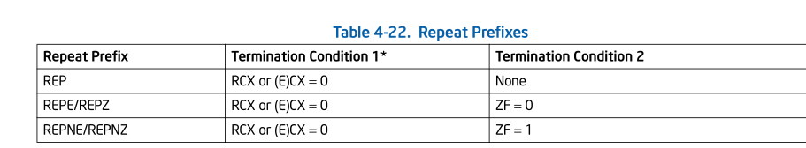
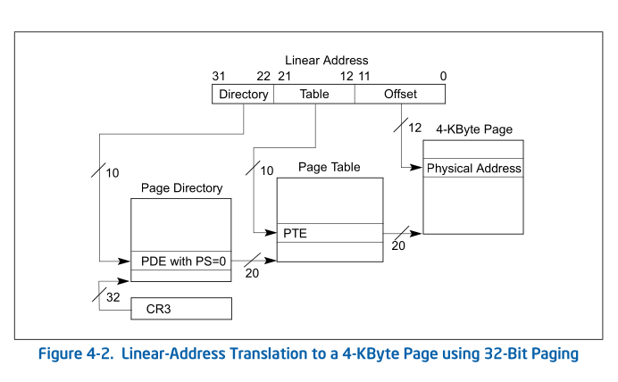

# ORG_PATCH
> From
> ```
> commit 2ab763b2e26be65551e717bd547497ffb9ba7267 (HEAD -> swap, tag: 0.12)
> Author: Linus Torvalds <torvalds@linuxfoundation.org>
> Date:   Fri Nov 23 15:08:59 2007 -0500
> 
>     Linux-0.12 (January 15, 1992)
> 
>     This was created from a re-packaged 0.12 tree
> ```

该版本过于老了, 很多逻辑和现在版本不一样, 我们先看下mm init, alloc, free相关流程

# How old mm code work ?

## INIT
```cpp
void main(void)         /* This really IS void, no error here. */
{                       /* The startup routine assumes (well, ...) this */
        ...
        //==(1)==
        memory_end = (1<<20) + (EXT_MEM_K<<10);
        //==(2)==
        memory_end &= 0xfffff000;
        //==(3)==
        if (memory_end > 16*1024*1024)
                memory_end = 16*1024*1024;
        if (memory_end > 12*1024*1024)
                buffer_memory_end = 4*1024*1024;
        else if (memory_end > 6*1024*1024)
                buffer_memory_end = 2*1024*1024;
        else
                buffer_memory_end = 1*1024*1024;
        main_memory_start = buffer_memory_end;
#ifdef RAMDISK
        main_memory_start += rd_init(main_memory_start, RAMDISK*1024);
#endif
        //start为 buffer_memory_end
        //==(4)==
        mem_init(main_memory_start,memory_end);
        ...
}
```
1. `1<<20`表示`1M`, 低1M 内存bios要占用, `EXT_MEM_K`表示 kernel要占用的
   额外的内存, 以Kb为单位
   ```cpp
   #define EXT_MEM_K (*(unsigned short *)0x90002)
   ```
2. `memory_end`以4K对齐(以PAGE_SIZE对齐)
3. 这里根据 `memory_end` 大小 来确定 buffer_memory_end, (最小为1M)
4. 调用 mem_init()

```cpp
void mem_init(long start_mem, long end_mem)
{
        int i;
        HIGH_MEMORY = end_mem;
        for (i=0 ; i<PAGING_PAGES ; i++)
                mem_map[i] = USED;
        i = MAP_NR(start_mem);
        end_mem -= start_mem;
        end_mem >>= 12;
        while (end_mem-->0)
                mem_map[i++]=0;
}
```
我们先看下 mem_map[]定义:
```cpp
unsigned char mem_map [ PAGING_PAGES ] = {0,};
```

每个 byte 表示一个页, 如果为0, 表示页空闲,如果非0, 表示页被占用

我们先看下 `MAP_NR`定义:
```cpp
#define MAP_NR(addr) (((addr)-LOW_MEM)>>12)

/* these are not to be changed without changing head.s etc */
#define LOW_MEM 0x100000
```

该函数的逻辑很简单, 大概达成的效果如下:
```
mem_map[0]          memory_map[MAP_NR(start_mem)]       memory_map[end_mem >> 12 ]
|--             USED                          --|---            0              --|
```

那什么意思呢?

`mem_map[]`数组是用来alloc mem, 其中表示kernel 能够用来分配的page的index, 低
1M 内存是bios 永久占用了,所以不能用来分配, mem_map[0] 实际上就是表示 physical address 1M
地址处的page, 而 [1M, buffer_memory_end] 被预留了, 所以在`mem_map[]`中标记为 `USED`, 
其余的设置为0, 表示未被占用.

接下来我们分析内存分配:


## PAGE ALLOC -- get_free_page
```cpp
/*
 * Get physical address of first (actually last :-) free page, and mark it
 * used. If no free pages left, return 0.
 */
unsigned long get_free_page(void)
{
register unsigned long __res asm("ax");

repeat:
                //eax设置为0, edx设置为 mem_map[end]
                //这里相当于从后向前找, 看看是否有等于0的地址
        __asm__("std ; repne ; scasb\n\t"
                //ZF=0跳转, 相当于没有找到, 也就是所有的都被used了
                "jne 1f\n\t"
                //将该位置内存设置为1
                "movb $1,1(%%edi)\n\t"
                //ecx << 12
                "sall $12,%%ecx\n\t"
                //然后 + LOW_MEM
                "addl %2,%%ecx\n\t"
                //赋值给 edx
                "movl %%ecx,%%edx\n\t"
                //重新设置循环次数 1024`
                "movl $1024,%%ecx\n\t"
                //定位到该页的最后一个 int
                "leal 4092(%%edx),%%edi\n\t"
                //将该页全部设置为 eax也就是0
                "rep ; stosl\n\t"
                //将edx赋值给 eax, 也就是res
                "movl %%edx,%%eax\n"
                "1:"
                :"=a" (__res)
                :"0" (0),"i" (LOW_MEM),"c" (PAGING_PAGES),
                "D" (mem_map+PAGING_PAGES-1)
                :"di","cx","dx");
}
```

> NOTE
>
> 该函数代码为未引入swap的代码, 我们后面会列出为支持swap, 增加了哪些部分

我们先简单看下里面提到的一些指令:
* **std**

  设置 DF flag (Direction Flag), 这个flags之前没有关注过, 手册中有该指令部分
  有对DF 描述:
  ```
  Sets the DF flag in the EFLAGS register. When the DF flag is set to 1, string
  operations decrement the index registers (ESI and/or EDI). Operation is the
  same in all modes 
  ```
  看起来是和字符串操作相关, 只有DF为1 时, string operations 会 des  index register.

  > NOTE
  > 
  > 相对应的 CLD 命令会clear direction flag, string operations 会 inc index register

* **repne; scasb**

  这两个是连起来用的, 手册中描述为:
  ```
  Find AL, starting at [RDI].
  ```
  该指令还会影响ZF位, 手册中描述:
  ```
  Repeats a string instruction the number of times specified in the count register 
  or until the indicated condition of the ZF flag is no longer met.
  ```
  该指令有两种结束循环的方式, 一种是达到了指定循环的次数(ecx指定), 另一种是 根据ZF来判断:
  如下图:
  

  可以看到, REPNE是, ZF为1时, 退出循环, 实际上也就是equal
* **rep ; stosl**

  Fill (E)CX doublewords at ES:[(E)DI] with EAX.

为了方便, 之后的具体指令分析, 以注释的方式描述.


所以综合来看, 该函数会做:
* mem_map[]中找到一个空闲的页
* 将mem_map[空闲 index] 赋值为1
* 将整个也zero
* 将页面首地址返回.

接下来, 我们看下 free page
## PAGE_FREE -- free pages
```cpp
/*
 * Free a page of memory at physical address 'addr'. Used by
 * 'free_page_tables()'
 */
void free_page(unsigned long addr)
{
        if (addr < LOW_MEM) return;
        if (addr >= HIGH_MEMORY)
                panic("trying to free nonexistent page");
        addr -= LOW_MEM;
        addr >>= 12;
        if (mem_map[addr]--) return;
        mem_map[addr]=0;
        panic("trying to free free page");
}
```
代码逻辑很简单, 就是找到其在 mem_map中的位置, 然后将 `mem_map[addr]--`, 
之前提到 alloc page时, 将其赋值为1, 现在自减后, 设置为0.

另外, 这里简单粗暴的, 如果是free 了 free page 就直接panic 0.0

## PG DIR
此外, swap 还需要关心另外一个东西, 那就是page map, 那就涉及到页表了, 我们简单
看下其实现:
```cpp
/*
 *  head.s contains the 32-bit startup code.
 *
 * NOTE!!! Startup happens at absolute address 0x00000000, which is also where
 * the page directory will exist. The startup code will be overwritten by
 * the page directory.
 */
.globl _idt,_gdt,_pg_dir,_tmp_floppy_area
//==(1)==
_pg_dir:
startup_32:
        movl $0x10,%eax
        mov %ax,%ds

        ...
/*
 * I put the kernel page tables right after the page directory,
 * using 4 of them to span 16 Mb of physical memory. People with
 * more than 16MB will have to expand this.
 */
//==(2)==
.org 0x1000
pg0:

.org 0x2000
pg1:

.org 0x3000
pg2:

.org 0x4000
pg3:

.org 0x5000
```
1. 这里提到, Startup 发生在绝对地址 0x0 处, pg_dir也要设置到这个地址, 所以startup
code将会被pg_dir覆盖
2. `.org` 表示位置, 也就是每类pg dir, 占用 0x1000, 也就是一个页, 这5个页面怎么算出来的呢?

   首先这一版kernel 支持 16M 内存. 16M是低23位, 我们来对照下32位的地址映射:
    
   
   可见Page Directory中应该有两位的index, 也就是4个. 所以除了page directory page 之外, 还应该
   有额外的4个page table.


我们再来看下, 初始化页表的代码, 在该函数之前有一段代码, 解释了
作者为什么要想内存限制到16M
```
/*
 * Setup_paging
 *
 * This routine sets up paging by setting the page bit
 * in cr0. The page tables are set up, identity-mapping
 * the first 16MB. The pager assumes that no illegal
 * addresses are produced (ie >4Mb on a 4Mb machine).
 *
 * NOTE! Although all physical memory should be identity
 * mapped by this routine, only the kernel page functions
 * use the >1Mb addresses directly. All "normal" functions
 * use just the lower 1Mb, or the local data space, which
 * will be mapped to some other place - mm keeps track of
 * that.
 *
 * For those with more memory than 16 Mb - tough luck. I've
 * not got it, why should you :-) The source is here. Change
 * it. (Seriously - it shouldn't be too difficult. Mostly
 * change some constants etc. I left it at 16Mb, as my machine
 * even cannot be extended past that (ok, but it was cheap :-)
 * I've tried to show which constants to change by having
 * some kind of marker at them (search for "16Mb"), but I
 * won't guarantee that's all :-( )
 */
```
> NOTE
>
> 有一句话, 让人倍受鼓舞:
> ```
> For those with more memory than 16 Mb - tough luck. I've
> not got it, why should you :-) The source is here. Change
> it.
> ```

读完注释, 我们再来看下该代码:
```cpp
.align 2
setup_paging:
        //ecx表示循环次数, 因为每次要操作32bit,也就是四个4byte, 
        //5个页也就是操作 (4096 / 4) * 5 = 1024*5
        movl $1024*5,%ecx               /* 5 pages - pg_dir+4 page tables */
        //将eax, edi清0
        xorl %eax,%eax
        xorl %edi,%edi                  /* pg_dir is at 0x000 */
		//CLD表示 index register 会在循环中 inc(edi)
        cld;rep;stosl
		//上面的动作, 是将page table 部分全部清0

		//上面提到过, page table 一共有四个, 下面的代码将这四个放到page 
		//directory 中, 7表示的意思,下面注释中有解释
        movl $pg0+7,_pg_dir             /* set present bit/user r/w */
        movl $pg1+7,_pg_dir+4           /*  --------- " " --------- */
        movl $pg2+7,_pg_dir+8           /*  --------- " " --------- */
        movl $pg3+7,_pg_dir+12          /*  --------- " " --------- */
		//下面初始化pg table, 由于执行std, 所以是需要倒着循环, pg3+4092表示
		//pg table中的最后一个entry
        movl $pg3+4092,%edi
		//这个表示16M处的地址
        movl $0xfff007,%eax             /*  16Mb - 4096 + 7 (r/w user,p) */
        std
		//mov eax,(edi)
1:      stosl                   /* fill pages backwards - more efficient :-) */
		//减去4096
        subl $0x1000,%eax
		//大于等于0
        jge 1b
		//上面把每个PTE初始化好了

		//上面提到过 pg_dir的地址是0x0, 初始化cr3
        xorl %eax,%eax          /* pg_dir is at 0x0000 */
        movl %eax,%cr3          /* cr3 - page directory start */
        movl %cr0,%eax
		//初始化cr0, 或上PG 位 :(Paging)
        orl $0x80000000,%eax
        movl %eax,%cr0          /* set paging (PG) bit */
        ret                     /* this also flushes prefetch-queue */
```

至此, 关于页表部分初始化部分代码分析完

## swap
接下来, 我们主要看下swap相关代码
### INIT
```cpp
void init_swapping(void)
{
        extern int *blk_size[];
        int swap_size,i,j;

        if (!SWAP_DEV)
                return;
        /*
         * blk_size 是一个二维数组,表示该block设备的大小, 
         * 由[MAJOR, MINOR], 主次设备号索引.
         */
        if (!blk_size[MAJOR(SWAP_DEV)]) {
                printk("Unable to get size of swap device\n\r");
                return;
        }
        swap_size = blk_size[MAJOR(SWAP_DEV)][MINOR(SWAP_DEV)];
        if (!swap_size)
                return;
        if (swap_size < 100) {
                printk("Swap device too small (%d blocks)\n\r",swap_size);
                return;
        }
        //这里相当于 / 4, 这个操作我不是很懂
        //感觉可能是blk_size[]的单位是1024, 而每个页的大小是4096, 所以
        //这里需要 / 4, 另外 SWAP_BITS 定义是 4098 * 8, 那么能够代表的最大大小是
        // 8 * 4096 * 4096 也就是 128 M
        swap_size >>= 2;
        if (swap_size > SWAP_BITS)
                swap_size = SWAP_BITS;
        //swap_bitmap 用于表示哪些index的swap 被使用了
        swap_bitmap = (char *) get_free_page();
        if (!swap_bitmap) {
                printk("Unable to start swapping: out of memory :-)\n\r");
                return;
        }
        //从blkdev中读取一个页, index为0
        read_swap_page(0,swap_bitmap);
        //相当于swap文件系统, 第一个4096 的末尾[4086, 4095], 为字符串"SWAP-SPACE"
        //如果不是说明不是swap文件系统
        if (strncmp("SWAP-SPACE",swap_bitmap+4086,10)) {
                printk("Unable to find swap-space signature\n\r");
                free_page((long) swap_bitmap);
                swap_bitmap = NULL;
                return;
        }
        memset(swap_bitmap+4086,0,10);
        //SWAP_BITS为 4096 << 3 也就是4096 * 8
        //这段逻辑不是很懂,大概是检查 [swap_size, SWAP_BITS]
        //之前是否有bit enable
        for (i = 0 ; i < SWAP_BITS ; i++) {
                if (i == 1)
                        i = swap_size;
                if (bit(swap_bitmap,i)) {
                        printk("Bad swap-space bit-map\n\r");
                        free_page((long) swap_bitmap);
                        swap_bitmap = NULL;
                        return;
                }
        }
        j = 0;
        //这一段也很迷, 查看swap_size内的swap_bitmap, 如果没有设置这个bit, 
        //说明该页,不用做swap, 那综合来看, 应该是swap分区格式化的时候决定.
        //kernel 目前不允许格式化swap分区大于128M.
        for (i = 1 ; i < swap_size ; i++)
                if (bit(swap_bitmap,i))
                        j++;
        if (!j) {
                free_page((long) swap_bitmap);
                swap_bitmap = NULL;
                return;
        }
        printk("Swap device ok: %d pages (%d bytes) swap-space\n\r",j,j*4096);
}
```

# swap_out
```cpp
/*
 * Ok, this has a rather intricate logic - the idea is to make good
 * and fast machine code. If we didn't worry about that, things would
 * be easier.
 */
int swap_out(void)
{
        static int dir_entry = FIRST_VM_PAGE>>10;
        static int page_entry = -1;
        /*
         * VM_PAGE  LAST_VM_PAGE - FIRST_VM_PAGE
         *   LAST_VM_PAGE 为: 1024 * 1024 
         *   FIRST_VM_PAGE为: 16 * 1024
         *
         *   所以counter为 1024 * 1024 - 64
         */
        int counter = VM_PAGES;
        int pg_table;

        while (counter>0) {
                pg_table = pg_dir[dir_entry];
                if (pg_table & 1)
                        break;
                //前面分析过, 每个pde有 1024 个entry, 所以这里减 1024
                counter -= 1024;
                dir_entry++;
                //因为 dir_entry 是 static 的, 这里相当于回归到开始
                //总之,这里是想把所有的pg_dir都遍历一遍, 直到找到一个
                //pg_table 是 PRESENT的
                if (dir_entry >= 1024)
                        dir_entry = FIRST_VM_PAGE>>10;
        }
        pg_table &= 0xfffff000;
        while (counter-- > 0) {
                //这里每次也会自增, 比较巧妙的是, page_entry初始值为-1,
                //这样第一次进来的时候, page_entry自增后为1, 不过无伤大雅,
                //个人认为先回收page[0] 和先回收page[1]都一样.
                page_entry++;
                //回归
                if (page_entry >= 1024) {
                        page_entry = 0;
                repeat:
                        dir_entry++;
                        if (dir_entry >= 1024)
                                dir_entry = FIRST_VM_PAGE>>10;
                        pg_table = pg_dir[dir_entry];
                        if (!(pg_table&1))
                                if ((counter -= 1024) > 0)
                                        goto repeat;
                                else
                                        break;
                        pg_table &= 0xfffff000;
                }
                //回收该page_entry
                //整个的这段逻辑, 会把 "VM_PAGES" 范围之内的page 全部尝试 swap_out
                if (try_to_swap_out(page_entry + (unsigned long *) pg_table))
                        return 1;
        }
        printk("Out of swap-memory\n\r");
        return 0;
}
```
这个函数的整个逻辑是将 counter减小到0, counter的单位实际上是 PAGE_SIZE, 4k,
这里
* FIRST_VM_PAGE: 16, 即 16 * 4k = 64k
* LAST_VM_PAGE : 1024 * 1024, 即  1024 * 1024 * 4k = 4G

该代码最终会将counter减少到0, 也就是把整个的虚拟内存空间都遍历一遍. swap能swap的page

## try_to_swap_out
```cpp
int try_to_swap_out(unsigned long * table_ptr)
{
        unsigned long page;
        unsigned long swap_nr;

        page = *table_ptr;
        //pgtable没有PRESENT
        if (!(PAGE_PRESENT & page))
                return 0;
        //回收的内存在 LOW_MEM, 低 16K
        if (page - LOW_MEM > PAGING_MEMORY)
                return 0;
        //是dirty的
        if (PAGE_DIRTY & page) {
                page &= 0xfffff000;
                //refcount != 1
                if (mem_map[MAP_NR(page)] != 1)
                        return 0;
                //尝试获取一个swap idx
                if (!(swap_nr = get_swap_page()))
                        return 0;
                //将页表设置为这个 idx << 1,  << 1的目的是将PRESENT位空出来.
                *table_ptr = swap_nr<<1;
                //invalidate tlb -- mov to cr3
                invalidate();
                //因为是dirty的需要writeback
                write_swap_page(swap_nr, (char *) page);
                free_page(page);
                return 1;
        }
        *table_ptr = 0;
        invalidate();
        free_page(page);
        return 1;
}
```
该版本的代码比较简单, 只做一些必要的检查, 例如 refcount, PRESENT, LOW_MEM.
然后dirty的page需要writeback. 比起现在的宏伟的代码, 真简单啊!!

## get_swap_page
```cpp
static int get_swap_page(void)
{
        int nr;

        if (!swap_bitmap)
                return 0;
        for (nr = 1; nr < 32768 ; nr++)
                if (clrbit(swap_bitmap,nr))
                        return nr;
        return 0;
}
```
该代码也比较简单, 就是从`swap_bitmap` 中找到一个可用的bit, 将其清0.
我们来看下`32786`
```
4096 * 8
```
也就是 `SWAP_BITS`

另外看下`clrbit`宏
```cpp
#define bitop(name,op) \
static inline int name(char * addr,unsigned int nr) \
{ \
int __res; \
__asm__ __volatile__("bt" op " %1,%2; adcl $0,%0" \
:"=g" (__res) \
:"r" (nr),"m" (*(addr)),"0" (0)); \
return __res; \
}
bitop(clrbit,"r")
```

实际上执行的指令为
```
btr nr, *addr
```
* btr: Bit Test and Reset. 
  ```
  CF := Bit(BitBase, BitOffset);
  Bit(BitBase, BitOffset) := 0;
  ```
  如果bit位是1, 则CF为1
* adc : 
  ```
  DEST := DEST + SRC + CF;
  ```
  看下输出的约束中:
  ```
  g
    Any register, memory or immediate integer operand is allowed, 
    except for registers that are not general registers.
  = 
    Means that this operand is written to by this instruction: 
    the previous value is discarded and replaced by new data.
  ```
而输入部将`%0` 初始为0, 所以最终为`0 + 0 + CF`, 综上判断, 该宏
的作用就是 `test_and_clear_bit()`

## write_swap_page
```cpp
#define write_swap_page(nr,buffer) ll_rw_page(WRITE,SWAP_DEV,(nr),(buffer));
```
不再展开
