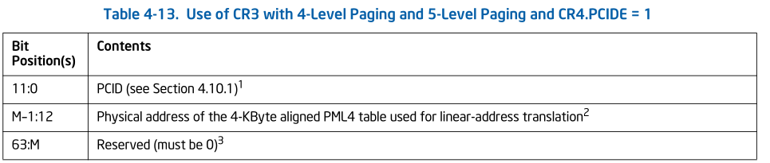

# CPU 功能简介
在intel sdm `4.10.1 process-context identifiers (PCID)`
章节中, 简要描述了PCID.

> NOTE
>
> translation caching information 既包括 TLB 也包括
> paging-structure cache, 我们在下面的讲述中 为了方便,
> 很多时候称 translation caching information 为 TLB

PCID用作CPU管理多个线性地址空间的 cache information.可以
允许CPU在switch到一个不同PCID的新的 线性地址空间时, 不丢弃
之前的 cache information 

> 我们知道切换线性地址空间是通过 switch CR3, 那么有了PCID功能后,
> 可以允许CPU在切换CR3时,不丢弃之前的缓存信息.

PCID是一个12-bit的标识符.所以最多有4096个. PCID 在 CR4.PCIDE = 0,
时, 当前PCID 只能为 0000H, 当 CR4.PCIDE != 0 时, 当前PCID才能为
非0值.

处理器保证只有在 IA-32e mode中 CR4.PCIDE 才能为1. 我们再来看下
在使能了PCID 的情况下, 无效缓存的一些行为:

* **MOV to CR3**.
  + CR4.PCIDE = 0, 该指令会无效所有的TLB entries 和paging structure cache
    (和PCID 000H 相关的, 但是上面也提到了在CR4.PCIDE=0 时, current PCID
    只能为000H) (除global pages_)
  + CR4.PCIDE = 1, 并且指令的源操作数bit 63 = 0, 该指令会无效所有和
    指令源操作中bit [11:0] 指定的PCID相关的 TLBs和 paging structure cache
    (除gobal pages)
  + CR4.PCIDE = 1, 并且指令源操作数 bit 63 = 1, 该指令不需要无效任何TLB entries
    或者 paging-structure caches.

   

  > NOTE
  >   
  >
  > 这里我们需要注意两点
  >
  > 1. 不需要无效TLB... 这个在手册的多个地方有提及, 意思是可能无效也可能不
  >    无效, 看CPU自己, 但是这个行为不会影响软件测的运行,软件在设计时候,也不能
  >    对此有依赖(例如, 在第三条的情况下, 软件错误的认为TLBs 肯定不会无效, 利用
  >    该想法再次和该TLB相关的线性地址, 认为其肯定会利用old TLB访问其page, 但是
  >    实际上是不一定的.)
  >
  > 2. 为什么switch CR3 过程中, 会无效源操作数 中的 PCID 字段相关的caching information ,
  >    而不是无效除了该PCID的. 原因在于当执行 `MOV to CR3`, 切换到一个新的线性地址空间
  >    中, 我们只能访问到该源操作数PCID 相关的 caching information, 除该PCID的caching 
  >    information 不会影响到我们. 而我们需要关心, 当我们switch 回来时, 这些caching
  >    information 是不是old的,需不需要无效

* **INVLPG** : 

  我们知道`INVLPG`指令可以指定一个线性地址, 无效该线性地址相关的TLB. 当 CR4.PCIDE = 1
  后, 该指令会无效和当前PCID相关的缓存信息. 但是也可能无效其他的PCID相关的缓存
* **INVPCID** :
  该指令比较复杂,有两个操作数: 

  op1: invpcid type, 在下面描述
  + Individual-address invalidation: If the INVPCID type is 0, the logical
    processor invalidates mappings—except global translations—for the linear
    address and PCID specified in the INVPCID descriptor. In some cases, the
    instruction may invalidate global translations or mappings for other linear
    addresses (or other PCIDs) as well.

    无效一个PCID 的一个线性地址
  + Single-context invalidation: If the INVPCID type is 1, the logical
    processor invalidates all mappings—except global translations—associated
    with the PCID specified in the INVPCID descriptor. In some cases, the
    instruction may invalidate global translations or mappings for other PCIDs
    as well.

    无效当前PCID
  + All-context invalidation, including global translations: If the INVPCID
    type is 2, the logical processor invalidates all mappings—including global
    translations—associated with any PCID.

    无效所有PCID(包括global translations)
  + All-context invalidation: If the INVPCID type is 3, the logical processor
    invalidates all mappings—except global translations—associated with any
    PCID. In some case, the instruction may invalidate global translations as
    well.

    无效所有PCID (除了global translations)

  op2 : invpcid descriptor(见下图)
  

# kernel 实现
Luto 在 [PCID and improved laziness](https://lore.kernel.org/all/cover.1498751203.git.luto@kernel.org/)
maillist中讨论引入 PCID, 可以看到该mail的标题为`PCID and improved laziness`, 
在PCID的同时还能提升TLB laziness, 所以我们接下来分为两部分:
* 如何优化 lazy TLB
* PCID 的功能实现

## improve laziness
我们先来回忆下 lazy TLB 的设计, 然后
再看看这组patch是如何提升其功能的.

lazy TLB 前面介绍过, 其目的是为了减少下面场景下, tlb shootdown的次数:
* A进程有两个线程 t1, t2分别运行在两个CPU上: c1, c2
* t1 切换到内核线程 k1
* t2 发出tlb shootdown (1)
* t2 再发出 tlb shootdown  (2)
* k1 -> t1

lazy TLB 的做法是在 t1 切换到内核线程 K1时, 记录当前cpu的 mm 以及 一个tlb
状态`TLBSTATE_LAZY`, 当收到 tlb shootdown 时(1), 标记tlb状态为`TLBSTATE_OLD`,
并且在 `mm->cpu_vm_mask`中清除该CPU 的bit, 这样在(2)发出时,不会在向c1发出
ipi 通知. 在k1->t1时, 在flush 一次 tlb

那么可以看到, CPU c1 最多收到一次 tlb shootdown 的ipi, 那么优化的话,只能
把仅有的一次优化没.

作者就是这么干的! 我们来看下相关代码.

### track how up-to-date tlb

在`improve laziness`的patch之前,我们先看下该作者是如何track tlb的最新程度的

作者在 `mm_context_t`中引入了两个成员
```diff
 typedef struct {
+       /*
+        * ctx_id uniquely identifies this mm_struct.  A ctx_id will never
+        * be reused, and zero is not a valid ctx_id.
+        */
+       u64 ctx_id;
+
+       /*
+        * Any code that needs to do any sort of TLB flushing for this
+        * mm will first make its changes to the page tables, then
+        * increment tlb_gen, then flush.  This lets the low-level
+        * flushing code keep track of what needs flushing.
+        *
+        * This is not used on Xen PV.
+        */
+       atomic64_t tlb_gen;
//mm_context_t
```

该数据位于 mm_struct(mm_struct.context)

* ctx_id: 用于唯一标识 mm_struct 
  > NOTE
  >
  > 为什么不用mm_struct 指针, 因为该地址可能被释放+申请, 不能唯一标识,
  > 我们下面会看下该值是如何初始化的
* tlb_gen: 在执行tlb flush 之前,会inc 该值

而 `[ctx_id, tlb_gen]` 的组合可以用来表示当前的线性地址空间的`"version"`,
如果需要更新`context.tlb_gen`, 就说明该进程的线性地址空间映射有所
改变,需要 `"bump version"`. 而线性地址空间映射关系可以存在于多个地方
* memory 中的 page table ("newest version") (先不想dcache)
* 每个CPU的tlb , 这个在某些情况下,(例如 tlb shootdown 还没有收到) 
  `"version"` 可能要低一些

我们来看下两者的init流程

定义一个atomic的全局变量, 记录最新的 `ctx_id`
```diff
+atomic64_t last_mm_ctx_id = ATOMIC64_INIT(1);
```

在 init context流程中会设置 `context.tlb_gen`以及`context.tlb_gen`
```diff
 static inline int init_new_context(struct task_struct *tsk,
                                   struct mm_struct *mm)
 {
+       mm->context.ctx_id = atomic64_inc_return(&last_mm_ctx_id);
+       atomic64_set(&mm->context.tlb_gen, 0);
+
        #ifdef CONFIG_X86_INTEL_MEMORY_PROTECTION_KEYS
        if (cpu_feature_enabled(X86_FEATURE_OSPKE)) {
                /* pkey 0 is the default and always allocated */
```
`context.ctx_id`由全局变量`last_mm_ctx_id`自增而来, 而`tlb_gen`
则设置为0, 表示该进程地址空间 TLB 的一个初始状态

`tlb_gen`会在刷新tlb的发起者的流程中更新.
```diff
+static inline u64 inc_mm_tlb_gen(struct mm_struct *mm)
+{
+       u64 new_tlb_gen;
+
+       /*
+        * Bump the generation count.  This also serves as a full barrier
+        * that synchronizes with switch_mm(): callers are required to order
+        * their read of mm_cpumask after their writes to the paging
+        * structures.
+        */
+       smp_mb__before_atomic();
+       new_tlb_gen = atomic64_inc_return(&mm->context.tlb_gen);
+       smp_mb__after_atomic();
+
+       return new_tlb_gen;
+}
+

 static inline void arch_tlbbatch_add_mm(struct arch_tlbflush_unmap_batch *batch,
                                        struct mm_struct *mm)
 {
+       inc_mm_tlb_gen(mm);
        cpumask_or(&batch->cpumask, &batch->cpumask, mm_cpumask(mm));
 }

 void leave_mm(int cpu)
 {
        struct mm_struct *loaded_mm = this_cpu_read(cpu_tlbstate.loaded_mm);
@@ -250,8 +252,8 @@ void flush_tlb_mm_range(struct mm_struct *mm, unsigned long start,

        cpu = get_cpu();

-       /* Synchronize with switch_mm. */
-       smp_mb();
+       /* This is also a barrier that synchronizes with switch_mm(). */
+       inc_mm_tlb_gen(mm);

        /* Should we flush just the requested range? */
        if ((end != TLB_FLUSH_ALL) &&
```

这个实际上就相当于更新了 memory 的 `"version"`

我们再来看下, 当前cpu 的 `"version"`

CPU的 `"version"`怎么在哪里定义的, 那当然是定义在`tlb_state`中的啦.
```diff
+struct tlb_context {
+   u64 ctx_id;
+   u64 tlb_gen;
+};
+
 struct tlb_state {
    /*
     * cpu_tlbstate.loaded_mm should match CR3 whenever interrupts
@@ -97,6 +102,21 @@ struct tlb_state {
     * disabling interrupts when modifying either one.
     */
    unsigned long cr4;
+
+   /*
+    * This is a list of all contexts that might exist in the TLB.
+    * Since we don't yet use PCID, there is only one context.
+    *
+    * For each context, ctx_id indicates which mm the TLB's user
+    * entries came from.  As an invariant, the TLB will never
+    * contain entries that are out-of-date as when that mm reached
+    * the tlb_gen in the list.
+    *
+    * To be clear, this means that it's legal for the TLB code to
+    * flush the TLB without updating tlb_gen.  This can happen
+    * (for now, at least) due to paravirt remote flushes.
+    */
+   struct tlb_context ctxs[1];
 };
 DECLARE_PER_CPU_SHARED_ALIGNED(struct tlb_state, cpu_tlbstate);
```

可以看到作者在这里设置了一个数组, 数组是1, 这是为之后引入PCID做准备,
这里数组大小为1, 是因为当前CPU中只有一个地址空间映射(tlb),所以只需要保存
一个`"version"` 即可, 而引入PCID后, 可能就会有多个地址空间映射了(多组TLB),
那么这时需要在扩充数组. 

> NOTE
>
> luto 这种方式引入代码, 真是厉害, 这样使得后人在看这些patch的时候,
> 更加清晰. 每个patch都有自己的功能, 不越界. YYDS

那CPU的 `"version"` 时候更新(同步)呢?

其实主要分为两个流程
* `flush_tlb_func_common`:  直接同步
* `switch_mm_irqs_off`: lazy 同步

在看该函数之前,我们首先看下该patch对于`struct flush_tlb_info`
的改动

```diff
 struct flush_tlb_info {
-   struct mm_struct *mm;
-   unsigned long start;
-   unsigned long end; /*
+    * We support several kinds of flushes.
+    *
+    * - Fully flush a single mm.  .mm will be set, .end will be
+    *   TLB_FLUSH_ALL, and .new_tlb_gen will be the tlb_gen to
+    *   which the IPI sender is trying to catch us up.
+    *
+    * - Partially flush a single mm.  .mm will be set, .start and
+    *   .end will indicate the range, and .new_tlb_gen will be set
+    *   such that the changes between generation .new_tlb_gen-1 and
+    *   .new_tlb_gen are entirely contained in the indicated range.
+    *
+    * - Fully flush all mms whose tlb_gens have been updated.  .mm
+    *   will be NULL, .end will be TLB_FLUSH_ALL, and .new_tlb_gen
+    *   will be zero.
+    */
+   struct mm_struct    *mm;
+   unsigned long       start;
+   unsigned long       end;
+   u64         new_tlb_gen;
 };
```
主要就引入了 `new_tlb_gen`, 该成员的意思是, 将 CPU的`"version"`(tlb_stte.ctxs[])
更新成`flush_tlb_info.new_tlb_gen`


代码流程我们先看`flush_tlb_func_common`.

### flush_tlb_func_common

```diff
+/*
+ * flush_tlb_func_common()'s memory ordering requirement is that any
+ * TLB fills that happen after we flush the TLB are ordered after we
+ * read active_mm's tlb_gen.  We don't need any explicit barriers
+ * because all x86 flush operations are serializing and the
+ * atomic64_read operation won't be reordered by the compiler.
+ */
 static void flush_tlb_func_common(const struct flush_tlb_info *f,
                  bool local, enum tlb_flush_reason reason)
 {
+   /*
+    * We have three different tlb_gen values in here.  They are:
+    *
+    * - mm_tlb_gen:     the latest generation.
+    * - local_tlb_gen:  the generation that this CPU has already caught
+    *                   up to.
+    * - f->new_tlb_gen: the generation that the requester of the flush
+    *                   wants us to catch up to.
+    */
+   struct mm_struct *loaded_mm = this_cpu_read(cpu_tlbstate.loaded_mm);
+   u64 mm_tlb_gen = atomic64_read(&loaded_mm->context.tlb_gen);
+   u64 local_tlb_gen = this_cpu_read(cpu_tlbstate.ctxs[0].tlb_gen);
+
    /* This code cannot presently handle being reentered. */
    VM_WARN_ON(!irqs_disabled());

+   VM_WARN_ON(this_cpu_read(cpu_tlbstate.ctxs[0].ctx_id) !=
+          loaded_mm->context.ctx_id);
+
    if (this_cpu_read(cpu_tlbstate.state) != TLBSTATE_OK) {
+       /*
+        * leave_mm() is adequate to handle any type of flush, and
+        * we would prefer not to receive further IPIs.  leave_mm()
+        * clears this CPU's bit in mm_cpumask().
+        */
        leave_mm(smp_processor_id());
        return;
    }

-   if (f->end == TLB_FLUSH_ALL) {
-       local_flush_tlb();
-       if (local)
-           count_vm_tlb_event(NR_TLB_LOCAL_FLUSH_ALL);
-       trace_tlb_flush(reason, TLB_FLUSH_ALL);
-   } else {
+   if (unlikely(local_tlb_gen == mm_tlb_gen)) {
+       /*
+        * There's nothing to do: we're already up to date.  This can
+        * happen if two concurrent flushes happen -- the first flush to
+        * be handled can catch us all the way up, leaving no work for
+        * the second flush.
+        */
+       return;
+   }
+
+   WARN_ON_ONCE(local_tlb_gen > mm_tlb_gen);
+   WARN_ON_ONCE(f->new_tlb_gen > mm_tlb_gen);
+
+   /*
+    * If we get to this point, we know that our TLB is out of date.
+    * This does not strictly imply that we need to flush (it's
+    +    * possible that f->new_tlb_gen <= local_tlb_gen), but we're
+    * going to need to flush in the very near future, so we might
+    * as well get it over with.
+    *
+    * The only question is whether to do a full or partial flush.
+    *
+    * We do a partial flush if requested and two extra conditions
+    * are met:
+    *
+    * 1. f->new_tlb_gen == local_tlb_gen + 1.  We have an invariant that
+    *    we've always done all needed flushes to catch up to
+    *    local_tlb_gen.  If, for example, local_tlb_gen == 2 and
+    *    f->new_tlb_gen == 3, then we know that the flush needed to bring
+    *    us up to date for tlb_gen 3 is the partial flush we're
+    *    processing.
+    *
+    *    As an example of why this check is needed, suppose that there
+    *    are two concurrent flushes.  The first is a full flush that
+    *    changes context.tlb_gen from 1 to 2.  The second is a partial
+    *    flush that changes context.tlb_gen from 2 to 3.  If they get
+    *    processed on this CPU in reverse order, we'll see
+    *     local_tlb_gen == 1, mm_tlb_gen == 3, and end != TLB_FLUSH_ALL.
+    *    If we were to use __flush_tlb_single() and set local_tlb_gen to
+    *    3, we'd be break the invariant: we'd update local_tlb_gen above
+    *    1 without the full flush that's needed for tlb_gen 2.
+    *
+    * 2. f->new_tlb_gen == mm_tlb_gen.  This is purely an optimiation.
+    *    Partial TLB flushes are not all that much cheaper than full TLB
+    *    flushes, so it seems unlikely that it would be a performance win
+    *    to do a partial flush if that won't bring our TLB fully up to
+    *    date.  By doing a full flush instead, we can increase
+    *    local_tlb_gen all the way to mm_tlb_gen and we can probably
+    *    avoid another flush in the very near future.
+    */
+   if (f->end != TLB_FLUSH_ALL &&
+       f->new_tlb_gen == local_tlb_gen + 1 &&
+       f->new_tlb_gen == mm_tlb_gen) {
+       /* Partial flush */
        unsigned long addr;
        unsigned long nr_pages = (f->end - f->start) >> PAGE_SHIFT;
+
        addr = f->start;
        while (addr < f->end) {
            __flush_tlb_single(addr);
@@ -182,7 +261,16 @@ static void flush_tlb_func_common(const struct flush_tlb_info *f,
        if (local)
            count_vm_tlb_events(NR_TLB_LOCAL_FLUSH_ONE, nr_pages);
        trace_tlb_flush(reason, nr_pages);
+   } else {
+       /* Full flush. */
+       local_flush_tlb();
+       if (local)
+           count_vm_tlb_event(NR_TLB_LOCAL_FLUSH_ALL);
+       trace_tlb_flush(reason, TLB_FLUSH_ALL);
    }
+
+   /* Both paths above update our state to mm_tlb_gen. */
+   this_cpu_write(cpu_tlbstate.ctxs[0].tlb_gen, mm_tlb_gen);
 }

 static void flush_tlb_func_local(void *info, enum tlb_flush_reason reason)
@@ -253,7 +341,7 @@ void flush_tlb_mm_range(struct mm_struct *mm, unsigned long start,
    cpu = get_cpu();

    /* This is also a barrier that synchronizes with switch_mm(). */
-   inc_mm_tlb_gen(mm);
+   info.new_tlb_gen = inc_mm_tlb_gen(mm);

    /* Should we flush just the requested range? */
    if ((end != TLB_FLUSH_ALL) &&
--

```
