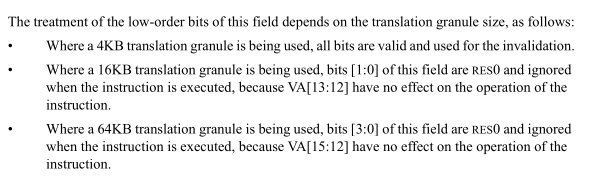

# ORG patch
在arm64 引入mmu-gather时, 并没有使用`include/asm-generic/tlb.h`中定义的功能,
而是在`arch/arm64/include/asm/tlb.h`自定义, 我们来简单分析下:

patch信息:
```
commit 58d0ba578bc3b7c044d4ef570307bcb03862cb66 (HEAD -> arm64_mmu_gather)
Author: Catalin Marinas <catalin.marinas@arm.com>
Date:   Mon Mar 5 11:49:28 2012 +0000

    arm64: TLB maintenance functionality
```

## mmu-gather
```cpp
#define MMU_GATHER_BUNDLE       8
/*
 * TLB handling.  This allows us to remove pages from the page
 * tables, and efficiently handle the TLB issues.
 */
struct mmu_gather {
        struct mm_struct        *mm;
        unsigned int            fullmm;
        struct vm_area_struct   *vma;
        unsigned long           range_start;
        unsigned long           range_end;
        unsigned int            nr;
        unsigned int            max;
        struct page             **pages;
        struct page             *local[MMU_GATHER_BUNDLE];
};

DECLARE_PER_CPU(struct mmu_gather, mmu_gathers);
```

* **pages**: 分两种情况
  + 内存充足的情况下, 指向另外一个page
  + 内存不足的情况下, 指向local
* **local**: 该数据结构中内置的page指针数组, 内置的page指针数量很少(8个)

## 相关接口
### tlb_gather_mmu
```cpp
static inline void __tlb_alloc_page(struct mmu_gather *tlb)
{
        unsigned long addr = __get_free_pages(GFP_NOWAIT | __GFP_NOWARN, 0);
        //如果内存分配成功, 使用新的page
        if (addr) {
                tlb->pages = (void *)addr;
                tlb->max = PAGE_SIZE / sizeof(struct page *);
        }
}

static inline void
tlb_gather_mmu(struct mmu_gather *tlb, struct mm_struct *mm, unsigned int fullmm)
{
        tlb->mm = mm;
        tlb->fullmm = fullmm;
        tlb->vma = NULL;
        tlb->max = ARRAY_SIZE(tlb->local);
        //先指向内置的 page ptr array
        tlb->pages = tlb->local;
        tlb->nr = 0;
        __tlb_alloc_page(tlb);
}
```

### tlb_start_vma, tlb_end_vma
```cpp
/*
 * In the case of tlb vma handling, we can optimise these away in the
 * case where we're doing a full MM flush.  When we're doing a munmap,
 * the vmas are adjusted to only cover the region to be torn down.
 */
static inline void
tlb_start_vma(struct mmu_gather *tlb, struct vm_area_struct *vma)
{
        if (!tlb->fullmm) {
                tlb->vma = vma;
                tlb->range_start = TASK_SIZE;
                tlb->range_end = 0;
        }
}

static inline void
tlb_end_vma(struct mmu_gather *tlb, struct vm_area_struct *vma)
{
        if (!tlb->fullmm)
                tlb_flush(tlb);
}
```

这个没什么可说的, 和之前我们分析 fullmm 引入时代码一样.

### tlb_remove_page
我们先看下该版本的 `zap_pte_range`
* `zap_pte_range`
  ```cpp
  static unsigned long zap_pte_range(struct mmu_gather *tlb,
                                struct vm_area_struct *vma, pmd_t *pmd,
                                unsigned long addr, unsigned long end,
                                struct zap_details *details)
  {
          do {
                  if (pte_present(ptent)) {
                          ...
                          ptent = ptep_get_and_clear_full(mm, addr, pte,
                                tlb->fullmm);
                          ...
                          tlb_remove_tlb_entry(tlb, pte, addr);
                          ...
                          force_flush = !__tlb_remove_page(tlb, page);
                          ...
                  }

          } while (pte++, addr += PAGE_SIZE, addr != end);

  }
  ```
  这里将mmu-gather 流程分为了三步:
  + `pte_get_and_clear_full` : 解除映射
  + `tlb_remove_tlb_entry` : flush tlb range 相关流程
  + `__tlb_remove_range`: 处理和 统计 free pte 相关流程

  我们分别看下后两个函数
* `tlb_remove_tlb_entry`
  ```cpp
  static inline void tlb_add_flush(struct mmu_gather *tlb, unsigned long addr)
  {
          //如果不是fullmm, 则要更改下 flush tlb的范围,如果是 fullmm, 
          //则要刷新整个进程的tlb, 统不统计无所谓
          if (!tlb->fullmm) {
                  if (addr < tlb->range_start)
                          tlb->range_start = addr;
                  if (addr + PAGE_SIZE > tlb->range_end)
                          tlb->range_end = addr + PAGE_SIZE;
          }
  }
  
  
  /*
   * Memorize the range for the TLB flush.
   */
  static inline void
  tlb_remove_tlb_entry(struct mmu_gather *tlb, pte_t *ptep, unsigned long addr)
  {
          tlb_add_flush(tlb, addr);
  }
  ```
* `__tlb_remove_range`
  ```cpp
  static inline int __tlb_remove_page(struct mmu_gather *tlb, struct page *page)
  {
          tlb->pages[tlb->nr++] = page;
          VM_BUG_ON(tlb->nr > tlb->max);
          return tlb->max - tlb->nr;
  }
  ```
  该函数也没有什么可说的, 和之前的流程差不多, 只不过保存的是page ptr, 而不是
  pte ptr

### tlb_finish_mmu
```cpp
static inline void
tlb_finish_mmu(struct mmu_gather *tlb, unsigned long start, unsigned long end)
{
        //flush tlb && 释放物理页
        tlb_flush_mmu(tlb);

        /* keep the page table cache within bounds */
        check_pgt_cache();
        //如果不是local(内置的), 则说明之前申请过page, 
        //释放之前申请的page
        if (tlb->pages != tlb->local)
                free_pages((unsigned long)tlb->pages, 0);
}

static inline void tlb_flush_mmu(struct mmu_gather *tlb)
{
        //flush tlb
        tlb_flush(tlb);
        //释放物理页
        free_pages_and_swap_cache(tlb->pages, tlb->nr);

        tlb->nr = 0;
        /* 
         * 调用到tlb_flush_mmu的一个路径是, tlb->pages数组空间
         * 不够了, 所以这里会看是否使用的local, 如果是,则会再
         * 尝试使用 alloc_pages的页面作为 pages ptr array
         */
        if (tlb->pages == tlb->local)
                __tlb_alloc_page(tlb);
}
```

我们接下来看下`tlb_flush`, 看下其有没有处理fullmm
```cpp
/*
 * This is unnecessarily complex.  There's three ways the TLB shootdown
 * code is used:
 *  1. Unmapping a range of vmas.  See zap_page_range(), unmap_region().
 *     tlb->fullmm = 0, and tlb_start_vma/tlb_end_vma will be called.
 *     tlb->vma will be non-NULL.
 *     
 *     umap vma 中的一个range, 见 zap_page_range, unmap_region(),此时,
 *     tlb->fullmm 为0, 兵i企鹅 tlb_start_vm/tlb_end_vma 也会被调用.
 *     tlb->vma 将会是 non-NULL
 *
 *  2. Unmapping all vmas.  See exit_mmap().
 *     tlb->fullmm = 1, and tlb_start_vma/tlb_end_vma will be called.
 *     tlb->vma != NULL.  Additionally, page tables will be freed.
 *
 *     Unmapping all vmas. 见 exit_mmap()
 *     tlb->fullmm = 1, 并且 tlb_start_vma()/tlb_end_vma()将会被嗲ui哦用.
 *     此时 tlb->vma != NULL. 另外 page tables 也将会被free
 *
 *  3. Unmapping argument pages.  See shift_arg_pages().
 *     tlb->fullmm = 0, but tlb_start_vma/tlb_end_vma will not be called.
 *     tlb->vma will be NULL.
 */
static inline void tlb_flush(struct mmu_gather *tlb)
{
        if (tlb->fullmm || !tlb->vma)
                flush_tlb_mm(tlb->mm);
        else if (tlb->range_end > 0) {
                flush_tlb_range(tlb->vma, tlb->range_start, tlb->range_end);
                tlb->range_start = TASK_SIZE;
                tlb->range_end = 0;
        }
}
```
可以看到 arm64 `tlb_flush` 也是分了partial flush 和 full flush.

我们接下来看两种flush分别实现:

* full flush
  ```cpp
  static inline void flush_tlb_mm(struct mm_struct *mm)
  {
          unsigned long asid = (unsigned long)ASID(mm) << 48;
  
          dsb();
          asm("tlbi       aside1is, %0" : : "r" (asid));
          dsb();
  }
  ```
  该指令用法:
  ```
  TLBI 
     ASIDE1IS       TLB invalidate by ASID, EL1, Inner Shareable.
  ```
  表示无效所有el1和该asid相关的tlb
* partial flush
  ```cpp
  #define flush_tlb_range(vma,start,end)  __cpu_flush_user_tlb_range(start,end,vma)
  /*
   *      __cpu_flush_user_tlb_range(start, end, vma)
   *
   *      Invalidate a range of TLB entries in the specified address space.
   *
   *      - start - start address (may not be aligned)
   *      - end   - end address (exclusive, may not be aligned)
   *      - vma   - vma_struct describing address range
   */
  ENTRY(__cpu_flush_user_tlb_range)
          //==(1)==
          vma_vm_mm x3, x2                        // get vma->vm_mm
          //==(2)==
          mmid    x3, x3                          // get vm_mm->context.id
          //这个先不分析
          dsb     sy
          //start右移动12位
          lsr     x0, x0, #12                     // align address
          //end右移12位
          lsr     x1, x1, #12
          //==(3)==
          bfi     x0, x3, #48, #16                // start VA and ASID
          bfi     x1, x3, #48, #16                // end VA and ASID
          //这里做一个循环, 循环处理每一个4K range
  1:      tlbi    vae1is, x0                      // TLB invalidate by address and ASID
          //+1相当于 +4K
          //==(4)==
          add     x0, x0, #1
          cmp     x0, x1
          b.lo    1b
          dsb     sy
          ret
  ENDPROC(__cpu_flush_user_tlb_range)
  ```
  1. x2 为vma, x3 为临时变量, 表示出参, vma->vm_mm
    ```cpp
    /*
     * vma_vm_mm - get mm pointer from vma pointer (vma->vm_mm)
     */
            .macro  vma_vm_mm, rd, rn
            //DEFINE(VMA_VM_MM,             offsetof(struct vm_area_struct, vm_mm));
            //这里是获取 vma->vm_mm的值
            ldr     \rd, [\rn, #VMA_VM_MM]
            .endm
    ```
  2. 和上面类似, 获取 vm_mm->context.id
     ```cpp
     /*
      * mmid - get context id from mm pointer (mm->context.id)
      */
             .macro  mmid, rd, rn
             ldr     \rd, [\rn, #MM_CONTEXT_ID]
             .endm
     ```
  3. 关于该tlbi指令用法:
     ```
     TLBI
        VAEnIS     TLB invalidate by VA, ELn, Inner Shareable.
     ```
     x0操作数, 包含 VA和 ASID, 我们来看下相关格式:

     

     > NOTE
     >
     > 来自arm64 手册:
     >
     > C5.5.60 TLBI VAE1IS, TLBI VAE1ISNXS, TLB Invalidate by VA, EL1, 
     > Inner Shareable
     可以看到 [63, 48] 为 ASID, 共16位
     bfi 指令,会将x3 copydAO  X0的 [63, 48] bits
  4. 我们来看手册中, 关于x0 中VA的定义:

     

     可以看到, 如果 translation granule 不是4K, 可能会reserve该VA字段中的某些位:
     + 16K: [1:0] 对应VA[13:12] (4K * 2^2)
     + 64K: [3:0] 对应VA[15:12] (4K * 2^4)

     但是, 这里使用这样的循环, 不会有问题, 顶多是执行一些重复的指令.

## 需要补充下 free_pgtables() 流程 !!!!
```
!!!!!!!
遗留问题
!!!!!!!
```

# LAST LEVEL
commit information:
```
commit da4e73303e448aa23b36249a85e239ca118ce941
Author: Catalin Marinas <catalin.marinas@arm.com>
Date:   Fri Jul 24 09:59:55 2015 +0100

    arm64: Clean up __flush_tlb(_kernel)_range functions
commit 4150e50bf5f2171fbe7dfdbc7f2cdf44676b79a4
Author: Catalin Marinas <catalin.marinas@arm.com>
Date:   Wed Mar 18 11:28:06 2015 +0000

    arm64: Use last level TLBI for user pte changes
```

[MAIL LIST](https://lore.kernel.org/all/1437728396-5408-1-git-send-email-catalin.marinas@arm.com/)

这里我个人的理解, `last level tlb` 指的就是x86 中的tlb, 而`!last level tlb`指的是
`paging-structure cache`.

> NOTE
>
> 从这里可以看出, ARM64的指令比起x86更加灵活, 我们来看下x86 sdm中关于INVLPG指令
> 的描述:
>
>> 来自: intel sdm 4.10.4.1 Operations that Invalidate TLBs and Paging-Structure
>> Caches
>
> The instruction invalidates any TLB entries that are for a page number
> corresponding to the linear address and that are associated with the current
> PCID. It also invalidates any global TLB entries with that page number,
> regardless of PCID (see Section 4.10.2.4). INVLPG also invalidates **all
> entries in all paging-structure caches** associated with the current PCID,
> regardless of the linear addresses to which they correspond.
>
> 一个all, 道出了x86的霸道
>
> 但是假设, 我们只修改了 last level page table entry, 这里只需要invalidate last level
> tlb, 而不需要invalidate other, 例如 "PMD level tlb".
>
> 那这里arm64 实际上在x86架构的指令集上做了增强(不是很确定x86有没有新指令可以完成
> 这个, 从目前手册来看,应该是没有), 而该patch就是去应用该指令. 

我们先来看下patch 0 的commit message:
```
AArch64 introduces TLBI operations that only invalidate the last level
of a page table (block entry). The first patch in the series is just a
minor clean-up to avoid defining too many functions. The second patch
introduces the last level TLBI support for flush_tlb_page() and
tlb_flush(). The flush_tlb_range() function cannot be changed since it
is used in THP code for collapsing multiple small pages into a huge
page.

AArch64 引入了只 invalidate page table/block entry 的last level. 该系列
的第一个patch 只是一个 minor clean-up , 以避免定义过多的函数. 第二个patch
为 flush_tlb_page() 和 tlb_flush() 引入了 last level TLBI的支持. 
flush_tlb_range() function 不能被改变, 因为他用在 THP 代码中用于将多个small
pages 折叠成一个 huge page
```

第一个patch 只是代码优化,我们简单看下:
## Patch 1: arm64: Clean up \__flush_tlb(_kernel)_range functions
```diff
diff --git a/arch/arm64/include/asm/tlbflush.h b/arch/arm64/include/asm/tlbflush.h
index 7fedfa787a64..e972bf456558 100644
--- a/arch/arm64/include/asm/tlbflush.h
+++ b/arch/arm64/include/asm/tlbflush.h
@@ -91,11 +91,23 @@ static inline void flush_tlb_page(struct vm_area_struct *vma,
        dsb(ish);
 }

-static inline void __flush_tlb_range(struct vm_area_struct *vma,
-                                    unsigned long start, unsigned long end)
+/*
+ * This is meant to avoid soft lock-ups on large TLB flushing ranges and not
+ * necessarily a performance improvement.
+ */
+#define MAX_TLB_RANGE  (1024UL << PAGE_SHIFT)
+
+static inline void flush_tlb_range(struct vm_area_struct *vma,
+                                  unsigned long start, unsigned long end)
 {
        unsigned long asid = (unsigned long)ASID(vma->vm_mm) << 48;
        unsigned long addr;
+
+       if ((end - start) > MAX_TLB_RANGE) {
+               flush_tlb_mm(vma->vm_mm);
+               return;
+       }
+
        start = asid | (start >> 12);
        end = asid | (end >> 12);

@@ -105,9 +117,15 @@ static inline void __flush_tlb_range(struct vm_area_struct *vma,
        dsb(ish);
 }

-static inline void __flush_tlb_kernel_range(unsigned long start, unsigned long end)
+static inline void flush_tlb_kernel_range(unsigned long start, unsigned long end)
 {
        unsigned long addr;
+
+       if ((end - start) > MAX_TLB_RANGE) {
+               flush_tlb_all();
+               return;
+       }
+
        start >>= 12;
        end >>= 12;

@@ -118,29 +136,6 @@ static inline void __flush_tlb_kernel_range(unsigned long start, unsigned long e
        isb();
 }

-/*
- * This is meant to avoid soft lock-ups on large TLB flushing ranges and not
- * necessarily a performance improvement.
- */
-#define MAX_TLB_RANGE  (1024UL << PAGE_SHIFT)
-
-static inline void flush_tlb_range(struct vm_area_struct *vma,
-                                  unsigned long start, unsigned long end)
-{
-       if ((end - start) <= MAX_TLB_RANGE)
-               __flush_tlb_range(vma, start, end);
-       else
-               flush_tlb_mm(vma->vm_mm);
-}
-
-static inline void flush_tlb_kernel_range(unsigned long start, unsigned long end)
-{
-       if ((end - start) <= MAX_TLB_RANGE)
-               __flush_tlb_kernel_range(start, end);
-       else
-               flush_tlb_all();
-}

```

该代码, 删除了`__flush_tlb_kernel_range` 和 `__flush_tlb_range`,将其流程移动到
`flush_tlb_kernel_range`和`flush_tlb_range`函数中, 不多解释

## Patch 2: arm64: Use last level TLBI for user pte changes

我们首先看下commit message
```
    The flush_tlb_page() function is used on user address ranges when PTEs
    (or PMDs/PUDs for huge pages) were changed (attributes or clearing). For
    such cases, it is more efficient to invalidate only the last level of
    the TLB with the "tlbi vale1is" instruction.

    flush_tlb_page() function 被用做 user address range, 当PTEs(或者对于 huge
    page 来说 PMDs/PUDs) 被改变了(attr 或者被清空). 对于这些情况, 使用"tlb vale1is"
    指令只无效TLB中的last level 是更高效的.

    In the TLB shoot-down case, the TLB caching of the intermediate page
    table levels (pmd, pud, pgd) is handled by __flush_tlb_pgtable() via the
    __(pte|pmd|pud)_free_tlb() functions and it is not deferred to
    tlb_finish_mmu() (as of commit 285994a62c80 - "arm64: Invalidate the TLB
    corresponding to intermediate page table levels"). The tlb_flush()
    function only needs to invalidate the TLB for the last level of page
    tables; the __flush_tlb_range() function gains a fourth argument for
    last level TLBI.

    在 TLB shoot-down 情形中, intermediate page table levels(pmd, pud, pgd)的
    TLB cache 已经在 __flush_tlb_pgtable() 中通过 __(pte|pmd|pud)_free_tlb()函数
    处理了并且将不会defer到 tlb_finish_mmu()中去做 (.... commit). tlb_flush()
    函数只需要无效 page table 的 last level TLB; __flush_tlb_range() 函数中的
    第四个参数将获last level TLBI.(是否使用 last level TLBI?)
```
Patch:
```diff
diff --git a/arch/arm64/include/asm/tlb.h b/arch/arm64/include/asm/tlb.h
index 3a0242c7eb8d..d6e6b6660380 100644
--- a/arch/arm64/include/asm/tlb.h
+++ b/arch/arm64/include/asm/tlb.h
@@ -41,7 +41,12 @@ static inline void tlb_flush(struct mmu_gather *tlb)
        if (tlb->fullmm) {
                flush_tlb_mm(tlb->mm);
        } else {
                struct vm_area_struct vma = { .vm_mm = tlb->mm, };
-               flush_tlb_range(&vma, tlb->start, tlb->end);
+               /*
+                * The intermediate page table levels are already handled by
+                * the __(pte|pmd|pud)_free_tlb() functions, so last level
+                * TLBI is sufficient here.
                 *  
                 * intermediate 中间的 page table levels已经在 
                 * ___(pte|pmd|pud)_free_tlb() functions 中被处理了, 所以
                 * 这里使用 last level TLBI 已经是足够了.
+                */
+               __flush_tlb_range(&vma, tlb->start, tlb->end, true);
        }
 }

diff --git a/arch/arm64/include/asm/tlbflush.h b/arch/arm64/include/asm/tlbflush.h
index e972bf456558..7bd2da021658 100644
--- a/arch/arm64/include/asm/tlbflush.h
+++ b/arch/arm64/include/asm/tlbflush.h
@@ -87,7 +87,7 @@ static inline void flush_tlb_page(struct vm_area_struct *vma,
                ((unsigned long)ASID(vma->vm_mm) << 48);

        dsb(ishst);
-       asm("tlbi       vae1is, %0" : : "r" (addr));
        //单个page 肯定是 last level
+       asm("tlbi       vale1is, %0" : : "r" (addr));
        dsb(ish);
 }

@@ -97,8 +97,9 @@ static inline void flush_tlb_page(struct vm_area_struct *vma,
  */
 #define MAX_TLB_RANGE  (1024UL << PAGE_SHIFT)

-static inline void flush_tlb_range(struct vm_area_struct *vma,
-                                  unsigned long start, unsigned long end)
/*
 *
 */
+static inline void __flush_tlb_range(struct vm_area_struct *vma,
+                                    unsigned long start, unsigned long end,
+                                    bool last_level)
 {
        unsigned long asid = (unsigned long)ASID(vma->vm_mm) << 48;
        unsigned long addr;
@@ -112,11 +113,21 @@ static inline void flush_tlb_range(struct vm_area_struct *vma,
        end = asid | (end >> 12);

        dsb(ishst);
-       for (addr = start; addr < end; addr += 1 << (PAGE_SHIFT - 12))
-               asm("tlbi vae1is, %0" : : "r"(addr));
+       for (addr = start; addr < end; addr += 1 << (PAGE_SHIFT - 12)) {
                //根据第四个参数判断是否使用 tlbi的last level 指令
+               if (last_level)
+                       asm("tlbi vale1is, %0" : : "r"(addr));
+               else
+                       asm("tlbi vae1is, %0" : : "r"(addr));
+       }
        dsb(ish);
 }

+static inline void flush_tlb_range(struct vm_area_struct *vma,
+                                  unsigned long start, unsigned long end)
+{
        //目前last_level之用在了 tlb_flush (mmu-gather)流程中.
+       __flush_tlb_range(vma, start, end, false);
+}
+
```

# delete full flush on ARM64

Will 在

[arm64: tlbflush: avoid flushing when fullmm == 1](https://lore.kernel.org/all/1442494219-6133-7-git-send-email-will.deacon@arm.com/#t)

将`tlb_flush()`关于 full flush的分支删除.我们先看下 commit message:
```
commit 5a7862e83000ccfd36db927c6f060458fe271157
Author: Will Deacon <will@kernel.org>
Date:   Tue Oct 6 18:46:26 2015 +0100

    arm64: tlbflush: avoid flushing when fullmm == 1

    The TLB gather code sets fullmm=1 when tearing down the entire address
    space for an mm_struct on exit or execve. Given that the ASID allocator
    will never re-allocate a dirty ASID, this flushing is not needed and can
    simply be avoided in the flushing code.
    
    TLB gather code 会在当 tearing down(拆卸, 拆除)整个 该mm_struct的整个
    地址空间时(在 exit 或者 execve) 将设置 fullmm=1. 假设ASID 分配器永远不会
    重新分配 dirtyASID, 那么该flush在 flushing code可以简单的避免.
```

我们来看下patch:
```diff
diff --git a/arch/arm64/include/asm/tlb.h b/arch/arm64/include/asm/tlb.h
index d6e6b6660380..ffdaea7954bb 100644
--- a/arch/arm64/include/asm/tlb.h
+++ b/arch/arm64/include/asm/tlb.h
@@ -37,17 +37,21 @@ static inline void __tlb_remove_table(void *_table)

 static inline void tlb_flush(struct mmu_gather *tlb)
 {
-       if (tlb->fullmm) {
-               flush_tlb_mm(tlb->mm);
-       } else {
-               struct vm_area_struct vma = { .vm_mm = tlb->mm, };
-               /*
-                * The intermediate page table levels are already handled by
-                * the __(pte|pmd|pud)_free_tlb() functions, so last level
-                * TLBI is sufficient here.
-                */
-               __flush_tlb_range(&vma, tlb->start, tlb->end, true);
-       }
+       struct vm_area_struct vma = { .vm_mm = tlb->mm, };
+
+       /*
+        * The ASID allocator will either invalidate the ASID or mark
+        * it as used.
+        */
+       if (tlb->fullmm)
+               return;
+
+       /*
+        * The intermediate page table levels are already handled by
+        * the __(pte|pmd|pud)_free_tlb() functions, so last level
+        * TLBI is sufficient here.
+        */
+       __flush_tlb_range(&vma, tlb->start, tlb->end, true);
```

改动也很简单, 当检测到是`tlb->fullmm`为真时,  will认为执行了 exit或者execve流程,
该 mm_struct 即将被销毁, 而 ASID allocate 将不会申请到 dirty 的 ASID, 所以
这里可以不需要flush tlb

# 
```
commit 6899a4c82faf9b41bbddf330651a4d1155f8b64e
Author: Will Deacon <will@kernel.org>
Date:   Wed Aug 22 21:23:05 2018 +0100

    arm64: tlb: Use last-level invalidation in flush_tlb_kernel_range()
```

[mail list](https://lore.kernel.org/all/1535645747-9823-1-git-send-email-will.deacon@arm.com/)
