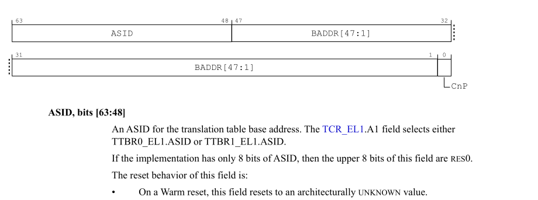

# ARM64 SPEC
ASID 是类似于x86的PCID, 用于在TLB中作为一个searchkey来标记
该tlb是哪个内存空间, 我们来看下arm64 ASID的相关内容:

* ASID bits

  在 `ID_AA64MMFR0_EL1.ASIDBits`中定义了ASID的bits: 

   

* switch asid

  `ttbr0_elx`很像是x86的cr3, x86的cr3可以指定pcid, 而`ttbr0_elx`也可以
  指定asid, 如下图:

   

  可以看到,一共16bits, 图片中也提到,如果asidbits为8, 高8bits是reserved


# ORG PATCH 代码分析

## asid 相关数据结构
```cpp
//FILE include/linux/mm_types.h
struct mm_struct {
    ...
    mm_context_t context;
    ...
};
//FILE arch/arm64/include/asm/mmu.h ---这个是arch 特定的
typedef struct {
        unsigned int id;
        raw_spinlock_t id_lock;
        void *vdso;
} mm_context_t;
```

其中id 表示 asid, 该字段是`unsigned int`, 32-bits, 但是asid
只有16 bits, 所以该字段有两部分:
```
31              15              0
|                |              |
  asid version         asid
```

内核中获取asid 可以通过下面的宏
```cpp
//FILE arch/arm64/include/asm/mmu.h
#define ASID(mm)        ((mm)->context.id & 0xffff)
```
那为什么有要区分两个字段呢, 我们来设想下面的场景:
> NOTE
>
> switch to (进程切换, 我们用 -> 表示

当 task1->task2时, 我们要不要flush task1 tlb ? 如下:
```
task comm           asid
a                   0
b(flush asid 0)     0
b(flush asid 1)     0
b(flush asid 2)     0
...
```

因为arm64 支持asid, 在cpu tlb 中可以共存多个地址空间的 
tlb entry. 上面这样做就体现不出asid的优点(可以共存多个地址空间tlb)
例如下面的场景:
```
task comm           asid
a                   0
b                   1
c                   2
d                   3

task switch         need flush
x->x                N
```
给进程a,b,c,d分配了自己的asid之后, 我们切换task, 就不用flush tlb,
而例如在 a->b的后, cpu中可能还存有b的tlb, 所以也会提高性能.这就是asid
的作用.

而在操作系统运行时, 我们采用什么样的asid分配策略呢,
因为8/16bits asidbits(这里我们假设为16bits), 
一时半会用不完, 我们一直往上累加asid, 这样进程每次都
是最新的, 如下:
```
task comm           asid
a                   0
b                   1
c                   2
d                   3
e                   4
...
```
但是其总会溢出16bits, 如下:
```
task comm           asid
aa                 0xffff
ab                 ???
```
当进程`aa`的asid为`0xffff`时, `ab`的asid该设置多少呢? 只能从头开
始, 设置为0, 这时, 我们相当于开启了新的一轮的tlb id allocate, 
当然, 此时我们可以只flush asid == 1 的 tlb, 但是就会有下面的
场景:
```
task comm                   asid
f                           0xfffe
aa                          0xffff
    flush asid 0
ab                          0
    flush asid 1
ac                          1
    flush asid 2
ad                          2
```
这样做有什么好处呢? 
假设, ab->f, 这时候, cpu可能还有f的tlb. 但是坏处是, 之后的每次切换都
需要flush tlb. kernel开发者们衡量之后, 是这样做的:
```
task comm                   asid
f                           0xfffe
aa                          0xffff
    flush ALL tlb
ab                          0
ac                          1
ad                          2
..
af                          0xfffe
```

在ab 分配asid之前,将所有tlb flush掉. 这样之后的asid的分配, 不再需要flush 
tlb.

在flush ALL tlb之后, cpu tlb中已经没有 进程`f`地址空间的 tlb entry了,
那么 `af->f`这时候也不需要刷tlb, 这个是怎么做到的呢, 就是上面我们提到的
version, 我们可以把 asid 在软件层面扩展成:(asid version , asid), 这样的二元结构:
```
task comm                   (asid_version, asid)
f                           (0,0xfffe)
aa                          (0,0xffff)
    flush ALL tlb
    bump version, current version is 1
ab                          (1,0)
...
af                          (1,0xfffe)
```
当`af->f`时, 发现`(1, 0xfffe) != (0,0xfffe)`, 所以不需要刷tlb. 但是切换f进程之前,可能
要重新获取下asid, `(0, 0xfffe) -> (1, 0xffff)`, 我们下面会详细分析代码

和asid 相关的一个主要流程,就是task switch, 和tlb 相关的一个重要的功能就是 lazy tlb, 
我们直接从 context_switch开始看.

## context_switch

我们直接从`context_switch`开始看:
```cpp
static inline void
context_switch(struct rq *rq, struct task_struct *prev,
               struct task_struct *next)
{
        ...
        mm = next->mm;
        ...
        //==(1)==
        if (!mm) {
                next->active_mm = oldmm;
                atomic_inc(&oldmm->mm_count);
                enter_lazy_tlb(oldmm, next);
        } else
        //==(2)==
                switch_mm(oldmm, mm, next);

        if (!prev->mm) {
                //如果是内核线程, 将 active_mm再次置为NULL
                prev->active_mm = NULL;
                rq->prev_mm = oldmm;
        }
        ...

}
```
1. 当为内核线程时, 可以进入lazy mode, 会执行 enter_lazy_tlb(),
   但是arm64并没有实现
   ```cpp
   /*
    * This is called when "tsk" is about to enter lazy TLB mode.
    *
    * mm:  describes the currently active mm context
    * tsk: task which is entering lazy tlb
    * cpu: cpu number which is entering lazy tlb
    *
    * tsk->mm will be NULL
    */
   static inline void
   enter_lazy_tlb(struct mm_struct *mm, struct task_struct *tsk)
   {
   }
   ```


下面我们详细分析 `switch_mm`

`switch_mm`:
```cpp
/*
 * This is the actual mm switch as far as the scheduler
 * is concerned.  No registers are touched.  We avoid
 * calling the CPU specific function when the mm hasn't
 * actually changed.
 */
static inline void
switch_mm(struct mm_struct *prev, struct mm_struct *next,
          struct task_struct *tsk)
{
        unsigned int cpu = smp_processor_id();

#ifdef CONFIG_SMP
        //flush icache 先不关注
        /* check for possible thread migration */
        if (!cpumask_empty(mm_cpumask(next)) &&
            !cpumask_test_cpu(cpu, mm_cpumask(next)))
                __flush_icache_all();
#endif
        //相当于判断如果当前cpu所在的地址空间不是 next, 则做切换
        //    mm_cpumask() 会统计那些cpu上运行的地址空间是该 mm
        if (!cpumask_test_and_set_cpu(cpu, mm_cpumask(next)) || prev != next)
                check_and_switch_context(next, tsk);
}

static inline void check_and_switch_context(struct mm_struct *mm,
                                            struct task_struct *tsk)
{
        /*
         * Required during context switch to avoid speculative page table
         * walking with the wrong TTBR.
         */
        cpu_set_reserved_ttbr0();
        
        /*
         * 这里会判断当前的 context.id version和 cpu_last_asid version
         * 异或的目的, 是看这两个是否相等, 异或为真, 则不相等, 所以这个if
         * 条件如果为真, 则表示 这两个 asid version 相同
         */
        //#define MAX_ASID_BITS   16
        if (!((mm->context.id ^ cpu_last_asid) >> MAX_ASID_BITS))
                /*
                 * The ASID is from the current generation, just switch to the
                 * new pgd. This condition is only true for calls from
                 * context_switch() and interrupts are already disabled.
                 *
                 * 该流程发生在 context_switch()上下文中, 并且之前获取过asid, 
                 * asid version 有是当前最新的version, 所以可以直接切换,
                 * 下面我们会详细讲 asid version 相关处理
                 */
                cpu_switch_mm(mm->pgd, mm);
        else if (irqs_disabled())
                /*
                 * Defer the new ASID allocation until after the context
                 * switch critical region since __new_context() cannot be
                 * called with interrupts disabled.
                 *
                 * 先不看这个
                 */
                set_ti_thread_flag(task_thread_info(tsk), TIF_SWITCH_MM);
        else
                /*
                 * That is a direct call to switch_mm() or activate_mm() with
                 * interrupts enabled and a new context.
                 *
                 * 这里要为进程分配新的asid, 因为要切换的task 可能使用的是old asid
                 * version, 所以
                 */
                switch_new_context(mm);
}
```

`switch_new_context`:
```cpp
static inline void switch_new_context(struct mm_struct *mm)
{
        unsigned long flags;

        __new_context(mm);

        local_irq_save(flags);
        cpu_switch_mm(mm->pgd, mm);
        local_irq_restore(flags);
}
```
大概有两件事:
* 分配新的asid -- `__new_context`
* 切换到新的 mm -- `cpu_switch_mm`

`__new_context`:
```cpp
void __new_context(struct mm_struct *mm)
{
        unsigned int asid;
        unsigned int bits = asid_bits();

        raw_spin_lock(&cpu_asid_lock);
#ifdef CONFIG_SMP
        /*
         * Check the ASID again, in case the change was broadcast from another
         * CPU before we acquired the lock.
         */
        //注释中提到可以收到其他CPU 的 braodcast(IPI), 然后,看起来会更改 mm->context.id
        //让其可能是新 version ? 跟 reset_context()流程有关,我们稍后看
        if (!unlikely((mm->context.id ^ cpu_last_asid) >> MAX_ASID_BITS)) {
                cpumask_set_cpu(smp_processor_id(), mm_cpumask(mm));
                raw_spin_unlock(&cpu_asid_lock);
                return;
        }
#endif
        /*
         * At this point, it is guaranteed that the current mm (with an old
         * ASID) isn't active on any other CPU since the ASIDs are changed
         * simultaneously via IPI.
         *
         * 什么意思呢???
         */
        asid = ++cpu_last_asid;

        /*
         * If we've used up all our ASIDs, we need to start a new version and
         * flush the TLB.
         */
        //这里说明asid 用完了, 需要 bump asid version
        if (unlikely((asid & ((1 << bits) - 1)) == 0)) {
                /* increment the ASID version */
                //这里会因为上面 ++cpu_last_asid 溢出一位,所以需要减去 
                //   - (1 << bits)
                cpu_last_asid += (1 << MAX_ASID_BITS) - (1 << bits);
                //如果整个的cpu_last_asid 都用完了, 也就是asid version 
                //也溢出了, 更新到ASID_FIRST_VERSION
                if (cpu_last_asid == 0)
                        cpu_last_asid = ASID_FIRST_VERSION;
                //==(1)==
                asid = cpu_last_asid + smp_processor_id();
                flush_context();
#ifdef CONFIG_SMP
                smp_wmb();
                //==(2)==
                smp_call_function(reset_context, NULL, 1);
#endif
                //==(3)==
                cpu_last_asid += NR_CPUS - 1;
        }
        //下面会讲
        set_mm_context(mm, asid);
        raw_spin_unlock(&cpu_asid_lock);
}
```
我们直接看, 比较关键的 `flush_context()`  和`reset_context`这两个流程:
1. `flush_context`
   ```cpp
   static void flush_context(void)
   {
           /* set the reserved TTBR0 before flushing the TLB */
           cpu_set_reserved_ttbr0();
           flush_tlb_all();
           if (icache_is_aivivt())
                   __flush_icache_all();
   }
   static inline void flush_tlb_all(void)
   {
           dsb();
           asm("tlbi       vmalle1is");
           dsb();
           isb();
   }
   ```
   这里调用的 tlbi 指令为 `vmalle1is`指令
   ```
   VMALLE1ISTLB invalidate by VMID, EL1, Inner Shareable.
   ```
   首先是无效该 VMID,这里可以认为是host, 并且是IS(broadcast)

   我们先看当前cpu的进程如何分配asid
   ```
   asid = cpu_last_asid + smp_processor_id()
   ```
   可以看到, 在 cpu_last_asid 后, 加了`smp_processor_id()` , 
   这样做是因为其他的cpu上的进程也得重新分配

   那么此时, 其他的进程应该如何做呢 ? 理论上来说,其他进程的TLB都已经被
   invalidate了, 使用老的asid已经没有意义了, 我们分两种情况:
   * 在其他cpu上运行:  立即重新分配asid
   * 没有在其他cpu上运行: 等调度到该进程时, 再重新分配asid
   
   这里立即分配,就需要发送ipi了, 我们来看 `reset_context`流程
2. `reset_context`
   ```cpp
   /*
    * Reset the ASID on the current CPU. This function call is broadcast from the
    * CPU handling the ASID rollover and holding cpu_asid_lock.
    */
   static void reset_context(void *info)
   {
           unsigned int asid;
           unsigned int cpu = smp_processor_id();
           struct mm_struct *mm = current->active_mm;
   
           smp_rmb();
           //重新获取asid
           asid = cpu_last_asid + cpu;
           //因为此时cpu还在跑, 所以可能会产生一些老的asid的tlb,
           //所以这里再flush下(那为什么还要用 IS 的tlbi指令呢)
           flush_context();
           //下面会讲这个函数, 这里作用, 主要是设置mm->context.id
           set_mm_context(mm, asid);
           //这里并不是为了切换内存空间,而是去修改asid, 我们下面
           //也会讲到这个函数
           /* set the new ASID */
           cpu_switch_mm(mm->pgd, mm);
   }
   ```
3. 前面讲到[0, NR_CPUS) 都被每个cpu上的进程申请了, 所以这里要加上

那么函数主要剩余两个:
* set_mm_context
  ```cpp
  static void set_mm_context(struct mm_struct *mm, unsigned int asid)
  {
          unsigned long flags;
  
          /*
           * Locking needed for multi-threaded applications where the same
           * mm->context.id could be set from different CPUs during the
           * broadcast. This function is also called via IPI so the
           * mm->context.id_lock has to be IRQ-safe.
           */
          raw_spin_lock_irqsave(&mm->context.id_lock, flags);
          //这里可能是reset_context流程调用, 当发起broadcast的cpu上的线程
          //和该线程属于一个进程, 那么这里条件就会为假,不用再更新asid
          if (likely((mm->context.id ^ cpu_last_asid) >> MAX_ASID_BITS)) {
                  /*
                   * Old version of ASID found. Set the new one and reset
                   * mm_cpumask(mm).
                   */
                  mm->context.id = asid;
                  cpumask_clear(mm_cpumask(mm));
          }
          raw_spin_unlock_irqrestore(&mm->context.id_lock, flags);
  
          /*
           * Set the mm_cpumask(mm) bit for the current CPU.
           */
          cpumask_set_cpu(smp_processor_id(), mm_cpumask(mm));
  }
  ```
* cpu_switch_mm
  ```cpp
  #define cpu_switch_mm(pgd,mm) cpu_do_switch_mm(virt_to_phys(pgd),mm) 
  ENTRY(cpu_do_switch_mm)
        mmid    w1, x1                          // get mm->context.id
        bfi     x0, x1, #48, #16                // set the ASID
        msr     ttbr0_el1, x0                   // set TTBR0
        isb
        ret
  ENDPROC(cpu_do_switch_mm)
  ```
  代码比较简单, 注释中都写清楚了, 不赘述. 总之 该流程为类似于x86的switch_cr3

那么, 我们这里思考下, 为什么arm64在该版本为什么没有实现lazy tlb. 原因如下:
1. x86_64 需要 tlb shootdown  flush 其他cpu的tlb, arm64 不需要
2. 目前arm64 flushtlb(tlbi) 的指令, 都是带着IS后缀的

我们知道, tlbi 指令可以不带 IS 后缀, 需要关注下后续的patch 会不会引入.

#  arm64 LAZY tlb
redhat 向社区提交了一个组patch, 是为了avoid alway flush tlb broadcast.

[MAIL LIST](https://lore.kernel.org/all/20200223192520.20808-1-aarcange@redhat.com/#r)

我们先看下PATCH 0 的 commit message  :
```
Subject: [PATCH 0/3] arm64: tlb: skip tlbi broadcast v2
Date: Sun, 23 Feb 2020 14:25:17 -0500	[thread overview]
Message-ID: <20200223192520.20808-1-aarcange@redhat.com> (raw)

Hello,

This is introducing a nr_active_mm that allows to optimize away the
tlbi broadcast also for multi threaded processes, it doesn't rely
anymore on mm_users <= 1.

引入 nr_active_mm, 该成员允许针对多线程优化掉tlbi broadcast, 它不再
依赖 mm_users <= 1.

This also optimizes away all TLB flushes (including local ones) when
the process is not running in any cpu (including during exit_mmap with
lazy tlb state).

这同时也优化掉 all TLB flushs(包括 local) , 当这个进程不在任何 CPU上 
running(包括在 具有 lazy tlb 状态的 exit_mmap期间)

This optimization is generally only observable when there are parallel
TLB flushes from different processes in multiple CPUs. One possible
use case is an userland malloc libs freeing small objects with
MADV_DONTNEED and causing a frequent tiny tlb flushes as demonstrated
by the tcmalloc testsuite.

这种优化通常 只在 多个CPU中 有来自不同进程并行进行TLB flush 才能观察到.
一个可能的用例是 用户态 mallic libs使用 MADV_DONTNEED 释放小的 objects
并且导致频繁的微小的tlb flush, 如tcmalloc 测试套件所示

All memory intensive apps dealing a multitude of frequently freed
small objects tend to opt-out of glibc and they opt-in jemalloc or
tcmalloc, so this should facilitate the SMP/NUMA scalability of long
lived apps with small objects running in different containers if
they're issuing frequent MADV_DONTNEED tlb flushes while the other
threads of the process are not running.

intensive [ɪnˈtensɪv] : 密集的
facilitate: 使...容易
scalability: 可扩展性

所有处理大量频繁释放 smallc objects的内存密集的apps 都会倾向于不使用 glibc
而引入 jemalloc 或者 tcmalloc, 所以这应该有助于 有smaill objects 运行在不同
containers的长期运行程序的SMP/NUMA 可扩展性, 如果他们频繁提交 MADV_DONTNEED
tlb flushs, 当其他进程的线程不再running的时.

I was suggested to implement the mm_cpumask the standard way in
order to optimize multithreaded apps too and to avoid restricting the
optimization to mm_users <= 1. So initially I had two bitmasks allocated
as shown at the bottom of this cover letter, by setting
ARCH_NR_MM_CPUMASK to 2 with the below patch applied... however I
figured a single atomic per-mm achieves the exact same runtime behavior
of the extra bitmap, so I just dropped the extra bitmap and I replaced
it with nr_active_mm as an optimization.

曾经有人建议我用标准的方式实现 mm_cpumask, 以优化多线程应用程序 并且避免
将优化限制在 mm_users <= 1. 所以最初我 alloc 两个 bitmasks, 正如 cover letter
底部展示的那样, 通过在应用下面补丁的情况下, 设置 ARCH_NR_MM_CPUMASK 为2...
但是我认为 single atomic per-mm 可以达到和增加一个额外的 bitmap 完全相同的
运行时行为, 所以我只是 dropped 了 extra bitmap 并且 我将其替换为 nr_active_mm
作为优化.

If the switch_mm atomic ops in the switch_mm fast path would be a
concern (they're still faster than the cpumask_set_cpu/clear_cpu, with
less than 256-512 CPUs), it's worth mentioning it'd be possible to
remove all atomic ops from the switch_mm fast path by restricting this
optimization to single threaded processes by checking mm_users <= 1
and < 1 instead of nr_active_mm <= 1 and < 1 similarly to what the
earlier version of this patchset was doing.

如果 switch_mm fast patch 中的 switch_mm atomic ops 是一个问题(在cpu 少于
256-512时, 他们仍然比 cpumask_set_cpu(), clear_cpu()快), 值得
一提的是通过检查 mm_users <=1 和 < 1 而不是nr_active_mm <= 1和 <1, 将这种优化
限制在单线程中, 可以在 switch_mm fast patch 中删除 所有的atomic ops, 这与
该补丁集早期的版本类似
```

## [PATCH 1/3] : mm: use_mm: fix for arches checking mm_users to optimize TLB flushes
COMMIT MESSAGE:
```
alpha, ia64, mips, powerpc, sh, sparc are relying on a check on
mm->mm_users to know if they can skip some remote TLB flushes for
single threaded processes.

...这些架构依赖检查 mm->mm_users 来知道他们是否可以对单线程程序跳过
一些 remote TLB flush

Most callers of use_mm() tend to invoke mmget_not_zero() or
get_task_mm() before use_mm() to ensure the mm will remain alive in
between use_mm() and unuse_mm().

大部分 use_mm() 的大部分的caller都倾向于在使用 use_mm()之前 调用 mmget_no_zero()
和 get_task_mm() 来保证在 use_mm()和 unuse_mm()之间该mm 仍然是
alive的

Some callers however don't increase mm_users and they instead rely on
serialization in __mmput() to ensure the mm will remain alive in
between use_mm() and unuse_mm(). Not increasing mm_users during
use_mm() is however unsafe for aforementioned arch TLB flushes
optimizations. So either mmget()/mmput() should be added to the
problematic callers of use_mm()/unuse_mm() or we can embed them in
use_mm()/unuse_mm() which is more robust.

aforementioned: 前面所述的,上述的
embed [ɪmˈbed]:  把...嵌入
robust [rəʊˈbʌst] : 强健的,坚固的

某些调用者并没有 inc mm_users 而他们通过以来 __mmput中的序列化?? 来保证
在 use_mm()和 unuse_mm()之前 mm 保持alive. 在 use_mm()期间不增加 mm_users
对于上述 arch TLB flush 来说是不安全的. 所以将 mmget()/mmput() 添加到
use_mm()/unuse_mm()有问题的调用者中,或者我们可以将他们嵌入到 use_mm()/unuse_mm()
中, 这样更健壮.
```

patch内容:
```diff
 mm/mmu_context.c | 2 ++
 1 file changed, 2 insertions(+)

diff --git a/mm/mmu_context.c b/mm/mmu_context.c
index 3e612ae748e9..ced0e1218c0f 100644
--- a/mm/mmu_context.c
+++ b/mm/mmu_context.c
@@ -30,6 +30,7 @@ void use_mm(struct mm_struct *mm)
 		mmgrab(mm);
 		tsk->active_mm = mm;
 	}
+	mmget(mm);
 	tsk->mm = mm;
 	switch_mm(active_mm, mm, tsk);
 	task_unlock(tsk);
@@ -57,6 +58,7 @@ void unuse_mm(struct mm_struct *mm)
 	task_lock(tsk);
 	sync_mm_rss(mm);
 	tsk->mm = NULL;
+	mmput(mm);
 	/* active_mm is still 'mm' */
 	enter_lazy_tlb(mm, tsk);
 	task_unlock(tsk);
```

## Patch 2 先不看
```
!!!!!!!!
遗留问题
!!!!!!!!
```
## [PATCH 3/3] arm64: tlb: skip tlbi broadcast
commit message:
```
With multiple NUMA nodes and multiple sockets, the tlbi broadcast
shall be delivered through the interconnects in turn increasing the
CPU interconnect traffic and the latency of the tlbi broadcast
instruction. To avoid the synchronous delivery of the tlbi broadcast
before the tlbi instruction can be retired, the hardware would need to
implement a replicated mm_cpumask bitflag for each ASID and every CPU
would need to tell every other CPU which ASID is being loaded. Exactly
what x86 does with mm_cpumask in software.

shall : 应; 可以, 会
interconnects: 相联系，相互联系，相互连接;
traffic: 信息流量;交通; 运输; 
replicated: 复制,再生,仿制的
Exactly:确切的, 准确的,一点不错, 正是如此,完全正确

在 multiple NUMA node和 multiple sockets的机器上, tlbi broadcast应通过
interconnect, 从而增加了 CPU interconnect traffic 和 tlbi broadcast 指令
的延迟. 为了避免在tlbi retired之前 同步delivery tlbi broadcast,  硬件将
需要为每个ASID 实现类似于 mm_cpumask bitflags, 并且每一个CPU 应该需要告
诉其他CPU, 该CPU load了哪个ASID. x86 在软件中对 mm_cpumask 的作用正是如此.

Even within a single NUMA node the latency of the tlbi broadcast
instruction increases almost linearly with the number of CPUs trying
to send tlbi broadcasts at the same time.

即使在 single NUMA node 中, tlbi broadcast 指令的延迟, 几乎随着要同时发送
tlbi broadcast的CPUs数量线性增加.

If a single thread of the process is running and it's also running in
the CPU issuing the TLB flush, or if no thread of the process are
running, we can achieve full SMP scalability in the arm64 TLB flushng
by skipping the tlbi broadcasting.

如果进程中的某个线程是running的, 并且它也在提交 TLB flush的CPU上运行, 或者是
进程中没有线程是running 的, 通过跳过 tlbi broadcast, 我们可以在 arm64 TLB flushing
中实现 full SMP scalability(???)

After the local TLB flush this means the ASID context goes out of sync
in all CPUs except the local one. This can be tracked on the per-mm
cpumask: if the bit is set it means the ASID context is stale for that
CPU. This results in an extra local ASID TLB flush only when threads
are running in new CPUs after a TLB flush.

在 local TLB flush 后,这意味着ASID context 在除了本地的CPU之外的所有CPU
都不同步. 这可以在 per-mm cpumask 跟踪到:
如果该bit被设置,意味着AISD context在该CPU上是stale. 只有当县城在TLB 刷新后,
在新的CPU 上运行时, 才会导致额外的local ASID TLB 刷新.

Skipping the tlbi instruction broadcasting is already implemented in
local_flush_tlb_all(), this patch only extends it to flush_tlb_mm(),
flush_tlb_range() and flush_tlb_page() too.

skip tlbi instruction broadcast 已经在 local_flush_tlb_all()中实现, 该patch只是
将其扩展到 flush_tlb_mm() flush_tlb_range() flush_tlb_page()中.

The below benchmarks are measured on a non-NUMA 32 CPUs system (ARMv8
Ampere), so it should be far from a worst case scenario: the
enterprise kernel config allows multiple NUMA nodes with NR_CPUS set
by default to 4096.

enterprise : 事业;事业单位; 企业单位; 公司; 商号; 商行: (企业版)

下面的benchmark 在 non-NUMA 32 CPUs system(ARMv8 Ampere) 中测试, 所以
这远远达不到最坏的情况:
  enterprise kernel 允许配置默认设置为4096 的NR_CPUs的mulitple NUMA node
```

所以, 根据作者描述, tlbi broadcast在多NUMA机器上会造成一些性能问题,而在
单NUMA , 多个CPU 同时发出TLBI指令,也会造成性能问题. 目前硬件没有实现类似
于根据 mm_cpumask 选择某些cpu broadcast 的逻辑, 需要软件去做.

作者这边是这么想的:

<!--
假设A进程有线程a1, a2, B进程有线程b
```
CPU0                        CPU1
running a1                  running a2
modify pgtable
flush_tlb {
  flush_local
  mask CPU1 in 

}

```
-->

我们来看下patch code

> NOTE
>
> 该patch未合入社区, 所以找的主线分支日期相近的commit,来分析代码:
> ```
> commit 39f3b41aa7cae917f928ef9f31d09da28188e5ed (HEAD -> before_2020_2_23)
> Author: Paolo Abeni <pabeni@redhat.com>
> Date:   Fri Feb 21 19:42:13 2020 +0100
> 
>     net: genetlink: return the error code when attribute parsing fails.
> ```

## 数据结构变动
```cpp
diff --git a/arch/arm64/include/asm/mmu.h b/arch/arm64/include/asm/mmu.h
index e4d862420bb4..9072fd7bc5f8 100644
--- a/arch/arm64/include/asm/mmu.h
+++ b/arch/arm64/include/asm/mmu.h
@@ -20,6 +20,7 @@ typedef struct {
 	atomic64_t	id;
 	void		*vdso;
 	unsigned long	flags;
+	atomic_t	nr_active_mm;
 } mm_context_t;
```

在将x86 lazy tlb 时提到过, `mm_context_t` 是`mm_struct`中定义:
```cpp
struct mm_struct {
    ...
    mm_context_t context;
    ...
};
```

**nr_active_mm**: 表示当前mm_struct 目前正在CPU上RUNNING的数量

我们来看下其该值的变动:
* init:
  ```diff
  -#define init_new_context(tsk,mm)	({ atomic64_set(&(mm)->context.id, 0); 0; })
  +#define init_new_context(tsk,mm)			\
  +	({ atomic64_set(&(mm)->context.id, 0);		\
  +	   atomic_set(&(mm)->context.nr_active_mm, 0);	\
  +	   0; })
  ```
  初始化为0, 表示没有在任何CPU上RUNNING
* dec/inc in `switch_mm`/`enter_lazy_tlb`

  看这两个函数的流程需要理解`cpu_not_lazy_tlb` global vars, 以及进程切换的流程(`context_switch`)
  我们下面分析

## global vars

新增`cpu_not_lazy_tlb`
```cpp
diff --git a/arch/arm64/mm/context.c b/arch/arm64/mm/context.c
index 8ef73e89d514..3152b7f7da12 100644
--- a/arch/arm64/mm/context.c
+++ b/arch/arm64/mm/context.c
@@ -25,6 +25,7 @@ static unsigned long *asid_map;
 static DEFINE_PER_CPU(atomic64_t, active_asids);
 static DEFINE_PER_CPU(u64, reserved_asids);
 static cpumask_t tlb_flush_pending;
+DEFINE_PER_CPU(bool, cpu_not_lazy_tlb);
```
可以看到是bool 类型的 per-cpu 变量. 表示当前CPU 的状态是:
* **non lazy mode**: true
* **lazy_mode**: false

该值初始化为0, 表示在切换第一个进程之前是 non lazy mode, (idle switch to others)
没毛病.

## 代码改动
我们先看下和进程切换相关的代码改动
### context_switch
* `enter_lazy_tlb`
  ```diff
  //==(1)==调用关系
   static inline void
   enter_lazy_tlb(struct mm_struct *mm, struct task_struct *tsk)
   {
  +        unsigned int cpu = smp_processor_id();
           /*
            * 这里判断如果当前cpu不是 lazy tlb(prev不是内核线程),
            * 并且要切换的线程不是idle task, 则该cpu 则进如lazy 
            * mode :
            *   per_cpu(cpu_not_lazy_tlb, cpu) = false
            */
  +        if (per_cpu(cpu_not_lazy_tlb, cpu) &&
  +            is_idle_task(tsk)) {
  +                per_cpu(cpu_not_lazy_tlb, cpu) = false;
  +                if (!system_uses_ttbr0_pan())
  +                         cpu_set_reserved_ttbr0();
  +                 //==(2)==
  +                atomic_dec(&mm->context.nr_active_mm);
  +        }
  +        VM_WARN_ON(atomic_read(&mm->context.nr_active_mm) < 0);
  ```
  1. 之前我们讲过,当我们切换到内核线程时, 会执行 `enter_lazy_tlb`
     ```cpp
     context_switch()
     {
             ...
             if (!next->mm) {                                // to kernel
                     enter_lazy_tlb(prev->active_mm, next);
                     
                     next->active_mm = prev->active_mm;
                     if (prev->mm)                           // from user
                             mmgrab(prev->active_mm);
                     else
                             prev->active_mm = NULL;
             } else {
             ...
     }
     ```
  2. 这里需要注意, 如果进入lazy mode, 则需要dec `nr_active_mmf`, 因为
     当前线程切出去了, 运行的是内核线程, 该线程不会访问用户空间, 所以
     不会使用用户空间 VA range 相关的tlb. 所以, 也就相当于NOT RUNNING on
     this CPU
     > NOTE
     >
     > 这里我们不关注PAN 的特性, 在没有PAN 的特性下, `enter_lazy_tlb`不会
     > 切换ttbr0(可以认为用户态CR3)

* `switch_mm`
  ```diff
  //==(1)==(调用关系)
   switch_mm(struct mm_struct *prev, struct mm_struct *next,
   	  struct task_struct *tsk)
   {
  -        if (prev != next)
  -                __switch_mm(next);
  +        unsigned int cpu = smp_processor_id();
  +        //==(2)==
  +        if (!per_cpu(cpu_not_lazy_tlb, cpu)) {
  +                per_cpu(cpu_not_lazy_tlb, cpu) = true;
  +                atomic_inc(&next->context.nr_active_mm);
  +                __switch_mm(next, cpu);
  +        //==(3)==
  +        } else if (prev != next) {
  +                atomic_inc(&next->context.nr_active_mm);
  +                __switch_mm(next, cpu);
  +                atomic_dec(&prev->context.nr_active_mm);
  +        }
  +        VM_WARN_ON(!atomic_read(&next->context.nr_active_mm));
  +        VM_WARN_ON(atomic_read(&prev->context.nr_active_mm) < 0);
  ```
  1. 和上面的流程类似在`context_switch()`调度到非内核线程时会调用到`switch_mm`
     ```cpp
     context_switch()
     {
             ...
             if (!next_mm) {
                    ...
             } else {
                    ...
                    switch_mm_irqs_off(prev->active_mm, next->mm, next);
                    ...
             }
             ...
     }
     /*
      * arm64 没有自定义 switch_mm_irq_off
      * 
      * 所以使用通用头文件: linux/mmu_context 的定义:
      */
     #ifndef switch_mm_irqs_off
     # define switch_mm_irqs_off switch_mm
     #endif
     ```
  2. 当判断switch之前的CPU 是lazy mode时, 需要做:
     * 切换为 NOT lazy mode(因为即将切换为用户态线程)
     * `inc(nr_active_mm)` 理由同上, 该用户线程即将运行, 并且因为是用户线程,
       所以可能访问用户空间
     * `__switch_mm()`: 切换进程
  3. 同理, 如果switch 之前的CPU 不是 lazy mode, 说明为用户态线程, 需要做:
     * `inc(next.nr_active_mm)`
     * `__switch_mm()`
     * `dec(prev.nr_active_mm)`

     不再赘述原因.

我们知道lazy tlb 实现的目的是, 发起tlb shootdown (broadcast flush)时, 如果
其他cpu 没有运行当前发起 tlb shootdown 进程的其他线程, 则不刷, 等该CPU 
switch到该进程的其他线程时, 再刷.

所以我们接下来需要关注两点:
* `switch_mm()` (切回发起进程的其他线程)中有关lazy tlb flush 的流程
* `flush_tlb()`(发起tlb shootdown), 这个比较特殊, 因为arm64不能选择让哪些CPU刷,
  哪些cpu不刷, 只能是要么全都刷,要么全都不刷,要么flush local.(当前也可以学习
  x86, 直接发IPI, stop other cpu, 但是这样做舍本逐末了不是).

为了连贯,我们先看进程切换流程:

### lazy flush in switch_mm
```diff
/*
 * 该patch增加了__switch_mm的参数:cpu, 原因是在switch_mm 中变动中, 增加了
 * 获取当前cpu的流程,所以这里没有必要在获取一次了
 */
-static inline void __switch_mm(struct mm_struct *next)
+ static inline void __switch_mm(struct mm_struct *next, unsigned int cpu)
{
-       unsigned int cpu = smp_processor_id();
        /*
         * init_mm.pgd does not contain any user mappings and it is always
         * active for kernel addresses in TTBR1. Just set the reserved TTBR0.
         */
        if (next == &init_mm) {
                cpu_set_reserved_ttbr0();
                return;
        }

        check_and_switch_context(next, cpu);
}
```

`check_and_switch_context`:
```diff
void check_and_switch_context(struct mm_struct *mm, unsigned int cpu)
{
        unsigned long flags;
        u64 asid, old_active_asid;

        if (system_supports_cnp())
                cpu_set_reserved_ttbr0();

        asid = atomic64_read(&mm->context.id);

        /*
         * The memory ordering here is subtle.
         * If our active_asids is non-zero and the ASID matches the current
         * generation, then we update the active_asids entry with a relaxed
         * cmpxchg. Racing with a concurrent rollover means that either:
         *
         * - We get a zero back from the cmpxchg and end up waiting on the
         *   lock. Taking the lock synchronises with the rollover and so
         *   we are forced to see the updated generation.
         *
         * - We get a valid ASID back from the cmpxchg, which means the
         *   relaxed xchg in flush_context will treat us as reserved
         *   because atomic RmWs are totally ordered for a given location.
         */
        old_active_asid = atomic64_read(&per_cpu(active_asids, cpu));
        if (old_active_asid &&
            !((asid ^ atomic64_read(&asid_generation)) >> asid_bits) &&
            atomic64_cmpxchg_relaxed(&per_cpu(active_asids, cpu),
                                     old_active_asid, asid))
                goto switch_mm_fastpath;

        raw_spin_lock_irqsave(&cpu_asid_lock, flags);
        /* Check that our ASID belongs to the current generation. */
        asid = atomic64_read(&mm->context.id);
        if ((asid ^ atomic64_read(&asid_generation)) >> asid_bits) {
                asid = new_context(mm);
                atomic64_set(&mm->context.id, asid);
        }

        if (cpumask_test_and_clear_cpu(cpu, &tlb_flush_pending))
                local_flush_tlb_all();

        atomic64_set(&per_cpu(active_asids, cpu), asid);
        raw_spin_unlock_irqrestore(&cpu_asid_lock, flags);

switch_mm_fastpath:
+       /*
+        * Enforce CPU ordering between the atomic_inc(nr_active_mm)
+        * in switch_mm() and the below cpumask_test_cpu(mm_cpumask).
+        */
        //这里增加了一个内存屏障,由于不了解arm64 memory model , 暂不分析
        /*
         * !!!!!!!!
         * 遗留问题
         * !!!!!!!!
         */
+       smp_mb();
+       if (cpumask_test_cpu(cpu, mm_cpumask(mm))) {
+       	cpumask_clear_cpu(cpu, mm_cpumask(mm));
+       	local_flush_tlb_asid(asid);
+       }
 
        arm64_apply_bp_hardening();

        /*
         * Defer TTBR0_EL1 setting for user threads to uaccess_enable() when
         * emulating PAN.
         */
        if (!system_uses_ttbr0_pan())
                cpu_switch_mm(mm->pgd, mm);
}
```
该代码和ORG PATCH, 有一些差异, 我们先暂时忽略这些差异,只关注下`switch_mm_fastpath`,
能走到该位置, 即说明已经选择好了asid (`mm->context.id`), 接下来要进行进程切换了,
`mm_cpumask(mm)`实际记录的是stale tlb cpu, 如果有该CPU 的bit, 说明该cpu的该asid(mm)的
tlb 是stale的, 需要在切回该内存空间时, invalidate 掉.
```diff
+static inline void local_flush_tlb_asid(unsigned long asid)
+{
+	asid = __TLBI_VADDR(0, __ASID(asid));
+	dsb(nshst);
+	__tlbi(aside1, asid);
+	__tlbi_user(aside1, asid);
+	dsb(nsh);
+}
```
> NOTE
>
> 我们先不关注__tlbi(), __tlbi_user()看起来是使用了不同的asid

可以看到是刷新整个asid的tlb.

我们接下来看, 在flush tlb 发起时, 如何 skip tlbi broadcast

### skip tlbi broadcast in tlb flush initiator
上面提到过 arm64 的flush 方式有三种:
* 全都刷: TLB_FLUSH_BROADCAST
* 全都不刷: TLB_FLUSH_NO
* 只刷本地: TLB_FLUSH_LOCAL
```diff
+enum tlb_flush_types {
+	TLB_FLUSH_NO,
+	TLB_FLUSH_LOCAL,
+	TLB_FLUSH_BROADCAST,
+};
```

我们这里以比较复杂的 `__flush_tlb_range`为例:
> NOTE
> 
> 作者修改了`__flush_tlb_range`, `flush_tlb_page`, `flush_tlb_mm`
> 使其都会选择 skip tlbi broadcast, 使用 lazy tlb flush

```diff
@@ -198,6 +262,31 @@ static inline void __flush_tlb_range(struct vm_area_struct *vma,
 	start = __TLBI_VADDR(start, asid);
 	end = __TLBI_VADDR(end, asid);
 
+	flush = tlb_flush_check(mm, get_cpu());
+	switch (flush) {
+	case TLB_FLUSH_LOCAL:
+
+		dsb(nshst);
+		for (addr = start; addr < end; addr += stride) {
+			if (last_level) {
+				__tlbi(vale1, addr);
+				__tlbi_user(vale1, addr);
+			} else {
+				__tlbi(vae1, addr);
+				__tlbi_user(vae1, addr);
+			}
+		}
+		dsb(nsh);
+
+		/* fall through */
+	case TLB_FLUSH_NO:
+		put_cpu();
+		return;
+	case TLB_FLUSH_BROADCAST:
+		break;
+	}
+	put_cpu();
```
代码也比较简单, 先调用`tlb_flush_check`选择哪种 flush方式, 然后
在执行相应的流程, 所以重点在 `tlb_flush_check`:
```cpp
enum tlb_flush_types tlb_flush_check(struct mm_struct *mm, unsigned int cpu)
{
    // nr_active_mm 如果 > 1, 则说明至少有一个另外的线程在其他cpu上运行,
    // 所以只能选择broadcast
    if (atomic_read(&mm->context.nr_active_mm) <= 1) {
        /*
         * is_local的为真的条件是同时满足:
         *   1. 当前线程就是要flush tlb 的用户态线程
         *      或者是,内核线程, 但是该内核线程的active_mm就是mm
         *      (也就是mm的线程,调度到内核线程的. 也就是说, 该线程
         *      内存空间就是用户态线程的内存空间)
         *   2. 并且当前cpu 不处于 lazy mode(那也就是说不是内核线程)
         *
         * 所以综上所述, 就是该用户线程的上下文
         */
        bool is_local = current->active_mm == mm &&
            per_cpu(cpu_not_lazy_tlb, cpu);
        //获取stale cpu mask
        cpumask_t *stale_cpumask = mm_cpumask(mm);
        //获取其下一个非0的cpubit
        unsigned int next_zero = cpumask_next_zero(-1, stale_cpumask);
        /*
         * local_is_clear: 
         *   在这个路径中, 只要 context.nr_active_mm == 1, 则需要flush local,
         *   但是我们需要关心, stale_cpumask 中该cpu是不是stale, 如果不是, 
         *   则需要clear一下, 所以local_is_clear就是表示该cpu的 stale_cpumask
         *   是clear的. 如果true ,就不需要清了
         */
        bool local_is_clear = false;
        /*
         * 看下这三个条件:
         *   + next_zero < nr_cpu_ids : 说明有 stale的 cpu bits
         *   + is_local: 说明 当前cpu运行的上下文是当前要flush的用户线程
         *   + next_zero == cpu, 说明该cpu 的 tlb 已经是 不是 stale的了
         *
         *     但是
         *      switch to current
         *        inc nr_active_mm
         *        clear this cpu stale_cpumask
         *
         *     这样来看, switch到这个线程后, 只要做完了 clear stale_cpumask,
         *     那应该其发起 tlb_flush_check 就不会再有 该cpu的 stale_cpumask
         *
         *  综上来看, 我们只需要flush local, 不再需要处理 stale_cpumask
         *  所以 local_is_clear = true,
         */
        if (next_zero < nr_cpu_ids &&
            (is_local && next_zero == cpu)) { next_zero = cpumask_next_zero(next_zero, stale_cpumask);
            local_is_clear = true;
        }
        /*
         * 分情况来看:
         * 1. if (next_zero >= nr_cpu_ids)
         *    说明, 所有的cpu 都是 stale的, 包括当前的cpu, 所以local_is_clear = false,
         *    这时, 我们不需要在设置一遍 stale_cpumask
         * 2. 如果 if (next_zero < nr_cpu_ids && !local)
         *    说明:
         *    1). 有cpu 不是stale的, 索性将所有的stale_cpumask 在set一下
         *    2). 当前cpu上运行的不是要flush的mm, 之后可能会切回mm所在的线程,
         *        不如在这里flush local, 另外把stale_cpumask中该cpu的bit clear,
         *        所以这里会设置 local_is_clear = false
         * 3. if (next_zero < nr_cpu_ids && is_local && next_zero != cpu)
         *    说明:
         *    当前cpu 不是stale ,但是有另外一个/几个cpu是stale的, 所以索性将所有
         *    stale_cpumask上, 并且设置 local_is_clear = false
         * 4. if (next_zero < nr_cpu_ids && is_local && next_zero == cpu && 
         *         next_next_zero < nr_cpu_ids)
         *    说明:
         *    当前cpu是stale的, 还有另外一个/几个cpu 是stale的, 所以索性将所有
         *    stale_cpumask上, 并且设置 local_is_clear
         */
        /*
         * 综上所述, 就是要将所有除了当前cpu的其他cpu stale_cpumask上, 并且
         * 如果当前cpu设置了mask, 则clear
         */
        //如果没有 next zero, 说明其他的cpu 都是stale的, 不需要在标记,
        //如果有, 索性 将所有的cpu都设置为上
        if (next_zero < nr_cpu_ids) {
            cpumask_setall(stale_cpumask);
            local_is_clear = false;
        }
        
        /*
         * Enforce CPU ordering between the above
         * cpumask_setall(mm_cpumask) and the below
         * atomic_read(nr_active_mm).
         */
        smp_mb();
        //这里会再次判断下, 尽量能skip braodcast 
        if (likely(atomic_read(&mm->context.nr_active_mm)) <= 1) {
            //is_local 如果能进来, 在这里一定返回 TLB_FLUSH_LOCAL
        	if (is_local) {
                //说明当前只有一个线程在运行, 所以这里只需要flush local
        		if (!local_is_clear)
        			cpumask_clear_cpu(cpu, stale_cpumask);
        		return TLB_FLUSH_LOCAL;
            }
            /* 
             * 执行到这里, 说明不是刷新的不是当前线程, 而该线程,可能在
             * 其他的cpu 上运行, 所以需要判断下, 该线程还有没有在其他cpu上
             * 运行:
             *    * nr_active_mm !=0 : 有, TLB_FLUSH_BROADCAST
             *    * nr_active_mm == 0: 没有, 不需要刷, 等调度回来再刷
             */
        	if (atomic_read(&mm->context.nr_active_mm) == 0)
        		return TLB_FLUSH_NO;
        }
    }
    /*
     * 但是需要注意的是, TLB_FLUSH_BROADCAST, 并不会去修改其他cpu的
     * stale_cpumask.
     * 
     * 一方面, 如果本次是partial flush, 则不能去修改stale, 因为可能
     * 本次flush broadcast, 并不能flush 掉所有的stale tlb
     *
     * 另一方面,也是最重要的,
     * 即使是full flush, 也可能有一些race的点, 我们下面会介绍到 所以我
     * 们要做的是flush 发起者只能set stale_cpumask, 而clear动作只能
     * 进行local flush的流程做
     */
    return TLB_FLUSH_BROADCAST;
}
```

我们需要考虑下, 我们知道 broadcast是硬件保证的,没有问题, 那么这里, 我们
需要关注下lazy tlb local flush 会不会漏掉
```
CPU 0                                   CPU 1
tlb_flush_check {
    if (nr_active_mm <= 1)
    {
                                        switch_mm {
                                            atomic_inc(nr_active_mm)
                                            cpumask_test_cpu() {
                                               cpumask_clear_cpu()
                                               local_flush_tlb_asid()
                                            }
                                        }
                                        return userspace {
                                            use stale tlb
                                        }
        cpumask_setall()
        if (nr_active_mm > 1) 
           TLB_FLUSH_BROADCAST
                                            use unstale tlb
        else
           TLB_FLUSH_LOCAL
    }
    TLB_FLUSH_BROADCAST
}
```
这里我们无论如何调整, 其实都不会有race的情况,
这里有一个比较精妙的点, 就是作者在`cpumask_setall()`之后, 
又去判断了下`nr_active_mm`, 这样做了,我们无论如何改变switch_mm
和 tlb_flush_check子流程的顺序,都不会有问题
