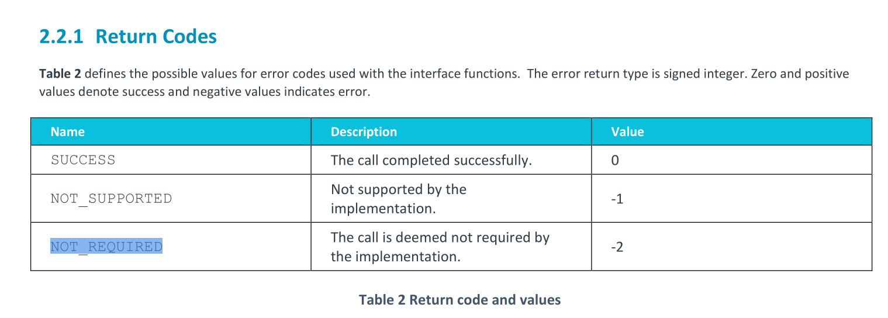

# Patch
```diff
From eff0e9e1078ea7dc1d794dc50e31baef984c46d7 Mon Sep 17 00:00:00 2001
From: Marc Zyngier <marc.zyngier@arm.com>
Date: Tue, 29 May 2018 13:11:05 +0100
Subject: [PATCH 01/14] arm/arm64: smccc: Add SMCCC-specific return codes

We've so far used the PSCI return codes for SMCCC because they
were extremely similar. But with the new ARM DEN 0070A specification,
"NOT_REQUIRED" (-2) is clashing with PSCI's "PSCI_RET_INVALID_PARAMS".

extremely : 尽可能的; 极大程度的
clash : 冲突

Let's bite the bullet and add SMCCC specific return codes. Users
can be repainted as and when required.

bite the bullet : 咬紧牙关; 迎难而上
repainted : 重新绘制

Acked-by: Will Deacon <will.deacon@arm.com>
Reviewed-by: Mark Rutland <mark.rutland@arm.com>
Signed-off-by: Marc Zyngier <marc.zyngier@arm.com>
Signed-off-by: Catalin Marinas <catalin.marinas@arm.com>
---
 include/linux/arm-smccc.h | 5 +++++
 1 file changed, 5 insertions(+)

diff --git a/include/linux/arm-smccc.h b/include/linux/arm-smccc.h
index a031897fca76..c89da86de99f 100644
--- a/include/linux/arm-smccc.h
+++ b/include/linux/arm-smccc.h
@@ -291,5 +291,10 @@ asmlinkage void __arm_smccc_hvc(unsigned long a0, unsigned long a1,
  */
 #define arm_smccc_1_1_hvc(...)	__arm_smccc_1_1(SMCCC_HVC_INST, __VA_ARGS__)
 
+/* Return codes defined in ARM DEN 0070A */
+#define SMCCC_RET_SUCCESS			0
+#define SMCCC_RET_NOT_SUPPORTED			-1
+#define SMCCC_RET_NOT_REQUIRED			-2
+
 #endif /*__ASSEMBLY__*/
 #endif /*__LINUX_ARM_SMCCC_H*/
-- 
2.39.0
```
# PSCI return value && SMCCC



