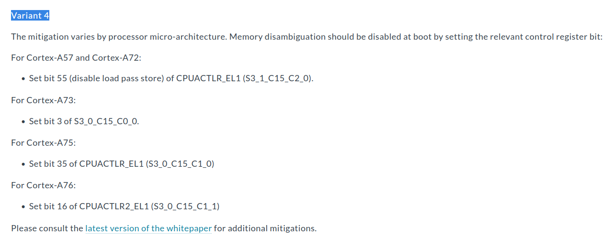
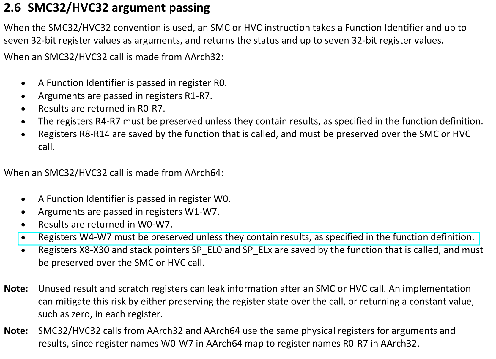
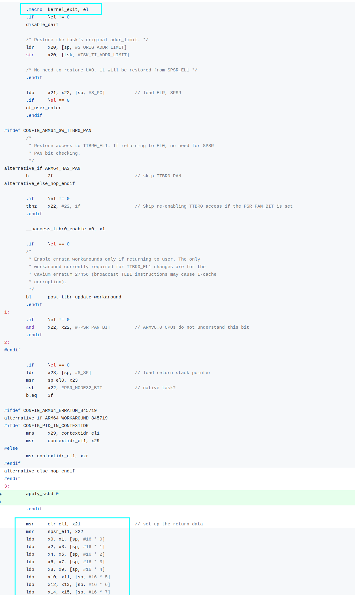

```diff
From 8e2906245f1e3b0d027169d9f2e55ce0548cb96e Mon Sep 17 00:00:00 2001
From: Marc Zyngier <marc.zyngier@arm.com>
Date: Tue, 29 May 2018 13:11:06 +0100
Subject: [PATCH 02/14] arm64: Call ARCH_WORKAROUND_2 on transitions between
 EL0 and EL1

In order for the kernel to protect itself, let's call the SSBD mitigation
implemented by the higher exception level (either hypervisor or firmware)
on each transition between userspace and kernel.

为了实现让kernel保护本身，让我们在每次的 userspace 和 kernel 切换中(U->K, K->V)，
调用 SSBD mitigation, 该功能由更高异常等级实现( hypervisor或者 firmware )

We must take the PSCI conduit into account in order to target the
right exception level, hence the introduction of a runtime patching
callback.

NOTE: PSCI conduit 可以在 device tree 或者 acpi FADT.arm_boot_flags中获取到是
使用 PSCI_CONDUIT_HVC, 还是 PSCI_CONDUIT_SMC 
[SMC Calling Convention]() 2.5.3 Conduits 章节中有讲到

所以这里使用了热补丁的方式动态确定

Reviewed-by: Mark Rutland <mark.rutland@arm.com>
Reviewed-by: Julien Grall <julien.grall@arm.com>
Acked-by: Will Deacon <will.deacon@arm.com>
Signed-off-by: Marc Zyngier <marc.zyngier@arm.com>
Signed-off-by: Catalin Marinas <catalin.marinas@arm.com>
---
 arch/arm64/kernel/cpu_errata.c | 24 ++++++++++++++++++++++++
 arch/arm64/kernel/entry.S      | 22 ++++++++++++++++++++++
 include/linux/arm-smccc.h      |  5 +++++
 3 files changed, 51 insertions(+)

diff --git a/arch/arm64/kernel/cpu_errata.c b/arch/arm64/kernel/cpu_errata.c
index a900befadfe8..c1eda6be7758 100644
--- a/arch/arm64/kernel/cpu_errata.c
+++ b/arch/arm64/kernel/cpu_errata.c
@@ -232,6 +232,30 @@ enable_smccc_arch_workaround_1(const struct arm64_cpu_capabilities *entry)
 }
 #endif	/* CONFIG_HARDEN_BRANCH_PREDICTOR */
 
+#ifdef CONFIG_ARM64_SSBD
+void __init arm64_update_smccc_conduit(struct alt_instr *alt,
+				       __le32 *origptr, __le32 *updptr,
+				       int nr_inst)
+{
+	u32 insn;
+
+	BUG_ON(nr_inst != 1);
+
+	switch (psci_ops.conduit) {
+	case PSCI_CONDUIT_HVC:
+		insn = aarch64_insn_get_hvc_value();
+		break;
+	case PSCI_CONDUIT_SMC:
+		insn = aarch64_insn_get_smc_value();
+		break;
+	default:
+		return;
+	}
+
+	*updptr = cpu_to_le32(insn);
+}
+#endif	/* CONFIG_ARM64_SSBD */
+
 #define CAP_MIDR_RANGE(model, v_min, r_min, v_max, r_max)	\
 	.matches = is_affected_midr_range,			\
 	.midr_range = MIDR_RANGE(model, v_min, r_min, v_max, r_max)
diff --git a/arch/arm64/kernel/entry.S b/arch/arm64/kernel/entry.S
index ec2ee720e33e..f33e6aed3037 100644
--- a/arch/arm64/kernel/entry.S
+++ b/arch/arm64/kernel/entry.S
@@ -18,6 +18,7 @@
  * along with this program.  If not, see <http://www.gnu.org/licenses/>.
  */
 
+#include <linux/arm-smccc.h>
 #include <linux/init.h>
 #include <linux/linkage.h>
//============(1)=============== 
@@ -137,6 +138,18 @@ alternative_else_nop_endif
 	add	\dst, \dst, #(\sym - .entry.tramp.text)
 	.endm
 
+	// This macro corrupts x0-x3. It is the caller's duty
+	// to save/restore them if required.
+	.macro	apply_ssbd, state
+#ifdef CONFIG_ARM64_SSBD
+	mov	w0, #ARM_SMCCC_ARCH_WORKAROUND_2
+	mov	w1, #\state
+alternative_cb	arm64_update_smccc_conduit
+	nop					// Patched to SMC/HVC #0
+alternative_cb_end
+#endif
+	.endm
+
 	.macro	kernel_entry, el, regsize = 64
 	.if	\regsize == 32
 	mov	w0, w0				// zero upper 32 bits of x0
@@ -163,6 +176,13 @@ alternative_else_nop_endif
 	ldr	x19, [tsk, #TSK_TI_FLAGS]	// since we can unmask debug
 	disable_step_tsk x19, x20		// exceptions when scheduling.
//===============(2)================= 
+	apply_ssbd 1
+
+#ifdef CONFIG_ARM64_SSBD
+	ldp	x0, x1, [sp, #16 * 0]
+	ldp	x2, x3, [sp, #16 * 1]
+#endif
+
 	mov	x29, xzr			// fp pointed to user-space
 	.else
 	add	x21, sp, #S_FRAME_SIZE
@@ -303,6 +323,8 @@ alternative_if ARM64_WORKAROUND_845719
 alternative_else_nop_endif
 #endif
 3:
 //==============(3)==================
+	apply_ssbd 0
+
 	.endif
 
 	msr	elr_el1, x21			// set up the return data
diff --git a/include/linux/arm-smccc.h b/include/linux/arm-smccc.h
index c89da86de99f..ca1d2cc2cdfa 100644
--- a/include/linux/arm-smccc.h
+++ b/include/linux/arm-smccc.h
@@ -80,6 +80,11 @@
 			   ARM_SMCCC_SMC_32,				\
 			   0, 0x8000)

//===============(4)====================
+#define ARM_SMCCC_ARCH_WORKAROUND_2					\
+	ARM_SMCCC_CALL_VAL(ARM_SMCCC_FAST_CALL,				\
+			   ARM_SMCCC_SMC_32,				\
+			   0, 0x7fff)
+
 #ifndef __ASSEMBLY__
 
 #include <linux/linkage.h>
-- 
2.39.0
```

1. `apply_ssbd()`宏有一个参数: state, 是`SMCCC 
ARM_SMCCC_ARCH_WORKAROUND_2`的另一个参数


> NOTE: 关于 SMCCC WORKAROUND_2的具体作用和实现方式
> 我们这里简单展开，大概的作用是可以 mitigation 
> CVE-2018-3639, 也就是 ssb 带来的幽灵漏洞。
>
> 至于实现每个CPU版本实现的方式不同, 如下图所示:
>
> 
>
> 上面的信息来自于: 
>
> [Speculative Processor Vulnerability](http://www.irmak-bilgisayar.com/speculative-processor-vulnerability.html)

2. 这个地方代码看不出来加在哪里，我们展开看下：


其实在开始进入异常，在`kernel_entry()`流程保存了通用寄存器上下文后.
不过这里 从堆栈中恢复了`x0, x1, x2, x3`, 这里我们看 `apply_ssbd()`
函数只是使用了x0, x1, 但是实际上 `SMCCC` 中有对参数传递的要求，
我们来看:



可以看到, 在参数传递中:
* `w0` 用于传入 function_id
* `w1-w7`可以用于参数传递
* `w0-w7`用于保存 return value
* **w4-w7 在整个过程收是受保护的除非他们也保存了 return value, 这个会在
 具体的function_id中有说明(也侧面说，w0-w3是不受保护的)**

那么这个地方就比较明确了，恢复[x0, x3]的值（但是目前看代码没有发现
后面的程序有对这些寄存器使用 )

3. 同样我们也展开下这部分代码:



这部分代码在kernel_exit比较靠后的位置（在恢复现场之前)

4. 对于 smccc 有两种调用方式, yield call和 fast call, 
这里使用的是fast call 指的是，对于调用的PE来说，看起来是一个原子
操作。这里就不再展开。 解释下各个参数:
* ARM_SMCCC_FAST_CALL： bits 31： 表示 Fast call
* ARM_SMCCC_SMC_32: 表示是 SMC32/SMC64 (hvc) 这里使用 SMC32
* 0: 表示 Arm Architecture Calls
* 0x7fff : WORKAROUND_2 function number
