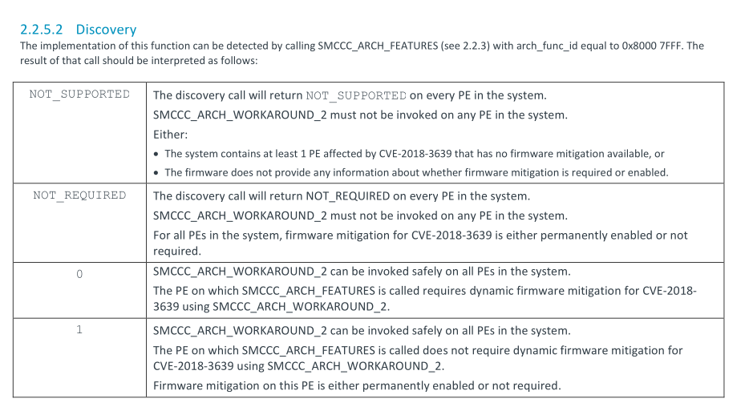

```diff
From a725e3dda1813ed306734823ac4c65ca04e38500 Mon Sep 17 00:00:00 2001
From: Marc Zyngier <marc.zyngier@arm.com>
Date: Tue, 29 May 2018 13:11:08 +0100
Subject: [PATCH 04/14] arm64: Add ARCH_WORKAROUND_2 probing

//=====================(1)=====================
As for Spectre variant-2, we rely on SMCCC 1.1 to provide the
discovery mechanism for detecting the SSBD mitigation.
A new capability is also allocated for that purpose, and a
config option.

Reviewed-by: Julien Grall <julien.grall@arm.com>
Reviewed-by: Mark Rutland <mark.rutland@arm.com>
Acked-by: Will Deacon <will.deacon@arm.com>
Reviewed-by: Suzuki K Poulose <suzuki.poulose@arm.com>
Signed-off-by: Marc Zyngier <marc.zyngier@arm.com>
Signed-off-by: Catalin Marinas <catalin.marinas@arm.com>
---
 arch/arm64/Kconfig               |  9 +++++
 arch/arm64/include/asm/cpucaps.h |  3 +-
 arch/arm64/kernel/cpu_errata.c   | 69 ++++++++++++++++++++++++++++++++
 3 files changed, 80 insertions(+), 1 deletion(-)

diff --git a/arch/arm64/Kconfig b/arch/arm64/Kconfig
index 3aed13626fd7..0b98a6c42454 100644
--- a/arch/arm64/Kconfig
+++ b/arch/arm64/Kconfig
@@ -940,6 +940,15 @@ config HARDEN_EL2_VECTORS
 
 	  If unsure, say Y.
 
+config ARM64_SSBD
+	bool "Speculative Store Bypass Disable" if EXPERT
+	default y
+	help
+	  This enables mitigation of the bypassing of previous stores
+	  by speculative loads.
+
+	  If unsure, say Y.
+
 menuconfig ARMV8_DEPRECATED
 	bool "Emulate deprecated/obsolete ARMv8 instructions"
 	depends on COMPAT
diff --git a/arch/arm64/include/asm/cpucaps.h b/arch/arm64/include/asm/cpucaps.h
index bc51b72fafd4..8a699c708fc9 100644
--- a/arch/arm64/include/asm/cpucaps.h
+++ b/arch/arm64/include/asm/cpucaps.h
@@ -48,7 +48,8 @@
 #define ARM64_HAS_CACHE_IDC			27
 #define ARM64_HAS_CACHE_DIC			28
 #define ARM64_HW_DBM				29
+#define ARM64_SSBD				30
 
-#define ARM64_NCAPS				30
+#define ARM64_NCAPS				31
 
 #endif /* __ASM_CPUCAPS_H */
diff --git a/arch/arm64/kernel/cpu_errata.c b/arch/arm64/kernel/cpu_errata.c
index cd91ca0250f1..7e8f12d85d99 100644
--- a/arch/arm64/kernel/cpu_errata.c
+++ b/arch/arm64/kernel/cpu_errata.c
@@ -256,6 +256,67 @@ void __init arm64_update_smccc_conduit(struct alt_instr *alt,
 
 	*updptr = cpu_to_le32(insn);
 }
+
+static void arm64_set_ssbd_mitigation(bool state)
+{
+	switch (psci_ops.conduit) {
+	case PSCI_CONDUIT_HVC:
+		arm_smccc_1_1_hvc(ARM_SMCCC_ARCH_WORKAROUND_2, state, NULL);
+		break;
+
+	case PSCI_CONDUIT_SMC:
+		arm_smccc_1_1_smc(ARM_SMCCC_ARCH_WORKAROUND_2, state, NULL);
+		break;
+
+	default:
+		WARN_ON_ONCE(1);
+		break;
+	}
+}
+
+static bool has_ssbd_mitigation(const struct arm64_cpu_capabilities *entry,
+				    int scope)
+{
+	struct arm_smccc_res res;
+	bool supported = true;
+
+	WARN_ON(scope != SCOPE_LOCAL_CPU || preemptible());
+
+	if (psci_ops.smccc_version == SMCCC_VERSION_1_0)
+		return false;
+
+	/*
+	 * The probe function return value is either negative
+	 * (unsupported or mitigated), positive (unaffected), or zero
+	 * (requires mitigation). We only need to do anything in the
+	 * last case.
+	 */
+	switch (psci_ops.conduit) {
+	case PSCI_CONDUIT_HVC:
+		arm_smccc_1_1_hvc(ARM_SMCCC_ARCH_FEATURES_FUNC_ID,
+				  ARM_SMCCC_ARCH_WORKAROUND_2, &res);
+		if ((int)res.a0 != 0)
+			supported = false;
+		break;
+
+	case PSCI_CONDUIT_SMC:
+		arm_smccc_1_1_smc(ARM_SMCCC_ARCH_FEATURES_FUNC_ID,
+				  ARM_SMCCC_ARCH_WORKAROUND_2, &res);
+		if ((int)res.a0 != 0)
+			supported = false;
+		break;
+
+	default:
+		supported = false;
+	}
+
+	if (supported) {
        //=============(2)============
+		__this_cpu_write(arm64_ssbd_callback_required, 1);
+		arm64_set_ssbd_mitigation(true);
+	}
+
+	return supported;
+}
 #endif	/* CONFIG_ARM64_SSBD */
 
 #define CAP_MIDR_RANGE(model, v_min, r_min, v_max, r_max)	\
@@ -512,6 +573,14 @@ const struct arm64_cpu_capabilities arm64_errata[] = {
 		.type = ARM64_CPUCAP_LOCAL_CPU_ERRATUM,
 		ERRATA_MIDR_RANGE_LIST(arm64_harden_el2_vectors),
 	},
+#endif
+#ifdef CONFIG_ARM64_SSBD
+	{
+		.desc = "Speculative Store Bypass Disable",
+		.capability = ARM64_SSBD,
+		.type = ARM64_CPUCAP_LOCAL_CPU_ERRATUM,
+		.matches = has_ssbd_mitigation,
+	},
 #endif
 	{
 	}
-- 
2.39.0
```
1. SMCCC 1.1 提供了 为 detecting SSBD mitigation 提供了一个discovery的机制。
该patch提供了一个 capability 来表示 该cpu是否支持 SSBD mitigation.<br/>
我们来看下手册中对于该功能的描述



可以看到是通过 `SMCCC_ARCH_FEATURES` fucntion


之前也提到过，返回值增加了 `NOT_REQUIRED`（-2)

我们来分别解释其返回值:
* NOT_SUPPORTED
  + must not be invoked on any PE in the system
  + 表示至少有一个受 CVE-2018-3639 影响的 PE没有
   firmware available, 或者 firmware 并没有提供
   关于 firmware mitigation是否 required/enabled
   相关信息
* NOT_REQUIRED
  + must not be invoked on any PE in the system
  + 表示可能全程enabled或者 not required
* 0
  + can be invoked safely on all PEs in the system
  + 支持 dynamic firmware mitigation
* 1
  + can be invoked safely on all PEs in the system
  + 表示不需要 dynamic firmware mitigation
   可能全程enable 或者 not required

综上所述，只有`0` 可以实现 `dynamic firmware mitigation`

2. 如果支持，设置 `arm64_ssbd_callback_required`为`1`, 
并且设置 ssbd mitigation 为 true。这样kernel早期
的处理流程也能支持 ssbd
