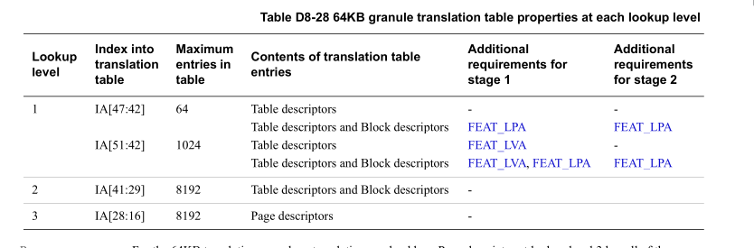
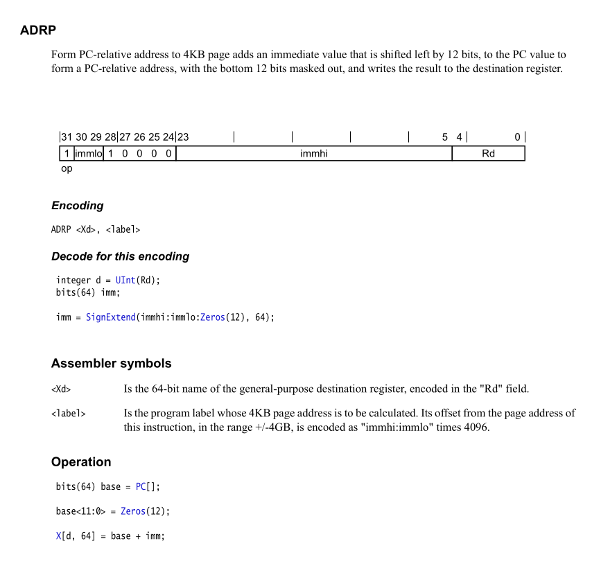
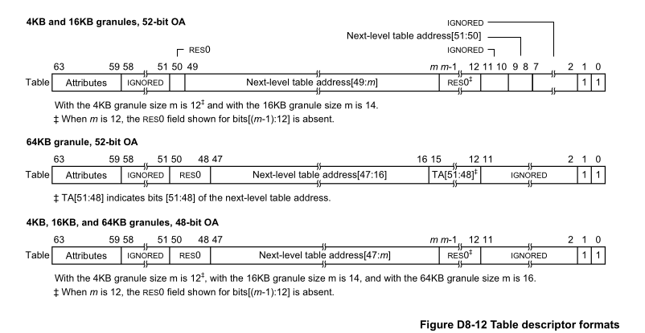
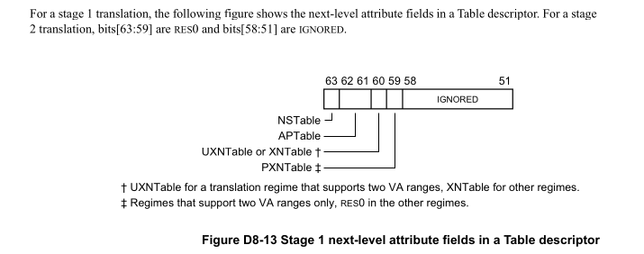
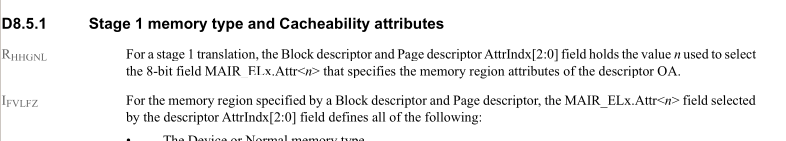

[TOC](文章目录)

# NOVHE KVM(el2) memory map
**本文主要分析, novh关于el2内存映射初始化, 顺便测试下，能不能在kernel module中
访问el2的资源（陷入到el2执行代码)**

# 代码分析
## 初始化流程分析
### stext
kernel在引导后，会进入stext执行, 此时cpu状态为:
* nommu(没有开启分页)
* 当前cpu允许的最高异常等级
```cpp
 /*
  * The following callee saved general purpose registers are used on the
  * primary lowlevel boot path:
  *
  *  Register   Scope                      Purpose
  *  x21        stext() .. start_kernel()  FDT pointer passed at boot in x0
  *  x23        stext() .. start_kernel()  physical misalignment/KASLR offset
  *  x28        __create_page_tables()     callee preserved temp register
  *  x19/x20    __primary_switch()         callee preserved temp registers
  */

ENTRY(stext)
        bl      preserve_boot_args
        bl      el2_setup                       // Drop to EL1, w0=cpu_boot_mode
        adrp    x23, __PHYS_OFFSET          //这个偏移加进去, 这是一个常量
        and     x23, x23, MIN_KIMG_ALIGN - 1    // KASLR offset, defaults to 0, 先设置KASLR offset先设置成0
        bl      set_cpu_boot_mode_flag
        bl      __create_page_tables
        /*
         * The following calls CPU setup code, see arch/arm64/mm/proc.S for
         * details.
         * On return, the CPU will be ready for the MMU to be turned on and
         * the TCR will have been set.
         */
        bl      __cpu_setup                     // initialise processor
        b       __primary_switch
ENDPROC(stext)
```
引导到`stext`时，有几个参数
* x21: fdt pointer
* x23:  physical misalignment(这个不太清楚!!)/KASLR offset

`preserve_boot_args`会将 bootloader传过来的参数`fdt`指向的内存, 存放到`boot_args`内存
处。

> NOTE :
>
> `secondary_entry`也会调用到该函数。
> ```
> ENTRY(secondary_entry)
>       bl      el2_setup                       // Drop to EL1
>       bl      set_cpu_boot_mode_flag
>       b       secondary_startup
> ENDPROC(secondary_entry)

> ```
我们主要看下 `el2_setup`的流程。

### el2_setup
在grub引导至内核中，kernel会在最高的异常级别下执行，
这里也很好理解，因为控制权是交给kernel了，低特权级无法
访问高特权级的寄存器，所以必须要在最高的特权级跳转到kernel的
代码。

kernel会在`el2_setup`函数中进行简单的初始化, 而函数有返回值
* BOOT_CPU_MODE_EL1
* BOOT_CPU_MODE_EL2

表示在引导到kernel时，是否是在el1/el2异常级别。

<details>
<summary> el2_setup</summary>

```cpp
ENTRY(el2_setup)                                
	msr	SPsel, #1			// We want to use SP_EL{1,2}
	mrs	x0, CurrentEL
	//#define CurrentEL_EL1           (1 << 2)
	//#define CurrentEL_EL2           (2 << 2)
	cmp	x0, #CurrentEL_EL2                          //判断是否是el2
	b.eq	1f					    //相同eq为真，如果是el2跳转到1f
	mov_q	x0, (SCTLR_EL1_RES1 | ENDIAN_SET_EL1)
	msr	sctlr_el1, x0
	mov	w0, #BOOT_CPU_MODE_EL1		// This cpu booted in EL1
	isb
	ret

	/* 
	 * #ifdef CONFIG_CPU_BIG_ENDIAN
	 * #define ENDIAN_SET_EL2          SCTLR_ELx_EE
	 * #define ENDIAN_CLEAR_EL2        0
	 * #else
	 * #define ENDIAN_SET_EL2          0
	 * #define ENDIAN_CLEAR_EL2        SCTLR_ELx_EE
	 * #endif
	 * 
	 * 初始化el2 ctrl 寄存器, 这里只是置位了 该寄存器的res位，和 ENDIAN_SET_EL2
	 * 和大小端有关, 该 大小端主要作用于stage 1 stage 2 translation table walks
	 *
	 * arm64 一般是小端存储，但是也可以设置为大端，kernel CONFIG_CPU_BIG_ENDIAN 
	 * 默认配置为NOT SET
	 */
1:	mov_q	x0, (SCTLR_EL2_RES1 | ENDIAN_SET_EL2)
	msr	sctlr_el2, x0	

#ifdef CONFIG_ARM64_VHE
	/*
	 * Check for VHE being present. For the rest of the EL2 setup,
	 * x2 being non-zero indicates that we do have VHE, and that the
	 * kernel is intended to run at EL2.
	 */
	mrs	x2, id_aa64mmfr1_el1        //查看id_aa64mmfr1_el1寄存器存储到x2
	/*
	 * 从x2寄存器8位开始，提取4位到x2寄存器, 实际上是[11:8], 取的是VH字段
	 * 该字段为1使能VHE功能
	 */
	ubfx	x2, x2, #8, #4          
#else
	mov	x2, xzr
#endif

	/* Hyp configuration. */
	mov_q	x0, HCR_HOST_NVHE_FLAGS //以到x0 (HCR_RW | HCR_API | HCR_APK)
        //为0跳转 表示如果是novhe，则跳转, 设置hcr_el2为HCR_HOST_NVHE_FLAGS 
	//如果是vhe, 则设置hcr_el2为HCR_HOST_VHE_FLAGS
	cbz	x2, set_hcr
	mov_q	x0, HCR_HOST_VHE_FLAGS  //(HCR_RW | HCR_TGE | HCR_E2H)
set_hcr:
    //在这里设置hcr_el2,也就是这个寄存器在kernel中是software设置的
	msr	hcr_el2, x0                 
	isb

	/*
	 * Allow Non-secure EL1 and EL0 to access physical timer and counter.
	 * This is not necessary for VHE, since the host kernel runs in EL2,
	 * and EL0 accesses are configured in the later stage of boot process.
	 * Note that when HCR_EL2.E2H == 1, CNTHCTL_EL2 has the same bit layout
	 * as CNTKCTL_EL1, and CNTKCTL_EL1 accessing instructions are redefined
	 * to access CNTHCTL_EL2. This allows the kernel designed to run at EL1
	 * to transparently mess with the EL0 bits via CNTKCTL_EL1 access in
	 * EL2.
	 */
	//非0跳转, 也就是vhe跳转, 这个和physical timer相关，先略过
	cbnz	x2, 1f              
	mrs	x0, cnthctl_el2
	orr	x0, x0, #3			// Enable EL1 physical timers
	msr	cnthctl_el2, x0
1:
	msr	cntvoff_el2, xzr		// Clear virtual offset

	//下面 #ifdef中的内容和GIC_V3相关，先略过
#ifdef CONFIG_ARM_GIC_V3
	/* GICv3 system register access */
	mrs	x0, id_aa64pfr0_el1
	ubfx	x0, x0, #24, #4
	cmp	x0, #1
	b.ne	3f

	mrs_s	x0, SYS_ICC_SRE_EL2
	orr	x0, x0, #ICC_SRE_EL2_SRE	// Set ICC_SRE_EL2.SRE==1
	orr	x0, x0, #ICC_SRE_EL2_ENABLE	// Set ICC_SRE_EL2.Enable==1
	msr_s	SYS_ICC_SRE_EL2, x0
	isb					// Make sure SRE is now set
	mrs_s	x0, SYS_ICC_SRE_EL2		// Read SRE back,
	tbz	x0, #0, 3f			// and check that it sticks
	msr_s	SYS_ICH_HCR_EL2, xzr		// Reset ICC_HCR_EL2 to defaults

3:
#endif

	/* Populate ID registers. */
	//和midr, mpidr相关，略过
	mrs	x0, midr_el1
	mrs	x1, mpidr_el1
	msr	vpidr_el2, x0
	msr	vmpidr_el2, x1

#ifdef CONFIG_COMPAT
	msr	hstr_el2, xzr			// Disable CP15 traps to EL2
#endif
	//和PMU相关，先略过
	/* EL2 debug */
	mrs	x1, id_aa64dfr0_el1		// Check ID_AA64DFR0_EL1 PMUVer
	sbfx	x0, x1, #8, #4
	cmp	x0, #1
	b.lt	4f				// Skip if no PMU present
	mrs	x0, pmcr_el0			// Disable debug access traps
	ubfx	x0, x0, #11, #5			// to EL2 and allow access to
4:
	csel	x3, xzr, x0, lt			// all PMU counters from EL1

	/* Statistical profiling */
	ubfx	x0, x1, #32, #4			// Check ID_AA64DFR0_EL1 PMSVer
	cbz	x0, 7f				// Skip if SPE not present
	cbnz	x2, 6f				// VHE?
	mrs_s	x4, SYS_PMBIDR_EL1		// If SPE available at EL2,
	and	x4, x4, #(1 << SYS_PMBIDR_EL1_P_SHIFT)
	cbnz	x4, 5f				// then permit sampling of physical
	mov	x4, #(1 << SYS_PMSCR_EL2_PCT_SHIFT | \
		      1 << SYS_PMSCR_EL2_PA_SHIFT)
	msr_s	SYS_PMSCR_EL2, x4		// addresses and physical counter
5:
	mov	x1, #(MDCR_EL2_E2PB_MASK << MDCR_EL2_E2PB_SHIFT)
	orr	x3, x3, x1			// If we don't have VHE, then
	b	7f				// use EL1&0 translation.
6:						// For VHE, use EL2 translation
	orr	x3, x3, #MDCR_EL2_TPMS		// and disable access from EL1
7:
	//设置mdcr_el2
	msr	mdcr_el2, x3			// Configure debug traps

	/* LORegions */
	mrs	x1, id_aa64mmfr1_el1
	ubfx	x0, x1, #ID_AA64MMFR1_LOR_SHIFT, 4
	cbz	x0, 1f
	msr_s	SYS_LORC_EL1, xzr
1:
	//stage-2 translation相关
	/* Stage-2 translation */
	msr	vttbr_el2, xzr

	/* 
	 * !!!!!!!!!!!!!!
	 * 重点部分 :
	 *
	 * 如果是novhe, 则跳转到install_el2_stub, 
	 * 如果是vhe,则不会跳转，而是直接返回
	 *
	 * 这里也就是novhe和vhe的不同走向
	 *    novhe : 跳转到install_el2_stub, 最终会调用eret返回，跳回到el1异常级别
	 *    vhe : 在这里调用ret返回，返回到上一级仍然是el2异常级别
	 */
	cbz	x2, install_el2_stub        //查看是否为0，为0跳转, 也就是跳转到EL1

	mov	w0, #BOOT_CPU_MODE_EL2		// This CPU booted in EL2 //boot as EL1
	isb
	ret

install_el2_stub:
	/*
	 * When VHE is not in use, early init of EL2 and EL1 needs to be
	 * done here.
	 * When VHE _is_ in use, EL1 will not be used in the host and
	 * requires no configuration, and all non-hyp-specific EL2 setup
	 * will be done via the _EL1 system register aliases in __cpu_setup.
	 */
	mov_q	x0, (SCTLR_EL1_RES1 | ENDIAN_SET_EL1)
	//设置el1 ctrl寄存器，和上面的流程一样，仅设置res和大小端
	msr	sctlr_el1, x0

	/* Coprocessor traps. */
	mov	x0, #0x33ff
	msr	cptr_el2, x0			// Disable copro. traps to EL2

	/* SVE register access */
	mrs	x1, id_aa64pfr0_el1
	ubfx	x1, x1, #ID_AA64PFR0_SVE_SHIFT, #4
	cbz	x1, 7f

	bic	x0, x0, #CPTR_EL2_TZ		// Also disable SVE traps
	msr	cptr_el2, x0			// Disable copro. traps to EL2
	isb
	mov	x1, #ZCR_ELx_LEN_MASK		// SVE: Enable full vector
	msr_s	SYS_ZCR_EL2, x1			// length for EL1.

	/* Hypervisor stub */
	/*
	 * 设置vbar_el2异常向量表，设置为 __hyp_stub_vectors
	 *
	 * NOTE : 这里大家思考下，为什么novhe的情况下，在el2_setup
	 * 返回之前需要设置异常向量表?
	 *
	 * 因为，novhe是通过eret返回，之后就返回到el1了，之后kvm运行在
	 * el2, 所以肯定还是有可能返回到el2，而代码控制权传递，就是
	 * 通过异常向量表，所以需要在这里设置下（要不就回不来了 :( )
	 */
7:	adr_l	x0, __hyp_stub_vectors
	msr	vbar_el2, x0

	/* spsr */
	//设置spsr
	mov	x0, #(PSR_F_BIT | PSR_I_BIT | PSR_A_BIT | PSR_D_BIT |\
		      PSR_MODE_EL1h)            
	msr	spsr_el2, x0 
        /*
	 * lr寄存器存储当前函数(el2_setup) 返回地址, 也就是:
	 *    ENTRY(xtext)
	 *      ...
	 *      bl      el2_setup          
	 *      adrp    x23, __PHYS_OFFSET <---here
	 *      ...
	 *
	 * 然后，将lr寄存器保存在elr_el2寄存器中，调用eret返回，则会
	 * 退回到el1异常级别，在elr_el2指向的代码地址运行。继续之前的
	 * 初始化流程
	 */
	msr	elr_el2, lr
	mov	w0, #BOOT_CPU_MODE_EL2		// This CPU booted in EL2   //boot as el2
	eret                            //当作异常返回了，也就是在这里drop to el1
ENDPROC(el2_setup)
```
</details> <!-- el2_setup-->
<!--
我们先来思考下, vhe和novhe在该流程中需要做哪些初始化，
或者说需要初始化el2的哪些资源, 其实两者的目的不同: 
-->
可以看到, 无论是novhe,还是vhe 都没有去做idmap页表映射。也没有开启分页，
也就是说，在novhe情况中，下次如果通过`hvc`进入到el2异常级别，那也是
nommu的情况，一会我们重点看下。

### set_cpu_boot_mode_flag

之后便执行到 `set_cpu_boot_mode_flag`, 该函数会将`el2_setup`的返回值，
保存到__boot_cpu_mode中
```
set_cpu_boot_mode_flag:
        adr_l   x1, __boot_cpu_mode
        cmp     w0, #BOOT_CPU_MODE_EL2
        b.ne    1f              //不为0, 表示为el1, 跳转
        add     x1, x1, #4	//如果是el2则进行地址add操作，x1 = &__boot_cpu_mode[1]
1:      str     w0, [x1]                        // This CPU has booted in EL1
        dmb     sy
        dc      ivac, x1                        // Invalidate potentially stale cache line
        ret
ENDPROC(set_cpu_boot_mode_flag)

ENTRY(__boot_cpu_mode)
        .long   BOOT_CPU_MODE_EL2
        .long   BOOT_CPU_MODE_EL1
```
这里为什么要这么操作呢 ? 上面提到了, `stext`(boot_cpu)和`secondary_entry`
(secondary cpu) 都会调用到该函数, 为了避免每个cpu执行到记录的最高异常等级
不一样，影响kvm的使用，所以当出现这种情况时，则不会使能kvm功能（vhe情况
还得看下，因为vhe中kernel也会运行在el2）。

而__boot_cpu_mode默认值为: `[0] = BOOT_CPU_MODE_EL2, [1] = BOOT_CPU_MODE_EL1`
而上面函数设置的时候, 如果检测到 `w0 == BOOT_CPU_MODE_EL2`, 则会设置 
`__boot_cpu_mode[1] =  BOOT_CPU_MODE_EL2`, 否则相反。

假设一个机器有8个cpu，有7个是 BOOT_CPU_MODE_EL2, 另外1个是 BOOT_CPU_MODE_EL1
则会出现 `__boot_cpu_mode[0] =  BOOT_CPU_MODE_EL1 &&
__boot_cpu_mode[1] =  BOOT_CPU_MODE_EL2`。并且，无论启动顺序如何，
`__boot_cpu_mode[0] = BOOT_CPU_MODE_EL1`都不会被后续的操作覆盖。

而在 `is_hyp_mode_available`会判断两个值是否相等，如果不相等，
并且是否是`BOOT_CPU_MODE_EL2`如果不是, 则认为kvm功能不能开启
```cpp
static inline bool is_hyp_mode_available(void)
{
        return (__boot_cpu_mode[0] == BOOT_CPU_MODE_EL2 &&
                __boot_cpu_mode[1] == BOOT_CPU_MODE_EL2);
}
int kvm_arch_init(void *opaque)
{
	...
	if (!is_hyp_mode_available()) {
		kvm_info("HYP mode not available\n");
        	return -ENODEV;
	}
	...
}
```
### __create_page_tables

<details> <!--__create_page_tables part 1-->
<summary>__create_page_tables part1</summary>

```cpp
__create_page_tables:
	/*
	 * 将lr 保存到 x28中
	 * 在最后还会通过 ret x28 返回, 那么这里为什么要保存lr
	 * 和`__inval_dcache_area`的调用相关, 我们接下来会分析到
	 */
	mov	x28, lr

	/*
	 * Invalidate the init page tables to avoid potential dirty cache lines
	 * being evicted. Other page tables are allocated in rodata as part of
	 * the kernel image, and thus are clean to the PoC per the boot
	 * protocol.
	 */
	 /*
	  * 这里提到需要invalidate init_pg_dir中的 dirty cache line, 以免对其产生影响,
	  * 但是不需要invalidate 其他的 page tables,因为其他的page tables在 kernel
	  * image的rodata, 根据PoC引导协议是干净的。
	  *
	  * 这里有点疑惑:
	  * 假如是stext路径走下来的，此时还没有开启分页和cache，不应该会产生影响
	  * （可能是其他的路径，先遗留，之后再看)
	  *
	  * ????????????????
	  */
	adrp	x0, init_pg_dir
	adrp	x1, init_pg_end
	sub	x1, x1, x0          //算出size
	/*
	 * 算出来init_pg_dir的大小，然后调用__inval_dcache_data
	 *
	 * __inval_dcache_area参数:
	 * 
	 * x0 start_address
	 * x1 size
	 *
	 * 而且该函数并没有 STP x29, x30
	 * 所以没有保存LR，所以在开始的时候，需要先将LR保存到其他寄存器中
	 * 这里不清楚问什么不在	__inval_dcache_area堆栈中保存LR
	 */
	bl	__inval_dcache_area

	/*
	 * Clear the init page tables.
	 */
	adrp	x0, init_pg_dir
	adrp	x1, init_pg_end
	sub	x1, x1, x0              //x1 指的是size
	/*
	 * 该指令会这里先将[x0, x0 + 16]赋值为0
	 * 然后再 x0 += 16
	 */
1:	stp	xzr, xzr, [x0], #16
	stp	xzr, xzr, [x0], #16
	stp	xzr, xzr, [x0], #16
	stp	xzr, xzr, [x0], #16
	subs	x1, x1, #64         //x1 = x1 -64
	b.ne	1b
```
</details>

我们来看下`init_pg_dir`的size
```
#define EARLY_PAGES(vstart, vend) ( 1                   /* PGDIR page */                                \
                        + EARLY_PGDS((vstart), (vend))  /* each PGDIR needs a next level page table */  \
                        + EARLY_PUDS((vstart), (vend))  /* each PUD needs a next level page table */    \
                        + EARLY_PMDS((vstart), (vend))) /* each PMD needs a next level page table */
#define INIT_DIR_SIZE (PAGE_SIZE * EARLY_PAGES(KIMAGE_VADDR + TEXT_OFFSET, _end))
```
不过多展开，这里计算了 `_end - (KIMAGE_VADDR + TEXT_OFFSET)`需要多少个
page来构建页表（各级页表)。

我们再来看下, arm64的链接脚本:
```cpp
SECTIONS
{
	/DISCARD/ : {
	        ARM_EXIT_DISCARD(EXIT_TEXT)
	        ARM_EXIT_DISCARD(EXIT_DATA)
	        EXIT_CALL
	        *(.discard)
	        *(.discard.*)
	        *(.interp .dynamic)
	        *(.dynsym .dynstr .hash)
	}

	. = KIMAGE_VADDR + TEXT_OFFSET;

	.head.text : {
	        _text = .;
	        HEAD_TEXT
	}
	.text : {           
		...
	}
	...
	_end = .;

	STABS_DEBUG

	HEAD_SYMBOLS

}
```
可以看到[KIMAGE_ADDR + TEXT_OFFSET, \_end] 几乎包含了整个
kernel的image。

接着分析`__create_page_tables`

<details>
<summary>__create_page_tables part2</summary>

```cpp
__create_page_tables:
	//...
	//接上面分析
	//...
	mov	x7, SWAPPER_MM_MMUFLAGS

	/*
	 * Create the identity mapping.
	 */
	adrp	x0, idmap_pg_dir
	adrp	x3, __idmap_text_start		// __pa(__idmap_text_start)

#ifdef CONFIG_ARM64_USER_VA_BITS_52
	/*
	 * #define ID_AA64MMFR2_LVA_SHIFT          16
	 *
	 * VARange [19,16]: 
	 *   0b0 : support 48-bits VAs
	 *   0b1 : support 52-bits VAs
	 */
	mrs_s	x6, SYS_ID_AA64MMFR2_EL1    //读操作
	and	x6, x6, #(0xf << ID_AA64MMFR2_LVA_SHIFT)
	mov	x5, #52
	//如果不是0, 则跳转
	cbnz	x6, 1f
#endif
	/*
	 * 如果没有配置，则配置为 VA_BITS (CONFIG_ARM64_VA_BITS)
	 */
	mov	x5, #VA_BITS
1:
	adr_l	x6, vabits_user		//获取vabits_user的地址
	str	x5, [x6]		//将x5保存
	dmb	sy
	dc	ivac, x6		// Invalidate potentially stale cache line

	/*
	 * VA_BITS may be too small to allow for an ID mapping to be created
	 * that covers system RAM if that is located sufficiently high in the
	 * physical address space. So for the ID map, use an extended virtual
	 * range in that case, and configure an additional translation level
	 * if needed.
	 *
	 * Calculate the maximum allowed value for TCR_EL1.T0SZ so that the
	 * entire ID map region can be mapped. As T0SZ == (64 - #bits used),
	 * this number conveniently equals the number of leading zeroes in
	 * the physical address of __idmap_text_end.
	 */
	adrp	x5, __idmap_text_end
	clz	x5, x5
	cmp	x5, TCR_T0SZ(VA_BITS)	// default T0SZ small enough?
	b.ge	1f			// .. then skip VA range extension
```
</details> <!-- __create_page_tables part2 -->

这里将`__idmap_text_end`地址存放到x5中，注意，这个地址是相对地址，adrp指令
编码时，只是记录了一个偏移(可见末尾章节对adrp相关解码分析)，算出来的值实际上
是根据ip来的，也就是未开启分页时的线性地址，和开启分页后的虚拟地址算出来还不一样。

TCR_EL1.T0SZ则表示，TTBR0_EL1能访问的memory region的范围，该字段又在整个寄存器
的低位，所以正好可以不用做位移，拿过来直接用。

而这里我们获取的应该是线性地址（物理地址），而计算`idmap`访问大小则是通过查看
最大的地址访问(`__idmap_text_end`)得到，所以查看T0SZ能不能满足当前最大的地址访问
(`__idmap_text_end`), 如果不能则用一定的方式扩展（扩展代码暂时不看），
关于`TCR_EL1.T0SZ`和`TCR_EL1.T1SZ`见末尾章节。

我们继续分析`__create_page_tables`代码:

<details>
<summary>__create_page_tables part3</summary>

```cpp
__create_page_tables:
	//...
	//接上面分析
	//...
	adr_l	x6, idmap_t0sz
	str	x5, [x6]
	dmb	sy
	dc	ivac, x6		// Invalidate potentially stale cache line

#if (VA_BITS < 48)
#define EXTRA_SHIFT	(PGDIR_SHIFT + PAGE_SHIFT - 3)
#define EXTRA_PTRS	(1 << (PHYS_MASK_SHIFT - EXTRA_SHIFT))

	/*
	 * If VA_BITS < 48, we have to configure an additional table level.
	 * First, we have to verify our assumption that the current value of
	 * VA_BITS was chosen such that all translation levels are fully
	 * utilised, and that lowering T0SZ will always result in an additional
	 * translation level to be configured.
	 */
#if VA_BITS != EXTRA_SHIFT
#error "Mismatch between VA_BITS and page size/number of translation levels"
#endif

	mov	x4, EXTRA_PTRS
	create_table_entry x0, x3, EXTRA_SHIFT, x4, x5, x6
#else
	/*
	 * If VA_BITS == 48, we don't have to configure an additional
	 * translation level, but the top-level table has more entries.
	 */
	mov	x4, #1 << (PHYS_MASK_SHIFT - PGDIR_SHIFT)
	str_l	x4, idmap_ptrs_per_pgd, x5
#endif
	//!!!!!
	//假如T0SZ满足当前idmap的访问，则跳转到这
1:
	ldr_l	x4, idmap_ptrs_per_pgd
	mov	x5, x3				// __pa(__idmap_text_start)
	adr_l	x6, __idmap_text_end		// __pa(__idmap_text_end)
        map_memory x0, x1, x3, x6, x7, x3, x4, x10, x11, x12, x13, x14
```

</details> <!-- __create_page_tables part3 -->

上面实际上在构造 `map_memory`宏的参数，然后调用map_memory进行idmap映射。

这里，我们先来看下`idmap_ptrs_per_pgd`的相关定义:
```
u64 idmap_ptrs_per_pgd = PTRS_PER_PGD;

#define PTRS_PER_PGD            (1 << (VA_BITS - PGDIR_SHIFT))
//CONFIG_PGTABLE_LEVELS = 3
/*
 * PGDIR_SHIFT determines the size a top-level page table entry can map
 * (depending on the configuration, this level can be 0, 1 or 2).
 */
#define PGDIR_SHIFT             ARM64_HW_PGTABLE_LEVEL_SHIFT(4 - CONFIG_PGTABLE_LEVELS)
/*
 * Size mapped by an entry at level n ( 0 <= n <= 3)
 * We map (PAGE_SHIFT - 3) at all translation levels and PAGE_SHIFT bits
 * in the final page. The maximum number of translation levels supported by
 * the architecture is 4. Hence, starting at at level n, we have further
 * ((4 - n) - 1) levels of translation excluding the offset within the page.
 * So, the total number of bits mapped by an entry at level n is :
 *
 *  ((4 - n) - 1) * (PAGE_SHIFT - 3) + PAGE_SHIFT
 *
 * Rearranging it a bit we get :
 *   (4 - n) * (PAGE_SHIFT - 3) + 3
 */
#define ARM64_HW_PGTABLE_LEVEL_SHIFT(n) ((PAGE_SHIFT - 3) * (4 - (n)) + 3)
```
我们先来看`ARM64_HW_PGTABLE_LEVEL_SHIFT`，注释中提到了，该宏用于计算level n
的entry能映射的size(但是这个size是用shift表示的), 最后一级页表的shift，为`PAGE_SHIFT`,
而其他页表的shift为`PAGE_SHIFT - 3`, 最多有4级页表，n为，所需计算的页表等级，
范围是`（0 <= n <= 3)`, 最后一级页表为3(pte), 所以除去最后一级，还有(4 - n - 1) 级页表,
所以最终计算的shift为:
```
(4 - n - 1) * (PAGE_SHIFT - 3) + PAGE_SHIFT
```

展开计算:
```
(4 - n) * (PAGE_SHIFT - 3) - (PAGE_SHIFT - 3) + PAGE_SHIFT
(4 - n) * (PAGE_SHIFT - 3) + 3
```
在回到 PTRS_PER_PGD ，为`1 << (VA_BITS - PGDIR_SHIFT)`
计算的为PGD的 bits所能表示的范围大小，我们举个例子来看下:

对于
```
CONFIG_ARM64_PAGE_SHIFT=16
CONFIG_ARM64_VA_BITS=48
CONFIG_PGTABLE_LEVELS=3
```
`PGDIR_SHIFT`计算为:
```
ARM64_HW_PGTABLE_LEVEL_SHIFT(4 - 3 = 1)
(4  - 1) * (16 - 3) + 3 = 3 * 13 + 3 = 42
```
PTRS_PER_PGD 计算为:
```
(1 << (48 - 42)) = 64
```
简单画个图:
```
page_shift alias pgf

+-------------------------------------------------------------------+
|          PGD        |    PMD    |    PTE    |        PAGE         |
VA_bits         pgdir_shift    pmd_shift     pgf                    0
|48                   42         29          16                     0
+-------------------------------------------------------------------+
|va_bits - pgdir_shift|  pgf - 3  | pgf - 3   |     pgf             |
|          6          |   13      |    13     |      16             |
+-------------------------------------------------------------------+
```

PS: 手册中给出的图表:


我们来看下 `map_memory`代码:

<details>
<summary>map_memory part1</summary>

```cpp
/*
 * Map memory for specified virtual address range. Each level of page table needed supports
 * multiple entries. If a level requires n entries the next page table level is assumed to be
 * formed from n pages.
 *
 *	tbl:	location of page table
 *	rtbl:	address to be used for first level page table entry (typically tbl + PAGE_SIZE)
 *	vstart:	start address to map
 *	vend:	end address to map - we map [vstart, vend]
 *	flags:	flags to use to map last level entries
 *	phys:	physical address corresponding to vstart - physical memory is contiguous(相邻的，邻近的)
 *	pgds:	the number of pgd entries
 *
 * Temporaries:	istart, iend, tmp, count, sv - these need to be different registers
 * Preserves:	vstart, vend, flags
 * Corrupts:	tbl, rtbl, istart, iend, tmp, count, sv
 */
	/*
	 * tbl: idmap_pgd_dir(x0)
	 * rtbl: 临时变量，表示first level pgtable entry的地址( tbl + PAGE+SIZE )(x1)
	 * vstart: __idmap_text_start(x3)
	 * vend: __idmap_text_end(x6)
	 * flags:  SWAPPER_MM_MMUFLAGS (x7)
	 * phys: __idmap_text_start(x3)
	 * pgds: idmap_ptrs_per_pgd(x4)
	 */
	.macro map_memory, tbl, rtbl, vstart, vend, flags, phys, pgds, istart, iend, tmp, count, sv
	add \rtbl, \tbl, #PAGE_SIZE
	mov \sv, \rtbl
	mov \count, #0
	compute_indices \vstart, \vend, #PGDIR_SHIFT, \pgds, \istart, \iend, \count
	populate_entries \tbl, \rtbl, \istart, \iend, #PMD_TYPE_TABLE, #PAGE_SIZE, \tmp
```
</details> <!-- map_memory part1 -->

我们来看下`compute_indices`的代码:

<details>
<summary>compute_indices</summary>

```cpp
/*
 * Compute indices(index的复数形式之一) of table entries from virtual address range. If multiple entries
 * were needed in the previous page table level then the next page table level is assumed
 * to be composed of multiple pages. (This effectively scales the end index).
 *
 * 个人理解这里提到的做法:
 * 假设上一级需要多个pgtable entry, 每个pgtable entry实际上都指向一个页面，这样iend, 可能就有多个，
 * 但是这里假定，下一级页表是 composed of multiple pages(由多个连续的页面组成),这样把
 * 多个页面看成一个整体，得到一个iend,供下面函数使用
 *
 * 而下面count参数提到的入参含义，里面提到`scale`， 没有太理解作用
 *
 *	vstart:	virtual address of start of range
 *	vend:	virtual address of end of range
 *	shift:	shift used to transform virtual address into index
 *	ptrs:	number of entries in page table
 *	istart:	index in table corresponding to vstart
 *	iend:	index in table corresponding to vend
 *	count:	On entry: how many extra entries were required in previous level, scales
 *			  our end index.
 *		On exit: returns how many extra entries required for next page table level
 *
 * Preserves:	vstart, vend, shift, ptrs
 * Returns:	istart, iend, count
 */
	.macro compute_indices, vstart, vend, shift, ptrs, istart, iend, count
	lsr	\iend, \vend, \shift	//右移shift 计算 iend index
	mov	\istart, \ptrs		//不要被这里istart迷惑，只是一个临时变量使用
	sub	\istart, \istart, #1
	and	\iend, \iend, \istart	// iend = (vend >> shift) & (ptrs - 1)
	mov	\istart, \ptrs
	mul	\istart, \istart, \count
	add	\iend, \iend, \istart	// iend += (count - 1) * ptrs 
					//个人理解: 
					//这里入参 count ，是 count - 1
					//假设，上一级需要5个page, 那么这里传入的count为4
					//原因在 (2)
					// our entries span multiple tables

	lsr	\istart, \vstart, \shift	//计算istart
	mov	\count, \ptrs			//count这时作为临时变量
	sub	\count, \count, #1		//ptrs - 1
	and	\istart, \istart, \count	//istart = (istart >> shift) & (ptrs - 1)

	sub	\count, \iend, \istart		//(2) 在这里计算icount,如果有4个entry，这里得到的count = 3
	.endm
```

</details> <!-- compute_indices -->

该宏定义，为了计算 [vstart, vend]虚拟内存区间，在该shift的页表中的index start,和
index end。而count会作为出参，用来计算低级页表的入参(PMD, PTE)

我们再来看下`populate_entry`

<details>
<summary>populate_entry</summary>

```cpp
/*
 * Macro to populate page table entries, these entries can be pointers to the next level
 * or last level entries pointing to physical memory.
 *
 *      tbl:    page table address
 *      rtbl:   pointer to page table or physical memory
 *      index:  start index to write
 *      eindex: end index to write - [index, eindex] written to
 *      flags:  flags for pagetable entry to or in
 *      inc:    increment to rtbl between each entry
 *      tmp1:   temporary variable
 *
 * Preserves:   tbl, eindex, flags, inc
 * Corrupts:    index, tmp1
 * Returns:     rtbl
 */
        .macro populate_entries, tbl, rtbl, index, eindex, flags, inc, tmp1
.Lpe\@: phys_to_pte \tmp1, \rtbl
        orr     \tmp1, \tmp1, \flags    // tmp1 = table entry
	/*
	 * 该指令为: 将tmp1存储到 [tbl + index << 3]的内存中
	 */
        str     \tmp1, [\tbl, \index, lsl #3]
        add     \rtbl, \rtbl, \inc      // rtbl = pa next level
        add     \index, \index, #1
        cmp     \index, \eindex
        b.ls    .Lpe\@
        .endm
```

</details> <!--populate_entry -->

该宏 用于填充page table entries.

先看下`page_to_pte`宏:
```
        .macro  phys_to_pte, pte, phys
#ifdef CONFIG_ARM64_PA_BITS_52
        /*
         * We assume \phys is 64K aligned and this is guaranteed by only
         * supporting this configuration with 64K pages.
         */
        orr     \pte, \phys, \phys, lsr #36
        and     \pte, \pte, #PTE_ADDR_MASK
#else
        mov     \pte, \phys
#endif
        .endm
```
在没有`CONFIG_ARM64_PA_BITS_52`情况下，为`phys`, 在代码中，就是rtbl

回到 populate 的流程, 大致为:
* tmp1 = rtbl	//获取entry指向的内存的物理地址
* tmp1 = tmp1 | flags(PMD_TYPE_TABLE/SWAPPER_MM_MMUFLAGS)//或上一些flags
* `[tbl + index << 3] = tmp1`, 这里`<< 3` 相当于 `* 8`, 
    相当于每个entry为8-byte
* rtbl = rtbl + PAGE_SIZE //获取下一个entry指向内存的物理地址
* index = index + 1	  //自增index
* `if (index < eindex) b.ls .Lpe\@`	//如果没有达到end_index,则继续循环
* 这里需要注意: 因为各级页表是连续的，上级页表的末尾，为下级页表的开始，
 所以rtbl 会依次增加到，下一级页表的开始位置。

那这里我们需要看下flags的内容, 这里有两个值, 我们简单说明下:
> NOTE 
>
> 关于具体的位，我们在[Table descriptor format](#Table_descriptor_format)中详细说明

* PMD_TYPE_TABLE: 
	+ kernel 中定义: `#define PMD_TYPE_TABLE          (_AT(pmdval_t, 3) << 0)`
	+ 关于`_AT(a, b)`宏定义，这里不再展开，和汇编，
	  C的编译相关，如果是汇编展开，则为3, 这里 3 指的是:
		* bits 1 : valid
		* bits 2 : 指向page table address, 而不是page

* SWAPPER_MM_MMUFLAGS: 
	+ 最后一级页表的flag（页表指向page, block page)
	+ 这里情况比较多，会涉及到 `ARM64_SWAPPER_USES_SECTION_MAPS`内容, 我们
	 在[ARM64_SWAPPER_USES_SECTION_MAPS](#ARM64_SWAPPER_USES_SECTION_MAPS_label)结合讲述

***

我们继续分析 map_memory代码。

<details>
<summary>map_memory part2</summary>

```cpp
	.macro map_memory
	// ...
	// 接上面分析
	// ...
	mov \tbl, \sv
	mov \sv, \rtbl

#if SWAPPER_PGTABLE_LEVELS > 3
	compute_indices \vstart, \vend, #PUD_SHIFT, #PTRS_PER_PUD, \istart, \iend, \count
	populate_entries \tbl, \rtbl, \istart, \iend, #PMD_TYPE_TABLE, #PAGE_SIZE, \tmp
	mov \tbl, \sv
	mov \sv, \rtbl
#endif

#if SWAPPER_PGTABLE_LEVELS > 2
	compute_indices \vstart, \vend, #SWAPPER_TABLE_SHIFT, #PTRS_PER_PMD, \istart, \iend, \count
	populate_entries \tbl, \rtbl, \istart, \iend, #PMD_TYPE_TABLE, #PAGE_SIZE, \tmp
	mov \tbl, \sv
#endif

	compute_indices \vstart, \vend, #SWAPPER_BLOCK_SHIFT, #PTRS_PER_PTE, \istart, \iend, \count
	bic \count, \phys, #SWAPPER_BLOCK_SIZE - 1
	populate_entries \tbl, \count, \istart, \iend, \flags, #SWAPPER_BLOCK_SIZE, \tmp
	.endm

```

</details> <!-- map_memory part2-->

* 之后流程比较简单sv，相当于是上一级page table的entry指向的地址，那么就是下一级page table的地址
* 而rtbl作为上次 populate_entries的出参，记录着下下级page table的地址.
* 通过多次调用`compute_indices`, `populate_entries`, 依次建立了 PGD->PUD, PUD->PMD, PMD->PTE, 
* 这里需要注意的是，这里涉及`ARM64_SWAPPER_USES_SECTION_MAPS`, 我们在
 [ARM64_SWAPPER_USES_SECTION_MAPS](#ARM64_SWAPPER_USES_SECTION_MAPS_label)结合讲述 


我们接下来再看`__create_page_tables`代码

<details>
<summary>__create_page_tables part4</summary>

```cpp
__create_page_tables:
	//...
	//...接上面
	//...
        /*
         * Map the kernel image (starting with PHYS_OFFSET).
         */
        adrp    x0, init_pg_dir
        mov_q   x5, KIMAGE_VADDR + TEXT_OFFSET  // compile time __va(_text)
        add     x5, x5, x23                     // add KASLR displacement
        mov     x4, PTRS_PER_PGD
        adrp    x6, _end                        // runtime __pa(_end)
        adrp    x3, _text                       // runtime __pa(_text)
        sub     x6, x6, x3                      // _end - _text
        add     x6, x6, x5                      // runtime __va(_end)
	/*
	 * tbl: init_pg_dir(x0)
	 * vstart: KIMAGE_ADDR + TEXT_OFFSET + KASLR_displacement (x5)
	 * vend: __pa(_end) - __pa(_text) + vstart (x6)
	 * flags: 仍为 SWAPPER_MM_MMUFLAGS (x7)
	 * phys : (x3) 这里是 adrp _text, 因为这时候没有开启映射，所以ip还是指向物理地址，
	 *    那么该指令的结果是：获取 _text物理地址
	 * pgds: idmap_ptrs_per_pgd(x4)
	 */
        map_memory x0, x1, x5, x6, x7, x3, x4, x10, x11, x12, x13, x14

        /*
         * Since the page tables have been populated with non-cacheable
         * accesses (MMU disabled), invalidate the idmap and swapper page
         * tables again to remove any speculatively loaded cache lines.
         */
        adrp    x0, idmap_pg_dir
        adrp    x1, init_pg_end
        sub     x1, x1, x0
        dmb     sy
        bl      __inval_dcache_area
	//返回之前保存的值
        ret     x28
ENDPROC(__create_page_tables)
```

</details> <!-- __create_page_tables part4 -->

可以发现在创建了identity map映射后, 又创建了kernel在运行时使用的映射
将虚拟内存区间，`[KIMAGE_ADDR + TEXT_OFFSET, KIMAGE_ADDR + TEXT_OFFSET + _text - _end]`
建立和相应物理地址映射

> NOTE : 
>
> 不考虑KASLR的话， 就是编译的地址，可以使用`readelf`工具查看符号地址，和
> `/proc/kallsyms`中的地址进行比较（比较编译地址和运行地址)
> ```
> [root@node-1 4.18.0-372.19.1.es8_2.aarch64]# readelf -s vmlinux |grep " _text$"
> 102200: ffff800010080000     0 NOTYPE  GLOBAL DEFAULT    1 _text
> [root@node-1 4.18.0-372.19.1.es8_2.aarch64]# cat /proc/kallsyms |grep " _text$"
> ffff800010080000 T _text
> ```

该函数执行后, `identity map table`和`runtime map table`都已经初始化完成。
接下来就要开启分页。

这个流程主要在`__enable_mmu`函数中。

### __enable_mmu
代码流程
```
stext
  ...
  __cpu_setup                     //init SCTLR_EL1 value
  __primary_switch
    adrp    x1, init_pg_dir
    __enable_mmu
```

> NOTE
>
> 在该流程执行之前，会先调用`__cpu_up`对`SCTLR_EL1`的值有一系列的
> 判定计算，但是这里涉及较多的arm64 memory 相关内容，不是很了解，
> 暂时先不看。
>
> 该函数返回值保存在x0中，并且x0中有相应的开启分页的位.
>
> ```cpp
> ENTRY(__cpu_setup)
>	...
> 	/*
> 	 * Prepare SCTLR  基础功能，会在该功能上增加一些功能
> 	 */
> 	mov_q   x0, SCTLR_EL1_SET
>	...
> 
> ENDPROC(__cpu_setup)
> /*
>  * SCTLR_ELx_M : mmu enable bit
>  */
> #define SCTLR_EL1_SET   (SCTLR_ELx_M    | SCTLR_ELx_C    | SCTLR_ELx_SA   |\
>                         SCTLR_EL1_SA0  | SCTLR_EL1_SED  | SCTLR_ELx_I    |\
>                         SCTLR_EL1_DZE  | SCTLR_EL1_UCT  | SCTLR_EL1_NTWI |\
>                         SCTLR_EL1_NTWE | SCTLR_ELx_IESB | SCTLR_EL1_SPAN |\
>                         ENDIAN_SET_EL1 | SCTLR_EL1_UCI  | SCTLR_EL1_RES1)
> ```

我们来看下`__enable_mmu`的代码:
```cpp
/*
 * Enable the MMU.
 *
 *  x0  = SCTLR_EL1 value for turning on the MMU.
 *  x1  = TTBR1_EL1 value
 *
 * Returns to the caller via x30/lr. This requires the caller to be covered
 * by the .idmap.text section.
 *
 * Checks if the selected granule size is supported by the CPU.
 * If it isn't, park the CPU
 */
 /*
  * x0 : SCTLR_EL1 value, 该值在 __cpu_setup返回
  * x1 : ttbr1_el1 value, 为 init_pg_dir
  */
ENTRY(__enable_mmu)
        mrs     x2, ID_AA64MMFR0_EL1
	/*
	 * #elif defined(CONFIG_ARM64_64K_PAGES)
	 * #define ID_AA64MMFR0_TGRAN_SHIFT        ID_AA64MMFR0_TGRAN64_SHIFT
	 */
        ubfx    x2, x2, #ID_AA64MMFR0_TGRAN_SHIFT, 4
        cmp     x2, #ID_AA64MMFR0_TGRAN_SUPPORTED
        b.ne    __no_granule_support
        update_early_cpu_boot_status 0, x2, x3
        adrp    x2, idmap_pg_dir
        phys_to_ttbr x1, x1
        phys_to_ttbr x2, x2
        msr     ttbr0_el1, x2                   // load TTBR0
        offset_ttbr1 x1
        msr     ttbr1_el1, x1                   // load TTBR1
        isb
        msr     sctlr_el1, x0
        isb
        /*
         * Invalidate the local I-cache so that any instructions fetched
         * speculatively from the PoC are discarded, since they may have
         * been dynamically patched at the PoU.
         */
        ic      iallu
        dsb     nsh
        isb
        ret
ENDPROC(__enable_mmu)
```
* 首先从`id sysreg aa64mmfr0` 寄存器中获取 TGran 相关比特，然后查看kernel配置的 
 granule size是不是在硬件层面支持(下面是id 寄存器中的TGran字段，以64kb为例)
 ```
 TGran64 bit [27:24]
   Indicates support for 64KB memory translation granule size. Defined values are:
       0b000064KB granule supported.
       0b111164KB granule not supported.
       All other values are reserved.
 ```
 如果不支持的话，跳转到`__no_granule_support`
 ```cpp
 __no_granule_support:
         /* Indicate that this CPU can't boot and is stuck in the kernel */
         update_early_cpu_boot_status CPU_STUCK_IN_KERNEL, x1, x2
 1:
         wfe
         wfi
         b       1b
 ENDPROC(__no_granule_support)
 ```
 会在这里一直死循环, `update_early_cpu_boot_status`, 会将cpu 相关state变量
`__early_cpu_boot_status` 置为 `CPU_STUCK_IN_KERNEL`状态。
 ```cpp
update_early_cpu_boot_status
/*
 * The booting CPU updates the failed status @__early_cpu_boot_status,
 * with MMU turned off.
 *
 * update_early_cpu_boot_status tmp, status
 *  - Corrupts tmp1, tmp2
 *  - Writes 'status' to __early_cpu_boot_status and makes sure                                    
 *    it is committed to memory.
 */                                                                                                
        .macro  update_early_cpu_boot_status status, tmp1, tmp2                                    
        mov     \tmp2, #\status
        adr_l   \tmp1, __early_cpu_boot_status
        str     \tmp2, [\tmp1]
        dmb     sy                                                                                 
        dc      ivac, \tmp1                     // Invalidate potentially stale cache line
        .endm                                                                                      
 ```
* 将 `__early_cpu_boot_status`置为0, 表示正常启动
* 将idmap_pg_dir --> ttbr0_el1
* 将init_pg_dir  --> ttbr1_el1
* 做一些cache刷新
* 返回
### vhe 

### 该阶段总结 

# NOTE 
## create_hyp_mappings
```
create_hyp_mappings


kvm_arch_init_vm
  create_hyp_mappings

kvm_arch_vcpu_create
  create_hyp_mappings

init_hyp_mode  ---- 做了大量的映射
  --> kvm_host_cpu_state
```

## kern_hyp_va

## ttbr0_el2
```
__kvm_hyp_init (异常向量表)
  __do_hyp_init {
      __do_hyp_init:
        /* Check for a stub HVC call */
        cmp     x0, #HVC_STUB_HCALL_NR
        b.lo    __kvm_handle_stub_hvc

        phys_to_ttbr x4, x0
alternative_if ARM64_HAS_CNP
        orr     x4, x4, #TTBR_CNP_BIT
alternative_else_nop_endif
        msr     ttbr0_el2, x4

        mrs     x4, tcr_el1
        ldr     x5, =TCR_EL2_MASK
        and     x4, x4, x5
        mov     x5, #TCR_EL2_RES1
        orr     x4, x4, x5
  }
```
## hyp_pgd
```
cpu_init_hyp_mode {
   pgd_ptr = kvm_mmu_get_httbr(); {
     if (__kvm_cpu_uses_extended_idmap())
       return virt_to_phys(merged_hyp_pgd);
      else
       return virt_to_phys(hyp_pgd);
   } //END:  kvm_mmu_get_httbr
   ...
   __cpu_init_hyp_mode(pgd_ptr, hyp_stack_ptr, vector_ptr);
}//END: cpu_init_hyp_mode
```

# arm64 spec reference
## arm64 condition code 
C1.2.4 Condition code
##  TPIDR_EL2
D17.2.141 TPIDR_EL2, EL2 Software Thread ID Register

## VBAR_EL2
D17.2.150 VBAR_EL2, Vector Base Address Register (EL2)

## SCTLR_EL2
D17.2.119 SCTLR_EL2, System Control Register (EL2)

### 25 bit
> Endianness of data accesses at EL2, stage 1 translation table walks in the EL2 or EL2&0 translation
> regime, and stage 2 translation table walks in the EL1&0 translation regime.
>
> `0b0`: Explicit data accesses at EL2, stage 1 translation table walks in the EL2 or EL2&0
> translation regime, and stage 2 translation table walks in the EL1&0 translation regime
> are little-endian.
>
> `0b1`: Explicit data accesses at EL2, stage 1 translation table walks in the EL2 or EL2&0
> translation regime, and stage 2 translation table walks in the EL1&0 translation regime
> are big-endian.
>
> If an implementation does not provide Big-endian support at Exception levels higher than EL0, this
> bit is RES0.
>
> If an implementation does not provide Little-endian support at Exception levels higher than EL0,
> this bit is RES1.
>
> The EE bit is permitted to be cached in a TLB.
>
> The reset behavior of this field is:
>
> * On a Warm reset,this field resets to an IMPLEMENTATION DEFINED value.
## TTBR0_EL2
D17.2.145 TTBR0_EL2, Translation Table Base Register 0 (EL2)

## TTBR0_EL2
D17.2.148 TTBR1_EL2, Translation Table Base Register 1 (EL2)

## ID_AA64MMFR1_EL1
D17.2.65 ID_AA64MMFR1_EL1, AArch64 Memory Model Feature Register 1

### VH, bits [11:8]
> Virtualization Host Extensions. Defined values are:
> * `0b0000`: Virtualization Host Extensions not supported.
> * `0b0001`: Virtualization Host Extensions supported.
> All other values are reserved.
> FEAT_VHE implements the functionality identified by the value 0b0001.
> From Armv8.1, the only permitted value is 0b0001.


## TCR_EL1
D17.2.131  TCR_EL1, Translation Control Register (EL1)

和MMU相关
### T1SZ, bits [21:16]
The size offset of the memory region addressed by TTBR1_EL1. 
The region size is 2(64-T1SZ) bytes.

The maximum and minimum possible values for T1SZ depend on 
the level of translation table and the memory translation
granule size, as described in the AArch64 Virtual Memory 
System Architecture chapter.

（为TTBR1_EL1, 所能访问到的memory region size offset)

### T0SZ, bits [5:0]
The size offset of the memory region addressed by TTBR0_EL1. 
The region size is 2(64-T0SZ) bytes. 

The maximum and minimum possible values for T0SZ depend on
the level of translation table and the memory translation 
granule size, as described in the AArch64 Virtual Memory System
Architecture chapter.

(为TTBR0_EL1, 所能访问到的 memory region size offset)

<div id="MAIR_EL1_label"></div>

## MAIR_EL1
asdfasdf

# 指令解码
## adrp


```
0xffff8000115800c4 <+132>:   adrp    x5, 0xffff800011b97000 <dbg_reg_def+856>
(gdb) x/4xb 0xffff8000115800c4
0xffff8000115800c4 <__create_page_tables+132>:  0xa5    0x30    0x00    0xf0
```


![0xf00030a5(pic/0xf00030a5.png)

[30,29],[23,5] = [0b0000 0000 0011 0000 101  11] * 4096 =  0x617000
0xffff800011580000 + 0x617000 = 0xffff800011b97000

> NOTE: 
>
> 这里最高位是符号位，所以计算出来是33位

<div id="Table_descriptor_format"></div>

## Table descriptor format
来自 arm6e sdm `D8.3 Translation table descriptor formats`


attribute字段:


* bits 0: Table descriptor bit[0] is required to be 1 to indicate the 
 descriptor is valid.(valid位)
* bits 1: For lookup levels other than lookup level 3, to specify a Table 
 descriptor, the value of descriptor bit[1] is required to be 1.
 (对于lv 3以外的entry，指定Table descriptor的话，需要指定bit[1]为1)
* [48,16]: (这里指的是64KB granule 48-bit OA): next level table address

# kernel NOTE

<div id="ARM64_SWAPPER_USES_SECTION_MAPS_label"></div>
ARM64_SWAPPER_USER_SECTION_MAPS_label

##  ARM64_SWAPPER_USES_SECTION_MAPS
`SWAPPER_MM_MMUFLAGS` kernel中的定义:
```cpp
//--------------------------------------------------------------------------
#if ARM64_SWAPPER_USES_SECTION_MAPS
#define SWAPPER_MM_MMUFLAGS     (PMD_ATTRINDX(MT_NORMAL) | SWAPPER_PMD_FLAGS)
#else
#define SWAPPER_MM_MMUFLAGS     (PTE_ATTRINDX(MT_NORMAL) | SWAPPER_PTE_FLAGS)
#endif
#define MT_NORMAL               4
//---------------------------------------------------------------------
/*
 * The linear mapping and the start of memory are both 2M aligned (per
 * the arm64 booting.txt requirements). Hence we can use section mapping
 * with 4K (section size = 2M) but not with 16K (section size = 32M) or
 * 64K (section size = 512M).
 */
#ifdef CONFIG_ARM64_4K_PAGES
#define ARM64_SWAPPER_USES_SECTION_MAPS 1
#else
#define ARM64_SWAPPER_USES_SECTION_MAPS 0
#endif
//---------------------------------------------------------------------
#define SWAPPER_PTE_FLAGS       (PTE_TYPE_PAGE | PTE_AF | PTE_SHARED)
#define SWAPPER_PMD_FLAGS       (PMD_TYPE_SECT | PMD_SECT_AF | PMD_SECT_S)
#define PMD_ATTRINDX(t)         (_AT(pmdval_t, (t)) << 2)
#define PTE_ATTRINDX(t)         (_AT(pteval_t, (t)) << 2)
```
* 这里`ARM64_SWAPPER_USES_SECTION_MAPS`表示可以使用 section mapping,而不是
page mapping。
* 从`PMD_ATTRINDX(MT_NORMAL)`,`PTE_ATTRINDX(MT_NORMAL)` 和memory type(cache)
 相关。对于stage-1 translation, 



可以看到, 实际该字段存放的用于在`MAIR_ELx.Attr<n>`中的n, 只是一个index, 
关于MAIR_ELx，我们在[MAIR_El1](#MAIR_EL1_label)章节中去看。
* 我们再看看其他位: (这里只是简单说下，字段详细内容还是请看[Table descriptor format](#Table_descriptor_format))
	+ SWAPPER_PTE_FLAGS:
		* PTE_TYPE_PAGE : 表明是PTE 映射的 page 
		* PTE_AF : access flag
		* PTE_SHARED : shared flag
	+ SWAPPER_PMD_FLAGS:
		* PMD_TYPE_SECT: 表明是PMD映射的 block (个人理解: huge page)
		* PMD_SECT_AF: access flag
		* PMD_SECT_S: shared flag
* 可以看到两者的不同就在于，是使用pte page映射，还是pmd block映射
