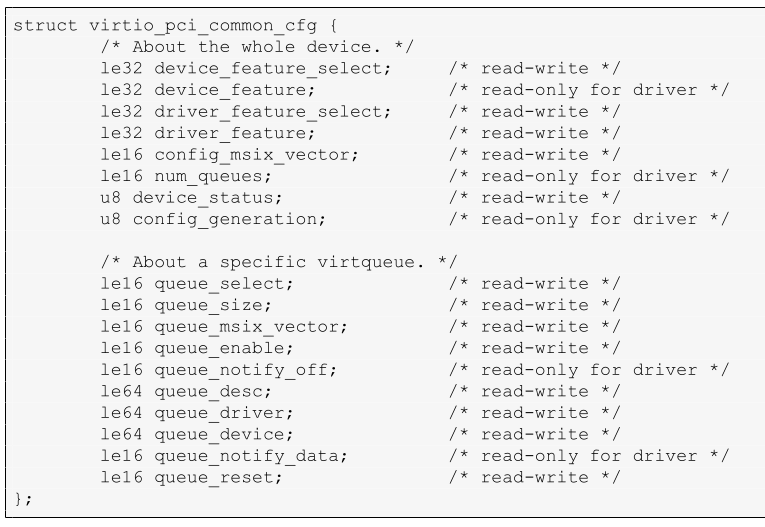

# virtio Over PCI bus
## Common configuration structure layout
The common configuration structure is found at the bar and 
offset within the VIRTIO_PCI_CAP_COMMON_CFG capability; 
its layout is below.



**queue_select** Queue Select. The driver selects which virtqueue
the following fields refer to.

**queue_notify_off** The driver reads this to calculate the 
offset from start of Notification structure at which this
virtqueue is located.

> MY_NOTE:
>
> 这里，common cap struct 中 queue_select字段是可写的, 是作为一个 选择子
> 选择其他字段是用来 获取/配置 哪个队列的

## Notification structure layout
The notification location is found using the VIRTIO_PCI_CAP_NOTIFY_CFG 
capability. This capability is immediately followed by an additional 
field, like so:

> 使用 VIRTIO_PCI_CAP_NOTIFY_CFG cap 发现 该notifcation 的位置. 该 cap
> 会立即跟随一个 额外的 field (notify_off_multiplier)

```cpp
struct virtio_pci_notify_cap {
        struct virtio_pci_cap cap;
        le32 notify_off_multiplier; /* Multiplier for queue_notify_off. */
};
```

notify_off_multiplier is combined with the queue_notify_off 
to derive the Queue Notify address within a BAR for a 
virtqueue:

> derive : [dɪˈraɪv] 得到,获取
>
> notify_off_multiplier 会结合 queue_notify_off 导出 virtqueue
> BAR内的 Queue Notify address:

```
cap.offset + queue_notify_off * notify_off_multiplier
```

The cap.offset and notify_off_multiplier are taken from the 
notification capability structure above, and the queue_notify_off
is taken from the common configuration structure.

> cap.offset和 notify_off_multiplier 会从上述的notification capability 
> structure 获取到, qemu_notify_off 可以从 common configuration structure
> 中获取到 （见上面分析)

Note: For example, if notifier_off_multiplier is 0, the device
uses the same Queue Notify address for all queues.

> 如果 notifier_off_multiplier 为0, 说明上面的公式的结果为 `cap.offset`
> device 中的所有队列都使用相同的 Queue Notify address
