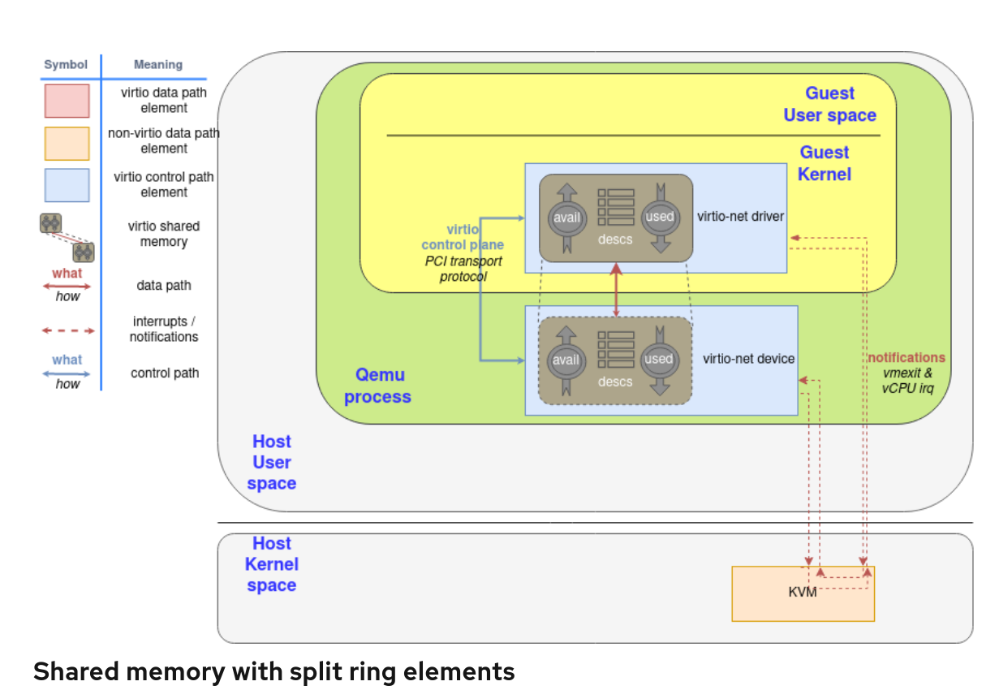

# 简介
## 作用
vring 用于virtio-device和 driver之前的数据传输

## buffers and notification: The work routine

如前所述，virtqueue 仅仅是一个用于存放guest buffers 以便供host 消耗的
队列，host可能读取buffer或者写他们。buffer 从 device端看可能是read-only/write-only
或者read-write。

这些`descriptor` 可能是chained(链表的形式), 这样消息的框架可以以任何更方便的方式传播.
例如，在一个buffer中展开 2000 byte message和使用两个1000byte buffer是一样的。

另外，它提供了一个用于driver -> device 通知方法(doorbell), 来通知 device 一个或
多个buffers 已经被加到了 queue中，反之亦然，device可以 interrupt drivers  通知
used buffer 已经准备好了。这取决于底层驱动提供正确的方法来dispatch实际的nitification,
例如使用PCI interruptions 或者memory writing: virtqueue只是对其语义进行了标准化。

如前所述，driver 和 device 可以调整 对方不要去发出ntification以降低所带来的
dispatch 相关的开销。（这里暂时不讲)

## Split virtqueue: beauty of simplicity
virtqueue 被分成了三个部分, **每一个部分对于 driver/device其中之一是可以写的，
不能对双方都是可写的**:
* Decriptor Area: 用于描述 buffers
* Driver Area: 提供driver到 device 的数据。也称为 **avail virtqueue**
* Device Area: 提供device 到 driver的数据。也称为 **used virtqueue**

virtqueue 的这几个area需要被分配在 driver's memory, 以便driver可以以straightforword(直接)
的方式去访问。Buffer 地址被以driver的视角保存，device需要执行一个地址转换去访问他们。
根据后一种性质（根据device实现不同), 这里有多种方式用于device访问他们的方式:
* 对于 hypervisor 模拟的设备来说(例如qemu), guest's address就在他们自己的进程memory中
* 对于向vhost-net, vhost-user模拟的device,需要去做一个 memory mappings, 例如POSIX 
  share memory。 该内存的文件描述符需要通过vhost 协议共享。
* 对于真实的设备，需要去做一个 hardware-level translation, 通常使用 IOMMU

#  descriptor ring, avail ring, used ring
## Descriptor ring: Where is my data?
descrtiptor area(descriptor ring)是第一个我们需要理解的点。他是一个 array,
该array obj 由 guest addressed buffer以及 buffer的len。每一个descriptor(array
obj) 同时也包含 flag

# 参考文档
[Virtqueues and virtio ring: How the data travels](https://www.redhat.com/zh/blog/virtqueues-and-virtio-ring-how-data-travels?channel=blog/channel/vertical-industries-blog&page=5)(该文档写的特别好，本文基本上是对该文档的翻译)
