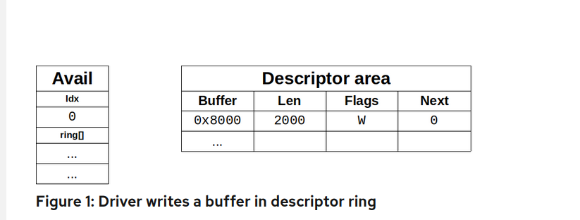
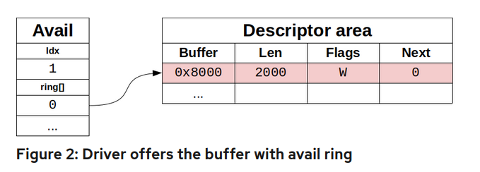
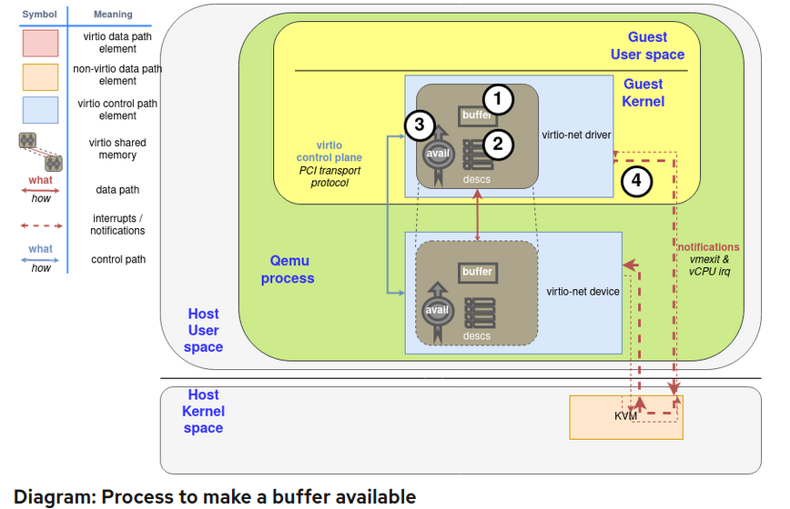
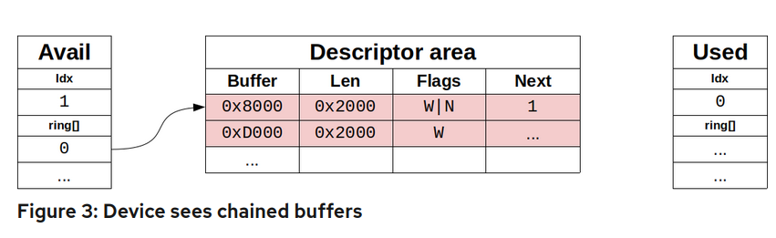
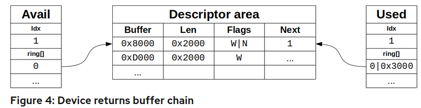
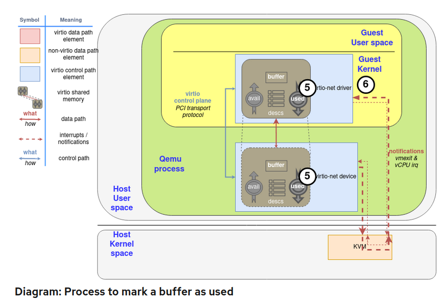
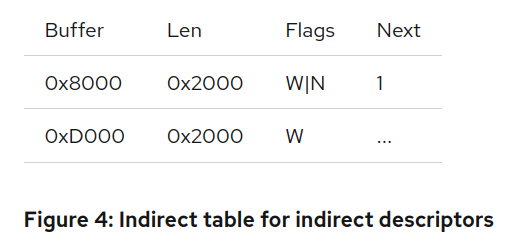
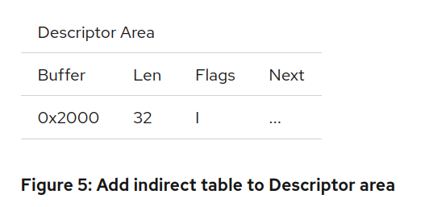
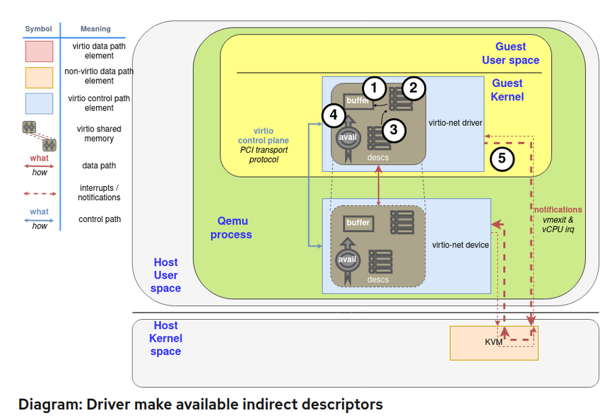
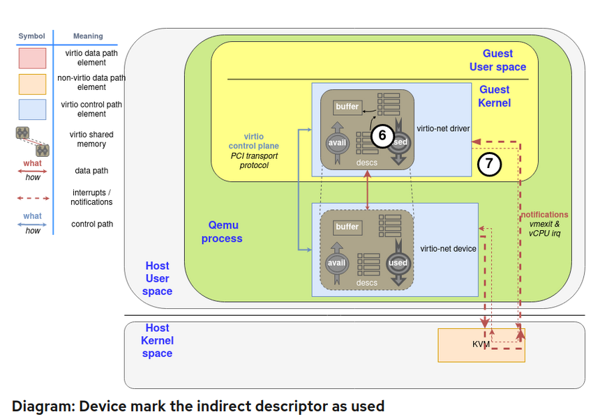

# 简介
## 作用
vring 用于virtio-device和 driver之前的数据传输

## buffers and notification: The work routine

如前所述，virtqueue 仅仅是一个用于存放guest buffers 以便供host 消耗的
队列，host可能读取buffer或者写他们。buffer 从 device端看可能是read-only/write-only
或者read-write。

这些`descriptor` 可能是chained(链表的形式), 这样消息的框架可以以任何更方便的方式传播.
例如，在一个buffer中展开 2000 byte message和使用两个1000byte buffer是一样的。

另外，它提供了一个用于driver -> device 通知方法(doorbell), 来通知 device 一个或
多个buffers 已经被加到了 queue中，反之亦然，device可以 interrupt drivers  通知
used buffer 已经准备好了。这取决于底层驱动提供正确的方法来dispatch实际的nitification,
例如使用PCI interruptions 或者memory writing: virtqueue只是对其语义进行了标准化。

如前所述，driver 和 device 可以调整 对方不要去发出ntification以降低所带来的
dispatch 相关的开销。（这里暂时不讲)


## Split virtqueue: beauty of simplicity
virtqueue 被分成了三个部分, **每一个部分对于 driver/device其中之一是可以写的，
不能对双方都是可写的**:
* Decriptor Area: 用于描述 buffers
* Driver Area: 提供driver到 device 的数据。也称为 **avail virtqueue**
* Device Area: 提供device 到 driver的数据。也称为 **used virtqueue**

virtqueue 的这几个area需要被分配在 driver's memory, 以便driver可以以straightforword(直接)
的方式去访问。Buffer 地址被以driver的视角保存，device需要执行一个地址转换去访问他们。
根据后一种性质（根据device实现不同), 这里有多种方式用于device访问他们的方式:
* 对于 hypervisor 模拟的设备来说(例如qemu), guest's address就在他们自己的进程memory中
* 对于向vhost-net, vhost-user模拟的device,需要去做一个 memory mappings, 例如POSIX 
  share memory。 该内存的文件描述符需要通过vhost 协议共享。
* 对于真实的设备，需要去做一个 hardware-level translation, 通常使用 IOMMU


#  descriptor ring, avail ring, used ring
## Descriptor ring: Where is my data?
descrtiptor area(descriptor ring)是第一个我们需要理解的点。他是一个 array,
该array obj 由 guest addressed buffer以及 buffer的len。每一个descriptor(array
obj) 同时也包含 一系列的flag, 这些flags 指示着该desc 更多信息。例如，如果设置了
1, 说明该buffer 后面还有另一个desc buffer.如果设置了0x2说明该buffer 是write-only,
如果时clear, 说明是read-only

这是一个desc的展开。我们将小端模式的Nbits称为 leN.
```
struct virtq_desc { 
        le64 addr;
        le32 len;
        le16 flags;
        le16 next; // Will explain this one later in the section "Chained descriptors"
};
```
## Avail ring: Supplying data to the device
下一个有意思的数据结构是 driver data, 或者说是 avail ring.  这是一个用于driver存放 
desc(index)的 room，device将会消耗 这些desc。注意，在这里存放 buffer并不意味着device需要
立刻去消耗: 例如 virtio-net, driver将会提供一堆 desc 用于收包，这些desc只有在收到包的时候
才会被使用。

avail ring 有两个重要的字段，只有driver可写，device只能够读取他们: **idx**和 **flags**, idx
字段指示着driver将在 avail ring 放置下一个desc的位置(对queue size 取模)。另一方面，
flags的最低有效位指示着 driver是否想被 notify (称为 `VIRTQ_AVAIL_F_NO_INTERRUPT`)
(轮询还是中断)。

在这两个字段之后，是一个和 desc ring 相同长度的整型数组。所以 avail vritqueue 展开为:
```
struct virtq_avail {
        le16 flags;
        le16 idx;
        le16 ring[ /* Queue Size */ ];
};
```

Figure 1 展示了一个一个desc table, 其中有一个 2000 bytes长度的buffer，开始于 position
`0x8000`, 并且有一个没有任何entry的 avail ring. 完成所有步骤后，将更新高亮显示描述符
区域的组件图。对于driver来说，第一步为 分配buffer，并且填充它( "Process to make a buffer availble"
图中的第一步)， 然后在更新descriptor area。(step 2)



在添加完 desc entry后，driver 将使用 avail ring advise it (通知它？通知设备么, 毕竟
avail ring idx entry是给设备看的): 他将 desc index #0 卸载 avail ring的
首个entry中，并且相应的更新 idx 字段。这个步骤的结果将在Figure 2 中展示。在chained buffer
的情况下, 只有 desc head index 应该通过这种方式添加, 并且 avail idx 应该只自增 1。该步骤
是图解中的步骤3.



从现在开始，driver不应该再去修改 avail desc ，或者在任何时刻暴露 buffer: 它现在是由device
控制。现在driver需要去通知device，如果后者已启用notifications（稍后将详细介绍设备如何管理通知）。
该步骤为图解中的最后一步(第四步).



avail ring必须和 desc area 中的 desc number保持一致，并且大小为 2的幂数。
so idx wraps naturally at some point.(取模). 例如，如果 ring size是 256 entry.
idx 1 和 idx,257,513指向的是同一个 desc...  And it will wrap at a 16 bit boundary。
（这个应该指的是16 bits的溢出, sizeof(virtq_avail->idx) = 2 ). 这样，双方都不必担心处理
无效的idx：它们都是有效的。(所有的数值计算出来都有一个对应的idx)

注意，desc 可以以任意顺序加到avail ring中, 一方面不需要在desc table entry 0开始，另一方面
也不一定在下一个desc 继续。

## Chained descriptors: Supplying large data to the device
driver 还可以使用其下一个成员链接多个desc. 如果 desc 的 NEXT(0x1，图中的N） flag被
设置, data将在另一个 buffer中延续，形成desc 链。注意链表中的  desc 不共享flags：
某些desc可能是 read-only, 某些可能是 write-only, write-only之前的buffer必须都是write-only
的。

举个例子，如果driver 需要在链表中发送两个 buffer. (index0, index1), device 将看到Figure 3
中的情形，然后再去从step 2做一遍。



## Used ring: When the device is done with the data
device 使用 used ring 来给 driver 返回 used(read / write) buffer 。向 avail ring 一样，
他有flags 和 idx 成员。airan notification flags现在被称为 `VIRTQ_USED_F_NO0_NOTIFY`, 但是
他们有这相同的格式并且服务于相同的目的。

他维护一个 used desc 的array, 在这个array中，device 返回的不只有 desc index, 在写的情况下，
还有 used length
```cpp
struct virtq_used {
        le16 flags;
        le16 idx;
        struct virtq_used_elem ring[ /* Queue Size */];
};

struct virtq_used_elem {
        /* Index of start of used descriptor chain. */
        le32 id;
        /* Total length of the descriptor chain which was used (written to) */
        le32 len;
};
///Listing: Used virtqueue layout
```
在返回 chain desc的情况下，只有链表头部的idx 会被返回，并且len指的是所有desc
被写的len，当数据是被读的情况下，不会去增长它（读的话，就是0). descriptor table
根本就没有被touch到，它对于device来说是read-only的。该步骤为"process to make a buffer
as used"的第五步。

举个例子，如果设备使用Chained descriptors 章节中展示的描述符链：





最后，device将会通知driver，如果它看到driver想被通知（使用 used queue flags可以知道他)(step 6)

# Indirect descriptors: supplying a lot of data to the device
indirect desc 是 传递一次性传递大量 desc, 增加 ring 容量 的一种方式，driver 可以在任意
内存位置存放 indect desc table(和 一般的 desc 格式相同), 并且在将desc 插入到virtqueue时，
带着flag `VIRTQ_DESC_F_INDIRECT (0x4)`。desc address 和len 将对应的是 indirect table的.

如果我们想将 Chained desc 章节中的 chain 加入到 indirect table中，driver 首先 分配一个 2 entries
的memory region(32 byte = sizeof(struct virtq_desc) * 2 ), 来存放后者:(图解中的step 2 将在step 1
alloc buffer后执行)



我们假设分配的内存位置在`0x2000`, 并且他的first decriptor 是 availble的。通常，第一步是将其包括
在描述符区域中（图中的步骤3），因此看起来如下：



在这之后，和 通常的desc有了相同的步骤，driver 将desc area中的该desc设置好flag, 并且
将desc的index加入avail ring.(在上面的情况下是 #0), 并且通知device。(步骤5)（这里作者少提到一步:
修改avail_ring->idx)



对于device 使用其data, 并且使用相同的内存地址返回它的`0x3000` byte( `0x8000~0x9fff`和`0xd000~0xdfff`
(step 6和 7, 同regular desc一样).一旦他被device使用过，driver可以释放 indirect memory 或者做它
想做的任何事情，就像任何常规缓冲区一样。



带有`INDIRECT`的desc将不会设置 `NEXT` / `WRITE` flags, 所以你不能在desc table中链接 indirect desc，
并且indirect table和desc table 有相同的desc的最大数量。

# Notifications. Learning the “do not disturb” mode
在很多系统中, used / available buffer notification 将带来显著的开销。为了减轻它，每个virtring
都会维护一个flag来指示什么时候想要被notify. 请记住，driver的那个对于device是read-only, device的
那个对于 driver是 read-only

我们已经知道了所有这些，并且它的使用非常简单。你唯一需要注意的是这种方法的异步性质：
禁用或启用它的通信方无法确定另一端是否会知道更改，因此你可能会错过通知或收到比预期更多的通知。 

一个更有效的触发notification的方式将被enable,如果driver和 device协商了`VIRTIO_F_EVENT_IDX` 
feature bit。驱动程序和设备可以使用特定的描述符id指定对方在需要通知之前可以前进多远，
而不是以二进制方式禁用它们，所以它们的格式类似于:
```
struct virtq_avail {              struct virtq_used {
  le16 flags;                       le16 flags;
  le16 idx;                         le16 idx;
  le16 ring[ /* Queue Size */ ];    struct virtq_used_elem ring[Q. size];
  le16 used_event;                  le16 avail_event;
};                                };
///Listing 3: Event suppression struct notification
```
在这种方式下, 每次driver想要使一个 buffer available, 他需要查看used ring的 avail_event:
如果driver的idx字段和avail_event相等，需要在此时发送一个notification, 并且胡罗used ring
flags member 的lower bits(`VIRTQ_USED_F_NO_NOTIFY`

相似的，如果`VIRTIO_F_EVENT_IDX`已经被协商，device 将会检查used_event, 来知道是否需要
发送notification。 对于维护一个device去写的virtuqueue，它将是非常有效的，向
virtio-net device receive queue.

# 参考文档
[Virtqueues and virtio ring: How the data travels](https://www.redhat.com/zh/blog/virtqueues-and-virtio-ring-how-data-travels?channel=blog/channel/vertical-industries-blog&page=5)(该文档写的特别好，本文基本上是对该文档的翻译)
